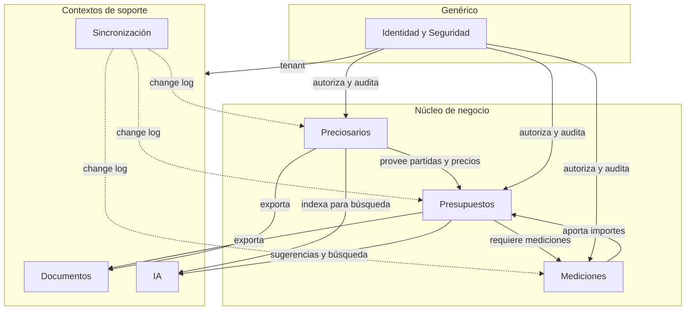
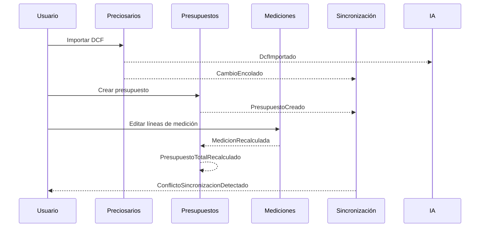
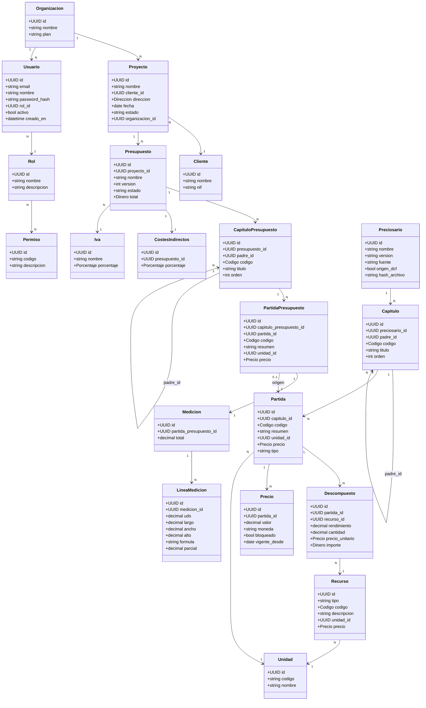

# Análisis de Dominio (Domain Driven Design)

Documento de análisis del dominio de **Preventivi App**, una aplicación moderna de presupuestos y mediciones de obra (estilo Primus de ACCA) con importación de preciosarios **DCF**, arquitectura offline-first y sincronización a la nube. Este documento establece el lenguaje ubicuo, los Bounded Contexts, los agregados, las entidades, los Value Objects y los eventos de dominio que guiarán el diseño táctico y la implementación bajo Clean Architecture (.NET 9) y Flutter + Riverpod.

El diseño respeta los nombres canónicos del modelo: clases C# en **PascalCase**, atributos en **snake_case** en BD, tablas en **singular snake_case**, IDs **UUID v7**.

---

## 1. Lenguaje Ubicuo / Glosario DDD

El lenguaje ubicuo es el vocabulario compartido entre negocio y desarrollo. Estos términos deben usarse de forma consistente en código, documentación, UI y conversaciones.

| Término | Definición |
|---|---|
| **Preciosario** | Base de datos de precios de referencia importada (origen DCF). Contiene capítulos, partidas, descompuestos y recursos con precios oficiales. Es la fuente de la que se nutren los presupuestos. |
| **Capítulo** | Agrupación jerárquica de partidas. Puede contener subcapítulos (autorreferencia `padre_id`). Pertenece a un preciosario o a un presupuesto. |
| **Partida** | Unidad de obra: el elemento atómico presupuestable, con código, resumen, texto largo, unidad y precio (ej. "m2 de solado de gres"). |
| **Descompuesto** | Línea del análisis de precios de una partida: combina un recurso con un rendimiento, una cantidad, un precio unitario y un importe. |
| **Análisis de Precios** | Composición completa de una partida en mano de obra + material + maquinaria + % de costes indirectos. Vista/agregado de los descompuestos. |
| **Recurso** | Insumo básico que compone una partida: mano de obra, material, maquinaria u otros. |
| **Rendimiento** | Cantidad de recurso necesaria por unidad de partida (ej. 0,8 h de oficial por m2). |
| **Medición** | Cálculo de las cantidades reales de una partida en obra, desglosado en líneas de medición. |
| **Línea de Medición** | Fila de cálculo: nº de iguales (uds) × largo × ancho × alto, o resultado de una fórmula; produce un parcial. |
| **Parcial** | Resultado numérico de una línea de medición. La suma de parciales es el total de la medición. |
| **Importe** | Resultado de total de medición × precio de la partida. |
| **Presupuesto** | Árbol versionable de capítulos y partidas con sus mediciones; agrega costes indirectos e IVA para obtener el total. |
| **Costes Indirectos** | Porcentaje aplicado sobre el coste directo de un presupuesto (gastos generales no imputables a una partida concreta). |
| **IVA** | Impuesto sobre el valor añadido aplicado al total del presupuesto. |
| **Precio Bloqueado** | Precio marcado como `bloqueado` que NO se actualiza al reimportar el preciosario DCF. |
| **DCF** | Formato de intercambio de preciosarios usado para la importación. Evolución futura: BC3 (FIEBDC-3), IFC, BIM. |
| **Coeficiente de Rendimiento** | Coeficiente corrector aplicado en mediciones/descompuestos. |
| **Proyecto** | Trabajo de obra asociado a un cliente; contenedor de uno o más presupuestos. |
| **Cola de Sincronización** | Change log de operaciones offline pendientes de enviar/confirmar contra el servidor. |
| **Versión** | Snapshot inmutable del estado de una entidad versionable en un momento dado. |
| **Auditoría / Historial** | Registro de acciones (datos antes/después) para trazabilidad. |
| **Organización** | Tenant/empresa propietaria de proyectos, usuarios y datos (multi-tenant). |
| **Plantilla** | Modelo reutilizable de presupuesto o documento. |
| **Etiqueta** | Tag de clasificación transversal. |
| **Adjunto** | Archivo (foto/plano/documento) asociado a una entidad. |

---

## 2. Bounded Contexts

Se identifican siete Bounded Contexts, cada uno con su propio modelo y lenguaje. Las fronteras se trazan según cohesión funcional y reglas de negocio independientes.

| Bounded Context | Responsabilidad | Entidades núcleo |
|---|---|---|
| **Preciosarios** | Gestión de bases de precios de referencia, importación DCF, capítulos/partidas/descompuestos/recursos de catálogo, bloqueo de precios. | Preciosario, Capitulo, Partida, Descompuesto, Recurso, Precio, Unidad, AnalisisPrecios |
| **Presupuestos** | Composición de presupuestos versionables a partir de preciosarios, árbol de capítulos/partidas de presupuesto, cálculo de totales, costes indirectos e IVA. | Proyecto, Presupuesto, CapituloPresupuesto, PartidaPresupuesto, CostesIndirectos, Iva, Plantilla, Cliente, Proveedor |
| **Mediciones** | Cálculo de cantidades por líneas de medición, fórmulas, coeficientes de rendimiento. | Medicion, LineaMedicion, CoeficienteRendimiento |
| **Documentos** | Generación y exportación (PDF, Excel, CSV/JSON/XML), adjuntos, comentarios, etiquetas. | Plantilla, Adjunto, Comentario, Etiqueta |
| **Sincronización** | Offline-first: change log, resolución de conflictos, sync en background. | ColaSincronizacion, Version |
| **Identidad y Seguridad** | Autenticación, RBAC, multi-tenant, auditoría. | Usuario, Rol, Permiso, Organizacion, Historial/Auditoria |
| **IA** | Embeddings, búsqueda semántica (pgvector), asistencia LLM (Claude). | (consume entidades de Preciosarios/Presupuestos; sin agregados propios persistentes salvo índices vectoriales) |

### Diagrama de Contextos

**Relaciones entre contextos:** Preciosarios actúa como *upstream* (proveedor) y Presupuestos como *downstream* (consumidor) mediante una relación Customer/Supplier: el presupuesto copia partidas del preciosario, pero su precio puede divergir (Anti-Corruption Layer implícita en `PartidaPresupuesto`). Mediciones y Presupuestos forman un par cooperativo (Partnership): el importe de una partida de presupuesto depende del total de su medición. Sincronización, Documentos e IA son contextos de soporte que observan eventos de dominio del núcleo. Identidad y Seguridad es un contexto genérico transversal.

---

## 3. Agregados y Raíces de Agregado

Un **agregado** es un clúster de entidades y value objects tratado como una unidad de consistencia transaccional. La **raíz de agregado** es el único punto de entrada y garante de las invariantes. Las referencias entre agregados se hacen **por ID**, nunca por referencia directa de objeto.

| Agregado (raíz) | Miembros internos | Justificación del límite |
|---|---|---|
| **Preciosario** | Capitulo, Partida, Descompuesto, Precio | El preciosario es la unidad de importación/versionado DCF. La consistencia de su árbol (códigos únicos, jerarquía de capítulos, precios vigentes) debe garantizarse atómicamente al importar. Sin embargo, dado el objetivo de **500.000+ partidas**, los hijos se cargan con *lazy loading* y se persisten de forma incremental: el agregado define el límite de consistencia conceptual, pero la implementación usa carga parcial para rendimiento. |
| **Recurso** | — (con Precio propio) | Los recursos (mano de obra, material, maquinaria) se comparten entre múltiples partidas y preciosarios. Su ciclo de vida es independiente del de una partida concreta, por lo que es su propio agregado referenciado por ID desde Descompuesto. |
| **Proyecto** | (referencia a Cliente y Organizacion por ID) | Raíz organizativa que agrupa presupuestos. Su estado (borrador/activo/cerrado/archivado) controla qué operaciones son válidas sobre sus presupuestos. Cliente y Organización son agregados externos referenciados por ID. |
| **Presupuesto** | CapituloPresupuesto, PartidaPresupuesto, CostesIndirectos, Iva | El presupuesto es versionable y su **total** es una invariante calculada que debe permanecer consistente con sus capítulos, partidas, mediciones, costes indirectos e IVA. Cambiar una partida recalcula el total dentro de la misma transacción. La medición se modela como agregado aparte por su tamaño y cohesión propia, referenciada por ID desde PartidaPresupuesto. |
| **Medicion** | LineaMedicion | El total de una medición es la suma de los parciales de sus líneas; esta invariante debe mantenerse atómica. Se separa de Presupuesto porque una partida puede tener muchas líneas de medición y su edición es frecuente e independiente. |
| **Usuario** | (referencia a Rol por ID) | Raíz del contexto de Identidad. El usuario y sus credenciales forman una unidad de consistencia. Rol y Permiso son agregados de catálogo referenciados por ID. |
| **Organizacion** | — | Tenant raíz. Define el límite de aislamiento multi-tenant. |
| **Plantilla** | — | Modelo reutilizable autónomo. |
| **ColaSincronizacion** | — | Cada entrada del change log es independiente y se procesa/confirma por separado; no comparte invariantes con otras entradas. |
| **Version** | — | Snapshot inmutable independiente. |
| **Historial / Auditoria** | — | Registro inmutable de solo escritura. |
| **Cliente** | — | Datos maestros con ciclo de vida propio. |
| **Proveedor** | — | Datos maestros con ciclo de vida propio. |

> **Catálogos / Value Objects compartidos:** `Unidad`, `Iva` (como catálogo) y `Etiqueta` se tratan como pequeños agregados de catálogo o como value objects según el caso. `AnalisisPrecios` no es un agregado persistente sino una **vista/proyección** del descompuesto de una partida.

---

## 4. Entidades del Dominio

Todas las entidades del brief, con sus atributos (nombre canónico, tipo, descripción) e invariantes/reglas de negocio.

### 4.1 Contexto: Identidad y Seguridad

#### Usuario

| Atributo | Tipo | Descripción |
|---|---|---|
| `id` | UUID v7 | Identificador único. |
| `email` | string | Correo electrónico, único por organización. |
| `nombre` | string | Nombre del usuario. |
| `password_hash` | string | Hash de la contraseña (nunca texto plano). |
| `rol_id` | UUID v7 | Referencia al Rol. |
| `activo` | bool | Indica si la cuenta está habilitada. |
| `creado_en` | datetime | Fecha de creación. |

**Invariantes:** `email` válido y único; `password_hash` nunca vacío ni reversible; un usuario inactivo (`activo = false`) no puede autenticarse; todo usuario tiene exactamente un `rol_id`.

#### Rol

| Atributo | Tipo | Descripción |
|---|---|---|
| `id` | UUID v7 | Identificador único. |
| `nombre` | string | Nombre del rol: admin, jefe_obra, presupuestista, lector. |
| `descripcion` | string | Descripción del rol. |

**Invariantes:** `nombre` pertenece al conjunto {admin, jefe_obra, presupuestista, lector}; un rol agrupa permisos (RBAC).

#### Permiso

| Atributo | Tipo | Descripción |
|---|---|---|
| `id` | UUID v7 | Identificador único. |
| `codigo` | string | Código del permiso (clave RBAC). |
| `descripcion` | string | Descripción legible. |

**Invariantes:** `codigo` único; los permisos se asocian a roles para autorizar operaciones.

#### Organizacion

| Atributo | Tipo | Descripción |
|---|---|---|
| `id` | UUID v7 | Identificador único (tenant). |
| `nombre` | string | Nombre de la organización. |
| `plan` | string | Plan de suscripción. |

**Invariantes:** `nombre` no vacío; toda entidad de negocio (proyecto, usuario) pertenece a una organización (aislamiento multi-tenant).

#### Historial / Auditoria

| Atributo | Tipo | Descripción |
|---|---|---|
| `id` | UUID v7 | Identificador único. |
| `usuario_id` | UUID v7 | Usuario que ejecutó la acción. |
| `accion` | string | Tipo de acción (crear/actualizar/eliminar...). |
| `entidad_tipo` | string | Tipo de entidad afectada. |
| `entidad_id` | UUID v7 | Identificador de la entidad afectada. |
| `datos_antes` | json | Estado previo. |
| `datos_despues` | json | Estado posterior. |
| `creado_en` | datetime | Marca temporal. |

**Invariantes:** Registro inmutable (solo escritura, nunca actualización ni borrado); `entidad_tipo` + `entidad_id` identifican el objeto auditado.

### 4.2 Contexto: Presupuestos

#### Proyecto

| Atributo | Tipo | Descripción |
|---|---|---|
| `id` | UUID v7 | Identificador único. |
| `nombre` | string | Nombre del proyecto. |
| `cliente_id` | UUID v7 | Referencia al Cliente. |
| `direccion` | Direccion (VO) | Dirección de la obra. |
| `fecha` | date | Fecha del proyecto. |
| `estado` | enum | borrador / activo / cerrado / archivado. |
| `organizacion_id` | UUID v7 | Tenant propietario. |
| `creado_en` | datetime | Fecha de creación. |
| `actualizado_en` | datetime | Última modificación. |

**Invariantes:** `estado` ∈ {borrador, activo, cerrado, archivado}; un proyecto `cerrado` o `archivado` no admite nuevos presupuestos editables; pertenece a una única organización; `cliente_id` debe existir.

#### Cliente

| Atributo | Tipo | Descripción |
|---|---|---|
| `id` | UUID v7 | Identificador único. |
| `nombre` | string | Razón social o nombre. |
| `nif` | string | NIF/CIF. |
| `direccion` | Direccion (VO) | Dirección fiscal. |
| `contacto` | string | Persona de contacto. |
| `email` | string | Correo de contacto. |
| `telefono` | string | Teléfono. |

**Invariantes:** `nif` con formato válido y único por organización; `email` válido si se informa.

#### Presupuesto

| Atributo | Tipo | Descripción |
|---|---|---|
| `id` | UUID v7 | Identificador único. |
| `proyecto_id` | UUID v7 | Proyecto al que pertenece. |
| `nombre` | string | Nombre del presupuesto. |
| `version` | int | Número de versión (versionable). |
| `estado` | enum | Estado del presupuesto. |
| `total` | Dinero (VO) | Total calculado. |
| `creado_en` | datetime | Fecha de creación. |

**Invariantes:** `total` = Σ importes de partidas + costes indirectos + IVA (invariante calculada, no editable manualmente); `version` se incrementa de forma monótona al crear una nueva versión; un presupuesto pertenece a un único proyecto; no se modifica una versión publicada (se crea una nueva).

#### CapituloPresupuesto

Instancia de capítulo dentro de un presupuesto (puede divergir del preciosario).

| Atributo | Tipo | Descripción |
|---|---|---|
| `id` | UUID v7 | Identificador único. |
| `presupuesto_id` | UUID v7 | Presupuesto contenedor. |
| `padre_id` | UUID v7 \| null | Capítulo padre (jerarquía). |
| `codigo` | Codigo (VO) | Código del capítulo. |
| `titulo` | string | Título. |
| `orden` | int | Orden dentro del nivel. |

**Invariantes:** `codigo` único dentro del presupuesto; jerarquía sin ciclos (`padre_id` no puede referenciarse a sí mismo ni crear bucles).

#### PartidaPresupuesto

Instancia de partida dentro de un presupuesto; su precio puede divergir del preciosario.

| Atributo | Tipo | Descripción |
|---|---|---|
| `id` | UUID v7 | Identificador único. |
| `capitulo_presupuesto_id` | UUID v7 | Capítulo de presupuesto contenedor. |
| `partida_id` | UUID v7 \| null | Partida origen del preciosario (si procede). |
| `codigo` | Codigo (VO) | Código. |
| `resumen` | string | Descripción corta. |
| `texto_largo` | string | Descripción detallada. |
| `unidad_id` | UUID v7 | Unidad de medida. |
| `precio` | Precio (VO) | Precio en el presupuesto (puede divergir). |

**Invariantes:** El `precio` puede diferir del preciosario origen sin afectar a este; el importe = total de medición × precio; cambiar el precio recalcula el total del presupuesto.

#### CostesIndirectos

| Atributo | Tipo | Descripción |
|---|---|---|
| `id` | UUID v7 | Identificador único. |
| `presupuesto_id` | UUID v7 | Presupuesto al que aplica. |
| `porcentaje` | Porcentaje (VO) | % de costes indirectos. |

**Invariantes:** `porcentaje` ≥ 0; se aplica sobre el coste directo del presupuesto.

#### Iva

| Atributo | Tipo | Descripción |
|---|---|---|
| `id` | UUID v7 | Identificador único. |
| `nombre` | string | Nombre del tipo impositivo. |
| `porcentaje` | Porcentaje (VO) | % de IVA. |

**Invariantes:** `porcentaje` ≥ 0; aplicado al total del presupuesto.

#### Proveedor

| Atributo | Tipo | Descripción |
|---|---|---|
| `id` | UUID v7 | Identificador único. |
| `nombre` | string | Nombre del proveedor. |
| `nif` | string | NIF/CIF. |
| `contacto` | string | Persona de contacto. |

**Invariantes:** `nif` válido y único por organización.

#### Plantilla

| Atributo | Tipo | Descripción |
|---|---|---|
| `id` | UUID v7 | Identificador único. |
| `nombre` | string | Nombre de la plantilla. |
| `tipo` | string | Tipo (presupuesto/documento). |
| `contenido` | json/blob | Definición de la plantilla. |

**Invariantes:** `nombre` no vacío; `tipo` válido.

### 4.3 Contexto: Preciosarios

#### Preciosario

| Atributo | Tipo | Descripción |
|---|---|---|
| `id` | UUID v7 | Identificador único. |
| `nombre` | string | Nombre del preciosario. |
| `version` | string | Versión del preciosario. |
| `fuente` | string | Fuente/editorial. |
| `fecha_publicacion` | date | Fecha de publicación. |
| `origen_dcf` | bool/string | Indica origen DCF. |
| `hash_archivo` | string | Hash del archivo importado (integridad). |

**Invariantes:** `hash_archivo` identifica de forma única el archivo importado (evita reimportaciones duplicadas); al reimportar, los precios con `bloqueado = true` no se sobrescriben; los códigos de partida son únicos dentro del preciosario.

#### Capitulo

| Atributo | Tipo | Descripción |
|---|---|---|
| `id` | UUID v7 | Identificador único. |
| `preciosario_id` | UUID v7 \| null | Preciosario contenedor (o `presupuesto_id`). |
| `padre_id` | UUID v7 \| null | Capítulo padre (jerarquía autorreferencial). |
| `codigo` | Codigo (VO) | Código del capítulo. |
| `titulo` | string | Título. |
| `orden` | int | Orden dentro del nivel. |

**Invariantes:** Pertenece a un preciosario **o** a un presupuesto (no ambos); jerarquía sin ciclos; `codigo` único dentro de su contenedor.

#### Partida

| Atributo | Tipo | Descripción |
|---|---|---|
| `id` | UUID v7 | Identificador único. |
| `capitulo_id` | UUID v7 | Capítulo contenedor. |
| `codigo` | Codigo (VO) | Código de la partida. |
| `resumen` | string | Descripción corta. |
| `texto_largo` | string | Descripción detallada. |
| `unidad_id` | UUID v7 | Unidad de medida. |
| `precio` | Precio (VO) | Precio de referencia. |
| `tipo` | string | Tipo de partida. |

**Invariantes:** `codigo` único dentro del preciosario; pertenece a un capítulo; el `precio` puede derivarse del descompuesto (Σ importes de descompuestos + % costes indirectos).

#### Descompuesto

| Atributo | Tipo | Descripción |
|---|---|---|
| `id` | UUID v7 | Identificador único. |
| `partida_id` | UUID v7 | Partida a la que pertenece. |
| `recurso_id` | UUID v7 | Recurso consumido. |
| `rendimiento` | decimal | Rendimiento (cantidad por unidad de partida). |
| `cantidad` | decimal | Cantidad. |
| `precio_unitario` | Precio (VO) | Precio unitario del recurso. |
| `importe` | Dinero (VO) | Importe = rendimiento/cantidad × precio_unitario. |

**Invariantes:** `importe` = (rendimiento o cantidad) × `precio_unitario` (invariante calculada); `recurso_id` debe existir; la suma de importes de los descompuestos compone el precio de la partida.

#### Recurso

| Atributo | Tipo | Descripción |
|---|---|---|
| `id` | UUID v7 | Identificador único. |
| `tipo` | enum | mano_obra / material / maquinaria / otros (discriminador). |
| `codigo` | Codigo (VO) | Código del recurso. |
| `descripcion` | string | Descripción. |
| `unidad_id` | UUID v7 | Unidad de medida. |
| `precio` | Precio (VO) | Precio unitario. |

**Invariantes:** `tipo` ∈ {mano_obra, material, maquinaria, otros}; `codigo` único; tabla base con discriminador `tipo`.

#### AnalisisPrecios

Vista/agregado del descompuesto de una partida (no entidad persistente independiente).

| Atributo | Tipo | Descripción |
|---|---|---|
| (proyección) `partida_id` | UUID v7 | Partida analizada. |
| (calculado) `coste_mano_obra` | Dinero (VO) | Suma de descompuestos tipo mano_obra. |
| (calculado) `coste_material` | Dinero (VO) | Suma de descompuestos tipo material. |
| (calculado) `coste_maquinaria` | Dinero (VO) | Suma de descompuestos tipo maquinaria. |
| (calculado) `costes_indirectos` | Porcentaje (VO) | % de costes indirectos aplicado. |
| (calculado) `precio_total` | Precio (VO) | Precio resultante de la partida. |

**Invariantes:** `precio_total` = (Σ mano de obra + material + maquinaria) × (1 + % costes indirectos); es una proyección de solo lectura derivada de los descompuestos.

#### Unidad

| Atributo | Tipo | Descripción |
|---|---|---|
| `id` | UUID v7 | Identificador único. |
| `codigo` | string | Código (m, m2, m3, ud, kg, h...). |
| `nombre` | string | Nombre legible. |

**Invariantes:** `codigo` único; catálogo compartido.

#### Precio

| Atributo | Tipo | Descripción |
|---|---|---|
| `id` | UUID v7 | Identificador único. |
| `partida_id` | UUID v7 | Partida a la que aplica. |
| `valor` | decimal | Importe numérico. |
| `moneda` | string | Moneda (ISO 4217). |
| `bloqueado` | bool | Si está bloqueado, no se actualiza al reimportar DCF. |
| `vigente_desde` | date | Inicio de vigencia. |

**Invariantes:** `valor` ≥ 0; si `bloqueado = true`, la reimportación DCF no modifica el precio; el precio vigente es el de mayor `vigente_desde` ≤ fecha actual.

#### CoeficienteRendimiento

| Atributo | Tipo | Descripción |
|---|---|---|
| (id) | UUID v7 | Identificador único. |
| (valor) | decimal | Coeficiente aplicado en mediciones/descompuestos. |

**Invariantes:** Coeficiente corrector ≥ 0 aplicado sobre rendimientos o parciales de medición.

### 4.4 Contexto: Mediciones

#### Medicion

| Atributo | Tipo | Descripción |
|---|---|---|
| `id` | UUID v7 | Identificador único. |
| `partida_presupuesto_id` | UUID v7 | Partida de presupuesto medida. |
| `total` | decimal | Suma de los parciales de sus líneas. |

**Invariantes:** `total` = Σ `parcial` de sus líneas de medición (invariante calculada); pertenece a una única partida de presupuesto.

#### LineaMedicion

| Atributo | Tipo | Descripción |
|---|---|---|
| `id` | UUID v7 | Identificador único. |
| `medicion_id` | UUID v7 | Medición contenedora. |
| `comentario` | string | Descripción de la línea. |
| `uds` | decimal | Nº de iguales. |
| `largo` | decimal | Dimensión largo. |
| `ancho` | decimal | Dimensión ancho. |
| `alto` | decimal | Dimensión alto. |
| `formula` | string | Fórmula alternativa de cálculo. |
| `parcial` | decimal | Resultado: uds×largo×ancho×alto o resultado de la fórmula. |

**Invariantes:** `parcial` = `uds` × `largo` × `ancho` × `alto`, o el resultado de evaluar `formula` (si se informa); las dimensiones no informadas se tratan como factor neutro (1); modificar una línea recalcula el `total` de la medición.

### 4.5 Contexto: Documentos

#### Etiqueta

| Atributo | Tipo | Descripción |
|---|---|---|
| `id` | UUID v7 | Identificador único. |
| `nombre` | string | Nombre del tag. |
| `color` | string | Color (hex). |

**Invariantes:** `nombre` único por organización.

#### Comentario

| Atributo | Tipo | Descripción |
|---|---|---|
| `id` | UUID v7 | Identificador único. |
| `entidad_tipo` | string | Tipo de entidad comentada. |
| `entidad_id` | UUID v7 | Identificador de la entidad. |
| `autor_id` | UUID v7 | Usuario autor. |
| `texto` | string | Contenido del comentario. |
| `creado_en` | datetime | Fecha de creación. |

**Invariantes:** `texto` no vacío; `entidad_tipo` + `entidad_id` referencian una entidad existente; `autor_id` debe ser un usuario válido.

#### Adjunto

| Atributo | Tipo | Descripción |
|---|---|---|
| `id` | UUID v7 | Identificador único. |
| `entidad_tipo` | string | Tipo de entidad asociada. |
| `entidad_id` | UUID v7 | Identificador de la entidad. |
| `tipo` | enum | foto / plano / documento. |
| `ruta` | string | Ruta/URL del archivo. |
| `mime` | string | Tipo MIME. |
| `tamano` | int | Tamaño en bytes. |

**Invariantes:** `tipo` ∈ {foto, plano, documento}; `tamano` ≥ 0; `mime` coherente con `tipo`.

### 4.6 Contexto: Sincronización

#### Version

| Atributo | Tipo | Descripción |
|---|---|---|
| `id` | UUID v7 | Identificador único. |
| `entidad_tipo` | string | Tipo de entidad versionada. |
| `entidad_id` | UUID v7 | Identificador de la entidad. |
| `numero` | int | Número de versión. |
| `snapshot` | json | Estado serializado. |
| `creado_en` | datetime | Fecha de creación. |

**Invariantes:** Snapshot inmutable; `numero` monótono creciente por (`entidad_tipo`, `entidad_id`).

#### ColaSincronizacion

| Atributo | Tipo | Descripción |
|---|---|---|
| `id` | UUID v7 | Identificador único. |
| `entidad_tipo` | string | Tipo de entidad afectada. |
| `entidad_id` | UUID v7 | Identificador de la entidad. |
| `operacion` | enum | insert / update / delete. |
| `payload` | json | Datos de la operación. |
| `estado` | enum | pendiente / enviado / confirmado / conflicto. |
| `creado_en` | datetime | Fecha de encolado. |

**Invariantes:** `operacion` ∈ {insert, update, delete}; `estado` ∈ {pendiente, enviado, confirmado, conflicto}; el orden de procesamiento respeta `creado_en`; una entrada en `conflicto` requiere resolución antes de confirmar.

---

## 5. Value Objects

Los Value Objects son inmutables, sin identidad propia y se comparan por valor. Encapsulan reglas de validación y comportamiento.

| Value Object | Componentes | Reglas / Comportamiento |
|---|---|---|
| **Dinero** | `valor` (decimal), `moneda` (ISO 4217) | Inmutable; suma/resta solo entre misma moneda; `valor` con precisión decimal fija; no negativo en importes. |
| **Precio** | `valor` (decimal), `moneda`, `bloqueado` (bool) | Especialización monetaria asociada a partidas/recursos; si `bloqueado`, es inmutable frente a reimportaciones DCF. |
| **Unidad** | `codigo`, `nombre` | Catálogo cerrado (m, m2, m3, ud, kg, h...); igualdad por `codigo`. |
| **Codigo** | `valor` (string) | Código de capítulo/partida/recurso; formato normalizado; único en su contexto. |
| **Direccion** | `calle`, `numero`, `cp`, `localidad`, `provincia`, `pais` | Dirección postal estructurada; validación de CP y país. |
| **Porcentaje** | `valor` (decimal 0–100 o 0–1) | Usado en costes indirectos e IVA; ≥ 0; provee multiplicador `(1 + valor)`. |
| **Rendimiento** | `valor` (decimal) | Cantidad de recurso por unidad de partida; ≥ 0. |
| **Parcial** | `valor` (decimal) | Resultado de cálculo de línea de medición; derivado, inmutable. |
| **Hash** | `valor` (string) | Huella de integridad del archivo DCF importado. |

---

## 6. Eventos de Dominio

Los eventos de dominio comunican hechos relevantes ya ocurridos (en pasado) y desacoplan los Bounded Contexts mediante el patrón Event-Driven. Son consumidos por Sincronización, Documentos, IA y Auditoría.

| Evento | Disparado por | Consumidores principales |
|---|---|---|
| `PresupuestoCreado` | Crear un presupuesto | Auditoría, Sincronización, IA (indexar) |
| `PresupuestoVersionado` | Crear nueva versión de presupuesto | Auditoría, Documentos |
| `PresupuestoTotalRecalculado` | Cambio en partidas/mediciones/costes/IVA | Documentos, IA |
| `PartidaActualizada` | Modificar una partida (precio, textos) | Sincronización, Auditoría, IA |
| `PartidaPresupuestoCreada` | Añadir partida a un presupuesto | Sincronización, IA |
| `PrecioBloqueado` | Marcar un precio como bloqueado | Preciosarios (excluir de reimportación), Auditoría |
| `PrecioDesbloqueado` | Desbloquear un precio | Auditoría |
| `DcfImportado` | Finalizar importación de preciosario DCF | IA (generar embeddings), Auditoría, Documentos |
| `PreciosarioReimportado` | Reimportar DCF respetando precios bloqueados | Auditoría, IA |
| `MedicionRecalculada` | Cambio en líneas de medición | Presupuestos (recalcular importe), Documentos |
| `DescompuestoModificado` | Cambio en una línea de descompuesto | Preciosarios (recalcular precio partida), Auditoría |
| `CambioEncolado` | Operación offline registrada en el change log | Sincronización (envío en background) |
| `ConflictoSincronizacionDetectado` | Colisión de versiones en sync | Sincronización (resolución), Usuario (notificar) |
| `CambioConfirmado` | Servidor confirma una operación de sync | Sincronización, Cliente |
| `DocumentoExportado` | Generar PDF/Excel/CSV/JSON/XML | Auditoría |
| `UsuarioAutenticado` | Login correcto | Auditoría, Seguridad |

---

## 7. Relaciones entre Entidades (resumen)

El modelo entidad-relación detallado se desarrolla en otro documento. A continuación, el resumen de las relaciones clave:

- **Organizacion** 1 — N **Proyecto**, 1 — N **Usuario** (multi-tenant).
- **Usuario** N — 1 **Rol**; **Rol** N — N **Permiso** (RBAC).
- **Proyecto** N — 1 **Cliente**; **Proyecto** 1 — N **Presupuesto**.
- **Preciosario** 1 — N **Capitulo**; **Capitulo** 1 — N **Capitulo** (autorreferencia `padre_id`).
- **Capitulo** 1 — N **Partida**; **Partida** 1 — N **Descompuesto**.
- **Descompuesto** N — 1 **Recurso**; **Recurso** N — 1 **Unidad**; **Partida** N — 1 **Unidad**.
- **Partida** 1 — N **Precio** (con `bloqueado` y `vigente_desde`).
- **AnalisisPrecios** es proyección 1 — 1 de los **Descompuesto** de una **Partida**.
- **Presupuesto** 1 — N **CapituloPresupuesto**; **CapituloPresupuesto** 1 — N **PartidaPresupuesto**.
- **PartidaPresupuesto** 0..1 — 1 **Partida** (origen del preciosario, precio divergente).
- **PartidaPresupuesto** 1 — 1 **Medicion**; **Medicion** 1 — N **LineaMedicion**.
- **Presupuesto** 1 — 1 **CostesIndirectos**; **Presupuesto** N — 1 **Iva**.
- **Comentario**, **Adjunto**, **Version**, **Historial** se relacionan polimórficamente vía (`entidad_tipo`, `entidad_id`).
- **ColaSincronizacion** referencia cualquier entidad vía (`entidad_tipo`, `entidad_id`).

---

## 8. Diagrama de Clases (entidades principales)

---

## 9. Consideraciones de Rendimiento y Diseño Táctico

- **Escala de 500.000+ partidas:** el agregado **Preciosario** define el límite de consistencia conceptual, pero la persistencia es incremental y la carga usa *lazy loading*, *virtual scrolling*, caché e indexación (SQLite FTS5 local, pg_trgm/tsvector en PostgreSQL). La importación DCF se procesa en background.
- **Referencias por ID entre agregados:** se evita cargar grafos enormes; los agregados se mantienen pequeños y consistentes.
- **Invariantes calculadas** (total de presupuesto, total de medición, importe de descompuesto, precio de análisis) se recalculan dentro del agregado raíz y emiten eventos de dominio para proyecciones y sincronización.
- **Offline-first:** toda mutación genera una entrada en **ColaSincronizacion** y, cuando aplica, un snapshot en **Version**; los conflictos se detectan por versión y se resuelven antes de confirmar.
- **IA:** los eventos `DcfImportado` y `PartidaActualizada` disparan la generación de embeddings (pgvector) para búsqueda semántica y asistencia con modelos Claude.
