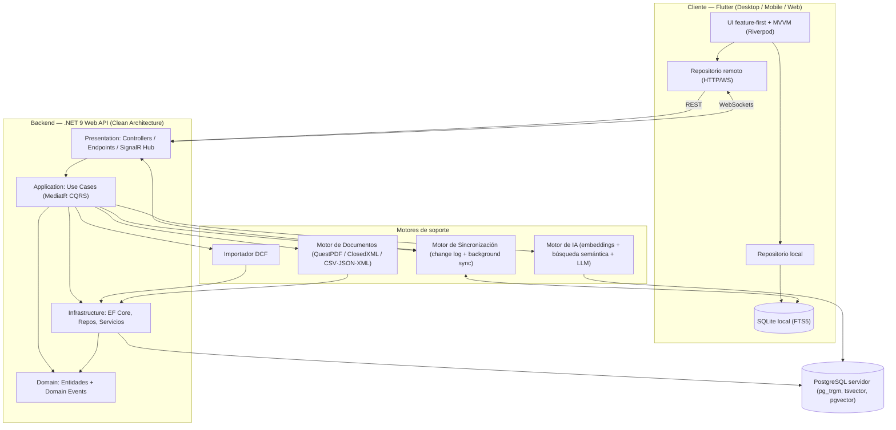
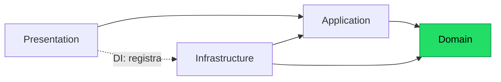
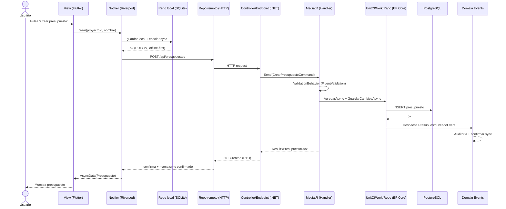

# Arquitectura

Documento de arquitectura de **Preventivi App**: app moderna de presupuestos y mediciones de obra (estilo Primus/ACCA), offline-first con sync a la nube e importación de preciosarios DCF.

## Visión general

La arquitectura combina tres principios fundamentales:

- **Clean Architecture**: separación en capas concéntricas con la **regla de dependencia hacia adentro**. El núcleo (Domain) no conoce nada del exterior; los detalles (BD, frameworks, UI) dependen de abstracciones.
- **DDD (Domain-Driven Design)**: el dominio modela los conceptos del negocio (Preciosario, Capítulo, Partida, Descompuesto, Medición, Presupuesto) con entidades, agregados, value objects y **domain events**.
- **Offline-first**: la app funciona sin conexión sobre **SQLite (FTS5)** local; los cambios se registran en una **cola de sincronización (change log)** y se concilian con el servidor **PostgreSQL** mediante background sync + **SignalR/WebSockets**. Los identificadores son **UUID v7** para permitir generación offline sin colisiones y orden temporal.

El sistema se compone de un **frontend Flutter** (Desktop + Mobile + Web) con patrón feature-first + MVVM sobre **Riverpod**, y un **backend .NET 9 Web API** con Clean Architecture, CQRS (MediatR), Result Pattern, FluentValidation y Serilog.

### Diagrama de módulos del sistema



## Las cuatro capas

La solución backend sigue Clean Architecture con cuatro capas. La dependencia **siempre apunta hacia el Domain**.

| Capa | Responsabilidad | Contiene | Depende de |
|------|-----------------|----------|------------|
| **Domain** | Reglas de negocio puras, invariantes del dominio | Entidades (Proyecto, Preciosario, Partida, Descompuesto, Medicion, Presupuesto…), Value Objects, Domain Events, interfaces de repositorio, excepciones de dominio | Nada (núcleo) |
| **Application** | Orquestación de casos de uso, CQRS | Commands/Queries + Handlers (MediatR), DTOs, validadores (FluentValidation), interfaces de servicios, Result Pattern, behaviors (pipeline) | Domain |
| **Infrastructure** | Detalles técnicos | EF Core (DbContext, configuraciones, migraciones), implementación de repositorios y Unit of Work, importador DCF, motores de documentos e IA, cliente PostgreSQL/SQLite, Serilog sinks, despachador de eventos | Application, Domain |
| **Presentation** | Punto de entrada HTTP/WS | Controllers / Minimal API endpoints, SignalR Hub, middleware (errores, logging), configuración de DI y arranque | Application (y Domain para tipos) |

### Regla de dependencia



> El **Domain** no referencia ninguna otra capa. La **Infrastructure** implementa las interfaces declaradas en Domain/Application (inversión de dependencias). La **Presentation** solo conoce la Application y registra las implementaciones de Infrastructure mediante DI en el arranque.

## Patrones aplicados

### Repository + Unit of Work

Las interfaces viven en el Domain; las implementaciones, en Infrastructure (EF Core).

```csharp
// Domain/Repositories/IPresupuestoRepository.cs
public interface IPresupuestoRepository
{
    Task<Presupuesto?> ObtenerPorIdAsync(Guid id, CancellationToken ct);
    Task AgregarAsync(Presupuesto presupuesto, CancellationToken ct);
    void Actualizar(Presupuesto presupuesto);
}

// Domain/Repositories/IUnitOfWork.cs
public interface IUnitOfWork
{
    IPresupuestoRepository Presupuestos { get; }
    IPartidaRepository Partidas { get; }
    Task<int> GuardarCambiosAsync(CancellationToken ct);
}
```

```csharp
// Infrastructure/Persistence/UnitOfWork.cs
public sealed class UnitOfWork(AppDbContext db) : IUnitOfWork
{
    public IPresupuestoRepository Presupuestos { get; } = new PresupuestoRepository(db);
    public IPartidaRepository Partidas { get; } = new PartidaRepository(db);

    public Task<int> GuardarCambiosAsync(CancellationToken ct) => db.SaveChangesAsync(ct);
}
```

### Dependency Injection

Cada capa expone un método de extensión de registro; el arranque los compone.

```csharp
// Infrastructure/DependencyInjection.cs
public static IServiceCollection AddInfrastructure(this IServiceCollection services, IConfiguration cfg)
{
    services.AddDbContext<AppDbContext>(o => o.UseNpgsql(cfg.GetConnectionString("Postgres")));
    services.AddScoped<IUnitOfWork, UnitOfWork>();
    services.AddScoped<IPresupuestoRepository, PresupuestoRepository>();
    services.AddScoped<IImportadorDcf, ImportadorDcf>();
    return services;
}

// Program.cs (Presentation)
builder.Services
    .AddApplication()      // MediatR, validadores, behaviors
    .AddInfrastructure(builder.Configuration);
```

### Use Cases con MediatR (CQRS: Commands / Queries / Handlers)

Comandos (escritura) y queries (lectura) se separan. Cada uno tiene su handler.

```csharp
// Application/Presupuestos/Commands/CrearPresupuesto/CrearPresupuestoCommand.cs
public sealed record CrearPresupuestoCommand(Guid ProyectoId, string Nombre)
    : IRequest<Result<PresupuestoDto>>;

public sealed class CrearPresupuestoHandler(IUnitOfWork uow, IMapper mapper)
    : IRequestHandler<CrearPresupuestoCommand, Result<PresupuestoDto>>
{
    public async Task<Result<PresupuestoDto>> Handle(CrearPresupuestoCommand cmd, CancellationToken ct)
    {
        var presupuesto = Presupuesto.Crear(cmd.ProyectoId, cmd.Nombre); // genera UUID v7 + domain event
        await uow.Presupuestos.AgregarAsync(presupuesto, ct);
        await uow.GuardarCambiosAsync(ct);
        return Result.Success(mapper.Map<PresupuestoDto>(presupuesto));
    }
}
```

```csharp
// Application/Presupuestos/Queries/ObtenerPresupuesto/ObtenerPresupuestoQuery.cs
public sealed record ObtenerPresupuestoQuery(Guid Id) : IRequest<Result<PresupuestoDto>>;

public sealed class ObtenerPresupuestoHandler(IPresupuestoRepository repo, IMapper mapper)
    : IRequestHandler<ObtenerPresupuestoQuery, Result<PresupuestoDto>>
{
    public async Task<Result<PresupuestoDto>> Handle(ObtenerPresupuestoQuery q, CancellationToken ct)
    {
        var p = await repo.ObtenerPorIdAsync(q.Id, ct);
        return p is null
            ? Result.Failure<PresupuestoDto>(Error.NotFound("Presupuesto.NoEncontrado", "Presupuesto no encontrado"))
            : Result.Success(mapper.Map<PresupuestoDto>(p));
    }
}
```

### DTO + Mapper

Los DTOs aíslan el dominio del transporte. El mapeo se hace con **Mapster** (alternativa: AutoMapper).

```csharp
// Application/Presupuestos/Dtos/PresupuestoDto.cs
public sealed record PresupuestoDto(Guid Id, string Nombre, int Version, string Estado, decimal Total);

// Infrastructure/Mapping/PresupuestoMapping.cs (Mapster)
TypeAdapterConfig<Presupuesto, PresupuestoDto>.NewConfig()
    .Map(d => d.Total, s => s.CalcularTotal());
```

### Result Pattern

Evita excepciones para flujos de negocio esperables. La capa de presentación traduce `Result` a códigos HTTP.

```csharp
// Domain/Common/Error.cs
public sealed record Error(string Codigo, string Mensaje, ErrorTipo Tipo)
{
    public static Error NotFound(string codigo, string msg) => new(codigo, msg, ErrorTipo.NoEncontrado);
    public static Error Validacion(string codigo, string msg) => new(codigo, msg, ErrorTipo.Validacion);
    public static readonly Error None = new(string.Empty, string.Empty, ErrorTipo.Ninguno);
}

// Domain/Common/Result.cs
public class Result
{
    protected Result(bool exito, Error error)
    {
        if (exito && error != Error.None) throw new InvalidOperationException();
        EsExito = exito;
        Error = error;
    }

    public bool EsExito { get; }
    public bool EsFallo => !EsExito;
    public Error Error { get; }

    public static Result Success() => new(true, Error.None);
    public static Result Failure(Error error) => new(false, error);
    public static Result<T> Success<T>(T valor) => new(valor, true, Error.None);
    public static Result<T> Failure<T>(Error error) => new(default, false, error);
}

public sealed class Result<T> : Result
{
    private readonly T? _valor;
    internal Result(T? valor, bool exito, Error error) : base(exito, error) => _valor = valor;

    public T Valor => EsExito
        ? _valor!
        : throw new InvalidOperationException("No se puede acceder al valor de un Result fallido");
}
```

```csharp
// Uso en un endpoint
var result = await sender.Send(new ObtenerPresupuestoQuery(id), ct);
return result.EsExito ? Results.Ok(result.Valor) : result.ToProblem();
```

### Manejo de errores centralizado

Un middleware traduce excepciones no controladas y `Result` fallidos a respuestas **ProblemDetails** (RFC 7807).

```csharp
// Presentation/Middleware/ExceptionHandlingMiddleware.cs
public sealed class ExceptionHandlingMiddleware(RequestDelegate next, ILogger<ExceptionHandlingMiddleware> log)
{
    public async Task InvokeAsync(HttpContext ctx)
    {
        try { await next(ctx); }
        catch (ValidationException ex)
        {
            log.LogWarning(ex, "Validación fallida en {Path}", ctx.Request.Path);
            await Escribir(ctx, StatusCodes.Status400BadRequest, "Validación", ex.Message);
        }
        catch (Exception ex)
        {
            log.LogError(ex, "Error no controlado en {Path}", ctx.Request.Path);
            await Escribir(ctx, StatusCodes.Status500InternalServerError, "Error interno", "Se produjo un error inesperado");
        }
    }
}
```

El mapeo `Result.Error.Tipo → HTTP` (NoEncontrado→404, Validacion→400, Conflicto→409) se centraliza en una extensión `ToProblem()`.

### Logging estructurado (Serilog)

```csharp
// Program.cs
builder.Host.UseSerilog((ctx, cfg) => cfg
    .ReadFrom.Configuration(ctx.Configuration)
    .Enrich.FromLogContext()
    .Enrich.WithProperty("App", "PreventiviApp")
    .WriteTo.Console(new RenderedCompactJsonFormatter())
    .WriteTo.Seq(ctx.Configuration["Seq:Url"]!));

// Uso con propiedades estructuradas
log.LogInformation("Importado preciosario {PreciosarioId} con {Partidas} partidas en {Ms}ms",
    preciosario.Id, total, sw.ElapsedMilliseconds);
```

Un `LoggingBehavior` de MediatR registra entrada/salida y duración de cada caso de uso.

### FluentValidation

Los validadores se ejecutan en un `ValidationBehavior` del pipeline de MediatR, antes del handler.

```csharp
// Application/Presupuestos/Commands/CrearPresupuesto/CrearPresupuestoValidator.cs
public sealed class CrearPresupuestoValidator : AbstractValidator<CrearPresupuestoCommand>
{
    public CrearPresupuestoValidator()
    {
        RuleFor(x => x.ProyectoId).NotEmpty();
        RuleFor(x => x.Nombre).NotEmpty().MaximumLength(200);
    }
}
```

```csharp
// Application/Common/Behaviors/ValidationBehavior.cs
public sealed class ValidationBehavior<TReq, TResp>(IEnumerable<IValidator<TReq>> validators)
    : IPipelineBehavior<TReq, TResp> where TReq : notnull
{
    public async Task<TResp> Handle(TReq req, RequestHandlerDelegate<TResp> next, CancellationToken ct)
    {
        var errores = validators
            .Select(v => v.Validate(req))
            .SelectMany(r => r.Errors)
            .Where(f => f is not null)
            .ToList();

        if (errores.Count != 0) throw new ValidationException(errores);
        return await next();
    }
}
```

### Domain Events / Event-Driven

Las entidades acumulan eventos; tras `SaveChanges` se despachan vía MediatR. Permite desacoplar efectos secundarios (auditoría, encolar sync, recálculos).

```csharp
// Domain/Common/AggregateRoot.cs
public abstract class AggregateRoot
{
    private readonly List<IDomainEvent> _eventos = [];
    public IReadOnlyList<IDomainEvent> Eventos => _eventos;
    protected void Agregar(IDomainEvent e) => _eventos.Add(e);
    public void LimpiarEventos() => _eventos.Clear();
}

// Domain/Presupuestos/Events/PresupuestoCreadoEvent.cs
public sealed record PresupuestoCreadoEvent(Guid PresupuestoId) : IDomainEvent;

// Application/Presupuestos/EventHandlers/EncolarSyncHandler.cs
public sealed class EncolarSyncHandler(IColaSincronizacion cola)
    : INotificationHandler<PresupuestoCreadoEvent>
{
    public Task Handle(PresupuestoCreadoEvent e, CancellationToken ct) =>
        cola.EncolarAsync("presupuesto", e.PresupuestoId, Operacion.Insert, ct);
}
```

## Arquitectura del frontend (Flutter)

Organización **feature-first**: cada feature (proyectos, preciosarios, presupuestos, mediciones) es un módulo autocontenido con sus capas `presentation` / `domain` / `data`. El patrón de presentación es **MVVM** sobre **Riverpod**.

```
lib/
├── core/                 # tema, router, db local, red, result, errores
├── features/
│   ├── presupuestos/
│   │   ├── presentation/ # widgets (View) + providers/notifiers (ViewModel)
│   │   ├── domain/       # entidades + interfaces de repositorio
│   │   └── data/         # repos (local SQLite + remoto HTTP), DTOs, mappers
│   ├── preciosarios/
│   └── mediciones/
└── main.dart
```

- **View**: widgets que observan providers y renderizan estado (loading/datos/error). Sin lógica de negocio.
- **ViewModel (Notifier)**: `Notifier`/`AsyncNotifier` de Riverpod que expone el estado inmutable y los comandos de la vista.
- **Repositorio**: interfaz en `domain`; dos implementaciones en `data`: **local (SQLite/FTS5)** para offline-first y **remoto (HTTP + WebSockets)**. Un repositorio coordinador escribe en local, encola en la `ColaSincronizacion` y reconcilia con el remoto.

```dart
// features/presupuestos/presentation/presupuesto_notifier.dart
final presupuestoProvider =
    AsyncNotifierProvider.family<PresupuestoNotifier, Presupuesto, String>(
        PresupuestoNotifier.new);

class PresupuestoNotifier extends FamilyAsyncNotifier<Presupuesto, String> {
  @override
  Future<Presupuesto> build(String id) {
    final repo = ref.watch(presupuestoRepositoryProvider); // offline-first
    return repo.obtenerPorId(id);
  }

  Future<void> renombrar(String nombre) async {
    state = const AsyncLoading();
    state = await AsyncValue.guard(() async {
      final repo = ref.read(presupuestoRepositoryProvider);
      return repo.renombrar(arg, nombre); // escribe local + encola sync
    });
  }
}
```

```dart
// features/presupuestos/data/presupuesto_repository_impl.dart
class PresupuestoRepositoryImpl implements PresupuestoRepository {
  PresupuestoRepositoryImpl(this._local, this._remote, this._cola);
  final PresupuestoLocalDataSource _local;   // SQLite (FTS5)
  final PresupuestoRemoteDataSource _remote; // HTTP/WS
  final ColaSincronizacion _cola;

  @override
  Future<Presupuesto> obtenerPorId(String id) => _local.obtenerPorId(id);

  @override
  Future<Presupuesto> renombrar(String id, String nombre) async {
    final actualizado = await _local.renombrar(id, nombre);
    await _cola.encolar('presupuesto', id, Operacion.update, actualizado.toJson());
    return actualizado;
  }
}
```

Para los **500.000+ partidas** objetivo: lazy loading, virtual scrolling (listas), caché en memoria y consultas FTS5 indexadas; el detalle se documenta en los ADRs de rendimiento.

## Flujo de una petición de extremo a extremo

Ejemplo: el usuario crea un presupuesto desde la UI estando online.



En modo **offline**, el flujo se detiene tras la escritura local + encolado; el background sync reenvía la `ColaSincronizacion` cuando se recupera la conexión (vía SignalR para notificación de cambios entrantes).

## Decisiones clave y trade-offs

| Decisión | Motivo | Trade-off | ADR |
|----------|--------|-----------|-----|
| Clean Architecture + DDD | Aísla el dominio complejo (preciosarios/mediciones) y facilita testing | Más boilerplate y curva de aprendizaje | ADR-001 |
| CQRS con MediatR | Separa lectura/escritura; pipeline de behaviors (validación, logging) | Duplicación de modelos lectura/escritura | ADR-002 |
| Result Pattern (no excepciones de negocio) | Flujos explícitos, menos coste de excepciones | Verbosidad; requiere disciplina | ADR-003 |
| Offline-first + change log + UUID v7 | Funciona sin red; IDs generables en cliente con orden temporal | Complejidad de sync y resolución de conflictos | ADR-004 |
| SQLite (FTS5) local / PostgreSQL (pgvector) servidor | Búsqueda full-text local y semántica/IA en servidor | Dos motores de BD que mantener | ADR-005 |
| Flutter feature-first + MVVM + Riverpod | UI multiplataforma única, estado testeable y modular | Ecosistema y tooling propios de Dart/Flutter | ADR-006 |

> Cada decisión se detalla, con contexto y alternativas descartadas, en los **ADRs** correspondientes (carpeta `docs/adr/`).
