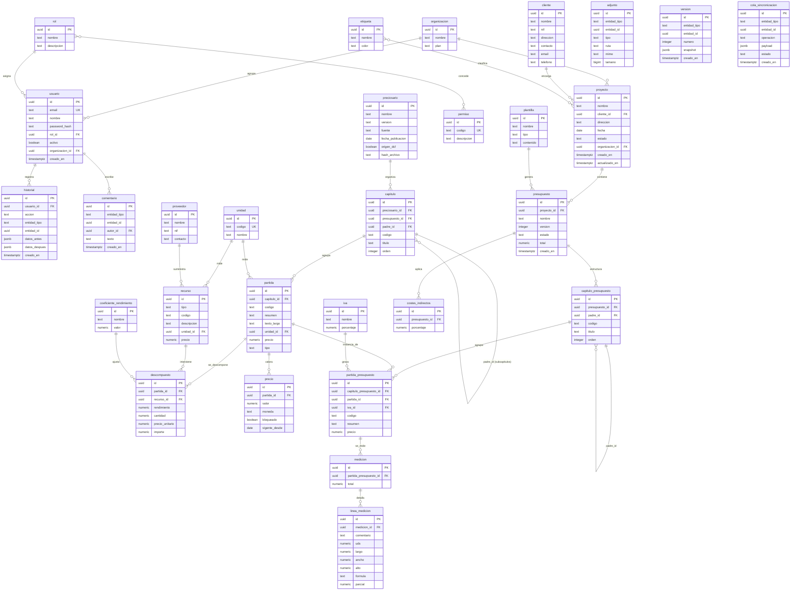

# Modelo Entidad-Relación y Diseño de Base de Datos

Este documento define el modelo entidad-relación (ER) completo y el diseño físico de la base de datos de **Preventivi App**, una aplicación de presupuestos y mediciones de obra estilo Primus (ACCA) con arquitectura **offline-first**.

La aplicación opera con **dos motores de base de datos**:

- **SQLite (con FTS5)** como base de datos **local** en cada cliente Flutter (Desktop / Mobile / Web), para trabajo offline.
- **PostgreSQL** (con `pg_trgm`, `tsvector` y `pgvector`) como base de datos **servidor**, autoridad de sincronización y soporte de IA.

Decisiones canónicas respetadas en todo el documento:

- Identificadores **UUID v7** como clave primaria (ordenables temporalmente, evita fragmentación de índices).
- Nombres de tablas en **singular `snake_case`**; columnas en **`snake_case`**.
- Columnas de control de sincronización en todas las entidades versionables: `creado_en`, `actualizado_en`, `sincronizado_en`, `eliminado` (soft delete).
- Toda la documentación en **español**.

---

## 1. Diagrama Entidad-Relación completo

El siguiente diagrama Mermaid recoge todas las entidades del modelo de dominio canónico, sus claves primarias (PK), foráneas (FK) y cardinalidades.



> Nota de cardinalidad: la entidad `capitulo` puede pertenecer a un **preciosario** (catálogo importado de DCF) o a un **presupuesto** (mediante la jerarquía paralela `capitulo_presupuesto`). Las **instancias** dentro de un presupuesto (`capitulo_presupuesto`, `partida_presupuesto`) permiten que el precio diverja del preciosario base.

---

## 2. Esquema de cada tabla (DDL)

Se ofrece el DDL para **PostgreSQL** (servidor) y, cuando difiere, su equivalente **SQLite** (local). Las diferencias clave aparecen comentadas y se resumen en la tabla comparativa de la sección 10.

### Convención de columnas de control

Toda tabla de dominio sincronizable incluye:

| Columna | PostgreSQL | SQLite | Significado |
|---|---|---|---|
| `creado_en` | `timestamptz NOT NULL DEFAULT now()` | `TEXT NOT NULL DEFAULT (strftime('%Y-%m-%dT%H:%M:%fZ','now'))` | Alta del registro |
| `actualizado_en` | `timestamptz NOT NULL DEFAULT now()` | `TEXT NOT NULL DEFAULT (...)` | Última modificación (trigger/aplicación) |
| `sincronizado_en` | `timestamptz NULL` | `TEXT NULL` | Última confirmación de sync; `NULL` = pendiente |
| `eliminado` | `boolean NOT NULL DEFAULT false` | `INTEGER NOT NULL DEFAULT 0` | Soft delete |

### 2.1 organizacion

```sql
-- PostgreSQL
CREATE TABLE organizacion (
    id               uuid PRIMARY KEY,           -- UUID v7 generado por la app
    nombre           text NOT NULL,
    plan             text NOT NULL DEFAULT 'free',
    creado_en        timestamptz NOT NULL DEFAULT now(),
    actualizado_en   timestamptz NOT NULL DEFAULT now(),
    sincronizado_en  timestamptz NULL,
    eliminado        boolean NOT NULL DEFAULT false,
    CONSTRAINT ck_organizacion_plan CHECK (plan IN ('free','pro','business','enterprise'))
);
```

```sql
-- SQLite
CREATE TABLE organizacion (
    id               TEXT PRIMARY KEY,           -- UUID v7 en formato texto canónico
    nombre           TEXT NOT NULL,
    plan             TEXT NOT NULL DEFAULT 'free',
    creado_en        TEXT NOT NULL DEFAULT (strftime('%Y-%m-%dT%H:%M:%fZ','now')),
    actualizado_en   TEXT NOT NULL DEFAULT (strftime('%Y-%m-%dT%H:%M:%fZ','now')),
    sincronizado_en  TEXT NULL,
    eliminado        INTEGER NOT NULL DEFAULT 0,
    CHECK (plan IN ('free','pro','business','enterprise'))
) STRICT;
```

### 2.2 rol, permiso, rol_permiso (RBAC)

```sql
-- PostgreSQL
CREATE TABLE rol (
    id          uuid PRIMARY KEY,
    nombre      text NOT NULL UNIQUE,
    descripcion text NULL,
    CONSTRAINT ck_rol_nombre CHECK (nombre IN ('admin','jefe_obra','presupuestista','lector'))
);

CREATE TABLE permiso (
    id          uuid PRIMARY KEY,
    codigo      text NOT NULL UNIQUE,            -- clave natural RBAC, p.ej. 'presupuesto.editar'
    descripcion text NULL
);

CREATE TABLE rol_permiso (                       -- tabla puente N:M
    rol_id      uuid NOT NULL REFERENCES rol(id) ON DELETE CASCADE,
    permiso_id  uuid NOT NULL REFERENCES permiso(id) ON DELETE CASCADE,
    PRIMARY KEY (rol_id, permiso_id)
);
```

> En SQLite los `uuid` pasan a `TEXT` y se añade `STRICT`; las `REFERENCES` son idénticas (requiere `PRAGMA foreign_keys = ON`).

### 2.3 usuario

```sql
-- PostgreSQL
CREATE TABLE usuario (
    id               uuid PRIMARY KEY,
    email            text NOT NULL,
    nombre           text NOT NULL,
    password_hash    text NOT NULL,
    rol_id           uuid NOT NULL REFERENCES rol(id),
    organizacion_id  uuid NOT NULL REFERENCES organizacion(id) ON DELETE CASCADE,
    activo           boolean NOT NULL DEFAULT true,
    creado_en        timestamptz NOT NULL DEFAULT now(),
    actualizado_en   timestamptz NOT NULL DEFAULT now(),
    sincronizado_en  timestamptz NULL,
    eliminado        boolean NOT NULL DEFAULT false,
    CONSTRAINT uq_usuario_email UNIQUE (email)
);
```

### 2.4 cliente

```sql
-- PostgreSQL
CREATE TABLE cliente (
    id               uuid PRIMARY KEY,
    nombre           text NOT NULL,
    nif              text NULL,
    direccion        text NULL,
    contacto         text NULL,
    email            text NULL,
    telefono         text NULL,
    creado_en        timestamptz NOT NULL DEFAULT now(),
    actualizado_en   timestamptz NOT NULL DEFAULT now(),
    sincronizado_en  timestamptz NULL,
    eliminado        boolean NOT NULL DEFAULT false
);
```

### 2.5 proyecto

```sql
-- PostgreSQL
CREATE TABLE proyecto (
    id               uuid PRIMARY KEY,
    nombre           text NOT NULL,
    cliente_id       uuid NULL REFERENCES cliente(id),
    direccion        text NULL,
    fecha            date NULL,
    estado           text NOT NULL DEFAULT 'borrador',
    organizacion_id  uuid NOT NULL REFERENCES organizacion(id) ON DELETE CASCADE,
    creado_en        timestamptz NOT NULL DEFAULT now(),
    actualizado_en   timestamptz NOT NULL DEFAULT now(),
    sincronizado_en  timestamptz NULL,
    eliminado        boolean NOT NULL DEFAULT false,
    CONSTRAINT ck_proyecto_estado CHECK (estado IN ('borrador','activo','cerrado','archivado'))
);
```

### 2.6 preciosario

```sql
-- PostgreSQL
CREATE TABLE preciosario (
    id                 uuid PRIMARY KEY,
    nombre             text NOT NULL,
    version            text NULL,
    fuente             text NULL,
    fecha_publicacion  date NULL,
    origen_dcf         boolean NOT NULL DEFAULT true,
    hash_archivo       text NULL,                -- SHA-256 del archivo DCF importado (deduplicación)
    creado_en          timestamptz NOT NULL DEFAULT now(),
    actualizado_en     timestamptz NOT NULL DEFAULT now(),
    sincronizado_en    timestamptz NULL,
    eliminado          boolean NOT NULL DEFAULT false,
    CONSTRAINT uq_preciosario_hash UNIQUE (hash_archivo)
);
```

### 2.7 capitulo (jerárquico, autorreferencia)

```sql
-- PostgreSQL
CREATE TABLE capitulo (
    id               uuid PRIMARY KEY,
    preciosario_id   uuid NULL REFERENCES preciosario(id) ON DELETE CASCADE,
    presupuesto_id   uuid NULL REFERENCES presupuesto(id) ON DELETE CASCADE,
    padre_id         uuid NULL REFERENCES capitulo(id) ON DELETE CASCADE,  -- autorreferencia
    codigo           text NOT NULL,
    titulo           text NOT NULL,
    orden            integer NOT NULL DEFAULT 0,
    creado_en        timestamptz NOT NULL DEFAULT now(),
    actualizado_en   timestamptz NOT NULL DEFAULT now(),
    sincronizado_en  timestamptz NULL,
    eliminado        boolean NOT NULL DEFAULT false,
    -- pertenece a preciosario O a presupuesto, exactamente uno:
    CONSTRAINT ck_capitulo_propietario CHECK (
        (preciosario_id IS NOT NULL)::int + (presupuesto_id IS NOT NULL)::int = 1
    )
);
```

```sql
-- SQLite (el XOR se expresa sin cast booleano)
CREATE TABLE capitulo (
    id               TEXT PRIMARY KEY,
    preciosario_id   TEXT NULL REFERENCES preciosario(id) ON DELETE CASCADE,
    presupuesto_id   TEXT NULL REFERENCES presupuesto(id) ON DELETE CASCADE,
    padre_id         TEXT NULL REFERENCES capitulo(id) ON DELETE CASCADE,
    codigo           TEXT NOT NULL,
    titulo           TEXT NOT NULL,
    orden            INTEGER NOT NULL DEFAULT 0,
    creado_en        TEXT NOT NULL DEFAULT (strftime('%Y-%m-%dT%H:%M:%fZ','now')),
    actualizado_en   TEXT NOT NULL DEFAULT (strftime('%Y-%m-%dT%H:%M:%fZ','now')),
    sincronizado_en  TEXT NULL,
    eliminado        INTEGER NOT NULL DEFAULT 0,
    CHECK ((preciosario_id IS NOT NULL) + (presupuesto_id IS NOT NULL) = 1)
) STRICT;
```

### 2.8 unidad

```sql
-- PostgreSQL
CREATE TABLE unidad (
    id      uuid PRIMARY KEY,
    codigo  text NOT NULL UNIQUE,                -- 'm','m2','m3','ud','kg','h'
    nombre  text NOT NULL
);
```

### 2.9 partida (unidad de obra)

```sql
-- PostgreSQL
CREATE TABLE partida (
    id               uuid PRIMARY KEY,
    capitulo_id      uuid NOT NULL REFERENCES capitulo(id) ON DELETE CASCADE,
    codigo           text NOT NULL,              -- clave natural dentro del preciosario
    resumen          text NOT NULL,
    texto_largo      text NULL,
    unidad_id        uuid NULL REFERENCES unidad(id),
    precio           numeric(14,4) NOT NULL DEFAULT 0,
    tipo             text NOT NULL DEFAULT 'partida',
    busqueda         tsvector GENERATED ALWAYS AS (   -- columna FTS (PostgreSQL)
                        to_tsvector('spanish',
                            coalesce(codigo,'') || ' ' ||
                            coalesce(resumen,'') || ' ' ||
                            coalesce(texto_largo,''))
                     ) STORED,
    creado_en        timestamptz NOT NULL DEFAULT now(),
    actualizado_en   timestamptz NOT NULL DEFAULT now(),
    sincronizado_en  timestamptz NULL,
    eliminado        boolean NOT NULL DEFAULT false,
    CONSTRAINT ck_partida_precio CHECK (precio >= 0),
    CONSTRAINT ck_partida_tipo   CHECK (tipo IN ('partida','partida_alzada','auxiliar'))
);
```

```sql
-- SQLite: numeric -> NUMERIC (afinidad REAL), sin tsvector (se usa tabla FTS5 externa, ver sección 5)
CREATE TABLE partida (
    id               TEXT PRIMARY KEY,
    capitulo_id      TEXT NOT NULL REFERENCES capitulo(id) ON DELETE CASCADE,
    codigo           TEXT NOT NULL,
    resumen          TEXT NOT NULL,
    texto_largo      TEXT NULL,
    unidad_id        TEXT NULL REFERENCES unidad(id),
    precio           NUMERIC NOT NULL DEFAULT 0,
    tipo             TEXT NOT NULL DEFAULT 'partida',
    creado_en        TEXT NOT NULL DEFAULT (strftime('%Y-%m-%dT%H:%M:%fZ','now')),
    actualizado_en   TEXT NOT NULL DEFAULT (strftime('%Y-%m-%dT%H:%M:%fZ','now')),
    sincronizado_en  TEXT NULL,
    eliminado        INTEGER NOT NULL DEFAULT 0,
    CHECK (precio >= 0),
    CHECK (tipo IN ('partida','partida_alzada','auxiliar'))
) STRICT;
```

### 2.10 recurso (con discriminador de tipo)

Tabla base única con **discriminador** `tipo ∈ {mano_obra, material, maquinaria, otros}` (estrategia *Table-Per-Hierarchy*, eficiente para 500k+ filas y consultas mixtas en el descompuesto).

```sql
-- PostgreSQL
CREATE TABLE recurso (
    id               uuid PRIMARY KEY,
    tipo             text NOT NULL,              -- discriminador
    codigo           text NOT NULL,
    descripcion      text NOT NULL,
    unidad_id        uuid NULL REFERENCES unidad(id),
    precio           numeric(14,4) NOT NULL DEFAULT 0,
    proveedor_id     uuid NULL REFERENCES proveedor(id),
    busqueda         tsvector GENERATED ALWAYS AS (
                        to_tsvector('spanish',
                            coalesce(codigo,'') || ' ' || coalesce(descripcion,''))
                     ) STORED,
    creado_en        timestamptz NOT NULL DEFAULT now(),
    actualizado_en   timestamptz NOT NULL DEFAULT now(),
    sincronizado_en  timestamptz NULL,
    eliminado        boolean NOT NULL DEFAULT false,
    CONSTRAINT ck_recurso_tipo   CHECK (tipo IN ('mano_obra','material','maquinaria','otros')),
    CONSTRAINT ck_recurso_precio CHECK (precio >= 0)
);
```

### 2.11 descompuesto (análisis de precios)

```sql
-- PostgreSQL
CREATE TABLE descompuesto (
    id                          uuid PRIMARY KEY,
    partida_id                  uuid NOT NULL REFERENCES partida(id) ON DELETE CASCADE,
    recurso_id                  uuid NOT NULL REFERENCES recurso(id),
    coeficiente_rendimiento_id  uuid NULL REFERENCES coeficiente_rendimiento(id),
    rendimiento                 numeric(14,6) NOT NULL DEFAULT 1,
    cantidad                    numeric(14,6) NOT NULL DEFAULT 0,
    precio_unitario             numeric(14,4) NOT NULL DEFAULT 0,
    importe                     numeric(14,4) NOT NULL DEFAULT 0,
    orden                       integer NOT NULL DEFAULT 0,
    creado_en                   timestamptz NOT NULL DEFAULT now(),
    actualizado_en              timestamptz NOT NULL DEFAULT now(),
    sincronizado_en             timestamptz NULL,
    eliminado                   boolean NOT NULL DEFAULT false,
    CONSTRAINT ck_descompuesto_importe CHECK (importe >= 0)
);
```

> **`analisis_precios`** (del brief) se modela como **vista** agregada, no como tabla — ver sección 7.

### 2.12 precio (histórico/bloqueo)

```sql
-- PostgreSQL
CREATE TABLE precio (
    id               uuid PRIMARY KEY,
    partida_id       uuid NOT NULL REFERENCES partida(id) ON DELETE CASCADE,
    valor            numeric(14,4) NOT NULL,
    moneda           text NOT NULL DEFAULT 'EUR',
    bloqueado        boolean NOT NULL DEFAULT false,  -- true = no se actualiza al reimportar DCF
    vigente_desde    date NOT NULL DEFAULT current_date,
    creado_en        timestamptz NOT NULL DEFAULT now(),
    actualizado_en   timestamptz NOT NULL DEFAULT now(),
    sincronizado_en  timestamptz NULL,
    eliminado        boolean NOT NULL DEFAULT false,
    CONSTRAINT ck_precio_valor CHECK (valor >= 0)
);
```

### 2.13 coeficiente_rendimiento, iva, costes_indirectos, proveedor

```sql
-- PostgreSQL
CREATE TABLE coeficiente_rendimiento (
    id      uuid PRIMARY KEY,
    nombre  text NOT NULL,
    valor   numeric(8,4) NOT NULL DEFAULT 1,
    CONSTRAINT ck_coef_valor CHECK (valor > 0)
);

CREATE TABLE iva (
    id          uuid PRIMARY KEY,
    nombre      text NOT NULL,
    porcentaje  numeric(5,2) NOT NULL,
    CONSTRAINT ck_iva_pct CHECK (porcentaje >= 0 AND porcentaje <= 100)
);

CREATE TABLE costes_indirectos (
    id              uuid PRIMARY KEY,
    presupuesto_id  uuid NOT NULL REFERENCES presupuesto(id) ON DELETE CASCADE,
    porcentaje      numeric(5,2) NOT NULL DEFAULT 0,
    CONSTRAINT ck_ci_pct CHECK (porcentaje >= 0 AND porcentaje <= 100)
);

CREATE TABLE proveedor (
    id        uuid PRIMARY KEY,
    nombre    text NOT NULL,
    nif       text NULL,
    contacto  text NULL
);
```

### 2.14 presupuesto (versionable)

```sql
-- PostgreSQL
CREATE TABLE presupuesto (
    id               uuid PRIMARY KEY,
    proyecto_id      uuid NOT NULL REFERENCES proyecto(id) ON DELETE CASCADE,
    nombre           text NOT NULL,
    version          integer NOT NULL DEFAULT 1,
    estado           text NOT NULL DEFAULT 'borrador',
    total            numeric(16,4) NOT NULL DEFAULT 0,
    plantilla_id     uuid NULL REFERENCES plantilla(id),
    creado_en        timestamptz NOT NULL DEFAULT now(),
    actualizado_en   timestamptz NOT NULL DEFAULT now(),
    sincronizado_en  timestamptz NULL,
    eliminado        boolean NOT NULL DEFAULT false,
    CONSTRAINT ck_presupuesto_estado CHECK (estado IN ('borrador','enviado','aprobado','rechazado','cerrado')),
    CONSTRAINT uq_presupuesto_version UNIQUE (proyecto_id, nombre, version)
);
```

### 2.15 capitulo_presupuesto y partida_presupuesto (instancias)

```sql
-- PostgreSQL
CREATE TABLE capitulo_presupuesto (
    id               uuid PRIMARY KEY,
    presupuesto_id   uuid NOT NULL REFERENCES presupuesto(id) ON DELETE CASCADE,
    padre_id         uuid NULL REFERENCES capitulo_presupuesto(id) ON DELETE CASCADE,
    codigo           text NOT NULL,
    titulo           text NOT NULL,
    orden            integer NOT NULL DEFAULT 0,
    creado_en        timestamptz NOT NULL DEFAULT now(),
    actualizado_en   timestamptz NOT NULL DEFAULT now(),
    sincronizado_en  timestamptz NULL,
    eliminado        boolean NOT NULL DEFAULT false
);

CREATE TABLE partida_presupuesto (
    id                      uuid PRIMARY KEY,
    capitulo_presupuesto_id uuid NOT NULL REFERENCES capitulo_presupuesto(id) ON DELETE CASCADE,
    partida_id              uuid NULL REFERENCES partida(id),  -- origen en preciosario (puede divergir)
    iva_id                  uuid NULL REFERENCES iva(id),
    codigo                  text NOT NULL,
    resumen                 text NOT NULL,
    precio                  numeric(14,4) NOT NULL DEFAULT 0,  -- precio que puede divergir del preciosario
    creado_en               timestamptz NOT NULL DEFAULT now(),
    actualizado_en          timestamptz NOT NULL DEFAULT now(),
    sincronizado_en         timestamptz NULL,
    eliminado               boolean NOT NULL DEFAULT false,
    CONSTRAINT ck_partida_pres_precio CHECK (precio >= 0)
);
```

### 2.16 medicion y linea_medicion

```sql
-- PostgreSQL
CREATE TABLE medicion (
    id                      uuid PRIMARY KEY,
    partida_presupuesto_id  uuid NOT NULL REFERENCES partida_presupuesto(id) ON DELETE CASCADE,
    total                   numeric(16,6) NOT NULL DEFAULT 0,
    creado_en               timestamptz NOT NULL DEFAULT now(),
    actualizado_en          timestamptz NOT NULL DEFAULT now(),
    sincronizado_en         timestamptz NULL,
    eliminado               boolean NOT NULL DEFAULT false
);

CREATE TABLE linea_medicion (
    id           uuid PRIMARY KEY,
    medicion_id  uuid NOT NULL REFERENCES medicion(id) ON DELETE CASCADE,
    comentario   text NULL,
    uds          numeric(14,4) NULL,   -- nº de iguales
    largo        numeric(14,4) NULL,
    ancho        numeric(14,4) NULL,
    alto         numeric(14,4) NULL,
    formula      text NULL,            -- fórmula alternativa a uds×largo×ancho×alto
    parcial      numeric(16,6) NOT NULL DEFAULT 0,
    orden        integer NOT NULL DEFAULT 0,
    creado_en    timestamptz NOT NULL DEFAULT now(),
    actualizado_en timestamptz NOT NULL DEFAULT now(),
    sincronizado_en timestamptz NULL,
    eliminado    boolean NOT NULL DEFAULT false
);
```

### 2.17 plantilla, etiqueta, comentario, adjunto

```sql
-- PostgreSQL
CREATE TABLE plantilla (
    id        uuid PRIMARY KEY,
    nombre    text NOT NULL,
    tipo      text NOT NULL,                     -- presupuesto/documento/...
    contenido jsonb NOT NULL DEFAULT '{}'::jsonb,
    creado_en timestamptz NOT NULL DEFAULT now()
);

CREATE TABLE etiqueta (
    id     uuid PRIMARY KEY,
    nombre text NOT NULL,
    color  text NULL
);

CREATE TABLE entidad_etiqueta (                  -- tabla puente N:M genérica
    etiqueta_id  uuid NOT NULL REFERENCES etiqueta(id) ON DELETE CASCADE,
    entidad_tipo text NOT NULL,
    entidad_id   uuid NOT NULL,
    PRIMARY KEY (etiqueta_id, entidad_tipo, entidad_id)
);

CREATE TABLE comentario (
    id           uuid PRIMARY KEY,
    entidad_tipo text NOT NULL,                  -- polimórfico
    entidad_id   uuid NOT NULL,
    autor_id     uuid NOT NULL REFERENCES usuario(id),
    texto        text NOT NULL,
    creado_en    timestamptz NOT NULL DEFAULT now(),
    actualizado_en timestamptz NOT NULL DEFAULT now(),
    sincronizado_en timestamptz NULL,
    eliminado    boolean NOT NULL DEFAULT false
);

CREATE TABLE adjunto (
    id           uuid PRIMARY KEY,
    entidad_tipo text NOT NULL,
    entidad_id   uuid NOT NULL,
    tipo         text NOT NULL,                  -- foto/plano/documento
    ruta         text NOT NULL,
    mime         text NULL,
    tamano       bigint NULL,
    creado_en    timestamptz NOT NULL DEFAULT now(),
    eliminado    boolean NOT NULL DEFAULT false,
    CONSTRAINT ck_adjunto_tipo CHECK (tipo IN ('foto','plano','documento'))
);
```

> Las relaciones **polimórficas** (`comentario`, `adjunto`, `entidad_etiqueta`, `version`, `historial`, `cola_sincronizacion`) usan el par `(entidad_tipo, entidad_id)`. No se declaran FK reales (PostgreSQL no soporta FK polimórficas); la integridad se garantiza en la capa de aplicación (.NET / domain events).

Las tablas de soporte de sincronización (`version`, `historial`, `cola_sincronizacion`) se detallan en la **sección 6**.

---

## 3. Estrategia de claves

| Aspecto | Decisión | Justificación |
|---|---|---|
| **Clave primaria** | **UUID v7** en todas las tablas | Generable offline en el cliente sin coordinación con el servidor (esencial offline-first). UUID v7 es **ordenable temporalmente** (prefijo de timestamp Unix ms), por lo que las inserciones son casi secuenciales y **no fragmentan** los índices B-Tree como hace UUID v4. |
| **Tipo físico** | `uuid` (PostgreSQL, 16 bytes nativos) / `TEXT` UUID canónico (SQLite) | PostgreSQL almacena el UUID compacto e indexa de forma eficiente. SQLite no tiene tipo UUID nativo; se usa la representación textual de 36 caracteres (legible, portable en el change log). |
| **Generación** | En la **aplicación** (.NET, librería UUID v7) antes de insertar | Permite asignar el ID antes de tocar la BD, construir grafos de objetos en memoria y registrar el cambio en la cola de sync con el ID definitivo. |
| **Clave natural** | `codigo` de partida/recurso/capítulo como **índice único** (no como PK) | El `codigo` (p.ej. `E04.001`) es estable dentro de un preciosario pero **no** globalmente único ni inmutable; sirve para búsqueda, deduplicación en reimportación DCF y referencia humana. Se indexa con `UNIQUE` por ámbito (preciosario/capítulo). |

Índices únicos de clave natural:

```sql
-- Código único por capítulo (una partida no se repite dentro del mismo capítulo)
CREATE UNIQUE INDEX uq_partida_codigo ON partida (capitulo_id, codigo) WHERE eliminado = false;

-- Código de recurso único por tipo
CREATE UNIQUE INDEX uq_recurso_codigo ON recurso (tipo, codigo) WHERE eliminado = false;

-- Código de capítulo único dentro de su preciosario
CREATE UNIQUE INDEX uq_capitulo_codigo_preciosario
    ON capitulo (preciosario_id, codigo) WHERE preciosario_id IS NOT NULL AND eliminado = false;
```

---

## 4. Jerarquía de capítulos (árboles)

Los capítulos forman un árbol mediante la autorreferencia `padre_id`. Para preciosarios DCF con **500.000+ partidas** y jerarquías de capítulos/subcapítulos profundas, la elección del patrón de árbol es crítica.

### Patrones evaluados

| Patrón | Lectura subárbol | Escritura/mover | Complejidad | Veredicto |
|---|---|---|---|---|
| **Adjacency list** (`padre_id` solo) | Recursiva (CTE), lenta en profundidad | Trivial (1 update) | Mínima | Base, insuficiente por sí sola |
| **Closure table** (tabla de cierre `ancestro/descendiente/profundidad`) | O(1) por join, muy rápida | Cara al mover (recalcular pares) | Tabla extra grande | Óptima para lectura intensa |
| **Path materializado** (columna `ruta` tipo `ltree`/string `1.4.9`) | Rápida con `LIKE 'ruta%'` / `ltree` | Media (reescribir prefijos del subárbol) | Baja | Buen equilibrio |

### Recomendación

Se adopta un **enfoque híbrido**:

1. **`padre_id`** (adjacency list) como **fuente de verdad** — simple, sincroniza bien (un cambio = un campo) y es lo único que el cliente offline necesita mantener.
2. **Path materializado** como **índice de lectura** derivado:
   - **PostgreSQL**: columna `ruta ltree` (extensión `ltree`) con índice GiST → consultas de subárbol `WHERE ruta <@ 'raiz.cap'` extremadamente rápidas.
   - **SQLite**: columna `ruta TEXT` (p.ej. `'/aa/bb/cc/'`) con índice; subárbol vía `WHERE ruta LIKE '/aa/bb/%'`.

**Justificación**: en preciosarios el árbol se **lee muchísimo más de lo que se reordena**, y la lectura de subárbol (cargar un capítulo y todos sus descendientes para virtual scrolling) es la operación caliente. El path materializado da lecturas casi O(1) sin el coste de mantenimiento ni el tamaño de una closure table completa, y se regenera fácilmente a partir de `padre_id` tras un sync. La closure table se reserva para un futuro caso de uso de analítica sobre el árbol completo si fuera necesario.

```sql
-- PostgreSQL: path materializado con ltree
ALTER TABLE capitulo ADD COLUMN ruta ltree;
CREATE INDEX ix_capitulo_ruta_gist ON capitulo USING GIST (ruta);
CREATE INDEX ix_capitulo_padre ON capitulo (padre_id) WHERE eliminado = false;

-- Lectura de un subárbol completo (un capítulo y todos sus descendientes)
SELECT * FROM capitulo WHERE ruta <@ '0a1b.3c4d' AND eliminado = false ORDER BY ruta, orden;
```

```sql
-- SQLite: path materializado textual
ALTER TABLE capitulo ADD COLUMN ruta TEXT;
CREATE INDEX ix_capitulo_ruta ON capitulo (ruta);
CREATE INDEX ix_capitulo_padre ON capitulo (padre_id);

-- Lectura de subárbol
SELECT * FROM capitulo WHERE ruta LIKE '/0a1b/3c4d/%' AND eliminado = 0 ORDER BY ruta, orden;
```

La misma estrategia se aplica a `capitulo_presupuesto`.

---

## 5. Índices y búsqueda full-text / semántica

### 5.1 Índices de acceso frecuente

```sql
-- Búsqueda por código (clave natural) — ya cubierta por los índices únicos de la sección 3.
-- Partidas de un capítulo (carga de árbol, paginación):
CREATE INDEX ix_partida_capitulo ON partida (capitulo_id, codigo) WHERE eliminado = false;

-- Todas las partidas de un preciosario (vía capítulo) — índice de apoyo en capítulo:
CREATE INDEX ix_capitulo_preciosario ON capitulo (preciosario_id) WHERE eliminado = false;

-- Descompuesto de una partida:
CREATE INDEX ix_descompuesto_partida ON descompuesto (partida_id) WHERE eliminado = false;
CREATE INDEX ix_descompuesto_recurso ON descompuesto (recurso_id);

-- Mediciones de una partida de presupuesto:
CREATE INDEX ix_medicion_partida_pres ON medicion (partida_presupuesto_id);
CREATE INDEX ix_linea_medicion ON linea_medicion (medicion_id);

-- Recursos por tipo (mano_obra/material/maquinaria):
CREATE INDEX ix_recurso_tipo ON recurso (tipo) WHERE eliminado = false;
```

### 5.2 Full-text en PostgreSQL (`tsvector` + `pg_trgm`)

```sql
-- Búsqueda lingüística (stemming español) sobre la columna generada 'busqueda':
CREATE INDEX ix_partida_fts ON partida USING GIN (busqueda);
CREATE INDEX ix_recurso_fts ON recurso USING GIN (busqueda);

-- Búsqueda por similitud / fuzzy y por subcadenas en código y resumen (pg_trgm):
CREATE EXTENSION IF NOT EXISTS pg_trgm;
CREATE INDEX ix_partida_codigo_trgm ON partida USING GIN (codigo gin_trgm_ops);
CREATE INDEX ix_partida_resumen_trgm ON partida USING GIN (resumen gin_trgm_ops);

-- Consulta combinada (relevancia + fuzzy):
SELECT id, codigo, resumen
FROM partida
WHERE busqueda @@ websearch_to_tsquery('spanish', 'tabique ladrillo')
   OR resumen % 'tabique ladrillo'
ORDER BY ts_rank(busqueda, websearch_to_tsquery('spanish','tabique ladrillo')) DESC
LIMIT 50;
```

### 5.3 Full-text en SQLite (FTS5)

En SQLite se usa una tabla virtual **FTS5** externa, sincronizada con `partida` mediante triggers:

```sql
-- Tabla FTS5 (contentless, referencia por rowid implícito = clave externa textual del id)
CREATE VIRTUAL TABLE partida_fts USING fts5(
    codigo, resumen, texto_largo,
    content='partida', content_rowid='rowid',
    tokenize = "unicode61 remove_diacritics 2"   -- ignora acentos
);

-- Triggers de sincronización
CREATE TRIGGER partida_ai AFTER INSERT ON partida BEGIN
    INSERT INTO partida_fts(rowid, codigo, resumen, texto_largo)
    VALUES (new.rowid, new.codigo, new.resumen, new.texto_largo);
END;
CREATE TRIGGER partida_ad AFTER DELETE ON partida BEGIN
    INSERT INTO partida_fts(partida_fts, rowid, codigo, resumen, texto_largo)
    VALUES ('delete', old.rowid, old.codigo, old.resumen, old.texto_largo);
END;
CREATE TRIGGER partida_au AFTER UPDATE ON partida BEGIN
    INSERT INTO partida_fts(partida_fts, rowid, codigo, resumen, texto_largo)
    VALUES ('delete', old.rowid, old.codigo, old.resumen, old.texto_largo);
    INSERT INTO partida_fts(rowid, codigo, resumen, texto_largo)
    VALUES (new.rowid, new.codigo, new.resumen, new.texto_largo);
END;

-- Consulta
SELECT p.id, p.codigo, p.resumen
FROM partida_fts f JOIN partida p ON p.rowid = f.rowid
WHERE partida_fts MATCH 'tabique AND ladrillo'
ORDER BY rank
LIMIT 50;
```

### 5.4 Búsqueda semántica con embeddings (pgvector, solo servidor)

La búsqueda semántica (IA) reside **únicamente en PostgreSQL** (el cliente no calcula embeddings):

```sql
CREATE EXTENSION IF NOT EXISTS vector;

CREATE TABLE partida_embedding (
    partida_id  uuid PRIMARY KEY REFERENCES partida(id) ON DELETE CASCADE,
    modelo      text NOT NULL,                  -- modelo de embedding usado
    embedding   vector(1536) NOT NULL,          -- dimensión según modelo
    creado_en   timestamptz NOT NULL DEFAULT now()
);

-- Índice ANN para vecinos más cercanos (coseno)
CREATE INDEX ix_partida_embedding_hnsw
    ON partida_embedding USING hnsw (embedding vector_cosine_ops);

-- Búsqueda semántica: las N partidas más parecidas a un vector de consulta
SELECT p.id, p.codigo, p.resumen,
       e.embedding <=> :consulta AS distancia
FROM partida_embedding e JOIN partida p ON p.id = e.partida_id
ORDER BY e.embedding <=> :consulta
LIMIT 20;
```

---

## 6. Tablas de soporte de sincronización

### 6.1 cola_sincronizacion (change log offline-first)

```sql
-- SQLite (local): registro de cada cambio pendiente de subir
CREATE TABLE cola_sincronizacion (
    id            TEXT PRIMARY KEY,              -- UUID v7
    entidad_tipo  TEXT NOT NULL,
    entidad_id    TEXT NOT NULL,
    operacion     TEXT NOT NULL,                 -- insert/update/delete
    payload       TEXT NOT NULL,                 -- JSON serializado del cambio
    estado        TEXT NOT NULL DEFAULT 'pendiente',
    intentos      INTEGER NOT NULL DEFAULT 0,
    error         TEXT NULL,
    creado_en     TEXT NOT NULL DEFAULT (strftime('%Y-%m-%dT%H:%M:%fZ','now')),
    actualizado_en TEXT NOT NULL DEFAULT (strftime('%Y-%m-%dT%H:%M:%fZ','now')),
    sincronizado_en TEXT NULL,
    CHECK (operacion IN ('insert','update','delete')),
    CHECK (estado IN ('pendiente','enviado','confirmado','conflicto'))
) STRICT;

-- Índice para drenar la cola en orden:
CREATE INDEX ix_cola_pendiente ON cola_sincronizacion (estado, creado_en)
    WHERE estado = 'pendiente';
```

```sql
-- PostgreSQL: en el servidor 'payload' usa jsonb
CREATE TABLE cola_sincronizacion (
    id            uuid PRIMARY KEY,
    entidad_tipo  text NOT NULL,
    entidad_id    uuid NOT NULL,
    operacion     text NOT NULL,
    payload       jsonb NOT NULL,
    estado        text NOT NULL DEFAULT 'pendiente',
    intentos      integer NOT NULL DEFAULT 0,
    error         text NULL,
    creado_en     timestamptz NOT NULL DEFAULT now(),
    actualizado_en timestamptz NOT NULL DEFAULT now(),
    sincronizado_en timestamptz NULL,
    CONSTRAINT ck_cola_op  CHECK (operacion IN ('insert','update','delete')),
    CONSTRAINT ck_cola_est CHECK (estado IN ('pendiente','enviado','confirmado','conflicto'))
);
```

### 6.2 version (snapshots, presupuestos versionables)

```sql
-- PostgreSQL
CREATE TABLE version (
    id           uuid PRIMARY KEY,
    entidad_tipo text NOT NULL,
    entidad_id   uuid NOT NULL,
    numero       integer NOT NULL,
    snapshot     jsonb NOT NULL,                 -- estado completo serializado
    creado_en    timestamptz NOT NULL DEFAULT now(),
    CONSTRAINT uq_version UNIQUE (entidad_tipo, entidad_id, numero)
);
-- SQLite: snapshot TEXT (JSON), numero INTEGER.
```

### 6.3 historial / auditoria

```sql
-- PostgreSQL
CREATE TABLE historial (
    id            uuid PRIMARY KEY,
    usuario_id    uuid NULL REFERENCES usuario(id),
    accion        text NOT NULL,                 -- crear/editar/eliminar/importar/...
    entidad_tipo  text NOT NULL,
    entidad_id    uuid NOT NULL,
    datos_antes   jsonb NULL,
    datos_despues jsonb NULL,
    creado_en     timestamptz NOT NULL DEFAULT now()
);
CREATE INDEX ix_historial_entidad ON historial (entidad_tipo, entidad_id, creado_en DESC);
-- SQLite: datos_antes/datos_despues TEXT (JSON).
```

### 6.4 Columnas de control y resolución de conflictos

- `actualizado_en` actúa como reloj lógico para la estrategia **last-write-wins** por defecto; cuando hay divergencia se marca `estado = 'conflicto'` en `cola_sincronizacion` y se resuelve en la capa de aplicación.
- `sincronizado_en IS NULL` identifica registros locales no confirmados por el servidor.
- `eliminado = true/1` (soft delete) permite **propagar borrados** por el change log sin perder la referencia hasta confirmar la sincronización; un proceso de *vacuum* purga físicamente los registros con `eliminado = true AND sincronizado_en IS NOT NULL` pasado un periodo de retención.

---

## 7. Vista AnalisisPrecios

`analisis_precios` no es una tabla, sino una **vista agregada** del descompuesto de cada partida (mano de obra + material + maquinaria + % de costes indirectos):

```sql
-- PostgreSQL
CREATE VIEW analisis_precios AS
SELECT
    d.partida_id,
    sum(d.importe) FILTER (WHERE r.tipo = 'mano_obra')  AS coste_mano_obra,
    sum(d.importe) FILTER (WHERE r.tipo = 'material')    AS coste_material,
    sum(d.importe) FILTER (WHERE r.tipo = 'maquinaria')  AS coste_maquinaria,
    sum(d.importe) FILTER (WHERE r.tipo = 'otros')       AS coste_otros,
    sum(d.importe)                                       AS coste_directo
FROM descompuesto d
JOIN recurso r ON r.id = d.recurso_id
WHERE d.eliminado = false
GROUP BY d.partida_id;
```

> El **% de costes indirectos** se aplica en el contexto del presupuesto (tabla `costes_indirectos`), no en el preciosario base; la vista entrega el coste directo y la capa de aplicación suma el indirecto. En SQLite el `FILTER` se reemplaza por `SUM(CASE WHEN r.tipo='mano_obra' THEN d.importe ELSE 0 END)`.

---

## 8. Optimización para 500.000+ partidas

| Técnica | Implementación | Beneficio |
|---|---|---|
| **Particionado** (PostgreSQL) | `partida` particionada por `LIST (preciosario)` o por rango del prefijo de `capitulo` cuando un preciosario es enorme | Cada consulta toca solo la partición de su preciosario; *pruning* automático y mantenimiento (VACUUM, REINDEX) por partición |
| **Índices parciales** | `WHERE eliminado = false` en todos los índices calientes | Los índices ignoran los soft-deleted; menor tamaño y menos páginas leídas |
| **Paginación keyset** | Ordenar por `(codigo, id)` y paginar con `WHERE (codigo, id) > (:ult_codigo, :ult_id)` en vez de `OFFSET` | Coste constante independiente de la página; imprescindible para virtual scrolling sobre 500k filas |
| **Columnas generadas FTS** | `busqueda tsvector STORED` precalculada | Evita recalcular el `tsvector` en cada consulta |
| **Carga perezosa por subárbol** | `ruta` (path materializado) + índice GiST/LIKE | Cargar solo el capítulo visible y sus hijos, no el preciosario entero |
| **BRIN** (opcional servidor) | `BRIN` sobre `creado_en`/`id` (UUID v7 ordenado) | Índice diminuto para barridos cronológicos de auditoría/sync |
| **Importación masiva DCF** | `COPY` (PostgreSQL) / transacción única con `INSERT` por lotes (SQLite) y FTS reconstruido al final | Importar 500k partidas en segundos en vez de minutos |

### Ejemplo de paginación keyset (virtual scrolling)

```sql
-- Página inicial
SELECT id, codigo, resumen, precio
FROM partida
WHERE capitulo_id = :cap AND eliminado = false
ORDER BY codigo, id
LIMIT 100;

-- Página siguiente (sin OFFSET): se pasa el último (codigo, id) de la página anterior
SELECT id, codigo, resumen, precio
FROM partida
WHERE capitulo_id = :cap AND eliminado = false
  AND (codigo, id) > (:ult_codigo, :ult_id)
ORDER BY codigo, id
LIMIT 100;
```

### Ejemplo de particionado (PostgreSQL)

```sql
CREATE TABLE partida (
    -- ... mismas columnas ...
    preciosario_origen uuid NOT NULL   -- columna de partición denormalizada desde capitulo
) PARTITION BY LIST (preciosario_origen);

CREATE TABLE partida_p_dcf2026 PARTITION OF partida FOR VALUES IN ('....');
```

---

## 9. Notas sobre integridad y EF Core

- Todas las FK usan `ON DELETE CASCADE` solo donde la relación es de **composición** (un descompuesto no existe sin su partida); las relaciones de **referencia** (p.ej. `partida.unidad_id`) son `NULL`able y sin cascada.
- En SQLite es obligatorio `PRAGMA foreign_keys = ON;` por conexión (EF Core lo activa) y se recomienda `PRAGMA journal_mode = WAL;` para concurrencia lectura/escritura.
- Los `CHECK` de discriminadores y estados se replican como *enums* en el dominio C# y se validan también con **FluentValidation** (defensa en profundidad).
- Tablas `STRICT` en SQLite garantizan tipado estricto comparable al de PostgreSQL.

---

## 10. SQLite (local) vs PostgreSQL (servidor) — tabla comparativa

| Aspecto | SQLite (local, cliente Flutter) | PostgreSQL (servidor) |
|---|---|---|
| **Rol** | BD offline-first en el dispositivo | Autoridad de sincronización y soporte de IA |
| **PK / UUID v7** | `TEXT` (UUID canónico de 36 chars) | tipo nativo `uuid` (16 bytes) |
| **Booleano** | `INTEGER` (0/1) | `boolean` |
| **Fecha/hora** | `TEXT` ISO-8601 (`strftime`) | `timestamptz` / `date` |
| **Decimal monetario** | `NUMERIC` (afinidad; usar enteros escalados o texto para evitar errores de coma flotante) | `numeric(p,s)` exacto |
| **JSON** | `TEXT` (+ funciones `json_*`) | `jsonb` (indexable, operadores) |
| **Full-text** | **FTS5** (tabla virtual + triggers, `tokenize unicode61 remove_diacritics`) | `tsvector` + GIN, `to_tsvector('spanish')`, `websearch_to_tsquery` |
| **Fuzzy / similitud** | `LIKE` / extensión opcional | `pg_trgm` (`%`, `gin_trgm_ops`) |
| **Búsqueda semántica (embeddings)** | No (no calcula embeddings) | `pgvector` (`vector`, índice HNSW) |
| **Árbol** | `padre_id` + `ruta TEXT` (`LIKE`) | `padre_id` + `ruta ltree` (GiST) |
| **Tipado estricto** | `STRICT` tables | Tipado estricto nativo |
| **Particionado** | No soportado (BD pequeña, 1 usuario) | `PARTITION BY` |
| **Índices parciales** | Sí (`WHERE`) | Sí (`WHERE`) |
| **Generated columns** | Sí (pero FTS se hace con tabla externa) | `GENERATED ALWAYS AS ... STORED` para `tsvector` |
| **Concurrencia** | WAL, un escritor | MVCC multiusuario |
| **Integridad FK** | `PRAGMA foreign_keys = ON` | Siempre activa |
| **Sincronización** | Origina cambios en `cola_sincronizacion` | Recibe, valida y resuelve conflictos; emite vía SignalR |

---

## 11. Resumen

- **27 entidades** del modelo canónico cubiertas, con PK UUID v7 y claves naturales (`codigo`) como índices únicos por ámbito.
- Jerarquía de capítulos resuelta con **adjacency list (`padre_id`) como verdad + path materializado** (`ltree`/`TEXT`) como índice de lectura.
- Búsqueda full-text con **FTS5** (local) y **`tsvector` + `pg_trgm`** (servidor), más **`pgvector`** para búsqueda semántica IA en el servidor.
- Soporte de sincronización offline-first con `cola_sincronizacion`, `version` e `historial`, y columnas de control (`creado_en`, `actualizado_en`, `sincronizado_en`, `eliminado`).
- Optimizado para **500.000+ partidas** mediante particionado, índices parciales, columnas FTS precalculadas y **paginación keyset**.
