# Casos de Uso

Este documento describe los casos de uso funcionales de **Preventivi App**, una aplicación
moderna de presupuestos y mediciones de obra (estilo Primus de ACCA), offline-first con
sincronización a la nube e importación de preciosarios **DCF**.

Los casos de uso se agrupan por módulo. Cada caso de uso incluye: identificador, nombre,
actor principal, precondiciones, flujo principal, flujos alternativos/excepciones y
postcondiciones.

## Actores

| Actor | Descripción | Rol asociado |
|-------|-------------|--------------|
| **Administrador** | Gestiona organización, usuarios, roles y permisos. | `admin` |
| **Jefe de obra** | Supervisa proyectos, mediciones y documentos. | `jefe_obra` |
| **Presupuestista** | Crea y edita presupuestos, partidas y mediciones. | `presupuestista` |
| **Lector** | Consulta presupuestos y documentos en modo solo lectura. | `lector` |
| **Sistema** | Procesos automáticos: importación DCF en background, sincronización, búsqueda por IA. | — |

## Diagrama de actores y casos de uso

```mermaid
graph LR
    admin([Administrador])
    jefe([Jefe de obra])
    presup([Presupuestista])
    lector([Lector])
    sistema([Sistema])

    subgraph Seguridad
        UC_LOGIN[Iniciar sesión]
        UC_ROLES[Gestionar roles y permisos]
    end

    subgraph Proyectos
        UC_PROY_CREAR[Crear proyecto]
        UC_PROY_ABRIR[Abrir proyecto]
        UC_PROY_DUP[Duplicar proyecto]
        UC_PROY_ARCH[Archivar proyecto]
    end

    subgraph Preciosarios
        UC_DCF_IMP[Importar DCF]
        UC_DCF_CAP[Visualizar capítulos]
        UC_DCF_PART[Navegar partidas]
        UC_DCF_ANA[Consultar análisis de precios]
    end

    subgraph Presupuestos
        UC_PRES_CREAR[Crear presupuesto]
        UC_PRES_ADD[Añadir capítulos/partidas]
        UC_PRES_BUSCAR[Buscar partida]
        UC_PRES_COPIAR[Copiar/duplicar partida]
        UC_PRES_PROPIA[Crear partida propia]
        UC_PRES_EDIT[Editar partida]
        UC_PRES_PRECIO[Modificar/bloquear precio]
        UC_PRES_ACT[Actualizar desde nuevo DCF]
        UC_PRES_COMP[Comparar versiones]
    end

    subgraph Mediciones
        UC_MED_ADD[Añadir líneas de medición]
        UC_MED_TOTAL[Ver totales]
    end

    subgraph Documentos
        UC_DOC_PDF[Generar PDF]
        UC_DOC_EXP[Exportar Excel/CSV/JSON/XML]
    end

    subgraph Busqueda
        UC_BUS_INTEL[Buscador inteligente]
        UC_BUS_IA[Búsqueda por IA en lenguaje natural]
    end

    subgraph Sincronizacion
        UC_SYNC_OFF[Trabajar offline]
        UC_SYNC_SYNC[Sincronizar cambios]
        UC_SYNC_CONF[Resolver conflictos]
    end

    admin --> UC_LOGIN
    admin --> UC_ROLES
    admin --> UC_PROY_CREAR
    jefe --> UC_LOGIN
    presup --> UC_LOGIN
    lector --> UC_LOGIN

    jefe --> UC_PROY_CREAR
    presup --> UC_PROY_CREAR
    presup --> UC_PROY_ABRIR
    presup --> UC_PROY_DUP
    jefe --> UC_PROY_ARCH

    presup --> UC_DCF_IMP
    presup --> UC_DCF_CAP
    presup --> UC_DCF_PART
    presup --> UC_DCF_ANA
    lector --> UC_DCF_CAP

    presup --> UC_PRES_CREAR
    presup --> UC_PRES_ADD
    presup --> UC_PRES_BUSCAR
    presup --> UC_PRES_COPIAR
    presup --> UC_PRES_PROPIA
    presup --> UC_PRES_EDIT
    presup --> UC_PRES_PRECIO
    presup --> UC_PRES_ACT
    jefe --> UC_PRES_COMP
    presup --> UC_PRES_COMP

    presup --> UC_MED_ADD
    presup --> UC_MED_TOTAL
    jefe --> UC_MED_TOTAL

    presup --> UC_DOC_PDF
    presup --> UC_DOC_EXP
    jefe --> UC_DOC_PDF
    lector --> UC_DOC_PDF

    presup --> UC_BUS_INTEL
    presup --> UC_BUS_IA

    presup --> UC_SYNC_OFF
    sistema --> UC_SYNC_SYNC
    presup --> UC_SYNC_SYNC
    presup --> UC_SYNC_CONF

    sistema --> UC_DCF_IMP
    sistema --> UC_BUS_IA
```

---

## Módulo: Seguridad

### CU-SEG-01 — Iniciar sesión

| Campo | Valor |
|-------|-------|
| **ID** | CU-SEG-01 |
| **Nombre** | Iniciar sesión |
| **Actor** | Administrador, Jefe de obra, Presupuestista, Lector |

**Precondiciones**
- El usuario está dado de alta y activo (`Usuario.activo = true`).
- La aplicación está instalada o accesible en web.

**Flujo principal**
1. El usuario abre la aplicación y selecciona "Iniciar sesión".
2. Introduce su email y contraseña.
3. El sistema valida las credenciales contra `password_hash` (FluentValidation + verificación de hash).
4. El sistema carga el `Rol` del usuario y sus `Permiso` asociados (RBAC).
5. El sistema emite un token de sesión y abre el espacio de trabajo de su `Organizacion`.
6. Se registra el acceso en `Historial/Auditoria`.

**Flujos alternativos / excepciones**
- **2a. Credenciales incorrectas**: el sistema muestra error genérico y no revela qué campo falló.
- **3a. Usuario inactivo**: se deniega el acceso con mensaje "Cuenta desactivada".
- **5a. Sin conexión**: si existe sesión previa cacheada válida, se permite acceso en modo offline con permisos del último login.

**Postcondiciones**
- Sesión activa con rol y permisos cargados; evento de login auditado.

### CU-SEG-02 — Gestionar roles y permisos

| Campo | Valor |
|-------|-------|
| **ID** | CU-SEG-02 |
| **Nombre** | Gestionar roles y permisos |
| **Actor** | Administrador |

**Precondiciones**
- El usuario tiene rol `admin` y el permiso de gestión de usuarios.

**Flujo principal**
1. El administrador abre la sección "Usuarios y roles".
2. El sistema lista usuarios, `Rol` (admin, jefe_obra, presupuestista, lector) y `Permiso` (RBAC).
3. El administrador crea/edita un usuario o reasigna su `rol_id`.
4. Opcionalmente ajusta los `Permiso` asociados a un rol.
5. El sistema valida y persiste los cambios.
6. Se registra la operación en `Historial/Auditoria` (datos_antes / datos_despues).

**Flujos alternativos / excepciones**
- **3a. Email duplicado**: la validación lo rechaza.
- **3b. Auto-degradación**: el sistema impide que el último administrador se quite a sí mismo el rol `admin`.
- **4a. Permiso inexistente**: se rechaza la asignación.

**Postcondiciones**
- Roles/permisos actualizados; cambios auditados y aplicados en próximos inicios de sesión.

---

## Módulo: Gestión de proyectos

### CU-PRO-01 — Crear proyecto

| Campo | Valor |
|-------|-------|
| **ID** | CU-PRO-01 |
| **Nombre** | Crear proyecto |
| **Actor** | Presupuestista, Jefe de obra, Administrador |

**Precondiciones**
- Usuario autenticado con permiso de creación de proyectos en su `Organizacion`.

**Flujo principal**
1. El usuario selecciona "Nuevo proyecto".
2. Introduce nombre, `Cliente` (existente o nuevo), dirección y fecha.
3. El sistema asigna `id` (UUID v7), `estado = borrador` y `organizacion_id`.
4. FluentValidation valida los campos obligatorios.
5. El sistema persiste el `Proyecto` y registra el cambio en `ColaSincronizacion` (offline-first).
6. Se abre el proyecto recién creado.

**Flujos alternativos / excepciones**
- **2a. Cliente nuevo**: se abre el formulario de alta de `Cliente` (nombre, nif, contacto, email, teléfono).
- **4a. Nombre vacío**: se muestra error de validación y no se crea el proyecto.

**Postcondiciones**
- Proyecto creado en estado `borrador`, encolado para sincronización.

### CU-PRO-02 — Abrir proyecto

| Campo | Valor |
|-------|-------|
| **ID** | CU-PRO-02 |
| **Nombre** | Abrir proyecto |
| **Actor** | Presupuestista, Jefe de obra, Lector |

**Precondiciones**
- Existe al menos un proyecto accesible para el usuario.

**Flujo principal**
1. El usuario abre la lista de proyectos.
2. El sistema muestra los proyectos de la organización con su `estado` y fecha de actualización.
3. El usuario filtra/busca y selecciona un proyecto.
4. El sistema carga el proyecto y sus presupuestos asociados (lazy loading del árbol).

**Flujos alternativos / excepciones**
- **3a. Proyecto archivado**: se abre en modo solo lectura salvo desarchivado previo.
- **4a. Sin permiso**: el sistema oculta o deniega el acceso.

**Postcondiciones**
- Proyecto cargado en el área de trabajo.

### CU-PRO-03 — Duplicar proyecto

| Campo | Valor |
|-------|-------|
| **ID** | CU-PRO-03 |
| **Nombre** | Duplicar proyecto |
| **Actor** | Presupuestista, Jefe de obra |

**Precondiciones**
- Existe un proyecto de origen accesible.

**Flujo principal**
1. El usuario selecciona "Duplicar" sobre un proyecto.
2. Indica nuevo nombre y opcionalmente cliente destino.
3. El sistema clona el `Proyecto` con nuevos `id` (UUID v7), incluyendo presupuestos, capítulos, partidas y mediciones.
4. El nuevo proyecto se crea en estado `borrador`.
5. Se encolan los nuevos registros en `ColaSincronizacion`.

**Flujos alternativos / excepciones**
- **2a. Duplicar solo estructura**: el usuario puede optar por copiar capítulos/partidas sin mediciones.
- **3a. Volumen elevado**: la clonación se ejecuta en background con indicador de progreso.

**Postcondiciones**
- Nuevo proyecto independiente creado a partir del original.

### CU-PRO-04 — Archivar proyecto

| Campo | Valor |
|-------|-------|
| **ID** | CU-PRO-04 |
| **Nombre** | Archivar proyecto |
| **Actor** | Jefe de obra, Administrador |

**Precondiciones**
- El proyecto existe y el usuario tiene permiso de gestión.

**Flujo principal**
1. El usuario selecciona "Archivar" sobre un proyecto.
2. El sistema solicita confirmación.
3. El sistema cambia `estado` a `archivado` y actualiza `actualizado_en`.
4. El proyecto deja de aparecer en la lista activa (filtro por defecto).
5. Se registra en `Historial/Auditoria` y se encola para sincronización.

**Flujos alternativos / excepciones**
- **3a. Desarchivar**: la misma operación permite volver a `activo`/`borrador`.
- **2a. Cancelar**: no se realiza ningún cambio.

**Postcondiciones**
- Proyecto en estado `archivado`, conservado y auditado.

---

## Módulo: Preciosarios (DCF)

### CU-PRE-01 — Importar preciosario DCF

| Campo | Valor |
|-------|-------|
| **ID** | CU-PRE-01 |
| **Nombre** | Importar preciosario DCF |
| **Actor** | Presupuestista, Sistema |

**Precondiciones**
- El usuario dispone de un archivo DCF válido.
- Hay espacio y permisos suficientes en la base local (SQLite).

**Flujo principal**
1. El usuario selecciona "Importar DCF" y elige el archivo.
2. El sistema calcula `hash_archivo` y crea un registro `Preciosario` (nombre, versión, fuente, fecha_publicacion, origen_dcf).
3. La importación se lanza en **background** (procesamiento por lotes para 500.000+ partidas).
4. El sistema parsea y crea `Capitulo` (jerárquicos), `Partida`, `Descompuesto`, `Recurso`, `Unidad` y `Precio`.
5. Una **barra de progreso** muestra capítulos/partidas procesados y porcentaje.
6. Al finalizar, se indexa el contenido (SQLite FTS5) para búsqueda.
7. El sistema notifica el resultado y deja el preciosario disponible.

**Flujos alternativos / excepciones**
- **3a. Cancelación**: el usuario pulsa "Cancelar"; el sistema detiene el proceso y revierte (rollback) la importación parcial.
- **4a. Archivo corrupto o formato inválido**: se aborta con mensaje de error y detalle de la línea/registro problemático (logging Serilog).
- **4b. Registros con errores no críticos**: se importan los válidos y se genera un informe de incidencias.
- **2a. Hash ya existente**: el sistema avisa de preciosario duplicado y ofrece reimportar como nueva versión (ver CU-PRES-08).

**Postcondiciones**
- Preciosario importado e indexado, o estado limpio si se canceló/falló.

### CU-PRE-02 — Visualizar capítulos

| Campo | Valor |
|-------|-------|
| **ID** | CU-PRE-02 |
| **Nombre** | Visualizar capítulos |
| **Actor** | Presupuestista, Lector |

**Precondiciones**
- Existe al menos un `Preciosario` importado.

**Flujo principal**
1. El usuario abre un preciosario.
2. El sistema muestra el árbol de `Capitulo` y subcapítulos (`padre_id`) ordenados por `orden`.
3. El usuario expande/contrae nodos (lazy loading + virtual scrolling).

**Flujos alternativos / excepciones**
- **2a. Preciosario vacío**: se muestra mensaje informativo.

**Postcondiciones**
- Árbol de capítulos visible y navegable.

### CU-PRE-03 — Navegar partidas

| Campo | Valor |
|-------|-------|
| **ID** | CU-PRE-03 |
| **Nombre** | Navegar partidas |
| **Actor** | Presupuestista, Lector |

**Precondiciones**
- Un capítulo está seleccionado.

**Flujo principal**
1. El usuario selecciona un capítulo.
2. El sistema lista sus `Partida` (código, resumen, unidad, precio) con scroll virtual.
3. El usuario selecciona una partida para ver su `texto_largo` y detalle.

**Flujos alternativos / excepciones**
- **2a. Muchas partidas**: la lista se carga por páginas/ventanas para mantener el rendimiento.

**Postcondiciones**
- Partida seleccionada con su detalle disponible.

### CU-PRE-04 — Consultar análisis de precios

| Campo | Valor |
|-------|-------|
| **ID** | CU-PRE-04 |
| **Nombre** | Consultar análisis de precios |
| **Actor** | Presupuestista, Lector |

**Precondiciones**
- Existe una `Partida` con `Descompuesto`.

**Flujo principal**
1. El usuario abre el análisis de precios de una partida.
2. El sistema muestra el `AnalisisPrecios`: líneas de `Descompuesto` agrupadas por tipo de `Recurso` (mano de obra, material, maquinaria, otros) con rendimiento, cantidad, precio_unitario e importe.
3. El sistema muestra el porcentaje de costes indirectos y el precio resultante.

**Flujos alternativos / excepciones**
- **2a. Partida sin descompuesto**: se indica "precio sin análisis" (precio directo).

**Postcondiciones**
- Composición del precio visible (solo consulta).

---

## Módulo: Presupuestos

### CU-PRES-01 — Crear presupuesto

| Campo | Valor |
|-------|-------|
| **ID** | CU-PRES-01 |
| **Nombre** | Crear presupuesto |
| **Actor** | Presupuestista |

**Precondiciones**
- Existe un `Proyecto` abierto.

**Flujo principal**
1. El usuario selecciona "Nuevo presupuesto" dentro del proyecto.
2. Introduce nombre y, opcionalmente, parte de una `Plantilla`.
3. El sistema crea el `Presupuesto` con `version = 1`, `estado = borrador` y `total = 0`.
4. Se asocia el preciosario de referencia a utilizar.
5. Se encola para sincronización.

**Flujos alternativos / excepciones**
- **2a. Desde plantilla**: se precargan capítulos/partidas de la `Plantilla`.

**Postcondiciones**
- Presupuesto creado y versionable (versión 1).

### CU-PRES-02 — Añadir capítulos/partidas

| Campo | Valor |
|-------|-------|
| **ID** | CU-PRES-02 |
| **Nombre** | Añadir capítulos y partidas al presupuesto |
| **Actor** | Presupuestista |

**Precondiciones**
- Existe un presupuesto en edición y un preciosario de referencia.

**Flujo principal**
1. El usuario añade un `CapituloPresupuesto` (manual o copiado del preciosario).
2. Selecciona partidas del preciosario y las añade como `PartidaPresupuesto`.
3. El sistema copia código, resumen, unidad y precio de referencia a la instancia del presupuesto.
4. El árbol se reordena (`orden`) y se recalculan totales.

**Flujos alternativos / excepciones**
- **2a. Arrastrar y soltar**: el usuario añade partidas mediante drag & drop desde el preciosario.
- **3a. Partida sin medición**: queda con cantidad 0 hasta definir medición (ver módulo Mediciones).

**Postcondiciones**
- Capítulos y partidas incorporados al presupuesto.

### CU-PRES-03 — Buscar partida

| Campo | Valor |
|-------|-------|
| **ID** | CU-PRES-03 |
| **Nombre** | Buscar partida |
| **Actor** | Presupuestista |

**Precondiciones**
- Existe un preciosario indexado.

**Flujo principal**
1. El usuario escribe texto en el buscador (código o descripción).
2. El sistema busca con índice de texto completo (SQLite FTS5 local / pg_trgm + tsvector en servidor).
3. Se muestran resultados relevantes con capítulo de origen y precio.
4. El usuario selecciona una partida para añadirla o consultarla.

**Flujos alternativos / excepciones**
- **2a. Sin resultados**: se sugiere usar el buscador inteligente o la búsqueda por IA (ver módulo Búsqueda).

**Postcondiciones**
- Partida localizada y disponible para usar.

### CU-PRES-04 — Copiar/duplicar partida

| Campo | Valor |
|-------|-------|
| **ID** | CU-PRES-04 |
| **Nombre** | Copiar o duplicar partida |
| **Actor** | Presupuestista |

**Precondiciones**
- Existe una `PartidaPresupuesto` de origen.

**Flujo principal**
1. El usuario selecciona "Duplicar" sobre una partida del presupuesto.
2. El sistema crea una nueva `PartidaPresupuesto` con nuevo `id` (UUID v7), copiando resumen, texto, unidad, precio y descompuesto.
3. El usuario puede modificarla sin afectar a la original.
4. Se recalculan totales y se encola la sincronización.

**Flujos alternativos / excepciones**
- **1a. Copiar entre presupuestos/proyectos**: se permite pegar la partida en otro presupuesto.

**Postcondiciones**
- Partida duplicada e independiente.

### CU-PRES-05 — Crear partida propia

| Campo | Valor |
|-------|-------|
| **ID** | CU-PRES-05 |
| **Nombre** | Crear partida propia |
| **Actor** | Presupuestista |

**Precondiciones**
- Existe un presupuesto en edición.

**Flujo principal**
1. El usuario selecciona "Nueva partida propia".
2. Introduce código, resumen, `texto_largo`, `Unidad` y precio.
3. Opcionalmente define su `Descompuesto` añadiendo `Recurso` (mano de obra, material, maquinaria, otros) con rendimiento y cantidad.
4. El sistema calcula el precio a partir del descompuesto + costes indirectos.
5. La partida se añade al presupuesto.

**Flujos alternativos / excepciones**
- **2a. Código duplicado**: la validación avisa y sugiere otro.
- **3a. Sin descompuesto**: se admite precio directo introducido manualmente.

**Postcondiciones**
- Partida propia creada (no vinculada al preciosario importado).

### CU-PRES-06 — Editar partida

| Campo | Valor |
|-------|-------|
| **ID** | CU-PRES-06 |
| **Nombre** | Editar partida |
| **Actor** | Presupuestista |

**Precondiciones**
- Existe una `PartidaPresupuesto` editable.

**Flujo principal**
1. El usuario abre la partida y modifica resumen, texto, unidad o descompuesto.
2. El sistema valida los cambios y recalcula el precio/importe.
3. Se actualiza el total del capítulo y del presupuesto.
4. El cambio se registra en `Historial/Auditoria` y se encola para sincronización.

**Flujos alternativos / excepciones**
- **2a. Precio bloqueado**: si `Precio.bloqueado = true`, se avisa y se requiere desbloqueo antes de modificar el precio (ver CU-PRES-07).

**Postcondiciones**
- Partida actualizada y totales recalculados.

### CU-PRES-07 — Modificar/bloquear precio

| Campo | Valor |
|-------|-------|
| **ID** | CU-PRES-07 |
| **Nombre** | Modificar o bloquear precio de partida |
| **Actor** | Presupuestista |

**Precondiciones**
- Existe una `PartidaPresupuesto` con su `Precio`.

**Flujo principal**
1. El usuario abre la edición de precio de la partida.
2. Modifica el `valor` y/o moneda.
3. Activa el indicador `bloqueado` para impedir que el precio se actualice al reimportar un DCF.
4. El sistema guarda el `Precio` con `vigente_desde` y registra el cambio.
5. Se recalculan los totales.

**Flujos alternativos / excepciones**
- **3a. Desbloquear**: el usuario quita el bloqueo para volver a permitir actualizaciones automáticas.
- **2a. Valor inválido (negativo)**: la validación lo rechaza.

**Postcondiciones**
- Precio actualizado; si se bloqueó, queda exento de futuras actualizaciones desde DCF.

### CU-PRES-08 — Actualizar desde nuevo DCF

| Campo | Valor |
|-------|-------|
| **ID** | CU-PRES-08 |
| **Nombre** | Actualizar presupuesto desde nuevo DCF |
| **Actor** | Presupuestista |

**Precondiciones**
- Existe un presupuesto vinculado a un preciosario y una nueva versión DCF importada.

**Flujo principal**
1. El usuario selecciona "Actualizar precios desde DCF" e indica el preciosario nuevo.
2. El sistema empareja partidas por código y compara precios.
3. Muestra una vista previa de cambios (precios subidos/bajados, partidas nuevas/obsoletas).
4. El usuario confirma la actualización.
5. El sistema actualiza los precios **excepto** los marcados como `bloqueado`.
6. Se recalculan totales y se registra en `Historial/Auditoria`.

**Flujos alternativos / excepciones**
- **5a. Precios bloqueados**: se conservan y se listan como "no actualizados".
- **2a. Partidas sin equivalente**: se marcan para revisión manual.
- **4a. Cancelar**: no se aplica ningún cambio.

**Postcondiciones**
- Presupuesto con precios actualizados respetando los bloqueos.

### CU-PRES-09 — Comparar versiones

| Campo | Valor |
|-------|-------|
| **ID** | CU-PRES-09 |
| **Nombre** | Comparar versiones de presupuesto |
| **Actor** | Presupuestista, Jefe de obra |

**Precondiciones**
- Existen al menos dos `Version` del presupuesto (snapshots).

**Flujo principal**
1. El usuario selecciona "Comparar versiones".
2. Elige dos versiones (`Version.numero`) a contrastar.
3. El sistema muestra un diff: capítulos/partidas añadidos, eliminados o modificados, con diferencias de precio y total.
4. El usuario revisa el resumen de variación económica.

**Flujos alternativos / excepciones**
- **2a. Una sola versión**: la comparación no está disponible; se sugiere crear una nueva versión.
- **3a. Restaurar versión**: el usuario puede restaurar un `snapshot` anterior creando una nueva versión.

**Postcondiciones**
- Diferencias entre versiones presentadas (consulta) o versión restaurada.

---

## Módulo: Mediciones

### CU-MED-01 — Añadir líneas de medición

| Campo | Valor |
|-------|-------|
| **ID** | CU-MED-01 |
| **Nombre** | Añadir líneas de medición |
| **Actor** | Presupuestista |

**Precondiciones**
- Existe una `PartidaPresupuesto` a la que medir.

**Flujo principal**
1. El usuario abre la `Medicion` de la partida.
2. Añade una `LineaMedicion` con comentario, `uds` (n.º de iguales), largo, ancho y alto.
3. El sistema calcula el `parcial` = uds × largo × ancho × alto.
4. Repite para todas las líneas necesarias.
5. El sistema suma los parciales en `Medicion.total`.

**Flujos alternativos / excepciones**
- **2a. Fórmula**: el usuario introduce una `formula` y el `parcial` se obtiene de su resultado en lugar del producto de dimensiones.
- **2b. Coeficiente/rendimiento**: se aplica un `CoeficienteRendimiento` a la línea.
- **3a. Dato no numérico o fórmula inválida**: se marca la línea con error y no computa.

**Postcondiciones**
- Líneas de medición registradas y total de medición calculado.

### CU-MED-02 — Ver totales

| Campo | Valor |
|-------|-------|
| **ID** | CU-MED-02 |
| **Nombre** | Ver totales de medición y presupuesto |
| **Actor** | Presupuestista, Jefe de obra |

**Precondiciones**
- Existen mediciones y precios en el presupuesto.

**Flujo principal**
1. El usuario consulta una partida, capítulo o el presupuesto completo.
2. El sistema calcula el importe de partida = `Medicion.total` × precio.
3. Agrega los importes por capítulo y subcapítulo.
4. Aplica `CostesIndirectos` (porcentaje) y el `Iva` correspondiente.
5. Muestra el total general del presupuesto.

**Flujos alternativos / excepciones**
- **2a. Partida sin medición**: importe 0; se resalta como pendiente.
- **4a. Sin IVA configurado**: se muestra base imponible y se advierte de IVA pendiente.

**Postcondiciones**
- Totales jerárquicos y total general visibles y actualizados.

---

## Módulo: Documentos

### CU-DOC-01 — Generar PDF

| Campo | Valor |
|-------|-------|
| **ID** | CU-DOC-01 |
| **Nombre** | Generar PDF |
| **Actor** | Presupuestista, Jefe de obra, Lector |

**Precondiciones**
- Existe un presupuesto con datos.

**Flujo principal**
1. El usuario selecciona "Generar PDF".
2. Elige una `Plantilla` de documento y las secciones a incluir (resumen, mediciones, análisis de precios).
3. El sistema genera el PDF con QuestPDF (capítulos, partidas, mediciones, totales, costes indirectos e IVA).
4. El usuario previsualiza y descarga/comparte el documento.

**Flujos alternativos / excepciones**
- **3a. Presupuesto muy grande**: la generación se ejecuta en background con progreso.
- **2a. Sin plantilla**: se usa la plantilla por defecto.

**Postcondiciones**
- Documento PDF generado y disponible.

### CU-DOC-02 — Exportar (Excel/CSV/JSON/XML)

| Campo | Valor |
|-------|-------|
| **ID** | CU-DOC-02 |
| **Nombre** | Exportar presupuesto |
| **Actor** | Presupuestista, Jefe de obra |

**Precondiciones**
- Existe un presupuesto con datos.

**Flujo principal**
1. El usuario selecciona "Exportar" y elige el formato: Excel, CSV, JSON o XML.
2. El sistema genera el archivo (ClosedXML para Excel; exportadores CSV/JSON/XML).
3. Incluye capítulos, partidas, mediciones, precios y totales.
4. El usuario descarga el archivo.

**Flujos alternativos / excepciones**
- **1a. Excel**: se generan hojas separadas (resumen, mediciones, análisis de precios).
- **2a. Error de generación**: se notifica y se registra en logging (Serilog).

**Postcondiciones**
- Archivo exportado en el formato elegido.

---

## Módulo: Búsqueda inteligente e IA

### CU-BUS-01 — Buscador inteligente

| Campo | Valor |
|-------|-------|
| **ID** | CU-BUS-01 |
| **Nombre** | Buscador inteligente |
| **Actor** | Presupuestista |

**Precondiciones**
- Existe contenido indexado (preciosarios/presupuestos).

**Flujo principal**
1. El usuario escribe en el buscador global.
2. El sistema busca con índices de texto completo (FTS5 local / pg_trgm + tsvector en servidor), con tolerancia a errores tipográficos y ranking por relevancia.
3. Muestra resultados agrupados por tipo (partidas, capítulos, recursos) con resaltado de coincidencias.
4. El usuario filtra por capítulo, unidad o rango de precio.

**Flujos alternativos / excepciones**
- **2a. Offline**: la búsqueda se resuelve contra el índice local SQLite FTS5.

**Postcondiciones**
- Resultados relevantes presentados y filtrables.

### CU-BUS-02 — Búsqueda por IA (lenguaje natural)

| Campo | Valor |
|-------|-------|
| **ID** | CU-BUS-02 |
| **Nombre** | Búsqueda por IA en lenguaje natural |
| **Actor** | Presupuestista, Sistema |

**Precondiciones**
- Hay conexión a la nube y el índice semántico (pgvector) está disponible.

**Flujo principal**
1. El usuario escribe una consulta en lenguaje natural (p. ej. "tabique de ladrillo hueco doble con enfoscado").
2. El sistema genera el embedding de la consulta y realiza búsqueda semántica con pgvector.
3. Un LLM (Claude — Opus 4.8 `claude-opus-4-8`, Sonnet 4.6 `claude-sonnet-4-6` o Haiku 4.5 `claude-haiku-4-5-20251001`) reordena/resume y explica las partidas más adecuadas.
4. Se muestran las partidas sugeridas con justificación; el usuario las añade al presupuesto.

**Flujos alternativos / excepciones**
- **1a. Sin conexión**: la búsqueda por IA no está disponible; se ofrece el buscador inteligente local (CU-BUS-01).
- **3a. Baja confianza**: el sistema indica resultados aproximados y sugiere refinar la consulta.

**Postcondiciones**
- Sugerencias semánticas presentadas; partidas opcionalmente incorporadas.

---

## Módulo: Sincronización

### CU-SYN-01 — Trabajar offline

| Campo | Valor |
|-------|-------|
| **ID** | CU-SYN-01 |
| **Nombre** | Trabajar offline |
| **Actor** | Presupuestista |

**Precondiciones**
- La aplicación tiene datos cargados localmente (SQLite).

**Flujo principal**
1. El usuario trabaja sin conexión (crear/editar proyectos, presupuestos, partidas, mediciones).
2. Cada cambio se persiste en la base local y se registra en `ColaSincronizacion` (operación insert/update/delete, payload, estado `pendiente`).
3. La interfaz indica el modo offline y el número de cambios pendientes.

**Flujos alternativos / excepciones**
- **2a. Espacio insuficiente**: se avisa y se sugiere liberar espacio.

**Postcondiciones**
- Cambios guardados localmente y encolados como `pendiente`.

### CU-SYN-02 — Sincronizar cambios

| Campo | Valor |
|-------|-------|
| **ID** | CU-SYN-02 |
| **Nombre** | Sincronizar cambios |
| **Actor** | Sistema, Presupuestista |

**Precondiciones**
- Existe conexión a la nube y cambios `pendiente` en `ColaSincronizacion`.

**Flujo principal**
1. Al recuperar conexión, el background sync detecta cambios pendientes.
2. Envía los registros (estado `pendiente` → `enviado`) al backend .NET 9 vía API/SignalR.
3. El servidor aplica los cambios y confirma (estado `confirmado`).
4. El cliente recibe por WebSocket los cambios remotos de otros usuarios y los aplica.
5. La interfaz actualiza el indicador a "sincronizado".

**Flujos alternativos / excepciones**
- **3a. Conflicto detectado**: el registro pasa a estado `conflicto` y se inicia CU-SYN-03.
- **2a. Error de red intermitente**: se reintenta con backoff sin perder la cola.

**Postcondiciones**
- Cambios locales confirmados en servidor y cambios remotos aplicados localmente.

### CU-SYN-03 — Resolver conflictos

| Campo | Valor |
|-------|-------|
| **ID** | CU-SYN-03 |
| **Nombre** | Resolver conflictos de sincronización |
| **Actor** | Presupuestista |

**Precondiciones**
- Existe al menos un registro en `ColaSincronizacion` con estado `conflicto`.

**Flujo principal**
1. El sistema notifica los conflictos pendientes.
2. Para cada conflicto, muestra la versión local frente a la versión del servidor (datos_antes/datos_despues).
3. El usuario elige: conservar local, conservar servidor o combinar campos.
4. El sistema aplica la resolución, actualiza el estado a `confirmado` y registra en `Historial/Auditoria`.

**Flujos alternativos / excepciones**
- **3a. Resolución automática**: para campos no solapados se combina sin intervención.
- **2a. Bloqueo de precio**: si el conflicto afecta a un `Precio` con `bloqueado = true`, se prioriza el valor bloqueado local.

**Postcondiciones**
- Conflictos resueltos; datos coherentes entre cliente y servidor, con traza de auditoría.
