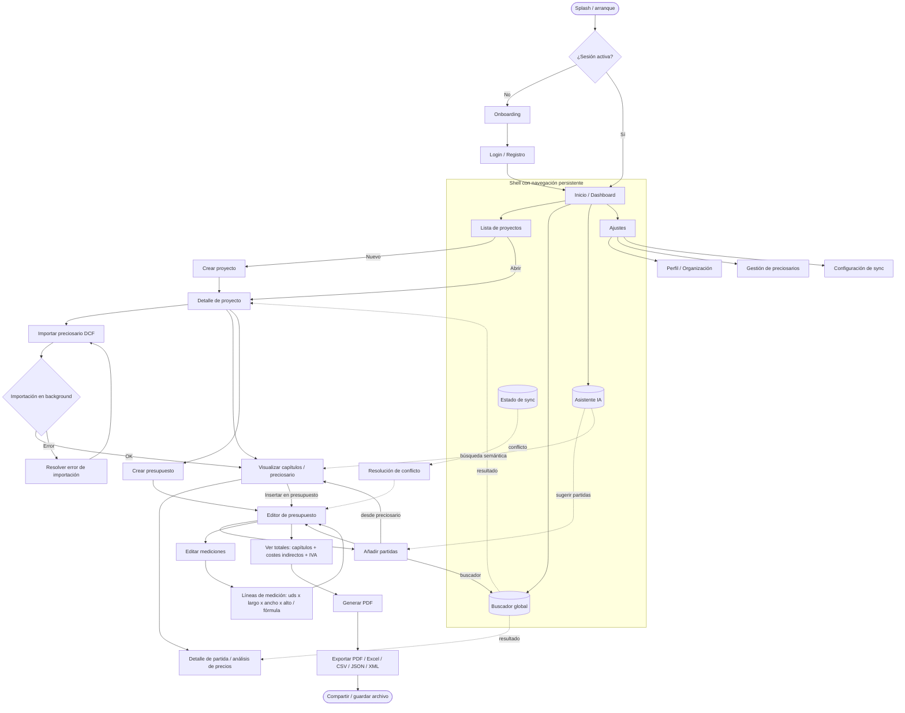
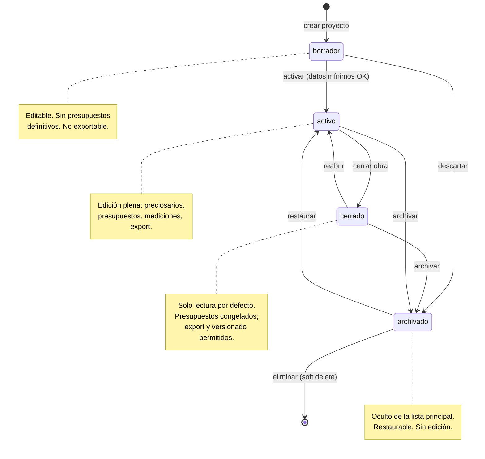
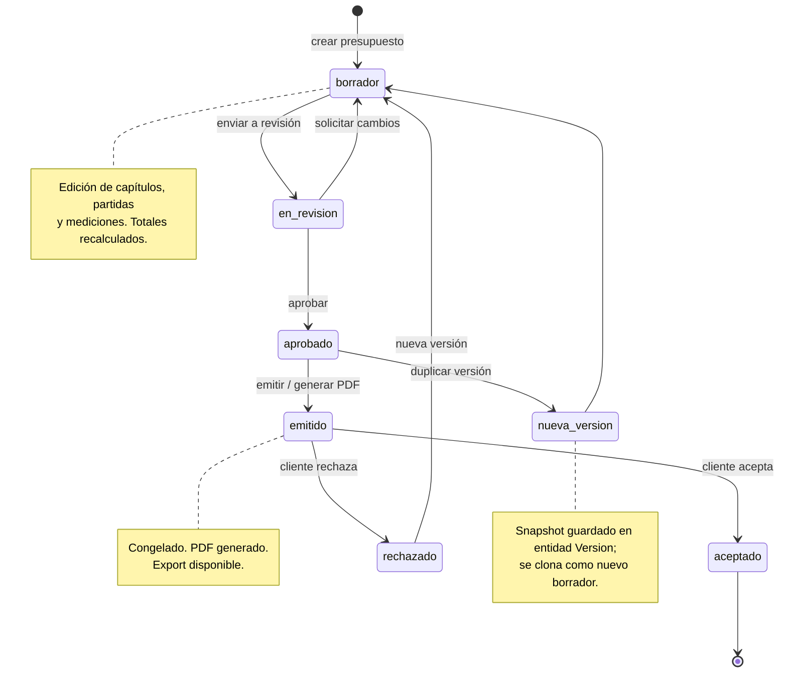
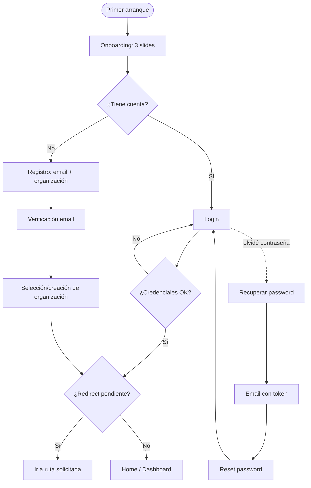
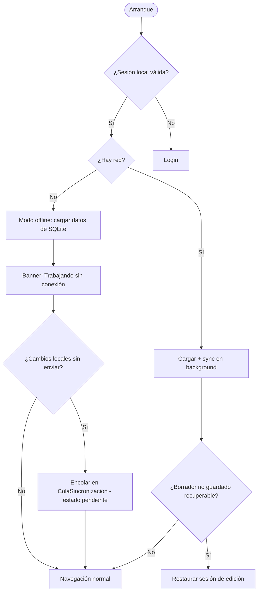
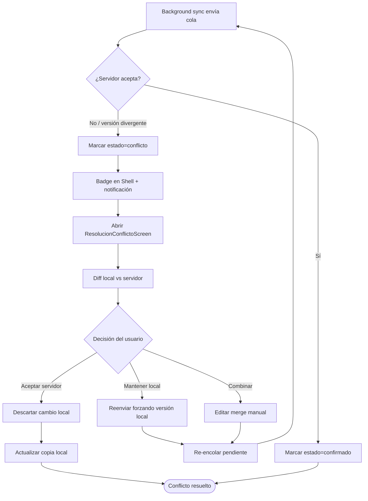
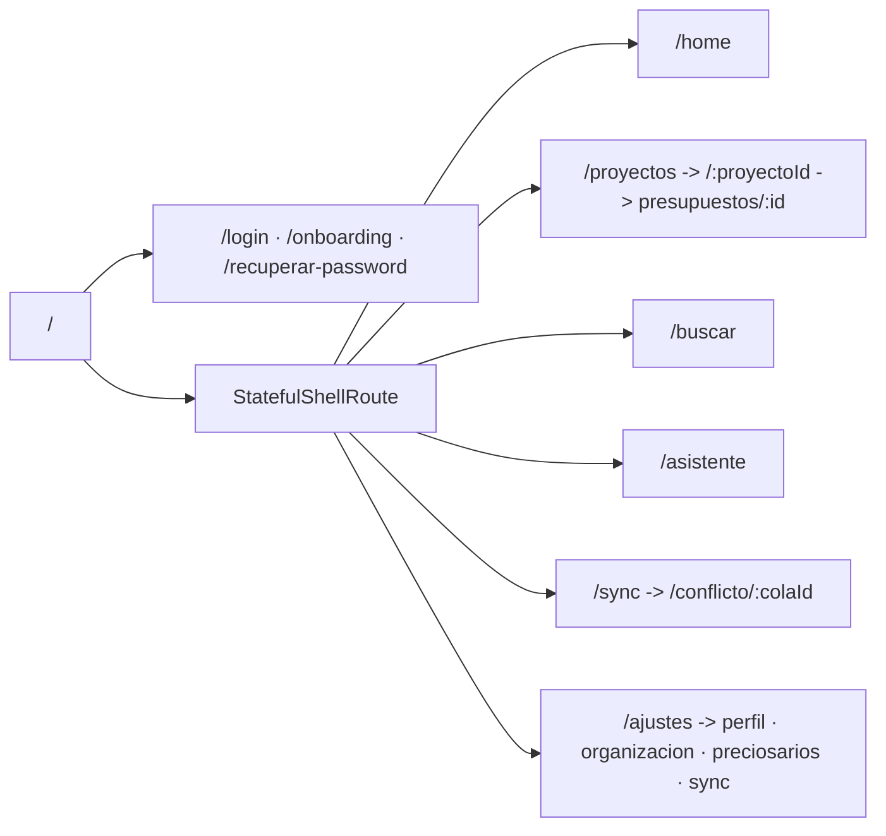

# Flujo de Navegación

Documento de referencia para el equipo de UX y Frontend (Flutter + Riverpod, feature-first + MVVM, `go_router`). Define el mapa de navegación end-to-end de **Preventivi App**, las rutas, los estados de navegación, los deep links, las máquinas de estado de **Proyecto** y **Presupuesto**, y los flujos secundarios (onboarding/login, recuperación offline, resolución de conflictos de sync).

La app es **offline-first**: la navegación nunca depende de la conectividad. El estado de sync se refleja como capa transversal (banner/indicador), no como bloqueo de pantalla.

---

## 1. Mapa de navegación end-to-end

Flujo principal: **Inicio → Lista de proyectos → Abrir proyecto → Importar DCF → Visualizar capítulos → Crear presupuesto → Añadir partidas → Editar mediciones → Ver totales → Generar PDF → Exportar**. Las ramas transversales (buscador global, asistente IA, sync, ajustes) son accesibles desde el *shell* de la app.

### Notas de navegación

- El **Shell** (barra lateral en desktop/web, bottom-nav + drawer en mobile) mantiene `Inicio`, `Proyectos`, `Buscador`, `IA` y `Ajustes` siempre accesibles mediante un `StatefulShellRoute` de `go_router`, conservando el estado de cada rama.
- La **importación DCF** y la generación de PDF se ejecutan en **background**; la navegación no se bloquea, se muestra progreso no modal.
- El **editor de presupuesto** es el centro de gravedad de la app: añadir partidas, editar mediciones y consultar totales son sub-vistas o paneles dentro de él.

---

## 2. Rutas y pantallas (`go_router`)

Convención: rutas en `kebab-case`, parámetros de ruta entre `:`, query params para filtros/estado efímero. `Acceso requerido` indica autenticación y rol mínimo (RBAC: admin, jefe_obra, presupuestista, lector).

| Nombre de ruta (`name`) | Path | Pantalla | Parámetros | Acceso requerido |
| --- | --- | --- | --- | --- |
| `splash` | `/` | SplashScreen | — | Público |
| `onboarding` | `/onboarding` | OnboardingScreen | `?step=` | Público |
| `login` | `/login` | LoginScreen | `?redirect=` | Público |
| `registro` | `/registro` | RegistroScreen | — | Público |
| `recuperar-password` | `/recuperar-password` | RecuperarPasswordScreen | `?token=` | Público |
| `home` | `/home` | DashboardScreen | — | Autenticado (lector+) |
| `proyectos` | `/proyectos` | ListaProyectosScreen | `?estado=&q=&orden=` | Autenticado (lector+) |
| `proyecto-nuevo` | `/proyectos/nuevo` | CrearProyectoScreen | — | presupuestista+ |
| `proyecto` | `/proyectos/:proyectoId` | DetalleProyectoScreen | `proyectoId` | lector+ (de la org) |
| `proyecto-importar-dcf` | `/proyectos/:proyectoId/importar` | ImportarDcfScreen | `proyectoId` | presupuestista+ |
| `capitulos` | `/proyectos/:proyectoId/preciosario/:preciosarioId` | CapitulosScreen | `proyectoId`, `preciosarioId`, `?capituloId=` | lector+ |
| `partida` | `/proyectos/:proyectoId/preciosario/:preciosarioId/partida/:partidaId` | PartidaDetalleScreen | `partidaId`, … | lector+ |
| `presupuestos` | `/proyectos/:proyectoId/presupuestos` | ListaPresupuestosScreen | `?version=` | lector+ |
| `presupuesto-nuevo` | `/proyectos/:proyectoId/presupuestos/nuevo` | CrearPresupuestoScreen | `proyectoId` | presupuestista+ |
| `presupuesto` | `/proyectos/:proyectoId/presupuestos/:presupuestoId` | EditorPresupuestoScreen | `presupuestoId`, `?panel=partidas\|mediciones\|totales` | lector+ (edición: presupuestista+) |
| `presupuesto-anadir` | `/proyectos/:proyectoId/presupuestos/:presupuestoId/anadir` | AnadirPartidasScreen | `presupuestoId` | presupuestista+ |
| `medicion` | `/proyectos/:proyectoId/presupuestos/:presupuestoId/partida/:partidaPresId/medicion` | EditarMedicionScreen | `partidaPresId` | presupuestista+ |
| `totales` | `/proyectos/:proyectoId/presupuestos/:presupuestoId/totales` | TotalesScreen | `presupuestoId` | lector+ |
| `generar-pdf` | `/proyectos/:proyectoId/presupuestos/:presupuestoId/pdf` | GenerarPdfScreen | `presupuestoId`, `?plantillaId=` | presupuestista+ |
| `exportar` | `/proyectos/:proyectoId/presupuestos/:presupuestoId/exportar` | ExportarScreen | `presupuestoId`, `?formato=pdf\|xlsx\|csv\|json\|xml` | presupuestista+ |
| `buscador` | `/buscar` | BuscadorGlobalScreen | `?q=&tipo=partida\|proyecto\|preciosario` | lector+ |
| `ia` | `/asistente` | AsistenteIaScreen | `?contexto=` | presupuestista+ |
| `sync` | `/sync` | EstadoSyncScreen | — | lector+ |
| `conflicto` | `/sync/conflicto/:colaId` | ResolucionConflictoScreen | `colaId` | presupuestista+ |
| `ajustes` | `/ajustes` | AjustesScreen | — | lector+ |
| `ajustes-perfil` | `/ajustes/perfil` | PerfilScreen | — | lector+ |
| `ajustes-organizacion` | `/ajustes/organizacion` | OrganizacionScreen | — | admin |
| `ajustes-preciosarios` | `/ajustes/preciosarios` | GestionPreciosariosScreen | — | jefe_obra+ |
| `ajustes-sync` | `/ajustes/sync` | ConfigSyncScreen | — | jefe_obra+ |
| `404` | `/404` | NotFoundScreen | — | Público |

### Guards / redirección

- `redirect` global en `go_router`: si no hay sesión → `login` con `?redirect=<rutaSolicitada>`. Tras login se restituye el destino.
- Guard de **RBAC** por ruta: si el rol no alcanza el acceso requerido → pantalla `403` embebida (no se expone la existencia del recurso a usuarios fuera de la organización; en ese caso → `404`).
- Guard de **organización**: `proyectoId` debe pertenecer a la `organizacion_id` del usuario.

---

## 3. Estados de navegación y deep links

### Estados de navegación

| Estado | Descripción | Comportamiento UI |
| --- | --- | --- |
| `cargando` | Resolviendo datos de la ruta (lazy load, FTS, query) | Skeletons + virtual scrolling; nunca pantalla en blanco |
| `vacío` | Ruta válida sin datos (p. ej. proyecto sin presupuestos) | Empty state con CTA contextual (Crear/Importar) |
| `error` | Fallo de carga (no de red, ya que es offline-first) | Estado de error con reintento; datos locales si existen |
| `offline` | Sin conectividad | Banner no bloqueante "Trabajando sin conexión"; edición permitida |
| `sincronizando` | Cola de cambios enviándose | Indicador en `Shell` + badge en ruta `sync` |
| `conflicto` | Cambio rechazado por el servidor | Badge rojo en `sync`; CTA a `ResolucionConflictoScreen` |
| `solo-lectura` | Rol `lector` o entidad `cerrado`/`archivado` | Acciones de edición ocultas/deshabilitadas |

- El estado de navegación es **independiente del estado de sync**: una ruta puede estar `cargada` y `offline` a la vez.
- El estado efímero de la pantalla (panel activo, filtros, scroll) se codifica en **query params** para que sea restaurable y compartible.

### Deep links

Esquema personalizado `preventivi://` y enlaces web `https://app.preventivi.com/...` (App Links / Universal Links). Todos resuelven contra el mismo árbol de `go_router`.

| Deep link | Destino | Notas |
| --- | --- | --- |
| `preventivi://proyectos` | `proyectos` | Lista, respeta filtros en query |
| `preventivi://proyecto/:id` | `proyecto` | Requiere pertenencia a la org |
| `preventivi://presupuesto/:proyectoId/:presupuestoId` | `presupuesto` | Abre editor; `?panel=` opcional |
| `preventivi://partida/:proyectoId/:preciosarioId/:partidaId` | `partida` | Para compartir una unidad de obra |
| `preventivi://buscar?q=...` | `buscador` | Búsqueda preparada (FTS5/semántica) |
| `preventivi://sync/conflicto/:colaId` | `conflicto` | Desde notificación push de conflicto |
| `https://app.preventivi.com/recuperar-password?token=...` | `recuperar-password` | Enlace de email |

Reglas de deep link:
- Un deep link a una ruta protegida pasa por el guard de sesión (`?redirect=`) y de RBAC.
- Si la entidad no existe localmente, se intenta cargar; si no hay red y no hay copia local → estado `error` con reintento, sin perder el deep link.
- Los deep links preservan el **back stack** lógico (p. ej. abrir `partida` reconstruye `proyecto → capitulos → partida`).

---

## 4. Máquina de estados — Proyecto

Estados del campo `estado` de **Proyecto**: `borrador → activo → cerrado → archivado`.

Implicaciones de navegación:
- En `cerrado`/`archivado` el `EditorPresupuestoScreen` entra en estado `solo-lectura` (oculta CTA de edición).
- `archivado` no aparece en `proyectos` salvo filtro `?estado=archivado`.

---

## 5. Máquina de estados — Presupuesto

El **Presupuesto** es **versionable**; su `estado` acompaña al ciclo de vida del documento.

Implicaciones de navegación:
- `AnadirPartidasScreen` y `EditarMedicionScreen` solo son accesibles en `borrador`.
- En `aprobado`/`emitido`/`aceptado`/`rechazado` el editor es `solo-lectura`; `GenerarPdfScreen` y `ExportarScreen` siguen disponibles.
- Crear nueva versión genera un `snapshot` (entidad **Version**) y navega al nuevo `presupuestoId` en `borrador`.

---

## 6. Flujos secundarios

### 6.1 Onboarding / Login

- Tras login se restituye `?redirect=` (deep link diferido).
- La sesión se persiste localmente; el `AuthGate` del Splash decide ruta inicial sin requerir red.

### 6.2 Recuperación offline

Aplica al arranque sin conexión y a la reanudación de trabajo no guardado.

- Toda escritura local pasa por la **ColaSincronizacion** (`operacion` insert/update/delete, `estado=pendiente`).
- El borrador de edición se autoguarda en local; al reabrir se ofrece restaurar.
- IDs **UUID v7** generados en cliente evitan colisiones al sincronizar.

### 6.3 Resolución de conflicto de sync

Se dispara cuando un cambio de la cola es rechazado por el servidor (`estado=conflicto`), p. ej. edición concurrente de la misma `PartidaPresupuesto`.

- La pantalla de conflicto muestra **diff campo a campo** (`datos_antes` / `datos_despues` del Historial) entre la versión local y la del servidor.
- Resolver no bloquea el resto de la app: el usuario puede seguir trabajando; los conflictos se acumulan como cola navegable.
- SignalR/WebSockets notifica conflictos en tiempo real cuando hay red; sin red, se detectan en el siguiente intento de sync.

---

## 7. Resumen de jerarquía de navegación

Cada rama del `StatefulShellRoute` conserva su propio `Navigator` y back stack, de modo que cambiar entre `Proyectos`, `Buscador`, `IA` y `Ajustes` no pierde el contexto de trabajo del usuario.
