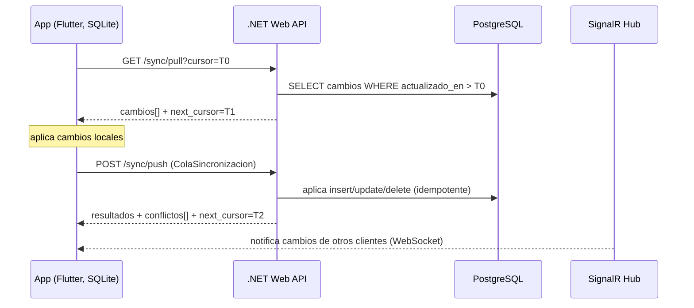

# API REST — Diseño y Contratos

Documento de diseño de la API REST de **Preventivi App**. Define principios, autenticación, recursos, contratos de request/response, paginación, errores, sincronización offline-first y rate limiting.

Stack de referencia: **.NET 9 Web API**, Clean Architecture, **MediatR (CQRS)**, **Result Pattern**, **FluentValidation**, Serilog. ORM EF Core (SQLite local / PostgreSQL servidor). IDs **UUID v7**. Documentación OpenAPI/Swagger.

---

## 1. Principios de diseño

### 1.1 Versionado

- Todas las rutas se prefijan con **`/api/v1`**. La versión va en la URL (versionado por path), simple y cacheable.
- Cambios incompatibles (breaking) incrementan la versión mayor: `/api/v2`. Cambios aditivos (nuevos campos, nuevos endpoints) **no** rompen `/api/v1`.
- Se expone la versión también en la cabecera de respuesta `API-Version: 1`.

### 1.2 Nomenclatura de recursos

- Recursos en **plural, kebab-case** y sustantivos (no verbos): `/proyectos`, `/clientes`, `/preciosarios`, `/partidas-presupuesto`.
- Jerarquía mediante anidamiento solo en relaciones de composición fuerte: `/presupuestos/{id}/capitulos`, `/partidas-presupuesto/{id}/mediciones`.
- Acciones que no encajan en CRUD se modelan como sub-recurso o verbo controlado bajo el recurso: `POST /presupuestos/{id}/documentos:generar-pdf`, `POST /preciosarios:importar-dcf`.
- IDs siempre **UUID v7** (ordenables temporalmente, óptimos para índices y sync).

### 1.3 Verbos HTTP

| Verbo | Uso | Cuerpo | Respuesta éxito |
|-------|-----|--------|-----------------|
| `GET` | Leer colección o recurso | No | `200 OK` |
| `POST` | Crear recurso / ejecutar acción | Sí | `201 Created` / `200 OK` / `202 Accepted` |
| `PUT` | Reemplazo completo (idempotente) | Sí | `200 OK` / `204 No Content` |
| `PATCH` | Modificación parcial (JSON Merge Patch) | Sí | `200 OK` |
| `DELETE` | Eliminar (idempotente) | No | `204 No Content` |

### 1.4 Idempotencia

- `GET`, `PUT`, `DELETE` son idempotentes por contrato.
- `POST` de creación admite la cabecera **`Idempotency-Key: <uuid>`**. El servidor almacena la clave + hash del cuerpo durante 24 h y devuelve la misma respuesta ante reintentos (clave en flujos offline/sync con reintento de red).
- `POST` de sync (`/sync/push`) es idempotente por `operacion + entidad_id + version` del change log.

### 1.5 HATEOAS (opcional)

- Soporte opcional negociado por `Accept: application/hal+json`. Por defecto se devuelve JSON plano.
- Cuando se activa, las respuestas incluyen `_links` con `self`, `next`, `prev` y acciones relevantes (`generar-pdf`, `nueva-version`).

### 1.6 Convenciones generales

- Content negotiation: `Content-Type: application/json; charset=utf-8`.
- Fechas en **ISO 8601 UTC** (`2026-06-26T10:15:30Z`).
- Importes decimales como número JSON con escala definida (no float binario en BD: `decimal`).
- Campos en **snake_case** en el JSON (alineado con BD y dominio del brief).
- `ETag` + `If-Match` para control de concurrencia optimista en `PUT`/`PATCH`.

---

## 2. Autenticación y autorización

### 2.1 Esquema

- **JWT Bearer** en cabecera `Authorization: Bearer <access_token>`.
- **Access token** de vida corta (15 min), firmado (RS256). Claims: `sub` (usuario_id), `org` (organizacion_id), `rol`, `permisos`, `exp`, `jti`.
- **Refresh token** de vida larga (30 días), opaco, rotativo y almacenado/hasheado en servidor. Rotación con detección de reuso (revoca toda la familia si se detecta reutilización).

### 2.2 Roles (RBAC)

Roles del brief: `admin`, `jefe_obra`, `presupuestista`, `lector`. La autorización se resuelve por **permisos** (codigo) agregados al rol; el JWT transporta los permisos efectivos.

| Rol | Capacidades resumidas |
|-----|------------------------|
| `admin` | Todo, incluida gestión de usuarios, roles y organización |
| `jefe_obra` | Gestión completa de proyectos, presupuestos y mediciones |
| `presupuestista` | Crear/editar preciosarios, presupuestos, partidas, descompuestos |
| `lector` | Solo lectura y exportación de documentos |

### 2.3 Endpoints de autenticación

| Método | Ruta | Descripción | Auth |
|--------|------|-------------|------|
| `POST` | `/api/v1/auth/login` | Login con email + password, devuelve tokens | Pública |
| `POST` | `/api/v1/auth/refresh` | Renueva access token con refresh token (rotativo) | Refresh token |
| `POST` | `/api/v1/auth/logout` | Revoca el refresh token actual | Bearer |
| `GET`  | `/api/v1/auth/me` | Perfil + permisos del usuario autenticado | Bearer |

#### Request `POST /api/v1/auth/login`

```json
{
  "email": "ana@constructora.es",
  "password": "••••••••"
}
```

#### Response `200 OK`

```json
{
  "access_token": "eyJhbGciOiJSUzI1NiIsInR5cCI6IkpXVCJ9...",
  "token_type": "Bearer",
  "expires_in": 900,
  "refresh_token": "rt_3f9c1a7e8b2d4f60a1c5...",
  "usuario": {
    "id": "0190f3a1-7c2e-7b44-9d11-0a1b2c3d4e5f",
    "nombre": "Ana López",
    "email": "ana@constructora.es",
    "rol": "presupuestista",
    "organizacion_id": "0190f3a0-1111-7222-8333-444455556666"
  }
}
```

#### Request `POST /api/v1/auth/refresh`

```json
{ "refresh_token": "rt_3f9c1a7e8b2d4f60a1c5..." }
```

#### Response `200 OK`

```json
{
  "access_token": "eyJhbGciOiJSUzI1NiIsInR5cCI6IkpXVCJ9...",
  "token_type": "Bearer",
  "expires_in": 900,
  "refresh_token": "rt_a8b2...nuevo_rotado"
}
```

---

## 3. Catálogo de endpoints por recurso

> Auth: todos requieren `Bearer` salvo `/auth/login` y `/auth/refresh`. La columna **Rol mínimo** indica el permiso requerido.

### 3.1 Proyectos

| Método | Ruta | Descripción | Rol mínimo |
|--------|------|-------------|------------|
| `GET` | `/api/v1/proyectos` | Listar proyectos (paginado, filtrable) | `lector` |
| `GET` | `/api/v1/proyectos/{id}` | Detalle de proyecto | `lector` |
| `POST` | `/api/v1/proyectos` | Crear proyecto | `jefe_obra` |
| `PUT` | `/api/v1/proyectos/{id}` | Reemplazar proyecto | `jefe_obra` |
| `PATCH` | `/api/v1/proyectos/{id}` | Cambiar estado/campos | `jefe_obra` |
| `DELETE` | `/api/v1/proyectos/{id}` | Archivar/eliminar proyecto | `jefe_obra` |

### 3.2 Clientes

| Método | Ruta | Descripción | Rol mínimo |
|--------|------|-------------|------------|
| `GET` | `/api/v1/clientes` | Listar clientes | `lector` |
| `GET` | `/api/v1/clientes/{id}` | Detalle de cliente | `lector` |
| `POST` | `/api/v1/clientes` | Crear cliente | `presupuestista` |
| `PUT` | `/api/v1/clientes/{id}` | Actualizar cliente | `presupuestista` |
| `DELETE` | `/api/v1/clientes/{id}` | Eliminar cliente | `jefe_obra` |

### 3.3 Preciosarios

| Método | Ruta | Descripción | Rol mínimo |
|--------|------|-------------|------------|
| `GET` | `/api/v1/preciosarios` | Listar preciosarios | `lector` |
| `GET` | `/api/v1/preciosarios/{id}` | Detalle (metadatos, versión, hash) | `lector` |
| `POST` | `/api/v1/preciosarios:importar-dcf` | Importar preciosario desde archivo DCF (asíncrono) | `presupuestista` |
| `GET` | `/api/v1/preciosarios/importaciones/{jobId}` | Estado del job de importación | `presupuestista` |
| `DELETE` | `/api/v1/preciosarios/{id}` | Eliminar preciosario | `admin` |

### 3.4 Capítulos

| Método | Ruta | Descripción | Rol mínimo |
|--------|------|-------------|------------|
| `GET` | `/api/v1/preciosarios/{id}/capitulos` | Árbol/lista de capítulos del preciosario | `lector` |
| `GET` | `/api/v1/capitulos/{id}` | Detalle de capítulo (+ subcapítulos) | `lector` |
| `POST` | `/api/v1/preciosarios/{id}/capitulos` | Crear capítulo/subcapítulo | `presupuestista` |
| `PATCH` | `/api/v1/capitulos/{id}` | Editar (título, orden, padre) | `presupuestista` |
| `DELETE` | `/api/v1/capitulos/{id}` | Eliminar capítulo | `presupuestista` |

### 3.5 Partidas

| Método | Ruta | Descripción | Rol mínimo |
|--------|------|-------------|------------|
| `GET` | `/api/v1/partidas` | Listar partidas (filtro por capítulo, paginado keyset) | `lector` |
| `GET` | `/api/v1/capitulos/{id}/partidas` | Partidas de un capítulo | `lector` |
| `GET` | `/api/v1/partidas/{id}` | Detalle de partida | `lector` |
| `GET` | `/api/v1/partidas/{id}/analisis-precios` | Análisis de precios agregado | `lector` |
| `POST` | `/api/v1/capitulos/{id}/partidas` | Crear partida | `presupuestista` |
| `PATCH` | `/api/v1/partidas/{id}` | Editar partida | `presupuestista` |
| `DELETE` | `/api/v1/partidas/{id}` | Eliminar partida | `presupuestista` |

### 3.6 Descompuestos

| Método | Ruta | Descripción | Rol mínimo |
|--------|------|-------------|------------|
| `GET` | `/api/v1/partidas/{id}/descompuestos` | Líneas de análisis de precios | `lector` |
| `POST` | `/api/v1/partidas/{id}/descompuestos` | Añadir línea (recurso + rendimiento) | `presupuestista` |
| `PATCH` | `/api/v1/descompuestos/{id}` | Editar rendimiento/cantidad/precio | `presupuestista` |
| `DELETE` | `/api/v1/descompuestos/{id}` | Eliminar línea | `presupuestista` |

### 3.7 Recursos

| Método | Ruta | Descripción | Rol mínimo |
|--------|------|-------------|------------|
| `GET` | `/api/v1/recursos` | Listar recursos (filtro por `tipo`) | `lector` |
| `GET` | `/api/v1/recursos/{id}` | Detalle de recurso | `lector` |
| `POST` | `/api/v1/recursos` | Crear recurso (mano_obra/material/maquinaria/otros) | `presupuestista` |
| `PATCH` | `/api/v1/recursos/{id}` | Editar recurso/precio | `presupuestista` |
| `DELETE` | `/api/v1/recursos/{id}` | Eliminar recurso | `presupuestista` |

### 3.8 Presupuestos

| Método | Ruta | Descripción | Rol mínimo |
|--------|------|-------------|------------|
| `GET` | `/api/v1/proyectos/{id}/presupuestos` | Presupuestos de un proyecto | `lector` |
| `GET` | `/api/v1/presupuestos/{id}` | Detalle (árbol, totales, IVA, costes indirectos) | `lector` |
| `POST` | `/api/v1/proyectos/{id}/presupuestos` | Crear presupuesto | `presupuestista` |
| `POST` | `/api/v1/presupuestos/{id}:nueva-version` | Crear nueva versión (versionable) | `presupuestista` |
| `PATCH` | `/api/v1/presupuestos/{id}` | Editar metadatos/estado | `presupuestista` |
| `POST` | `/api/v1/presupuestos/{id}/partidas` | Añadir partida al presupuesto | `presupuestista` |
| `DELETE` | `/api/v1/partidas-presupuesto/{id}` | Quitar partida del presupuesto | `presupuestista` |
| `DELETE` | `/api/v1/presupuestos/{id}` | Eliminar presupuesto | `jefe_obra` |

### 3.9 Mediciones

| Método | Ruta | Descripción | Rol mínimo |
|--------|------|-------------|------------|
| `GET` | `/api/v1/partidas-presupuesto/{id}/mediciones` | Mediciones de una partida del presupuesto | `lector` |
| `GET` | `/api/v1/mediciones/{id}/lineas` | Líneas de medición | `lector` |
| `POST` | `/api/v1/partidas-presupuesto/{id}/mediciones` | Crear medición | `presupuestista` |
| `POST` | `/api/v1/mediciones/{id}/lineas` | Añadir línea (uds×largo×ancho×alto o fórmula) | `presupuestista` |
| `PATCH` | `/api/v1/lineas-medicion/{id}` | Editar línea | `presupuestista` |
| `DELETE` | `/api/v1/lineas-medicion/{id}` | Eliminar línea | `presupuestista` |

### 3.10 Documentos

| Método | Ruta | Descripción | Rol mínimo |
|--------|------|-------------|------------|
| `POST` | `/api/v1/presupuestos/{id}/documentos:generar-pdf` | Generar PDF (QuestPDF) | `lector` |
| `POST` | `/api/v1/presupuestos/{id}/documentos:generar-excel` | Generar Excel (ClosedXML) | `lector` |
| `POST` | `/api/v1/presupuestos/{id}/documentos:exportar` | Exportar CSV/JSON/XML | `lector` |
| `GET` | `/api/v1/documentos/{jobId}` | Estado/descarga del documento generado | `lector` |
| `POST` | `/api/v1/{entidad_tipo}/{id}/adjuntos` | Subir adjunto (foto/plano/documento) | `presupuestista` |
| `GET` | `/api/v1/{entidad_tipo}/{id}/adjuntos` | Listar adjuntos | `lector` |

### 3.11 Búsqueda

| Método | Ruta | Descripción | Rol mínimo |
|--------|------|-------------|------------|
| `GET` | `/api/v1/buscar` | Búsqueda full-text (FTS5/pg_trgm/tsvector) | `lector` |
| `GET` | `/api/v1/buscar/partidas` | Búsqueda específica de partidas | `lector` |

### 3.12 IA

| Método | Ruta | Descripción | Rol mínimo |
|--------|------|-------------|------------|
| `POST` | `/api/v1/ia/buscar` | Búsqueda semántica (pgvector) y lenguaje natural | `lector` |
| `POST` | `/api/v1/ia/sugerir-partidas` | Sugerencias de partidas para un capítulo/proyecto | `presupuestista` |
| `POST` | `/api/v1/ia/analizar-presupuesto` | Análisis/resumen del presupuesto (LLM) | `presupuestista` |

### 3.13 Sincronización (Sync)

| Método | Ruta | Descripción | Rol mínimo |
|--------|------|-------------|------------|
| `GET` | `/api/v1/sync/pull` | Descargar cambios delta desde un cursor/timestamp | `lector` |
| `POST` | `/api/v1/sync/push` | Subir cola de cambios local (change log) | `presupuestista` |
| `GET` | `/api/v1/sync/estado` | Estado de sync (último cursor confirmado, conflictos) | `lector` |

---

## 4. Ejemplos de contratos clave

### 4.1 Crear proyecto — `POST /api/v1/proyectos`

**Request**

```json
{
  "nombre": "Reforma Edificio Sol",
  "cliente_id": "0190f3a2-aaaa-7bbb-8ccc-dddddddddddd",
  "direccion": "C/ Mayor 12, Madrid",
  "fecha": "2026-06-26",
  "estado": "borrador"
}
```

**Response `201 Created`** — `Location: /api/v1/proyectos/0190f3a3-...`

```json
{
  "id": "0190f3a3-1234-7890-abcd-ef0123456789",
  "nombre": "Reforma Edificio Sol",
  "cliente_id": "0190f3a2-aaaa-7bbb-8ccc-dddddddddddd",
  "direccion": "C/ Mayor 12, Madrid",
  "fecha": "2026-06-26",
  "estado": "borrador",
  "organizacion_id": "0190f3a0-1111-7222-8333-444455556666",
  "creado_en": "2026-06-26T10:15:30Z",
  "actualizado_en": "2026-06-26T10:15:30Z"
}
```

### 4.2 Listar partidas con paginación — `GET /api/v1/partidas`

**Request**

```
GET /api/v1/partidas?capitulo_id=0190f3b0-...&limit=50&cursor=eyJpZCI6IjAxOTBmM2I1In0&sort=codigo&q=hormigon
```

**Response `200 OK`**

```json
{
  "data": [
    {
      "id": "0190f3b5-0001-7000-8000-000000000001",
      "capitulo_id": "0190f3b0-aaaa-7bbb-8ccc-dddddddddddd",
      "codigo": "E04CM010",
      "resumen": "Hormigón HM-20 en cimentación",
      "unidad": "m3",
      "precio": 98.45,
      "tipo": "obra"
    }
  ],
  "paginacion": {
    "limit": 50,
    "next_cursor": "eyJpZCI6IjAxOTBmM2I1LTAwMDIifQ",
    "has_more": true
  }
}
```

### 4.3 Importar DCF — `POST /api/v1/preciosarios:importar-dcf`

Asíncrono (procesamiento en background para 500.000+ partidas). `multipart/form-data` con el archivo + metadatos.

**Request (campos)**

```
Content-Type: multipart/form-data
- archivo: <preciosario.dcf>
- nombre: "BPCM 2026"
- version: "2026.1"
- fuente: "Base Precios Construcción Madrid"
```

**Response `202 Accepted`** — `Location: /api/v1/preciosarios/importaciones/{jobId}`

```json
{
  "job_id": "0190f3c0-9999-7000-8000-000000000abc",
  "estado": "en_proceso",
  "preciosario_id": null,
  "origen_dcf": "preciosario.dcf",
  "hash_archivo": "sha256:3a7bd3e2360a...",
  "progreso": { "partidas_procesadas": 0, "total_estimado": 512340 }
}
```

### 4.4 Crear presupuesto — `POST /api/v1/proyectos/{id}/presupuestos`

**Request**

```json
{
  "nombre": "Presupuesto base",
  "version": 1,
  "costes_indirectos_pct": 6.0,
  "iva_id": "0190f3d0-aaaa-7bbb-8ccc-dddddddddddd"
}
```

**Response `201 Created`**

```json
{
  "id": "0190f3d1-1111-7000-8000-000000000001",
  "proyecto_id": "0190f3a3-1234-7890-abcd-ef0123456789",
  "nombre": "Presupuesto base",
  "version": 1,
  "estado": "borrador",
  "total": 0.0,
  "costes_indirectos_pct": 6.0,
  "creado_en": "2026-06-26T10:20:00Z"
}
```

### 4.5 Añadir partida a presupuesto — `POST /api/v1/presupuestos/{id}/partidas`

Copia una partida del preciosario al presupuesto (el precio puede divergir luego).

**Request**

```json
{
  "partida_id": "0190f3b5-0001-7000-8000-000000000001",
  "capitulo_presupuesto_id": "0190f3d2-aaaa-7bbb-8ccc-dddddddddddd",
  "precio": 98.45,
  "orden": 10
}
```

**Response `201 Created`**

```json
{
  "id": "0190f3d3-2222-7000-8000-000000000002",
  "presupuesto_id": "0190f3d1-1111-7000-8000-000000000001",
  "capitulo_presupuesto_id": "0190f3d2-aaaa-7bbb-8ccc-dddddddddddd",
  "codigo": "E04CM010",
  "resumen": "Hormigón HM-20 en cimentación",
  "unidad": "m3",
  "precio": 98.45,
  "medicion_total": 0.0,
  "importe": 0.0
}
```

### 4.6 Generar PDF — `POST /api/v1/presupuestos/{id}/documentos:generar-pdf`

**Request**

```json
{
  "plantilla_id": "0190f3e0-aaaa-7bbb-8ccc-dddddddddddd",
  "incluir_mediciones": true,
  "incluir_descompuestos": false
}
```

**Response `202 Accepted`**

```json
{
  "job_id": "0190f3e1-1111-7000-8000-000000000pdf",
  "estado": "en_proceso",
  "tipo": "pdf"
}
```

Al completarse, `GET /api/v1/documentos/{jobId}` devuelve `200 OK` con `{ "estado": "listo", "url": "https://.../documentos/...pdf", "expira_en": "2026-06-26T11:20:00Z" }`.

### 4.7 Búsqueda full-text — `GET /api/v1/buscar`

**Request**

```
GET /api/v1/buscar?q=hormigon+armado&tipo=partida&preciosario_id=0190f3c1-...&limit=20
```

**Response `200 OK`**

```json
{
  "data": [
    {
      "tipo": "partida",
      "id": "0190f3b5-0001-7000-8000-000000000001",
      "codigo": "E04CM010",
      "resumen": "Hormigón HM-20 en cimentación",
      "score": 0.94,
      "destacado": "<em>Hormigón</em> HM-20 <em>armado</em>..."
    }
  ],
  "paginacion": { "limit": 20, "next_cursor": null, "has_more": false }
}
```

### 4.8 Búsqueda IA en lenguaje natural — `POST /api/v1/ia/buscar`

Búsqueda semántica con embeddings (pgvector) + LLM (Claude). Acepta consulta en lenguaje natural.

**Request**

```json
{
  "consulta": "partidas de aislamiento térmico para cubierta plana transitable",
  "preciosario_id": "0190f3c1-aaaa-7bbb-8ccc-dddddddddddd",
  "limit": 10,
  "modelo": "claude-haiku-4-5-20251001"
}
```

**Response `200 OK`**

```json
{
  "interpretacion": "Búsqueda de partidas de aislamiento térmico en cubiertas planas transitables.",
  "data": [
    {
      "id": "0190f3b6-0007-7000-8000-000000000007",
      "codigo": "E10INL020",
      "resumen": "Aislamiento térmico cubierta plana transitable XPS 60mm",
      "unidad": "m2",
      "precio": 24.30,
      "similitud": 0.91
    }
  ],
  "tokens_uso": { "entrada": 420, "salida": 180 }
}
```

### 4.9 Sync delta (pull) — `GET /api/v1/sync/pull`

**Request**

```
GET /api/v1/sync/pull?cursor=2026-06-26T09:00:00Z&entidades=proyecto,presupuesto,partida_presupuesto,medicion&limit=500
```

**Response `200 OK`**

```json
{
  "cambios": [
    {
      "entidad_tipo": "presupuesto",
      "entidad_id": "0190f3d1-1111-7000-8000-000000000001",
      "operacion": "update",
      "version": 7,
      "actualizado_en": "2026-06-26T09:42:11Z",
      "datos": { "estado": "activo", "total": 154320.55 }
    },
    {
      "entidad_tipo": "medicion",
      "entidad_id": "0190f3f0-aaaa-7bbb-8ccc-dddddddddddd",
      "operacion": "delete",
      "version": 3,
      "actualizado_en": "2026-06-26T09:43:00Z"
    }
  ],
  "next_cursor": "2026-06-26T09:43:00Z",
  "has_more": false,
  "server_time": "2026-06-26T10:00:00Z"
}
```

### 4.10 Sync push — `POST /api/v1/sync/push`

Sube la **ColaSincronizacion** local. Idempotente por `entidad_id + operacion + version`.

**Request**

```json
{
  "cliente_sync_id": "0190f3aa-bbbb-7ccc-8ddd-eeeeeeeeeeee",
  "base_cursor": "2026-06-26T09:00:00Z",
  "cambios": [
    {
      "entidad_tipo": "linea_medicion",
      "entidad_id": "0190f400-0001-7000-8000-000000000001",
      "operacion": "insert",
      "version": 1,
      "payload": {
        "medicion_id": "0190f3f1-aaaa-7bbb-8ccc-dddddddddddd",
        "comentario": "Forjado planta 1",
        "uds": 4, "largo": 5.0, "ancho": 3.2, "alto": 0.3,
        "formula": null, "parcial": 19.2
      }
    }
  ]
}
```

**Response `200 OK`** (con resolución de conflictos)

```json
{
  "resultados": [
    {
      "entidad_id": "0190f400-0001-7000-8000-000000000001",
      "estado": "confirmado",
      "version_servidor": 1
    }
  ],
  "conflictos": [
    {
      "entidad_id": "0190f3d1-1111-7000-8000-000000000001",
      "entidad_tipo": "presupuesto",
      "motivo": "version_desactualizada",
      "version_cliente": 6,
      "version_servidor": 7,
      "datos_servidor": { "estado": "activo", "total": 154320.55 }
    }
  ],
  "next_cursor": "2026-06-26T10:01:30Z"
}
```

---

## 5. Paginación, filtrado, ordenación y búsqueda

### 5.1 Paginación por keyset/cursor

Se usa **paginación keyset (cursor)** en lugar de offset, esencial para preciosarios de 500.000+ partidas (rendimiento estable y sin desfases en inserciones concurrentes).

| Query param | Descripción | Ejemplo |
|-------------|-------------|---------|
| `limit` | Tamaño de página (default 50, máx 200) | `limit=100` |
| `cursor` | Cursor opaco (Base64 del último ordenamiento) | `cursor=eyJpZCI6...` |
| `sort` | Campo de ordenación, prefijo `-` para descendente | `sort=-creado_en` |

La respuesta incluye siempre `paginacion: { limit, next_cursor, has_more }`. Un `next_cursor: null` indica fin de la colección.

### 5.2 Filtrado

- Filtros simples por igualdad como query params: `?estado=activo&cliente_id=...`.
- Operadores con sufijo para rangos: `?creado_en_gte=2026-01-01&precio_lte=100`.
- Filtros múltiples del mismo campo con coma (OR): `?estado=activo,borrador`.

### 5.3 Ordenación

- `sort` admite varios campos separados por coma: `?sort=codigo,-precio`.
- El cursor codifica los campos de orden activos para mantener coherencia.

### 5.4 Búsqueda

- `q` para búsqueda full-text dentro del recurso: `GET /api/v1/partidas?q=hormigon`.
- El endpoint global `/buscar` cubre múltiples recursos; la búsqueda semántica vive en `/ia/buscar`.

---

## 6. Formato de error estándar (RFC 7807)

Todos los errores devuelven **`application/problem+json`** (ProblemDetails, soportado nativamente por .NET 9).

```json
{
  "type": "https://api.preventivi.app/errors/validacion",
  "title": "Error de validación",
  "status": 422,
  "detail": "El campo 'nombre' es obligatorio.",
  "instance": "/api/v1/proyectos",
  "trace_id": "00-3a7bd3e2360a-1234567890abcdef-01",
  "errores": [
    { "campo": "nombre", "mensaje": "El campo 'nombre' es obligatorio." },
    { "campo": "cliente_id", "mensaje": "El cliente no existe." }
  ]
}
```

- `trace_id` correlaciona con los logs estructurados (Serilog).
- Los errores de validación (FluentValidation) se agregan en `errores[]`.
- El **Result Pattern** del dominio se mapea a ProblemDetails en un middleware central de manejo de errores.

### 6.1 Tabla de códigos de estado

| Código | Significado | Cuándo |
|--------|-------------|--------|
| `200 OK` | Éxito con cuerpo | GET, PUT/PATCH con respuesta |
| `201 Created` | Recurso creado | POST de creación (con `Location`) |
| `202 Accepted` | Aceptado, procesamiento asíncrono | Importar DCF, generar PDF/Excel |
| `204 No Content` | Éxito sin cuerpo | DELETE, PUT idempotente sin retorno |
| `400 Bad Request` | Petición malformada | JSON inválido, cursor corrupto |
| `401 Unauthorized` | Sin autenticar o token inválido/expirado | Falta/expira Bearer |
| `403 Forbidden` | Autenticado sin permiso (rol) | Rol insuficiente |
| `404 Not Found` | Recurso inexistente | ID no encontrado |
| `409 Conflict` | Conflicto de estado/concurrencia | Sync delta, duplicado, `If-Match` fallido |
| `410 Gone` | Recurso/versión eliminado | Documento expirado |
| `412 Precondition Failed` | `If-Match`/`ETag` no coincide | Concurrencia optimista |
| `422 Unprocessable Entity` | Validación de negocio fallida | FluentValidation |
| `429 Too Many Requests` | Límite de rate superado | Rate limiting |
| `500 Internal Server Error` | Error no controlado | Excepción inesperada |
| `503 Service Unavailable` | Dependencia caída / mantenimiento | BD o servicio IA no disponible |

---

## 7. Sincronización offline-first

Modelo **offline-first** con cola de cambios (change log), `SignalR/WebSockets` para notificaciones push y background sync. Detalles del flujo:



### 7.1 Reglas de sync

- **Cursor temporal**: basado en `actualizado_en` (UTC) + `version` por entidad. Los **UUID v7** ordenables ayudan a desempatar.
- **Delta**: `pull` devuelve solo entidades modificadas desde el cursor; `push` envía solo la cola pendiente local.
- **Operaciones**: `insert`, `update`, `delete` (soft-delete con tombstone para propagar borrados).
- **Resolución de conflictos**: optimista por `version`. Si `version_cliente < version_servidor`, se devuelve en `conflictos[]` con los datos del servidor; la app decide (last-write-wins por defecto o merge manual).
- **Idempotencia**: reenviar la misma `operacion + entidad_id + version` no duplica efectos.
- **Estados de la cola** (del brief): `pendiente → enviado → confirmado` o `conflicto`.

---

## 8. Rate limiting

Implementado con el middleware de rate limiting nativo de .NET 9 (`AddRateLimiter`), por defecto **token bucket** por usuario/organización.

| Ámbito | Límite | Ventana |
|--------|--------|---------|
| Global por usuario | 600 peticiones | 1 min |
| `/auth/login` | 10 intentos | 5 min (anti fuerza bruta) |
| `/ia/*` | 30 peticiones | 1 min (coste LLM) |
| `/preciosarios:importar-dcf` | 5 jobs concurrentes | por organización |
| `/sync/push` | 120 peticiones | 1 min |

- Respuesta al superar el límite: `429 Too Many Requests` con cabecera `Retry-After: <segundos>` y ProblemDetails.
- Cabeceras informativas: `RateLimit-Limit`, `RateLimit-Remaining`, `RateLimit-Reset`.

---

## 9. OpenAPI / Swagger

- La API expone su contrato **OpenAPI 3.1** generado automáticamente (`Microsoft.AspNetCore.OpenApi` en .NET 9).
- UI interactiva en `/swagger` (entornos no productivos) y especificación servida en `/openapi/v1.json`.
- Anotaciones para esquemas de seguridad (`bearerAuth`), ejemplos de request/response y enums de estados del dominio.
- El JSON OpenAPI es la fuente para generar clientes tipados (incluido el cliente Dart/Flutter del frontend).
- Cada endpoint documenta: parámetros, cuerpos, códigos de estado, esquema ProblemDetails y permiso/rol requerido.

---

## 10. Resumen de cabeceras estándar

| Cabecera | Dirección | Uso |
|----------|-----------|-----|
| `Authorization: Bearer <jwt>` | Request | Autenticación |
| `Idempotency-Key: <uuid>` | Request | Idempotencia en POST/sync |
| `If-Match: <etag>` | Request | Concurrencia optimista |
| `Accept: application/json` / `application/hal+json` | Request | Negociación (HATEOAS opcional) |
| `ETag` | Response | Versión del recurso |
| `Location` | Response | URL del recurso creado / job |
| `API-Version` | Response | Versión de la API |
| `RateLimit-*` / `Retry-After` | Response | Rate limiting |
| `Content-Type: application/problem+json` | Response | Errores RFC 7807 |
