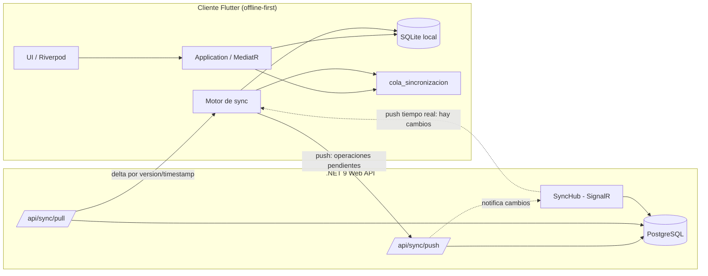
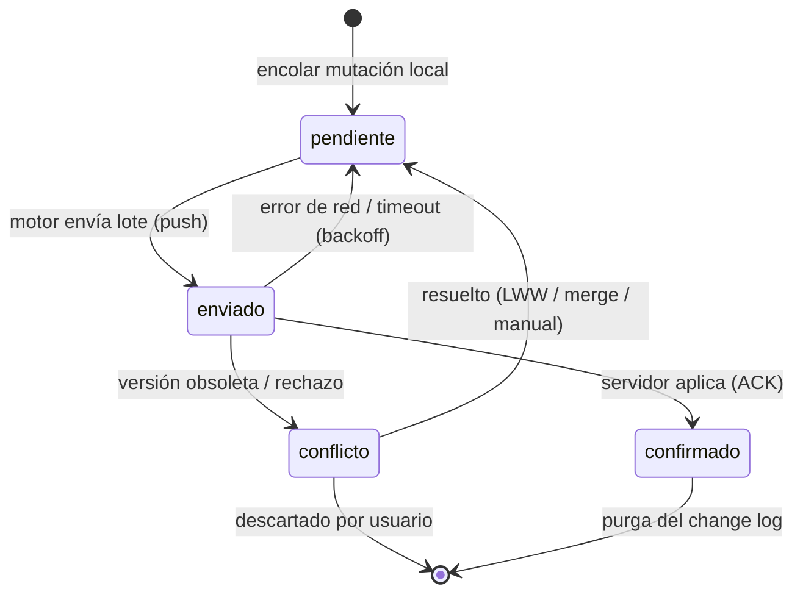
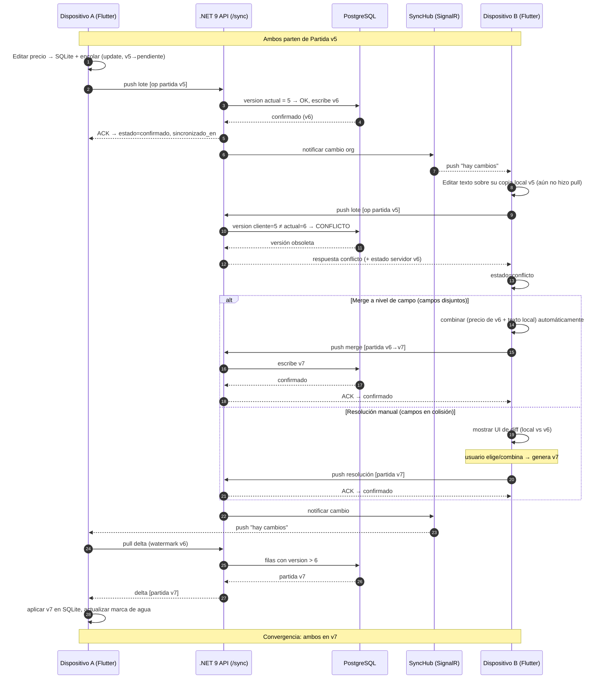

# Sincronización Offline/Online

Estrategia de sincronización **offline-first** para Preventivi App. La aplicación opera por completo sin red contra una base de datos **SQLite local (FTS5)** y reconcilia los cambios contra el servidor **PostgreSQL** cuando hay conectividad. Este documento define la arquitectura de sync, el modelo de datos de control, la resolución de conflictos y la máquina de estados de la cola de cambios.

## 1. Principios offline-first

- **La app funciona al 100 % sin red.** Toda lectura y escritura se realiza contra SQLite local. La latencia percibida es siempre local; la red nunca bloquea la UI.
- **SQLite es la verdad operativa; PostgreSQL es la fuente eventual de verdad.** El servidor consolida los cambios de todos los dispositivos y arbitra los conflictos. El cliente converge hacia el estado del servidor (consistencia eventual).
- **Toda mutación se registra primero localmente** en la tabla `cola_sincronizacion` (change log) dentro de la misma transacción que modifica el dato de dominio. No hay escritura local sin entrada en la cola.
- **El sync es asíncrono y resiliente.** Se ejecuta en background, tolera cortes de red, reintentos y reinicios de la app sin perder operaciones.
- **Idempotencia.** Cada operación lleva un `id` UUID v7; el servidor descarta duplicados, de modo que reenviar una operación es seguro.
- **Borrado lógico (soft-delete).** Nada se elimina físicamente de inmediato; se marca `eliminado_en` para poder propagar el borrado entre dispositivos.

> **Regla de oro:** la capa de Aplicación (MediatR handlers) escribe en el repositorio local y encola el cambio en una única Unit of Work. El motor de sync es un detalle de Infraestructura y nunca es invocado de forma síncrona por la UI.

## 2. Arquitectura de sincronización

| Componente | Capa | Responsabilidad |
|---|---|---|
| **Change log** (`cola_sincronizacion`) | Infraestructura (SQLite) | Registra operaciones `insert`/`update`/`delete` con `payload` y `estado`. |
| **Motor de sync** (`MotorSincronizacion`) | Infraestructura (cliente Flutter) | Orquesta push y pull, aplica backoff, respeta el orden de dependencias. |
| **API de sync** (`/api/sync`) | Presentación (.NET 9) | Endpoints `push` y `pull` (delta). Valida, persiste y arbitra conflictos vía MediatR. |
| **Hub SignalR** (`SyncHub`) | Presentación (.NET 9) | Push en tiempo real servidor→cliente (WebSockets) cuando otro dispositivo cambia datos. |
| **Background sync** | Cliente | Tarea periódica + disparo por evento (reconexión de red, cambio de foco, push del hub). |
| **Watermark** (`sincronizado_en`/`version`) | Ambos | Marca de agua por dispositivo para calcular el delta a descargar. |

### Flujo general

- **Push (local → servidor):** el motor lee las operaciones `pendiente` de la cola, las agrupa por lotes respetando el orden de FK, las envía a `/api/sync/push` y marca el resultado (`confirmado` o `conflicto`).
- **Pull (servidor → local):** el motor pide a `/api/sync/pull` los cambios con `version`/`actualizado_en` mayores que su última marca de agua y los aplica localmente.
- **Tiempo real:** `SyncHub` notifica a los dispositivos suscritos (por `organizacion_id`) que hay cambios disponibles, disparando un pull inmediato sin esperar al ciclo periódico.



## 3. Modelo de datos para sync

Toda entidad sincronizable incluye un conjunto común de **columnas de control**. Se modela como un value object/clase base (`EntidadSincronizable`) reutilizada por las entidades del dominio.

| Columna | Tipo | Propósito |
|---|---|---|
| `id` | UUID v7 | Identificador global y ordenable por tiempo. Evita colisiones entre dispositivos sin coordinación. |
| `version` | bigint / int | Número de versión de la fila. Se incrementa en cada cambio en el servidor; base del delta y del control de conflictos. |
| `actualizado_en` | timestamptz | Marca de última modificación (UTC). Usada por Last-Write-Wins y por el delta por timestamp. |
| `sincronizado_en` | timestamptz | Última vez que la fila se reconcilió con el servidor (marca de agua local). |
| `eliminado_en` | timestamptz null | Soft-delete. Si no es null, la fila está borrada y debe propagarse el borrado. |
| `origen_dispositivo` | UUID | Dispositivo que originó la última escritura. Permite auditoría y evitar eco del propio push. |

> **UUID v7 como PK.** Al ser ordenable por tiempo, mejora la localidad de inserción en índices B-Tree (PostgreSQL y SQLite) frente a UUID v4 y permite generar IDs en cliente sin riesgo de colisión, requisito imprescindible para crear entidades offline.

### Mapeo a `cola_sincronizacion`

La entidad `ColaSincronizacion` (change log local) materializa cada mutación:

| Campo | Descripción |
|---|---|
| `id` | UUID v7 de la operación (clave de idempotencia). |
| `entidad_tipo` | Nombre de la entidad afectada (p. ej. `presupuesto`, `partida`, `medicion`). |
| `entidad_id` | UUID v7 de la fila afectada. |
| `operacion` | `insert` / `update` / `delete`. |
| `payload` | Snapshot JSON del estado (en `update`, puede llevar solo campos cambiados para merge a nivel de campo). |
| `estado` | `pendiente` / `enviado` / `confirmado` / `conflicto`. |
| `creado_en` | Timestamp de encolado (orden FIFO base). |

## 4. Resolución de conflictos

Un conflicto ocurre cuando la `version` que el cliente conocía al modificar la fila es menor que la `version` actual en el servidor (otro dispositivo cambió antes). El servidor detecta esto comparando `version` enviada vs. almacenada.

### Estrategias disponibles

| Estrategia | Cómo funciona | Pros | Contras |
|---|---|---|---|
| **Last-Write-Wins (LWW)** | Gana la escritura con `actualizado_en` mayor (desempate por `origen_dispositivo`/`id`). | Simple, automático, sin UI. | Puede perder cambios silenciosamente. |
| **Control de versiones / vector clock** | Cada fila lleva `version`; el servidor rechaza escrituras sobre versiones obsoletas. Vector clock por dispositivo detecta concurrencia real vs. causal. | Detecta conflictos de forma fiable. | Más coste de almacenamiento y lógica. |
| **Merge a nivel de campo** | Se combinan los campos modificados por cada lado si no se solapan; solo los campos en colisión requieren arbitraje. | Minimiza pérdidas; ideal para entidades con muchos campos independientes. | Requiere `payload` con campos cambiados (no snapshot completo). |
| **Resolución manual (UI de diff)** | El conflicto se marca y se presenta al usuario un diff lado-a-lado para que elija/combine. | Máximo control; no pierde datos. | Interrumpe el flujo; solo para datos críticos. |

### Recomendación por tipo de entidad

| Entidad | Estrategia recomendada | Motivo |
|---|---|---|
| `Presupuesto`, `Version` (versionables) | **Versionado + resolución manual** | Documento de negocio crítico; un presupuesto ya emitido no debe sobrescribirse en silencio. Se crea nueva `version` ante conflicto. |
| `Partida`, `Capitulo`, `Descompuesto` | **Merge a nivel de campo + LWW** | Campos editados suelen ser independientes (texto, precio, orden). |
| `Medicion`, `LineaMedicion` | **Merge a nivel de campo** | Líneas independientes; rara vez dos usuarios editan la misma línea. |
| `Precio` (con `bloqueado`) | **Versionado estricto** | El precio `bloqueado` nunca debe perderse; conflicto → manual. |
| `Cliente`, `Proveedor`, `Proyecto` (cabeceras) | **LWW** | Baja contención; aceptable que gane el más reciente. |
| `Comentario`, `Adjunto`, `Historial` | **Append-only (sin conflicto)** | Inmutables tras crearse; solo `insert`/soft-delete. |
| `ColaSincronizacion` | No aplica | Es metadato local, no se sincroniza. |

## 5. Delta, lotes, reintentos y orden de dependencias

### Sincronización delta

- **Pull delta:** el cliente envía su última marca de agua (`max(version)` o `sincronizado_en`) por entidad; el servidor devuelve solo las filas con `version > watermark`. Reduce drásticamente el tráfico frente a un full-sync.
- **Push delta:** solo se envían operaciones en estado `pendiente`. El `payload` de un `update` puede contener únicamente los campos cambiados (clave para el merge a nivel de campo).

### Lotes (batching)

- Las operaciones se agrupan en lotes (p. ej. 200–500 ops) para amortizar latencia de red y abrir una sola transacción en el servidor por lote.
- Cada lote es **atómico en el servidor**: o se aplican todas las operaciones válidas, o el lote falla y se reintenta.

### Reintentos con backoff exponencial

| Intento | Espera aproximada |
|---|---|
| 1 | inmediato |
| 2 | 2 s |
| 3 | 4 s |
| 4 | 8 s |
| n | `min(2^n, 5 min)` + jitter aleatorio |

Tras agotar reintentos, la operación queda en `pendiente` y se reintenta en el siguiente disparo de red. Errores no recuperables (validación, conflicto) **no** se reintentan ciegamente: pasan a `conflicto`.

### Orden de dependencias (FK)

El push debe respetar el orden de claves foráneas para no violar integridad referencial en el servidor:

```
Organizacion → Usuario → Cliente / Proveedor → Proyecto → Preciosario
  → Presupuesto → Capitulo(Presupuesto) → Partida(Presupuesto)
  → Descompuesto / Recurso → Medicion → LineaMedicion
```

- Las operaciones de la cola se ordenan topológicamente por `entidad_tipo` antes de enviar.
- Los `delete` se aplican en **orden inverso** (hijos antes que padres).
- Si una operación referencia un padre aún no confirmado, se difiere al lote siguiente.

## 6. Estados de la cola y máquina de estados

Estados de `ColaSincronizacion.estado`:

- **pendiente** — encolada, aún no enviada.
- **enviado** — en vuelo hacia el servidor; esperando confirmación.
- **confirmado** — el servidor la aplicó; lista para purga.
- **conflicto** — el servidor la rechazó por versión obsoleta; requiere resolución.



- Las operaciones `confirmado` se purgan periódicamente para no inflar SQLite.
- Una operación en `conflicto` bloquea el push de operaciones posteriores sobre **la misma fila** hasta resolverse (preserva el orden causal); operaciones de otras filas continúan.

## 7. Seguridad del canal y manejo de borrados

### Seguridad del canal

- **Transporte:** HTTPS/TLS para REST y WSS para SignalR. Nunca texto plano.
- **Autenticación:** JWT (Bearer) en cada request de sync y en el handshake del hub; el token porta `usuario_id` y `organizacion_id`.
- **Autorización:** RBAC por rol (`admin`, `jefe_obra`, `presupuestista`, `lector`). El servidor verifica permisos por operación; un `lector` no puede hacer push de mutaciones.
- **Aislamiento multi-tenant:** todo pull/push se filtra por `organizacion_id`; un dispositivo solo recibe y envía datos de su organización.
- **Cifrado en reposo:** SQLite local cifrado (SQLCipher) para proteger datos en el dispositivo.
- **Validación servidor:** FluentValidation sobre cada `payload`; el cliente nunca es de confianza.

### Manejo de borrados (soft-delete)

- Un `delete` no elimina la fila: marca `eliminado_en = now()` e incrementa `version`. Esto permite propagar el borrado a otros dispositivos vía pull (una fila borrada es un cambio más en el delta).
- El cliente, al recibir una fila con `eliminado_en != null`, la oculta de la UI y la borra localmente (o la conserva oculta para auditoría).
- **Tombstones:** las filas borradas se conservan un periodo (p. ej. 90 días) para garantizar que todos los dispositivos hayan sincronizado el borrado, y luego se purgan físicamente en el servidor (hard-delete diferido).
- Conflicto borrado-vs-edición: si un dispositivo edita una fila que otro borró, se resuelve según la estrategia de la entidad (por defecto, el borrado gana salvo entidades críticas, que escalan a resolución manual).

## 8. Ciclo completo de sync con conflicto (secuencia)

El siguiente diagrama muestra un ciclo donde dos dispositivos editan la misma `Partida` y se produce un conflicto resuelto por merge/manual.



## 9. Resumen operativo

- Escribe siempre local + encola en la misma transacción (Unit of Work).
- Background sync con disparo por red, foco y push de SignalR.
- Delta por `version`/`actualizado_en`; lotes atómicos con backoff exponencial + jitter.
- Conflictos detectados por `version`; estrategia según entidad (LWW, merge de campo, versionado, manual).
- Borrados como soft-delete con tombstones para propagación fiable.
- Canal cifrado (TLS/WSS), JWT + RBAC, aislamiento por `organizacion_id`.
