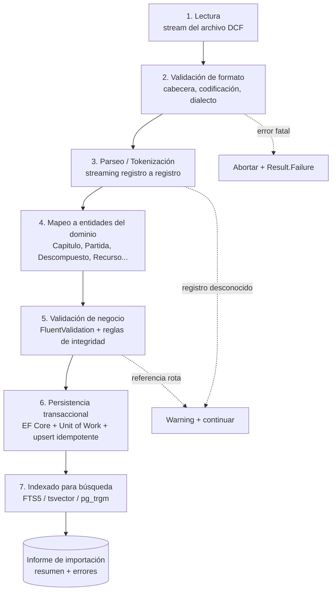
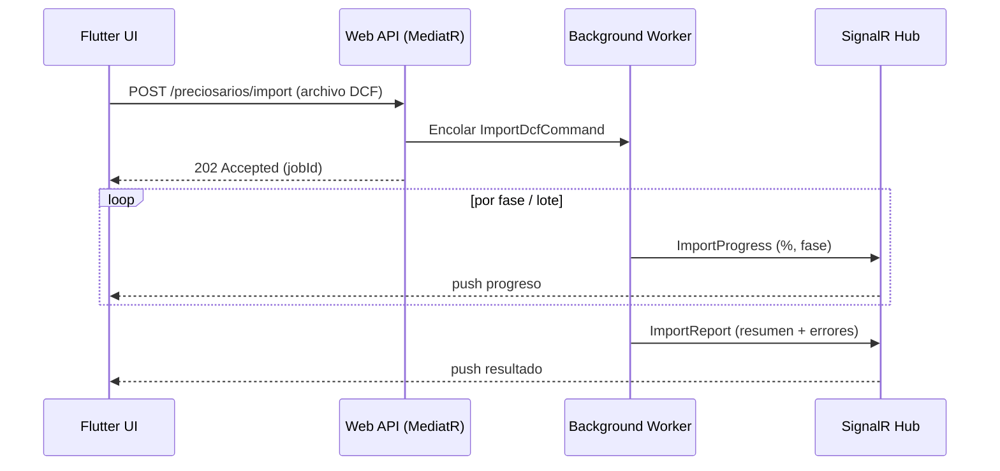
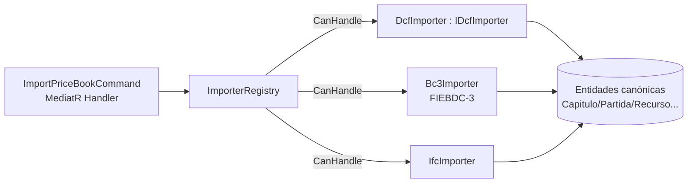

# Importador DCF

Especificación técnica del **importador de preciosarios DCF** para Preventivi App. Define qué es un archivo DCF, el pipeline de importación por fases, el diseño del parser en streaming, el mapeo a entidades canónicas del dominio, la gestión de errores, las interfaces C# y la arquitectura extensible a futuros formatos (BC3/FIEBDC-3, IFC).

> Stack de referencia: **.NET 9 Web API**, Clean Architecture, **MediatR** (CQRS), **Result Pattern**, **FluentValidation**, **EF Core**, SQLite (FTS5) local / PostgreSQL servidor. IDs **UUID v7**. Toda la importación es **idempotente** y se ejecuta en **background**.

---

## 1. Qué es un archivo DCF

**DCF** es un **formato de intercambio de preciosarios** (bancos de precios / cuadros de precios) usado por **Primus (ACCA)** y herramientas afines del sector de la construcción. Permite trasladar un cuadro de precios completo —con su estructura jerárquica, descompuestos y recursos— entre aplicaciones.

### 1.1 Información que contiene

Un archivo DCF transporta, total o parcialmente, la siguiente información:

| Bloque | Contenido |
|--------|-----------|
| **Cabecera del preciosario** | Nombre, versión, fuente/editor, fecha de publicación, moneda, idioma. |
| **Capítulos y subcapítulos** | Árbol jerárquico (autorreferencia padre/hijo) con código, título y orden. |
| **Partidas** | Unidades de obra: código, resumen, texto largo, unidad de medida, precio, tipo. |
| **Descompuestos** | Líneas de análisis de precios: recurso referenciado, rendimiento, cantidad, precio unitario, importe. |
| **Recursos** | Mano de obra, materiales, maquinaria y otros: código, descripción, unidad, precio. |
| **Precios** | Valor, moneda, vigencia. |
| **Unidades** | Catálogo de unidades de medida (m, m², m³, ud, kg, h, ...). |
| **Textos** | Descripciones largas, pliegos, notas, observaciones. |
| **Códigos y relaciones** | Códigos jerárquicos y referencias cruzadas partida↔recurso, capítulo↔partida. |

### 1.2 Naturaleza del formato y estrategia de parseo

> [!NOTE]
> El formato exacto de DCF puede ser **propietario** y no estar publicado de forma estable. Por ello el parser **no se acopla a una gramática fija**: se diseña como un **parser por contrato de registro** (record-based), donde cada línea/registro se identifica por un **discriminador de tipo de registro** y se delega a un **handler de registro** registrado en un diccionario. Esto permite cubrir el subconjunto conocido del formato y **extenderlo** añadiendo nuevos handlers sin reescribir el núcleo.

El núcleo del parser solo conoce:
1. Cómo segmentar el flujo en **registros** (por línea, por delimitador o por longitud fija, según `DcfDialect`).
2. Cómo extraer el **discriminador** de cada registro.
3. Cómo enrutar el registro a un `IDcfRecordHandler`.

Los handlers concretos (capítulo, partida, descompuesto, recurso, texto…) traducen el registro a un **evento canónico** (`DcfRecordParsed`) que la fase de mapeo consume. Registros desconocidos generan un **warning** y se ignoran, sin abortar la importación.

---

## 2. Pipeline de importación por fases

La importación se organiza en **7 fases** secuenciales, con reporte de progreso y posibilidad de cancelación en cada una.



| Fase | Responsabilidad | Salida |
|------|-----------------|--------|
| **1. Lectura** | Abrir el archivo como `Stream`, detectar codificación (UTF-8/Latin-1), calcular `hash_archivo` para idempotencia. | Flujo de bytes/líneas. |
| **2. Validación de formato** | Verificar firma/cabecera, dialecto y versión soportada. Errores aquí son **fatales**. | `DcfDialect` resuelto. |
| **3. Parseo / Tokenización** | Segmentar en registros, identificar discriminador, emitir `DcfRecordParsed` en streaming. | Secuencia de registros tipados. |
| **4. Mapeo** | Traducir registros DCF → entidades canónicas, resolviendo referencias por código. | Entidades de dominio en buffer. |
| **5. Validación de negocio** | Reglas de dominio (precios ≥ 0, unidades existentes, jerarquía coherente, referencias resueltas). | Conjunto válido + lista de errores. |
| **6. Persistencia** | Upsert transaccional por lotes, respetando precios bloqueados. | Preciosario persistido. |
| **7. Indexado** | Poblar índices de búsqueda full-text. | Índices actualizados. |

---

## 3. Diseño del parser

### 3.1 Lectura en streaming

El parser está diseñado para preciosarios de **500.000+ partidas**, por lo que **nunca carga el archivo completo en memoria**:

- Lectura mediante `StreamReader` + `IAsyncEnumerable<DcfRecord>` (yield por registro).
- El mapeo y la persistencia trabajan **por lotes** (`batchSize`, p. ej. 1.000–5.000 entidades) con `SaveChanges` + limpieza del `ChangeTracker` para evitar crecimiento de memoria.
- Las referencias por código (recurso de un descompuesto) se resuelven con una **tabla de símbolos** (diccionario código→Id) construida en una primera pasada ligera o mantenida incrementalmente, evitando re-lecturas del archivo.

### 3.2 Reportes de progreso

Se emite progreso vía `IProgress<ImportProgress>` con eventos de porcentaje y fase. El porcentaje se estima por **bytes consumidos del stream** (robusto aunque no se conozca el total de registros) y/o por **registros procesados** cuando hay conteo previo.

### 3.3 Cancelación

Todas las operaciones aceptan `CancellationToken`. Se comprueba la cancelación entre lotes y entre fases; al cancelar se hace **rollback** de la transacción abierta y se devuelve `Result.Failure` con motivo `Cancelled`.

### 3.4 Procesamiento en background

La importación se dispara como **comando MediatR** y se ejecuta en un **worker en background** (cola de trabajos / `IHostedService`). El cliente Flutter recibe el progreso por **SignalR** y el resultado final (`ImportReport`) al terminar.



---

## 4. Mapeo registro DCF → entidades canónicas

Cada tipo de registro DCF se traduce a una o varias entidades del dominio (nombres **exactos** del modelo canónico).

| Registro DCF | Entidad canónica | Campos mapeados | Notas |
|--------------|------------------|-----------------|-------|
| Cabecera | **Preciosario** | nombre, version, fuente, fecha_publicacion, `origen_dcf=true`, hash_archivo | Una por archivo. |
| Capítulo / Subcapítulo | **Capitulo** | codigo, titulo, orden, padre_id, preciosario_id | Jerarquía resuelta por código. |
| Partida (unidad de obra) | **Partida** | codigo, resumen, texto_largo, unidad_id, precio, tipo, capitulo_id | `unidad_id` resuelto contra catálogo. |
| Precio de partida | **Precio** | valor, moneda, vigente_desde, `bloqueado` (se respeta el existente) | No sobrescribe si bloqueado. |
| Línea de descompuesto | **Descompuesto** | partida_id, recurso_id, rendimiento, cantidad, precio_unitario, importe | `recurso_id` por código. |
| Recurso mano de obra | **Recurso** (`tipo=mano_obra`) | codigo, descripcion, unidad_id, precio | Discriminador `tipo`. |
| Recurso material | **Recurso** (`tipo=material`) | codigo, descripcion, unidad_id, precio | |
| Recurso maquinaria | **Recurso** (`tipo=maquinaria`) | codigo, descripcion, unidad_id, precio | |
| Otros recursos | **Recurso** (`tipo=otros`) | codigo, descripcion, unidad_id, precio | |
| Unidad de medida | **Unidad** | codigo, nombre | Catálogo compartido; upsert por codigo. |
| Texto / pliego | campo `texto_largo` de **Partida** | texto_largo | Se asocia a la partida/recurso referenciado. |

> El **análisis de precios** (`AnalisisPrecios`) no se importa como registro: es la **vista agregada** del conjunto de `Descompuesto` de una partida (mano de obra + material + maquinaria + % costes indirectos) y se calcula tras la persistencia.

### 4.1 Resolución de referencias

Las relaciones se expresan por **código** en el DCF y se traducen a **UUID v7** internos mediante una tabla de símbolos por preciosario:

- `Capitulo.padre_id` → por código de capítulo padre.
- `Partida.capitulo_id` → por código de capítulo contenedor.
- `Descompuesto.recurso_id` → por código de recurso.
- `*.unidad_id` → por código de unidad (catálogo global).

Una referencia no resuelta genera un error de tipo **referencia rota** (ver §5).

---

## 5. Detección y registro de errores

### 5.1 Tipos y niveles

| Tipo | Descripción | Nivel por defecto |
|------|-------------|-------------------|
| **FormatoInvalido** | Cabecera/dialecto/codificación no reconocidos. | `Error` (fatal en fase 2). |
| **RegistroDesconocido** | Discriminador sin handler registrado. | `Warning` (se ignora el registro). |
| **ReferenciaRota** | Código referenciado (capítulo padre, recurso, unidad) inexistente. | `Error` (la entidad se descarta o queda huérfana). |
| **DatoFaltante** | Campo obligatorio ausente (código, descripción, unidad). | `Error` o `Warning` según campo. |
| **PrecioInvalido** | Precio nulo, negativo o no numérico. | `Error`. |
| **DuplicadoCodigo** | Código repetido en el mismo ámbito. | `Warning` (se aplica última o se conserva existente). |
| **PrecioBloqueado** | Se intentó actualizar un precio `bloqueado`. | `Info`/`Warning` (se omite la actualización). |

- **Warning**: la importación continúa; el registro afectado se procesa de forma degradada o se omite.
- **Error**: el registro no se persiste; la importación continúa salvo que el error sea fatal de formato.

### 5.2 Informe de importación

Al finalizar se produce un `ImportReport` con resumen y detalle:

```jsonc
{
  "preciosarioId": "0190f2c1-...uuidv7",
  "exito": true,
  "fechaInicio": "2026-06-26T10:00:00Z",
  "duracion": "00:02:14",
  "resumen": {
    "capitulos": 1240,
    "partidas": 503112,
    "recursos": 88210,
    "descompuestos": 1421005,
    "warnings": 312,
    "errores": 4
  },
  "errores": [
    { "tipo": "ReferenciaRota", "nivel": "Error", "registro": 50231,
      "codigo": "E04SA020", "mensaje": "Recurso 'MO00123' no encontrado" }
  ]
}
```

---

## 6. Contratos C#

Interfaces y modelos de resultado (Application/Domain). Se usa el **Result Pattern** del proyecto (sin excepciones para flujo de negocio).

```csharp
namespace PreventiviApp.Application.Import;

/// <summary>Estrategia de importación de un cuadro de precios (formato concreto).</summary>
public interface IPriceBookImporter
{
    /// <summary>Formato soportado por esta estrategia (DCF, BC3, IFC...).</summary>
    PriceBookFormat Format { get; }

    /// <summary>Indica si esta estrategia puede procesar el stream (firma/extensión).</summary>
    bool CanHandle(ImportSource source);

    Task<Result<ImportReport>> ImportAsync(
        ImportRequest request,
        IProgress<ImportProgress> progress,
        CancellationToken cancellationToken);
}

/// <summary>Importador específico del formato DCF (Primus / ACCA).</summary>
public interface IDcfImporter : IPriceBookImporter { }

public sealed record ImportRequest(
    Stream Source,
    Guid? PreciosarioId,        // null = nuevo; con valor = reimportación
    ImportMode Mode,            // Crear | Actualizar
    int BatchSize = 2000);

public enum ImportMode { Crear, Actualizar }
public enum PriceBookFormat { Dcf, Bc3, Ifc }

/// <summary>Evento de progreso emitido vía IProgress&lt;ImportProgress&gt;.</summary>
public sealed record ImportProgress(
    ImportPhase Phase,
    double Percent,             // 0..100, estimado por bytes/registros
    long RecordsProcessed,
    string? Message = null);

public enum ImportPhase
{
    Lectura, ValidacionFormato, Parseo, Mapeo,
    ValidacionNegocio, Persistencia, Indexado
}

public sealed record ImportError(
    ImportErrorType Type,
    ImportSeverity Severity,
    long? RecordNumber,
    string? Code,
    string Message);

public enum ImportErrorType
{
    FormatoInvalido, RegistroDesconocido, ReferenciaRota,
    DatoFaltante, PrecioInvalido, DuplicadoCodigo, PrecioBloqueado
}

public enum ImportSeverity { Info, Warning, Error }

public sealed record ImportReport(
    Guid PreciosarioId,
    bool Success,
    TimeSpan Duration,
    ImportSummary Summary,
    IReadOnlyList<ImportError> Errors);

public sealed record ImportSummary(
    int Capitulos, long Partidas, long Recursos,
    long Descompuestos, int Warnings, int Errores);
```

### 6.1 Núcleo extensible del parser (handlers por registro)

```csharp
/// <summary>Traduce un registro DCF crudo a un evento canónico de dominio.</summary>
public interface IDcfRecordHandler
{
    string RecordDiscriminator { get; }     // p. ej. "CAP", "PAR", "DES", "REC"
    DcfRecordParsed Handle(DcfRawRecord record);
}

public sealed class DcfParser
{
    private readonly IReadOnlyDictionary<string, IDcfRecordHandler> _handlers;

    public async IAsyncEnumerable<DcfRecordParsed> ParseAsync(
        Stream stream, DcfDialect dialect,
        [EnumeratorCancellation] CancellationToken ct)
    {
        using var reader = new StreamReader(stream, dialect.Encoding);
        string? line;
        long n = 0;
        while ((line = await reader.ReadLineAsync(ct)) is not null)
        {
            ct.ThrowIfCancellationRequested();
            n++;
            var raw = dialect.Tokenize(line, n);
            if (_handlers.TryGetValue(raw.Discriminator, out var handler))
                yield return handler.Handle(raw);
            // registro desconocido -> warning agregado por el orquestador
        }
    }
}
```

---

## 7. Arquitectura extensible a futuros formatos

La importación usa el **patrón Strategy + plugins** sobre `IPriceBookImporter`. Añadir **BC3/FIEBDC-3** o **IFC** no requiere tocar el orquestador.



- `ImporterRegistry` selecciona la estrategia mediante `CanHandle(source)` (firma + extensión + dialecto).
- Todas las estrategias **convergen al mismo modelo canónico** y comparten las fases 4–7 (mapeo, validación, persistencia, indexado), reutilizando código.
- Registro vía **DI** (`services.AddImporters()`), permitiendo plugins futuros sin modificar el núcleo (principio Abierto/Cerrado).

---

## 8. Idempotencia y reimportación

La importación es **idempotente**: reimportar el mismo archivo (mismo `hash_archivo`) no duplica datos.

| Escenario | Comportamiento |
|-----------|----------------|
| **Mismo hash, mismo preciosario** | No-op (o solo refresco de índices). Se reporta como sin cambios. |
| **Nueva versión del preciosario** (`Mode=Actualizar`) | **Upsert por código**: capítulos/partidas/recursos existentes se actualizan; nuevos se insertan; los ausentes se marcan obsoletos (no se borran en duro por defecto). |
| **Precio bloqueado** (`Precio.bloqueado = true`) | **No se actualiza** el valor; se genera un evento `PrecioBloqueado` (Info/Warning) en el informe. |
| **Precio no bloqueado** | Se actualiza al valor del DCF, registrando `vigente_desde`. |

### 8.1 Clave de idempotencia

El **upsert** se realiza por clave natural `(preciosario_id, codigo)` para capítulos/partidas y por `codigo` para recursos/unidades dentro del ámbito del preciosario. La identidad interna usa **UUID v7** estable: si la entidad ya existe por su clave natural, se conserva su `id`.

### 8.2 Transaccionalidad

Toda la persistencia ocurre dentro de una **única transacción** (Unit of Work) por lotes. Ante error fatal o cancelación se hace **rollback** completo: el preciosario nunca queda en estado parcial. Las actualizaciones de precios bloqueados se filtran **antes** de `SaveChanges` para garantizar que nunca se sobrescriben.

---

## 9. Resumen

- Parser **por contrato de registro**, extensible vía `IDcfRecordHandler`, robusto frente a formato propietario.
- **Streaming** + lotes + tabla de símbolos para soportar **500.000+ partidas** con memoria acotada.
- Progreso por `IProgress<ImportProgress>` y **SignalR**; cancelación por `CancellationToken`; ejecución en **background**.
- Mapeo explícito a entidades canónicas (**Preciosario, Capitulo, Partida, Descompuesto, Recurso, Precio, Unidad**).
- Gestión de errores con tipos/niveles e **informe de importación**.
- **Strategy/plugins** (`IPriceBookImporter`) para BC3/FIEBDC-3 e IFC futuros.
- **Idempotencia** y reimportación con respeto a **precios bloqueados** y transaccionalidad total.
