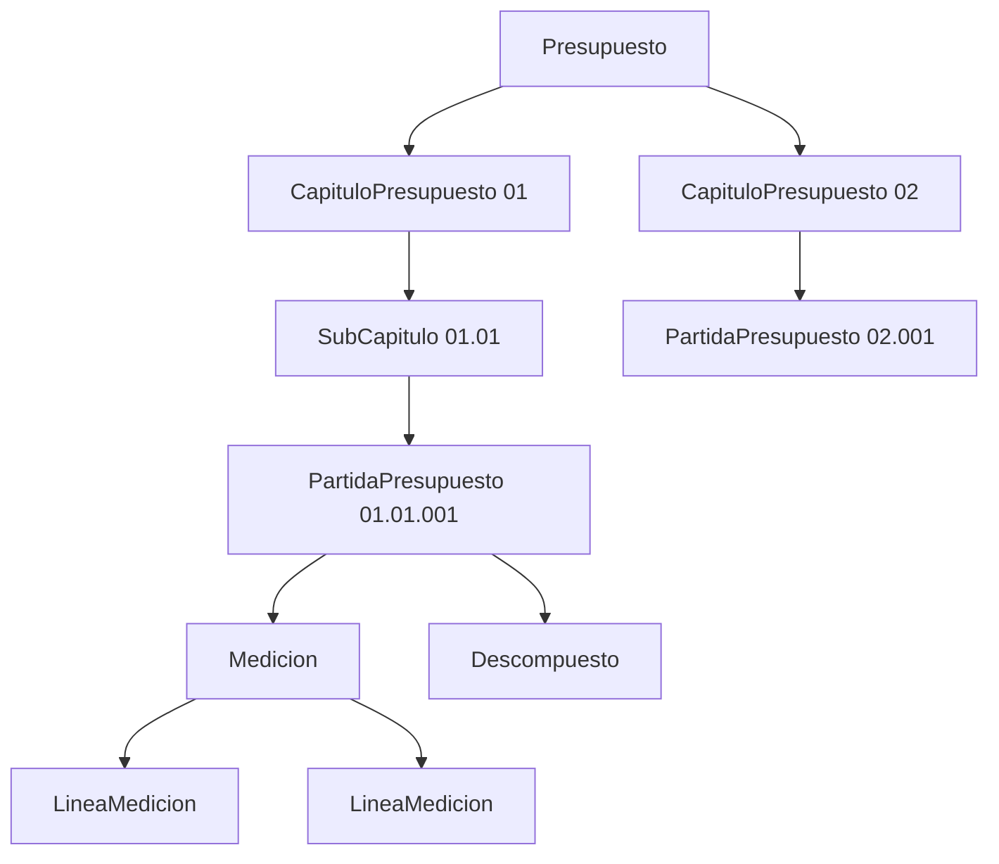
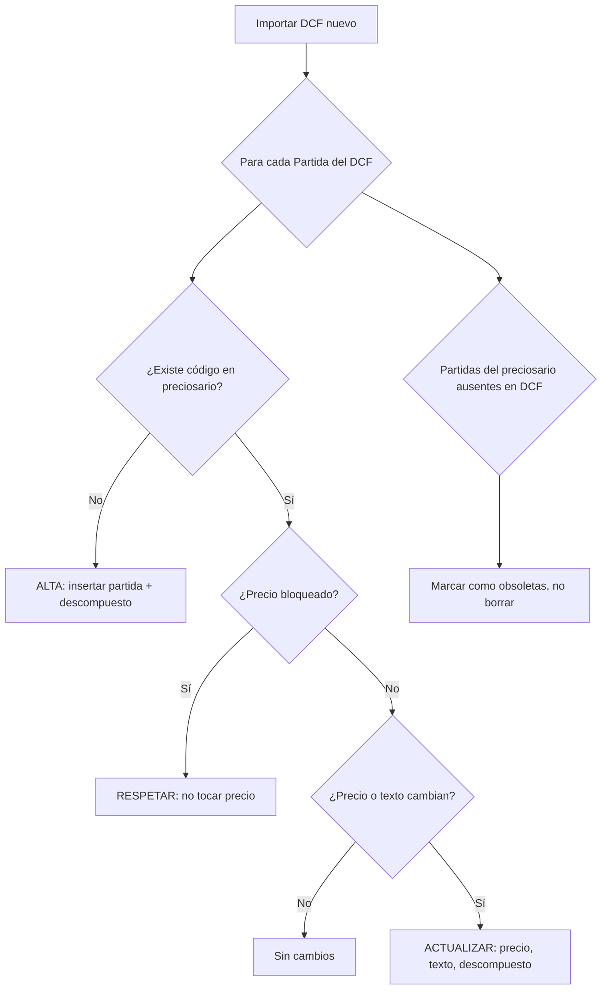
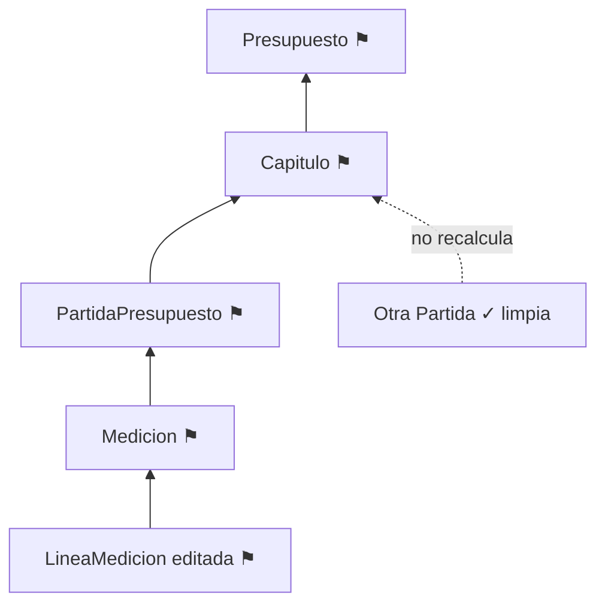

# Motor de Presupuestos y Mediciones

Este documento describe el motor de cálculo de presupuestos y mediciones de **Preventivi App**, inspirado en el comportamiento de Primus (ACCA) pero rediseñado para ser más rápido e intuitivo. Define el modelo de cálculo, las reglas de precisión decimal, el tratamiento de mediciones y fórmulas, la gestión de precios, la actualización desde nuevos preciosarios DCF, el versionado y el recálculo incremental para presupuestos grandes.

Todas las entidades referenciadas (`Presupuesto`, `CapituloPresupuesto`, `PartidaPresupuesto`, `Medicion`, `LineaMedicion`, `Descompuesto`, `Recurso`, `CostesIndirectos`, `Iva`, `Precio`) siguen exactamente el modelo de dominio canónico.

## 1. Modelo de cálculo del presupuesto

### 1.1. Jerarquía

Un presupuesto es un **árbol** de capítulos y partidas con sus mediciones:

```
Presupuesto
└── CapituloPresupuesto (raíz o subcapítulo, autorreferencia padre_id)
    ├── CapituloPresupuesto (subcapítulo)
    │   └── PartidaPresupuesto
    │       └── Medicion
    │           ├── LineaMedicion
    │           └── LineaMedicion
    └── PartidaPresupuesto
        └── Medicion
            └── LineaMedicion
```



### 1.2. Fórmulas de agregación

El cálculo es estrictamente **ascendente** (bottom-up):

| Nivel | Magnitud | Fórmula |
|-------|----------|---------|
| Línea de medición | `parcial` | `uds × largo × ancho × alto` (o resultado de fórmula) × coeficiente |
| Medición | `total` | `Σ parcial` de todas sus `LineaMedicion` |
| Partida | `importe` | `total_medición × precio` |
| Capítulo | `subtotal` | `Σ importe` de partidas + `Σ subtotal` de subcapítulos |
| Presupuesto | `pem` (Presupuesto de Ejecución Material) | `Σ subtotal` de capítulos raíz |

A partir del PEM se aplican costes indirectos (si no están ya en el precio), gastos generales, baja de adjudicación e IVA (ver §4).

### 1.3. Ejemplo numérico

Partida `01.01.001` — *Excavación en zanja*, precio = `18,45 €/m³`.

| Línea | Comentario | Uds | Largo | Ancho | Alto | Parcial (m³) |
|-------|-----------|-----|-------|-------|------|--------------|
| 1 | Zanja muro norte | 1 | 25,00 | 0,60 | 1,20 | 18,000 |
| 2 | Zanja muro este | 1 | 12,50 | 0,60 | 1,20 | 9,000 |
| 3 | Pozos cimentación | 4 | 1,00 | 1,00 | 1,50 | 6,000 |
| **Total medición** | | | | | | **33,000** |

`importe_partida = 33,000 × 18,45 = 608,85 €`

## 2. Cálculo del precio de una partida (análisis de precios)

El **precio** de una `PartidaPresupuesto` puede ser:

1. **Introducido directamente** (precio cerrado, sin descompuesto), o
2. **Calculado desde su descompuesto** (análisis de precios unitarios, APU).

### 2.1. Descompuesto

Cada línea de `Descompuesto` referencia un `Recurso` (tipo ∈ `{mano_obra, material, maquinaria, otros}`) con un `rendimiento` (cantidad de recurso por unidad de partida) y un `precio_unitario`:

```
importe_línea = rendimiento × precio_unitario
```

El **coste directo** de la partida es la suma de las líneas, normalmente agrupada por naturaleza:

```
coste_directo = Σ(mano_obra) + Σ(material) + Σ(maquinaria) + Σ(otros)
```

Sobre el coste directo se aplica el **porcentaje de costes indirectos** definido en `CostesIndirectos`:

```
precio_partida = redondear( coste_directo × (1 + costes_indirectos% / 100) )
```

### 2.2. Ejemplo de análisis de precios

Partida `02.003` — *m² de fábrica de ladrillo perforado 1/2 pie*.

| Tipo | Código | Descripción | Rendimiento | Ud | Precio unit. | Importe |
|------|--------|-------------|-------------|-----|-------------|---------|
| Mano obra | MO.001 | Oficial 1ª albañil | 0,650 | h | 19,80 | 12,8700 |
| Mano obra | MO.005 | Peón ordinario | 0,650 | h | 17,20 | 11,1800 |
| Material | MT.012 | Ladrillo perforado | 56,000 | ud | 0,18 | 10,0800 |
| Material | MT.040 | Mortero M-5 | 0,030 | m³ | 78,50 | 2,3550 |
| Maquinaria | MQ.002 | Hormigonera 250 l | 0,030 | h | 1,95 | 0,0585 |
| **Coste directo** | | | | | | **36,5435** |
| Costes indirectos (3 %) | | | | | | 1,0963 |
| **Precio partida** | | | | | | **37,64** |

Detalle:
- `Σ mano_obra = 12,8700 + 11,1800 = 24,0500`
- `Σ material = 10,0800 + 2,3550 = 12,4350`
- `Σ maquinaria = 0,0585`
- `coste_directo = 36,5435`
- `indirectos = 36,5435 × 0,03 = 1,09631 ≈ 1,0963`
- `precio = redondear(36,5435 × 1,03) = redondear(37,63981) = 37,64`

### 2.3. Redondeos y precisión decimal

Se usa **`decimal`** de C# en todo el motor (nunca `double`/`float`), para evitar errores de coma flotante en importes monetarios.

Reglas:

| Magnitud | Escala (decimales) | Redondeo |
|----------|-------------------|----------|
| Rendimiento | 4 | `MidpointRounding.AwayFromZero` |
| Precio unitario de recurso | 4 | `AwayFromZero` |
| Importe de línea de descompuesto | 4 (interno), 2 (presentación) | `AwayFromZero` |
| Precio de partida | 2 | `AwayFromZero` |
| Parcial de medición | 3 | `AwayFromZero` |
| Total de medición | 3 | `AwayFromZero` |
| Importe de partida | 2 | `AwayFromZero` |
| Subtotales y totales | 2 | `AwayFromZero` |

Principio clave: se **redondea solo al cruzar fronteras de presentación o de nivel jerárquico** (precio de partida, importe de partida, subtotal de capítulo). Los cálculos intermedios mantienen la mayor precisión disponible para evitar acumulación de error. La norma fija (configurable por presupuesto) sigue el criterio de redondeo «por mitades al alza» (`AwayFromZero`), coherente con la práctica de mediciones española.

```csharp
public static class Redondeo
{
    public static decimal Precio(decimal v)   => Math.Round(v, 2, MidpointRounding.AwayFromZero);
    public static decimal Medicion(decimal v) => Math.Round(v, 3, MidpointRounding.AwayFromZero);
    public static decimal Importe(decimal v)   => Math.Round(v, 2, MidpointRounding.AwayFromZero);
}
```

## 3. Mediciones

### 3.1. Líneas de medición

Una `LineaMedicion` calcula un `parcial` por dos vías mutuamente excluyentes:

1. **Dimensional**: `parcial = uds × largo × ancho × alto`. Cualquier dimensión nula o vacía se trata como `1` (un valor neutro), de modo que una medición de superficie deja `alto` vacío y una de unidades deja largo/ancho/alto vacíos.
2. **Fórmula**: si el campo `formula` está informado, el `parcial` es el resultado de evaluar la fórmula y se ignoran las dimensiones.

### 3.2. Coeficientes y rendimientos

Un coeficiente (entidad `CoeficienteRendimiento`) multiplica el parcial. Es útil para esponjamientos, mermas, solapes o factores de seguridad:

```
parcial = uds × largo × ancho × alto × coeficiente
```

### 3.3. Subtotales parciales

Las líneas pueden marcarse como **subtotal parcial** (acumulan lo anterior sin sumar de nuevo) o como **línea de comentario** (parcial = 0). Esto reproduce el comportamiento de Primus, donde se intercalan subtotales legibles dentro del listado de medición.

### 3.4. Fórmulas con variables

Las fórmulas admiten operadores aritméticos, funciones matemáticas y **variables** que referencian dimensiones de la propia línea o constantes del presupuesto:

| Variable | Significado |
|----------|-------------|
| `uds`, `largo`, `ancho`, `alto` | dimensiones de la línea |
| `PI` | constante 3,14159265358979 |
| funciones | `sqrt`, `pow`, `abs`, `round`, `min`, `max`, `sin`, `cos` |

Ejemplos:

| Comentario | Fórmula | Uds | Largo | Resultado |
|-----------|---------|-----|-------|-----------|
| Sección circular pilar | `PI * pow(0.30, 2) / 4 * largo` | 1 | 3,00 | 0,212 |
| Diagonal hueco | `sqrt(pow(largo,2) + pow(alto,2))` | 1 | 1,20 (alto=0,90) | 1,500 |
| Superficie con merma | `uds * largo * ancho * 1.05` | 10 | 2,40 (ancho=1,20) | 30,240 |

### 3.5. Ejemplo completo de medición con fórmula y coeficiente

Partida `03.001` — *m³ de hormigón en zapatas*, precio = `92,30 €/m³`.

| Línea | Comentario | Uds | Largo | Ancho | Alto | Fórmula | Coef. | Parcial |
|-------|-----------|-----|-------|-------|------|---------|-------|---------|
| 1 | Zapatas aisladas | 12 | 1,50 | 1,50 | 0,60 | — | 1,00 | 16,200 |
| 2 | Zapata corrida | 1 | 18,00 | 0,80 | 0,50 | — | 1,00 | 7,200 |
| 3 | Sobreancho excavación | 1 | — | — | — | `16.2 * 0.03` | 1,00 | 0,486 |
| **Total medición** | | | | | | | | **23,886** |

`importe = 23,886 × 92,30 = 2.204,68 €`

## 4. Costes indirectos, IVA, descuentos y baja de adjudicación

El motor distingue claramente entre los conceptos que afectan al precio unitario y los que afectan al total del presupuesto.

```mermaid
graph LR
    CD[Coste directo] --> CI[+ Costes indirectos %]
    CI --> PU[Precio unitario partida]
    PU --> PEM[PEM = Σ importes partidas]
    PEM --> BAJA[× coef. adjudicación / baja]
    BAJA --> DESC[− descuentos]
    DESC --> BASE[Base imponible]
    BASE --> IVA[+ IVA %]
    IVA --> TOTAL[Total presupuesto]
```



### 4.1. Costes indirectos

`CostesIndirectos.porcentaje` se aplica sobre el coste directo de cada partida que se calcula por descompuesto (§2.1). Si una partida tiene precio cerrado, se considera que ya incluye indirectos.

### 4.2. Baja / coeficiente de adjudicación

La **baja** es el descuento porcentual ofertado en licitación. Se modela como **coeficiente de adjudicación** sobre el PEM:

```
coef_adjudicacion = 1 − baja% / 100
pem_ajustado = redondear( PEM × coef_adjudicacion )
```

Ejemplo: PEM = `100.000,00 €`, baja = `12 %` → `coef = 0,88` → `pem_ajustado = 88.000,00 €`.

El coeficiente puede aplicarse de forma global o, opcionalmente, partida a partida (afectando al precio unitario de oferta) según la configuración del presupuesto.

### 4.3. Descuentos

Descuentos comerciales sobre la base, posteriores a la baja, expresados en importe o porcentaje:

```
base_imponible = pem_ajustado − descuentos
```

### 4.4. IVA

`Iva.porcentaje` se aplica sobre la base imponible. Un presupuesto puede usar uno o varios tipos de IVA (p. ej. 21 % general, 10 % reducido para rehabilitación de vivienda):

```
cuota_iva = redondear( base_imponible × iva% / 100 )
total = base_imponible + cuota_iva
```

### 4.5. Ejemplo de cierre de presupuesto

| Concepto | Importe |
|----------|---------|
| PEM (Σ importes de partidas) | 100.000,00 |
| Baja de adjudicación (12 %) | −12.000,00 |
| PEM ajustado | 88.000,00 |
| Descuento comercial (2 %) | −1.760,00 |
| **Base imponible** | **86.240,00** |
| IVA (21 %) | 18.110,40 |
| **TOTAL** | **104.350,40** |

## 5. Gestión de precios

### 5.1. Precio del preciosario vs. precio del presupuesto

- El `Precio` vive en el preciosario (`Preciosario` → `Partida`).
- Al insertar una partida en un presupuesto se crea una `PartidaPresupuesto` cuyo `precio` es **independiente**: puede divergir del preciosario sin afectarlo, y viceversa.

Estados de divergencia detectados por el motor:

| Estado | Condición | Indicador UI |
|--------|-----------|--------------|
| Sincronizado | `precio_presupuesto == precio_preciosario` | sin marca |
| Divergente | precios distintos | icono ⚠ + tooltip con ambos valores |
| Bloqueado | `Precio.bloqueado == true` | candado |
| Huérfano | la partida ya no existe en el preciosario | icono 🔗✕ |

### 5.2. Actualizar precios

La acción *Actualizar precios* copia el precio del preciosario al presupuesto para las partidas seleccionadas **respetando los precios bloqueados**. Recalcula importes afectados (§7).

### 5.3. Bloquear precios

`Precio.bloqueado = true` marca un precio como **protegido**: no se sobrescribe ni al reimportar un DCF ni al ejecutar *Actualizar precios*. Se usa para precios negociados o contradictorios que no deben perderse.

## 6. Actualización desde un nuevo DCF

Cuando se importa una nueva versión de un preciosario DCF, el motor compara por **código** y aplica una política de actualización conservadora.

### 6.1. Algoritmo de comparación



Pseudocódigo:

```csharp
foreach (var nueva in dcf.Partidas)
{
    var actual = preciosario.BuscarPorCodigo(nueva.Codigo);
    if (actual is null)
    {
        preciosario.Insertar(nueva);              // ALTA
        continue;
    }
    if (actual.Precio.Bloqueado)
        continue;                                  // RESPETAR

    if (actual.DifiereDe(nueva))
        actual.ActualizarDesde(nueva);             // ACTUALIZAR (precio, texto, descompuesto)
}
preciosario.MarcarObsoletas(dcf.CodigosPresentes); // las ausentes ⇒ obsoletas (no se borran)
```

### 6.2. Qué se actualiza y qué se respeta

| Elemento | Acción al reimportar DCF |
|----------|--------------------------|
| Partida nueva (código inexistente) | **Se inserta** |
| Precio no bloqueado y distinto | **Se actualiza** |
| Precio **bloqueado** | **Se respeta** (nunca se sobrescribe) |
| Texto/descompuesto de partida no bloqueada | **Se actualiza** |
| Partida del preciosario ausente en el DCF | **Se marca obsoleta** (no se borra) |
| `PartidaPresupuesto` ya colocada en un presupuesto | **No se toca**; el cambio queda disponible vía *Actualizar precios* |

La importación nunca modifica directamente presupuestos existentes: separa la actualización del catálogo (preciosario) de la decisión explícita del usuario de propagar precios a sus presupuestos.

## 7. Versionado de presupuestos y comparación

### 7.1. Versionado

`Presupuesto` es **versionable** (campo `version`). Al crear una nueva versión se genera un **snapshot inmutable** (entidad `Version` con `snapshot` serializado) del árbol completo: capítulos, partidas, precios y mediciones. Las versiones anteriores quedan congeladas para auditoría y comparación.

### 7.2. Diff entre versiones

La comparación se hace **por código de partida**, clasificando cada partida y detectando cambios de precio y de medición:

| Tipo de cambio | Detección |
|----------------|-----------|
| Añadida | código presente en B, ausente en A |
| Eliminada | código presente en A, ausente en B |
| Precio modificado | `precio_A != precio_B` |
| Medición modificada | `total_medicion_A != total_medicion_B` |
| Importe modificado | derivado de precio y/o medición |

### 7.3. Tabla de ejemplo de diff (v1 → v2)

| Código | Estado | Precio v1 | Precio v2 | Medición v1 | Medición v2 | Importe v1 | Importe v2 | Δ Importe |
|--------|--------|-----------|-----------|-------------|-------------|------------|------------|-----------|
| 01.01.001 | = | 18,45 | 18,45 | 33,000 | 33,000 | 608,85 | 608,85 | 0,00 |
| 02.003 | precio↑ | 37,64 | 39,10 | 120,000 | 120,000 | 4.516,80 | 4.692,00 | +175,20 |
| 03.001 | medición↑ | 92,30 | 92,30 | 23,886 | 25,500 | 2.204,68 | 2.353,65 | +148,97 |
| 04.010 | añadida | — | 54,20 | — | 80,000 | — | 4.336,00 | +4.336,00 |
| 05.002 | eliminada | 12,10 | — | 200,000 | — | 2.420,00 | — | −2.420,00 |
| **Total** | | | | | | | | **+2.240,17** |

## 8. Recálculo eficiente (dirty tracking)

Para presupuestos grandes (objetivo: preciosarios de 500.000+ partidas), el recálculo total es inviable en cada edición. El motor usa **dirty tracking** y **recálculo incremental ascendente**.

### 8.1. Principio

Cada nodo del árbol (línea → medición → partida → capítulo → presupuesto) cachea su valor calculado y un flag `dirty`. Al modificar un nodo:

1. Se marca el nodo como `dirty`.
2. Se **propaga el flag hacia arriba** (padres), nunca hacia abajo.
3. El recálculo recorre solo la rama afectada, recomputando de hojas a raíz y deteniéndose cuando un valor no cambia (poda).



### 8.2. Estrategia

| Técnica | Descripción |
|---------|-------------|
| Dirty flag por nodo | Solo se recalculan ramas marcadas. |
| Propagación ascendente | Un cambio en una línea invalida su medición, partida, capítulos ancestros y total; los hermanos quedan intactos. |
| Poda por igualdad | Si el subtotal recalculado de un capítulo no varía, se detiene la propagación hacia arriba. |
| Recálculo diferido (batch) | Múltiples ediciones se acumulan y se resuelven en un único pase antes de render/persistencia. |
| Caché de valores | Cada nodo guarda su último resultado; lectura O(1) si está limpio. |
| Procesamiento en background | El recálculo masivo (p. ej. *Actualizar precios* global) se ejecuta fuera del hilo de UI. |

Coste: una edición puntual es `O(altura del árbol)` en lugar de `O(nº de partidas)`.

## 9. Snippets del dominio

### 9.1. `EvaluadorMedicion`

```csharp
namespace Preventivi.Domain.Mediciones;

/// Calcula el parcial de una línea (dimensional o por fórmula) y el total de una medición.
public sealed class EvaluadorMedicion
{
    private readonly IEvaluadorFormula _formula;

    public EvaluadorMedicion(IEvaluadorFormula formula) => _formula = formula;

    public decimal CalcularParcial(LineaMedicion linea)
    {
        if (linea.EsComentario)
            return 0m;

        decimal baseCalculo = !string.IsNullOrWhiteSpace(linea.Formula)
            ? _formula.Evaluar(linea.Formula, linea.ContextoVariables())
            : Neutro(linea.Uds) * Neutro(linea.Largo)
              * Neutro(linea.Ancho) * Neutro(linea.Alto);

        var coef = linea.Coeficiente ?? 1m;
        return Redondeo.Medicion(baseCalculo * coef);
    }

    public decimal CalcularTotal(Medicion medicion)
        => Redondeo.Medicion(medicion.Lineas.Sum(CalcularParcial));

    // Una dimensión vacía/nula actúa como elemento neutro (1).
    private static decimal Neutro(decimal? dim) => dim is null or 0m ? 1m : dim.Value;
}
```

### 9.2. `CalculadoraPresupuesto`

```csharp
namespace Preventivi.Domain.Presupuestos;

/// Motor de cálculo ascendente con redondeo por nivel y recálculo incremental.
public sealed class CalculadoraPresupuesto
{
    private readonly EvaluadorMedicion _mediciones;

    public CalculadoraPresupuesto(EvaluadorMedicion mediciones) => _mediciones = mediciones;

    /// Precio de una partida desde su descompuesto + costes indirectos.
    public decimal CalcularPrecioPartida(IReadOnlyList<Descompuesto> descompuesto, decimal indirectosPct)
    {
        var costeDirecto = descompuesto.Sum(d => d.Rendimiento * d.PrecioUnitario);
        var precio = costeDirecto * (1m + indirectosPct / 100m);
        return Redondeo.Precio(precio);
    }

    /// Importe de una partida = total medición × precio.
    public decimal CalcularImportePartida(PartidaPresupuesto partida)
    {
        var totalMedicion = _mediciones.CalcularTotal(partida.Medicion);
        return Redondeo.Importe(totalMedicion * partida.Precio);
    }

    /// Subtotal de un capítulo (recursivo sobre subcapítulos y partidas).
    public decimal CalcularSubtotalCapitulo(CapituloPresupuesto capitulo)
    {
        if (!capitulo.Dirty && capitulo.SubtotalCache is { } cache)
            return cache;

        var importePartidas = capitulo.Partidas.Sum(CalcularImportePartida);
        var importeSubcapitulos = capitulo.Subcapitulos.Sum(CalcularSubtotalCapitulo);

        var subtotal = Redondeo.Importe(importePartidas + importeSubcapitulos);
        capitulo.MarcarLimpio(subtotal);
        return subtotal;
    }

    /// Cierre del presupuesto: PEM → baja → descuentos → IVA → total.
    public ResultadoPresupuesto CalcularPresupuesto(Presupuesto p)
    {
        var pem = Redondeo.Importe(p.CapitulosRaiz.Sum(CalcularSubtotalCapitulo));

        var coefAdjudicacion = 1m - p.BajaPct / 100m;
        var pemAjustado = Redondeo.Importe(pem * coefAdjudicacion);

        var baseImponible = Redondeo.Importe(pemAjustado - p.DescuentosImporte);
        var cuotaIva = Redondeo.Importe(baseImponible * p.Iva.Porcentaje / 100m);
        var total = Redondeo.Importe(baseImponible + cuotaIva);

        return new ResultadoPresupuesto(pem, pemAjustado, baseImponible, cuotaIva, total);
    }
}

public readonly record struct ResultadoPresupuesto(
    decimal Pem, decimal PemAjustado, decimal BaseImponible, decimal CuotaIva, decimal Total);
```

### 9.3. Servicio de actualización desde DCF

```csharp
namespace Preventivi.Application.Preciosarios;

public sealed class ActualizadorPreciosarioDcf
{
    public ResultadoImportacion Actualizar(Preciosario destino, PreciosarioDcf nuevo)
    {
        int altas = 0, actualizadas = 0, respetadas = 0;

        foreach (var part in nuevo.Partidas)
        {
            var actual = destino.BuscarPorCodigo(part.Codigo);
            if (actual is null) { destino.Insertar(part); altas++; continue; }
            if (actual.Precio.Bloqueado) { respetadas++; continue; }      // nunca se sobrescribe
            if (actual.DifiereDe(part)) { actual.ActualizarDesde(part); actualizadas++; }
        }

        destino.MarcarObsoletas(nuevo.CodigosPresentes);                  // ausentes ⇒ obsoletas
        return new ResultadoImportacion(altas, actualizadas, respetadas);
    }
}
```

## 10. Resumen de invariantes

- Todo el cálculo monetario usa `decimal`; nunca `double`/`float`.
- El cálculo es ascendente; el redondeo ocurre solo al cruzar nivel o presentación.
- `importe_partida = total_medición × precio`; `subtotal_capítulo = Σ importes + Σ subtotales`; `PEM = Σ subtotales raíz`.
- Los precios bloqueados nunca se sobrescriben (ni por DCF ni por *Actualizar precios*).
- El precio de `PartidaPresupuesto` es independiente del preciosario; las divergencias se señalan, no se corrigen automáticamente.
- La reimportación de DCF actualiza el catálogo, no los presupuestos; la propagación es una acción explícita del usuario.
- El recálculo es incremental mediante dirty tracking con propagación ascendente y poda por igualdad.
