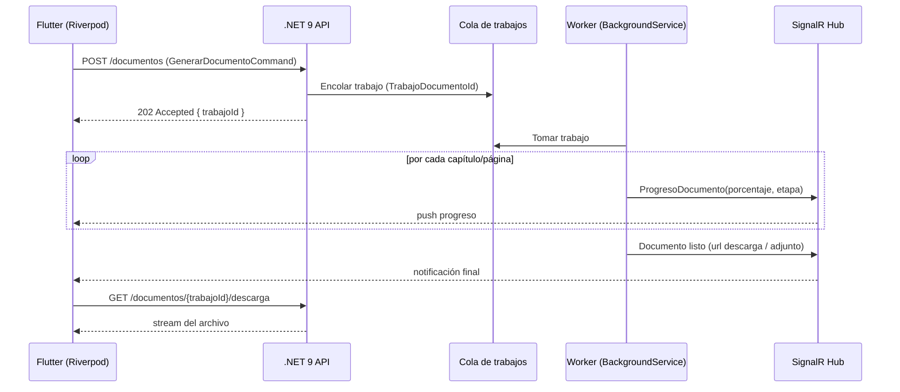

# Generación de documentos (PDF / Excel / CSV / JSON / XML)

Este documento describe el **motor de generación documental** de Preventivi App: la
arquitectura, los tipos de informe soportados, los formatos de exportación, el sistema
de plantillas, la generación en background y las consideraciones de paginación.

El motor vive en la capa **Infrastructure** (implementaciones concretas con QuestPDF /
ClosedXML) y se orquesta desde **Application** mediante casos de uso MediatR. Sigue el
**Result Pattern** para el manejo de errores y emite **eventos de progreso** para la UI.

---

## 1. Arquitectura del motor de documentos

### 1.1 Visión general

El motor separa tres ejes ortogonales:

1. **Tipo de documento** (qué información): Presupuesto, Mediciones, Resumen por
   capítulos, Descompuestos, Listado de materiales, Listado de mano de obra, Resumen
   económico, Certificaciones.
2. **Formato de salida** (cómo se serializa): PDF, Excel, CSV, JSON, XML.
3. **Plantilla** (con qué estilo / marca): cabecera, pie, logo, colores, idioma.

Cada eje se resuelve con un **patrón Strategy**: el caso de uso recibe un
`TipoDocumento` y un `FormatoExportacion`, y un **factory/registry** selecciona la
estrategia adecuada.

```mermaid
flowchart LR
    UC[Caso de uso\nGenerarDocumentoCommand] --> REG[GeneradorDocumentoFactory]
    REG -->|TipoDocumento + Formato| STRAT[IGeneradorDocumento\nseleccionado]
    subgraph Pipeline
        STRAT --> D[1. Datos\nrecolección DTO]
        D --> M[2. Modelo de documento\nDocumentoModel]
        M --> P[3. Plantilla\nPlantillaDocumento]
        P --> R[4. Render\nQuestPDF / ClosedXML / ...]
        R --> E[5. Exportación\nStream / archivo]
    end
    E --> OUT[(Resultado:\nbyte[] / Stream)]
```

### 1.2 El pipeline `datos → plantilla → render → exportación`

| Fase | Responsabilidad | Componente |
|------|-----------------|------------|
| **1. Datos** | Cargar el agregado (Presupuesto + Capítulos + Partidas + Mediciones + Descompuestos) desde repositorios; aplicar filtros. | `IDatosDocumentoProvider` |
| **2. Modelo** | Transformar entidades de dominio en un **modelo de presentación** plano (`DocumentoModel`), independiente del formato. | Mapper (Mapster) |
| **3. Plantilla** | Resolver `PlantillaDocumento` (cabecera, pie, estilos, i18n). | `IResolverPlantilla` |
| **4. Render** | Producir el documento físico con el motor concreto. | `IGeneradorDocumento` por formato |
| **5. Exportación** | Escribir a `Stream`, devolver `byte[]`, o persistir como `Adjunto`. | `IExportadorDocumento` |

> El **modelo de presentación** (`DocumentoModel`) es la pieza clave: aísla la lógica de
> "qué se muestra" del "cómo se renderiza". Así, el mismo `DocumentoModel` de un
> presupuesto puede ir a PDF y a Excel sin recalcular nada.

### 1.3 Interfaz `IGeneradorDocumento`

```csharp
namespace Preventivi.Application.Documentos.Abstracciones;

/// <summary>
/// Contrato común para todas las estrategias de generación documental.
/// Una implementación = una combinación (TipoDocumento × Formato).
/// </summary>
public interface IGeneradorDocumento
{
    /// <summary>Tipo de informe que produce esta estrategia.</summary>
    TipoDocumento Tipo { get; }

    /// <summary>Formato físico de salida.</summary>
    FormatoExportacion Formato { get; }

    /// <summary>
    /// Genera el documento a partir del modelo de presentación ya resuelto.
    /// Reporta progreso (0..1) y respeta la cancelación.
    /// </summary>
    Task<Result<DocumentoGenerado>> GenerarAsync(
        DocumentoModel modelo,
        PlantillaDocumento plantilla,
        IProgress<ProgresoDocumento>? progreso = null,
        CancellationToken ct = default);
}

public sealed record DocumentoGenerado(
    Stream Contenido,
    string NombreArchivo,
    string MimeType,
    long TamanoBytes);

public sealed record ProgresoDocumento(
    int PaginaActual,
    int PaginasTotales,
    double Porcentaje,
    string Etapa);
```

Enumeraciones canónicas:

```csharp
public enum TipoDocumento
{
    Presupuesto,
    MedicionesDetalladas,
    ResumenPorCapitulos,
    Descompuestos,
    ListadoMateriales,
    ListadoManoObra,
    ResumenEconomico,
    Certificacion
}

public enum FormatoExportacion { Pdf, Excel, Csv, Json, Xml }
```

### 1.4 Factory / registry

```csharp
public interface IGeneradorDocumentoFactory
{
    /// <summary>Devuelve la estrategia para el tipo+formato, o un error si no se soporta.</summary>
    Result<IGeneradorDocumento> Resolver(TipoDocumento tipo, FormatoExportacion formato);
}

// Registro por DI: todas las implementaciones de IGeneradorDocumento se inyectan
// como IEnumerable<IGeneradorDocumento> y se indexan por (Tipo, Formato).
internal sealed class GeneradorDocumentoFactory(IEnumerable<IGeneradorDocumento> generadores)
    : IGeneradorDocumentoFactory
{
    private readonly Dictionary<(TipoDocumento, FormatoExportacion), IGeneradorDocumento> _mapa =
        generadores.ToDictionary(g => (g.Tipo, g.Formato));

    public Result<IGeneradorDocumento> Resolver(TipoDocumento tipo, FormatoExportacion formato) =>
        _mapa.TryGetValue((tipo, formato), out var gen)
            ? Result.Success(gen)
            : Result.Failure<IGeneradorDocumento>(
                ErroresDocumento.FormatoNoSoportado(tipo, formato));
}
```

### 1.5 Caso de uso (MediatR / CQRS)

```csharp
public sealed record GenerarDocumentoCommand(
    Guid PresupuestoId,
    TipoDocumento Tipo,
    FormatoExportacion Formato,
    Guid? PlantillaId,
    string Idioma = "es") : IRequest<Result<DocumentoGenerado>>;

internal sealed class GenerarDocumentoHandler(
    IDatosDocumentoProvider datos,
    IResolverPlantilla plantillas,
    IGeneradorDocumentoFactory factory,
    ILogger<GenerarDocumentoHandler> log)
    : IRequestHandler<GenerarDocumentoCommand, Result<DocumentoGenerado>>
{
    public async Task<Result<DocumentoGenerado>> Handle(
        GenerarDocumentoCommand cmd, CancellationToken ct)
    {
        var modelo = await datos.ConstruirModeloAsync(cmd.PresupuestoId, cmd.Tipo, cmd.Idioma, ct);
        if (modelo.IsFailure) return Result.Failure<DocumentoGenerado>(modelo.Error);

        var plantilla = await plantillas.ResolverAsync(cmd.PlantillaId, cmd.Idioma, ct);
        var generador = factory.Resolver(cmd.Tipo, cmd.Formato);
        if (generador.IsFailure) return Result.Failure<DocumentoGenerado>(generador.Error);

        return await generador.Value.GenerarAsync(modelo.Value, plantilla, progreso: null, ct);
    }
}
```

---

## 2. Tipos de documento / informe

Todos los informes parten del agregado **Presupuesto** (árbol de `CapituloPresupuesto`
→ `PartidaPresupuesto` → `Medicion`/`LineaMedicion` y `Descompuesto`). El modelo de
dominio canónico está descrito en el BRIEF.

### 2.1 Presupuesto

Documento principal. Árbol completo de capítulos y partidas con mediciones resumidas e
importes.

- **Contenido**: portada (proyecto, cliente, fecha, versión), árbol de capítulos con
  numeración jerárquica, por cada partida (código, resumen, unidad, cantidad medida,
  precio, importe), subtotales por capítulo, total ejecución material, costes
  indirectos (`CostesIndirectos`), IVA (`Iva`) y total general.
- **Layout**: tabla por capítulo. Columnas: `Código | Resumen | Ud | Cantidad | Precio
  | Importe`. Capítulos como cabeceras de sección con su subtotal a la derecha. Página
  final de resumen económico.

### 2.2 Mediciones detalladas

Detalle de cálculo de cantidades línea a línea.

- **Contenido**: por cada partida, todas sus `LineaMedicion` (comentario, uds, largo,
  ancho, alto, fórmula, parcial) y el total de medición de la partida.
- **Layout**: bloque por partida con cabecera (código + resumen) y tabla de líneas:
  `Comentario | Uds | Largo | Ancho | Alto | Fórmula | Parcial`. Fila de **Total
  medición** al cierre de cada partida.

### 2.3 Resumen por capítulos

Vista de alto nivel sin partidas.

- **Contenido**: lista de capítulos de primer nivel (y subcapítulos opcionales) con su
  importe y su **% sobre el total**.
- **Layout**: tabla `Código | Capítulo | Importe | % s/Total`, fila de total y, si se
  solicita, gráfico de barras/sectores por capítulo.

### 2.4 Descompuestos / análisis de precios

Composición interna de cada partida (`Descompuesto` + `AnalisisPrecios`).

- **Contenido**: por partida, sus líneas de descompuesto (recurso, rendimiento,
  cantidad, precio unitario, importe), agrupadas por tipo de `Recurso` (mano de obra,
  material, maquinaria, otros), el subtotal de cada grupo, el **% de costes indirectos**
  y el precio resultante de la partida.
- **Layout**: bloque por partida. Tabla: `Código | Descripción recurso | Ud |
  Rendimiento | Cantidad | Precio | Importe`. Subtotales por tipo de recurso, línea de
  costes indirectos y **Precio total partida** destacado.

### 2.5 Listado de materiales

Agregación transversal de recursos tipo `material`.

- **Contenido**: todos los materiales usados en el presupuesto, con cantidad total
  acumulada (sumando rendimiento × medición de cada partida donde aparecen), precio
  unitario e importe total.
- **Layout**: tabla `Código | Material | Ud | Cantidad total | Precio | Importe`,
  ordenable por importe o por código. Total al pie.

### 2.6 Listado de mano de obra

Igual que materiales pero para recursos tipo `mano_obra`.

- **Contenido**: categorías/oficios, horas totales (`h`), precio/hora e importe.
- **Layout**: tabla `Código | Categoría | Ud (h) | Horas totales | Precio/h | Importe`,
  total de horas y total económico al pie.

### 2.7 Resumen económico

Cierre económico del presupuesto.

- **Contenido**: presupuesto de ejecución material (PEM), gastos generales y beneficio
  industrial si aplica, costes indirectos, base imponible, IVA y presupuesto base de
  licitación / total con IVA.
- **Layout**: tabla vertical de conceptos e importes, sin partidas, con énfasis
  tipográfico en el total final. Apto para una sola página.

### 2.8 Certificaciones

Documento de obra ejecutada a origen (parcial).

- **Contenido**: por partida, cantidad de presupuesto, cantidad certificada a origen,
  cantidad de la certificación anterior, cantidad de la certificación actual e importe
  certificado. Totales por capítulo y total de la certificación. Cabecera con número de
  certificación, periodo y firma.
- **Layout**: tabla `Código | Resumen | Ud | Cant. presup. | Origen | Anterior | Actual
  | Importe`. Página de resumen con acumulado a origen y pendiente. Bloque de firmas
  (dirección facultativa / contratista).

---

## 3. Formatos de exportación

| Formato | Motor / librería | Uso principal |
|---------|------------------|---------------|
| **PDF** | **QuestPDF** | Documento final imprimible, marca corporativa, firmas. |
| **Excel** | **ClosedXML** | Edición/análisis, fórmulas vivas, múltiples hojas. |
| **CSV** | Serializador propio (`StreamWriter` + `CsvHelper` opcional) | Importación a otras herramientas, listados planos. |
| **JSON** | `System.Text.Json` | Integraciones / API, intercambio estructurado. |
| **XML** | `XmlWriter` / `System.Xml.Linq` | Interoperabilidad, paso previo a BC3/FIEBDC-3. |

### 3.1 Matriz documento × formato

| Documento | PDF | Excel | CSV | JSON | XML |
|-----------|:---:|:-----:|:---:|:----:|:---:|
| Presupuesto | ✅ | ✅ | ✅ | ✅ | ✅ |
| Mediciones detalladas | ✅ | ✅ | ✅ | ✅ | ✅ |
| Resumen por capítulos | ✅ | ✅ | ✅ | ✅ | ✅ |
| Descompuestos / análisis de precios | ✅ | ✅ | ✅ | ✅ | ✅ |
| Listado de materiales | ✅ | ✅ | ✅ | ✅ | ✅ |
| Listado de mano de obra | ✅ | ✅ | ✅ | ✅ | ✅ |
| Resumen económico | ✅ | ✅ | ❌ | ✅ | ✅ |
| Certificaciones | ✅ | ✅ | ✅ | ✅ | ✅ |

Notas:

- El **Resumen económico** no se exporta a CSV (es una tabla de conceptos verticales sin
  estructura tabular plana útil); se cubre con PDF/Excel/JSON/XML.
- **CSV** siempre exporta una **única tabla plana** (la jerarquía de capítulos se aplana
  con una columna `nivel`/`codigo_capitulo`).
- **JSON/XML** preservan la **jerarquía completa** (capítulos anidados, mediciones,
  descompuestos) y están pensados para integraciones y como puente hacia BC3.

---

## 4. Sistema de plantillas

La entidad de dominio **`Plantilla`** (id, nombre, tipo, contenido) persiste la
configuración; el motor la materializa en un `PlantillaDocumento` de presentación.

```csharp
public sealed record PlantillaDocumento
{
    public required Cabecera Cabecera { get; init; }
    public required PieDePagina Pie { get; init; }
    public required EstilosDocumento Estilos { get; init; }
    public required string Idioma { get; init; }          // "es", "it", "en"
    public required FormatoNumeracion Numeracion { get; init; }
}

public sealed record Cabecera(
    byte[]? Logo,                 // PNG/SVG de la organización
    string NombreEmpresa,
    string DatosFiscalesEmpresa,  // NIF, dirección
    string? NombreCliente,
    string? DatosCliente,         // NIF, dirección, contacto del Cliente
    bool MostrarEnTodasLasPaginas);

public sealed record PieDePagina(
    string? TextoLegal,
    bool MostrarNumeroPagina,     // "Página X de N"
    bool MostrarFechaGeneracion);

public sealed record EstilosDocumento(
    string ColorPrimario,         // hex corporativo
    string ColorTextoCabecera,
    string FuenteBase,
    float TamanoFuenteBase,
    bool FilasAlternas);          // zebra striping en tablas

public sealed record FormatoNumeracion(
    bool NumeracionJerarquica,    // 1, 1.1, 1.1.1
    string SeparadorNivel,        // "."
    string FormatoMoneda,         // "#,##0.00 €"
    CultureInfo Cultura);         // es-ES por defecto
```

### 4.1 Cabecera y pie personalizables

- **Cabecera**: logo de la `Organizacion`, datos fiscales de la empresa y, opcionalmente,
  datos del `Cliente`. Puede repetirse en todas las páginas o solo en la portada.
- **Pie**: texto legal, paginación `Página X de N` y fecha de generación.

### 4.2 Estilos

Color primario corporativo, tipografía base, filas alternas (zebra) en tablas y énfasis
de totales. Los estilos se inyectan tanto en QuestPDF (`TextStyle`, colores de celda)
como en ClosedXML (estilos de rango).

### 4.3 Numeración

Numeración jerárquica de capítulos (`1`, `1.1`, `1.1.1`) derivada del campo `orden` y de
la relación `padre_id` de `Capitulo`. El formato de moneda y separadores de miles/decimal
provienen de la `CultureInfo` (por defecto `es-ES`).

### 4.4 i18n

- Toda etiqueta visible se resuelve por **clave** contra recursos `.resx`
  (`Documentos.es.resx`, `Documentos.it.resx`, `Documentos.en.resx`).
- El idioma se propaga desde el comando (`Idioma`) hasta `PlantillaDocumento.Idioma`.
- Números, fechas y moneda se formatean con la `CultureInfo` asociada al idioma.

```csharp
public interface ITextosDocumento
{
    string this[string clave] { get; }   // Resolver por clave + idioma activo
}
// Ejemplo: textos["doc.presupuesto.titulo"] => "PRESUPUESTO" / "PREVENTIVO" / "QUOTE"
```

---

## 5. Generación en background, progreso y streaming

Para presupuestos grandes (objetivo: preciosarios de **500.000+ partidas**) la
generación se ejecuta **fuera del hilo de petición**.

### 5.1 Trabajo en background



- Los trabajos se ejecutan en un **`BackgroundService`** (o cola Hangfire/Channel) y su
  estado se persiste para resiliencia.
- El progreso se emite vía **SignalR/WebSockets** (mismo canal que la sincronización
  offline-first), reutilizando `IProgress<ProgresoDocumento>`.
- **Umbral**: documentos pequeños (p. ej. < 2.000 partidas) se generan **síncronos**
  (respuesta inmediata); por encima del umbral se encolan.

### 5.2 Streaming

- La API expone la descarga como **stream** (`Results.Stream` / `FileStreamResult`) para
  no materializar todo el `byte[]` en memoria.
- QuestPDF y ClosedXML escriben directamente sobre el `Stream` de salida.
- Para Excel/CSV de listados muy largos se escribe **fila a fila** sin construir la
  colección completa en memoria.

---

## 6. Snippets de ejemplo

### 6.1 PDF con QuestPDF — informe de presupuesto

```csharp
using QuestPDF.Fluent;
using QuestPDF.Helpers;
using QuestPDF.Infrastructure;

internal sealed class PresupuestoPdfGenerador(ITextosDocumento textos)
    : IGeneradorDocumento
{
    public TipoDocumento Tipo => TipoDocumento.Presupuesto;
    public FormatoExportacion Formato => FormatoExportacion.Pdf;

    public Task<Result<DocumentoGenerado>> GenerarAsync(
        DocumentoModel modelo, PlantillaDocumento plantilla,
        IProgress<ProgresoDocumento>? progreso, CancellationToken ct)
    {
        var stream = new MemoryStream();

        Document.Create(doc =>
        {
            doc.Page(page =>
            {
                page.Margin(2, Unit.Centimetre);
                page.Size(PageSizes.A4);
                page.DefaultTextStyle(t => t
                    .FontFamily(plantilla.Estilos.FuenteBase)
                    .FontSize(plantilla.Estilos.TamanoFuenteBase));

                // --- Cabecera (logo + empresa + cliente) ---
                page.Header().Element(c => ComponerCabecera(c, plantilla.Cabecera));

                // --- Contenido: árbol de capítulos y partidas ---
                page.Content().PaddingVertical(10).Column(col =>
                {
                    foreach (var capitulo in modelo.Capitulos)
                    {
                        col.Item().Element(c => CapituloHeader(c, capitulo, plantilla));
                        col.Item().Table(tabla => ComponerTablaPartidas(tabla, capitulo, plantilla));
                        col.Item().AlignRight().Text(t =>
                        {
                            t.Span($"{textos["doc.subtotal.capitulo"]}: ").SemiBold();
                            t.Span(capitulo.Subtotal.ToString(plantilla.Numeracion.FormatoMoneda,
                                plantilla.Numeracion.Cultura)).SemiBold();
                        });
                    }
                });

                // --- Pie con paginación "X de N" ---
                page.Footer().AlignCenter().Text(t =>
                {
                    if (plantilla.Pie.MostrarNumeroPagina)
                    {
                        t.Span($"{textos["doc.pagina"]} ");
                        t.CurrentPageNumber();
                        t.Span($" {textos["doc.de"]} ");
                        t.TotalPages();
                    }
                });
            });

            // --- Página final: resumen económico ---
            doc.Page(p => ComponerResumenEconomico(p, modelo, plantilla, textos));
        })
        .GeneratePdf(stream);

        stream.Position = 0;
        var generado = new DocumentoGenerado(
            stream, $"presupuesto_{modelo.Codigo}.pdf",
            "application/pdf", stream.Length);

        return Task.FromResult(Result.Success(generado));
    }

    private static void ComponerTablaPartidas(
        TableDescriptor tabla, CapituloModel capitulo, PlantillaDocumento p)
    {
        tabla.ColumnsDefinition(c =>
        {
            c.ConstantColumn(70);   // Código
            c.RelativeColumn(5);    // Resumen
            c.ConstantColumn(35);   // Ud
            c.ConstantColumn(60);   // Cantidad
            c.ConstantColumn(60);   // Precio
            c.ConstantColumn(70);   // Importe
        });

        tabla.Header(h =>
        {
            foreach (var titulo in new[] { "Código", "Resumen", "Ud", "Cantidad", "Precio", "Importe" })
                h.Cell().Background(p.Estilos.ColorPrimario).Padding(4)
                 .Text(titulo).FontColor(p.Estilos.ColorTextoCabecera).SemiBold();
        });

        var alterna = false;
        foreach (var partida in capitulo.Partidas)
        {
            var fondo = (p.Estilos.FilasAlternas && (alterna = !alterna))
                ? "#F5F5F5" : "#FFFFFF";

            tabla.Cell().Background(fondo).Padding(3).Text(partida.Codigo);
            tabla.Cell().Background(fondo).Padding(3).Text(partida.Resumen);
            tabla.Cell().Background(fondo).Padding(3).Text(partida.Unidad);
            tabla.Cell().Background(fondo).Padding(3).AlignRight().Text(partida.Cantidad.ToString("N3"));
            tabla.Cell().Background(fondo).Padding(3).AlignRight().Text(partida.Precio.ToString("N2"));
            tabla.Cell().Background(fondo).Padding(3).AlignRight().Text(partida.Importe.ToString("N2"));
        }
    }
}
```

### 6.2 Excel con ClosedXML — presupuesto multi-hoja

```csharp
using ClosedXML.Excel;

internal sealed class PresupuestoExcelGenerador : IGeneradorDocumento
{
    public TipoDocumento Tipo => TipoDocumento.Presupuesto;
    public FormatoExportacion Formato => FormatoExportacion.Excel;

    public Task<Result<DocumentoGenerado>> GenerarAsync(
        DocumentoModel modelo, PlantillaDocumento plantilla,
        IProgress<ProgresoDocumento>? progreso, CancellationToken ct)
    {
        using var wb = new XLWorkbook();
        var ws = wb.Worksheets.Add("Presupuesto");

        // Cabecera con datos de empresa/cliente
        ws.Cell("A1").Value = plantilla.Cabecera.NombreEmpresa;
        ws.Cell("A1").Style.Font.Bold = true;
        ws.Cell("A2").Value = plantilla.Cabecera.NombreCliente ?? string.Empty;

        var fila = 4;
        // Cabecera de tabla
        string[] cabeceras = ["Código", "Resumen", "Ud", "Cantidad", "Precio", "Importe"];
        for (var i = 0; i < cabeceras.Length; i++)
        {
            var c = ws.Cell(fila, i + 1);
            c.Value = cabeceras[i];
            c.Style.Font.Bold = true;
            c.Style.Fill.BackgroundColor = XLColor.FromHtml(plantilla.Estilos.ColorPrimario);
            c.Style.Font.FontColor = XLColor.FromHtml(plantilla.Estilos.ColorTextoCabecera);
        }
        fila++;

        foreach (var capitulo in modelo.Capitulos)
        {
            ws.Cell(fila, 1).Value = capitulo.Codigo;
            ws.Cell(fila, 2).Value = capitulo.Titulo;
            ws.Range(fila, 1, fila, 6).Style.Font.Bold = true;
            fila++;

            var primeraPartida = fila;
            foreach (var partida in capitulo.Partidas)
            {
                ws.Cell(fila, 1).Value = partida.Codigo;
                ws.Cell(fila, 2).Value = partida.Resumen;
                ws.Cell(fila, 3).Value = partida.Unidad;
                ws.Cell(fila, 4).Value = partida.Cantidad;
                ws.Cell(fila, 5).Value = partida.Precio;
                // Fórmula viva: Importe = Cantidad * Precio
                ws.Cell(fila, 6).FormulaA1 = $"D{fila}*E{fila}";
                fila++;
            }

            // Subtotal del capítulo con SUM nativo de Excel
            ws.Cell(fila, 5).Value = "Subtotal";
            ws.Cell(fila, 6).FormulaA1 = $"SUM(F{primeraPartida}:F{fila - 1})";
            ws.Range(fila, 5, fila, 6).Style.Font.Bold = true;
            fila += 2;
        }

        ws.Columns().AdjustToContents();
        ws.Range(5, 4, fila, 6).Style.NumberFormat.Format = plantilla.Numeracion.FormatoMoneda;

        var stream = new MemoryStream();
        wb.SaveTo(stream);
        stream.Position = 0;

        return Task.FromResult(Result.Success(new DocumentoGenerado(
            stream, $"presupuesto_{modelo.Codigo}.xlsx",
            "application/vnd.openxmlformats-officedocument.spreadsheetml.sheet",
            stream.Length)));
    }
}
```

---

## 7. Paginación, totales por página y tablas largas

### 7.1 Paginación

- En **QuestPDF**, las `Table` y `Column` paginan automáticamente; la cabecera de tabla
  (`tabla.Header(...)`) se **repite en cada página**.
- Para evitar cortar una partida entre páginas se usa `ShowEntire()` en bloques que no
  deben dividirse (p. ej. la cabecera de un capítulo junto con su primera fila).
- La numeración `Página X de N` se resuelve con `CurrentPageNumber()` / `TotalPages()`.

### 7.2 Totales por página

Algunos documentos (presupuesto, certificaciones) requieren **acarreo de totales**
("suma y sigue"):

- **Total transportado / a transportar**: al final de cada página se imprime el subtotal
  acumulado y al inicio de la siguiente se reimprime como "Suma anterior".
- En QuestPDF se implementa con **componentes dinámicos** (`IDynamicComponent`), que dan
  acceso al estado de paginación para calcular el acumulado mostrado en cada página.

### 7.3 Tablas largas y rendimiento

- **No materializar** la colección completa: el `DocumentoModel` expone capítulos/partidas
  como secuencias **perezosas** y, para Excel/CSV, se escribe **fila a fila**.
- **Streaming de salida**: escribir directamente al `Stream` de respuesta evita picos de
  memoria con presupuestos de cientos de miles de partidas.
- **Background + progreso**: por encima del umbral de tamaño, la generación se encola y
  reporta `ProgresoDocumento` por capítulo/página vía SignalR.
- **Paginación de datos**: el `IDatosDocumentoProvider` carga el árbol por lotes
  (lazy loading) para no traer 500.000 partidas a memoria de golpe.

---

## 8. Resumen

| Concepto | Decisión |
|----------|----------|
| Contrato | `IGeneradorDocumento` (Strategy por `TipoDocumento` × `FormatoExportacion`) |
| Selección | `IGeneradorDocumentoFactory` (registry por DI) |
| Pipeline | datos → modelo (`DocumentoModel`) → plantilla → render → exportación |
| PDF | QuestPDF | 
| Excel | ClosedXML |
| CSV/JSON/XML | serializadores propios / `System.Text.Json` / `XmlWriter` |
| Plantillas | `PlantillaDocumento` (cabecera, pie, estilos, numeración, i18n `.resx`) |
| Grandes documentos | `BackgroundService` + cola + progreso SignalR + streaming |
| Idioma por defecto | español (`es-ES`) |
