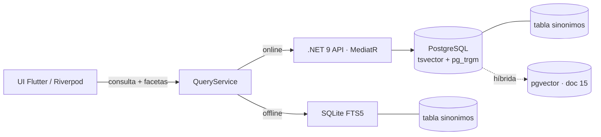

# Buscador Inteligente

El buscador inteligente es el motor de búsqueda full-text y fuzzy de Preventivi App sobre los preciosarios DCF. Debe ofrecer **resultados instantáneos** sobre catálogos de **500.000+ partidas** tanto en modo offline (SQLite FTS5) como en servidor (PostgreSQL `tsvector` + `pg_trgm`), respetando el modelo de dominio canónico (`Capitulo`, `Partida`, `Descompuesto`, `Recurso`, `Unidad`, `Precio`).

Este documento cubre la búsqueda **léxica** (texto exacto, parcial, aproximada). La búsqueda **semántica por IA** (embeddings + `pgvector`) y la estrategia **híbrida** se detallan en el doc [`15-busqueda-semantica-ia.md`](./15-busqueda-semantica-ia.md).

## Requisitos

| # | Requisito | Detalle |
|---|-----------|---------|
| R1 | Búsqueda por **código** | Código exacto y por prefijo (`E04.1`, `E04*`). Máxima prioridad de ranking. |
| R2 | Búsqueda por **texto libre** | Sobre `resumen` y `texto_largo` de la partida. |
| R3 | **Sinónimos** | `hormigón`≈`concreto`, `enfoscado`≈`revoco`, etc. (tabla `sinonimos`). |
| R4 | Búsqueda por **familia** | Agrupaciones funcionales (p. ej. "carpintería de madera"). |
| R5 | Búsqueda por **material** | Filtra/realza por `Recurso` tipo `material` del descompuesto. |
| R6 | Filtro por **precio** | Rango `precio` de la partida. |
| R7 | Filtro por **capítulo** | Por `Capitulo` y subcapítulos (jerarquía). |
| R8 | **Palabras parciales / prefijo** | Autocompletado mientras se escribe. |
| R9 | **Texto aproximado** | Tolerancia a errores tipográficos (typos) y variantes. |
| R10 | **Filtros combinables** | Texto + facetas simultáneos. |
| R11 | **Rendimiento instantáneo** | < 50 ms local, < 150 ms servidor sobre 500k+ partidas. |
| R12 | Resultados con **snippet** resaltado | Fragmento con coincidencias marcadas. |

## Arquitectura de indexación

Preventivi App es offline-first, por lo que el buscador tiene **dos implementaciones** equivalentes en comportamiento:



- **Local (SQLite FTS5)**: índice virtual `partida_fts` sincronizado con la tabla `partida` mediante *triggers*. Cubre la mayoría de consultas sin red.
- **Servidor (PostgreSQL)**: columna generada `tsv tsvector` con índice **GIN** para full-text + índices **GIN/GiST con `pg_trgm`** para similitud y tolerancia a typos. Habilita además la búsqueda híbrida con `pgvector`.

### Normalización de texto

Se aplica el **mismo pipeline** en ambos motores para garantizar resultados coherentes:

1. **Lowercase** (`unaccent` previo a minúsculas según motor).
2. **Sin acentos**: `unaccent` en PostgreSQL; tokenizer `unicode61 remove_diacritics 2` en FTS5.
3. **Stemming en español**: configuración `spanish` (`to_tsvector('spanish', ...)`) en PostgreSQL. SQLite FTS5 no tiene stemmer español nativo: se usa **tokenización + expansión por sinónimos** y prefijos (`*`) como sustituto práctico, más una columna normalizada `texto_norm` precalculada en la ingesta.
4. **Stopwords**: las del español (`de`, `la`, `el`, `con`...) las gestiona la config `spanish` en PG; en FTS5 se omiten en la fase de construcción de la consulta.

## Diccionario de sinónimos y familias

Tabla canónica que alimenta la **expansión de consulta** en ambos motores:

```sql
CREATE TABLE sinonimos (
    id          BLOB PRIMARY KEY,        -- UUID v7
    termino     TEXT NOT NULL,           -- forma normalizada (sin acentos, lowercase)
    canonico    TEXT NOT NULL,           -- término representante del grupo
    tipo        TEXT NOT NULL,           -- 'sinonimo' | 'familia' | 'material'
    peso        REAL NOT NULL DEFAULT 1  -- factor de relevancia al expandir
);
CREATE INDEX ix_sinonimos_termino ON sinonimos(termino);
```

Ejemplos de filas:

| termino | canonico | tipo | peso |
|---------|----------|------|------|
| concreto | hormigon | sinonimo | 0.9 |
| revoco | enfoscado | sinonimo | 0.9 |
| carpinteria madera | familia_carp_madera | familia | 1.0 |
| acero corrugado | acero | material | 1.0 |

**Expansión de consulta**: antes de ejecutar, `QueryService` normaliza el término del usuario, busca coincidencias en `sinonimos` y construye una consulta `OR` ponderada. Ejemplo: el usuario teclea `concreto` → la consulta efectiva pasa a `concreto OR hormigon` (con `hormigon` boosteado por su `peso`). Las **familias** se traducen a un filtro/realce sobre el grupo correspondiente.

## Ranking y relevancia

| Señal | Local (FTS5) | Servidor (PG) | Boost |
|-------|--------------|---------------|-------|
| Relevancia textual | `bm25()` | `ts_rank_cd()` | base |
| **Código exacto** | match en columna `codigo` | match en `codigo` | × alto (prioritario) |
| Código por prefijo | `codigo:term*` | `codigo LIKE 'term%'` | × medio |
| Coincidencia en `resumen` | peso de columna BM25 | peso `A` en `setweight` | mayor que `texto_largo` |
| Capítulo afín / favorito | post-orden | post-orden | × configurable |
| **Recencia** del preciosario | `fecha_publicacion` | `fecha_publicacion` | desempate |
| Similitud (typos) | n/a | `similarity()` `pg_trgm` | fallback |

En FTS5, BM25 permite pesos por columna: `bm25(partida_fts, 10.0, 3.0)` realza `resumen` (10) sobre `texto_largo` (3). En PostgreSQL se usa `setweight` (`A` resumen, `B` texto_largo) y `ts_rank_cd`. Un código exacto **siempre encabeza** los resultados, independientemente del score textual.

## Filtros facetados

Las facetas se combinan con la búsqueda de texto en la misma consulta (filtro `WHERE` + ordenación por ranking):

| Faceta | Campo | Tipo de control |
|--------|-------|-----------------|
| Capítulo | `capitulo_id` (incl. descendientes) | árbol jerárquico |
| Tipo de recurso | `Recurso.tipo` (mano_obra/material/maquinaria/otros) | multi-selección |
| Rango de precio | `partida.precio` | slider min–max |
| Unidad | `unidad_id` (m, m2, m3, ud, kg, h...) | chips |
| Preciosario / versión | `preciosario_id` | desplegable |

Los **conteos de faceta** (nº de resultados por valor) se calculan con agregaciones sobre el conjunto filtrado por texto, para mostrar facetas dinámicas tipo e-commerce. Para el filtro por capítulo se expande la jerarquía vía `padre_id` (CTE recursivo en PG; tabla de cierre o IN de ids precomputados en SQLite).

## Búsqueda parcial / prefijo y tolerancia a errores

- **Prefijo (autocompletado)**: FTS5 soporta `term*` nativamente (requiere `prefix='2 3 4'` en la definición del índice para acelerar prefijos cortos). En PG se usa `to_tsquery('spanish', 'term:*')`.
- **Tolerancia a typos (trigramas)**: exclusivo de PostgreSQL vía `pg_trgm`. Cuando la búsqueda exacta/prefijo devuelve pocos resultados, `QueryService` cae a `similarity(texto_norm, :q) > 0.3` ordenado por `similarity` desc. En SQLite, la tolerancia se aproxima con expansión de sinónimos y prefijos; los typos "duros" se resuelven al sincronizar online.

## Rendimiento

- **Debounce** en la UI Flutter: 200–300 ms desde la última pulsación antes de disparar la consulta.
- **Paginación keyset** (seek) en lugar de `OFFSET`, para que la página N sea tan rápida como la primera sobre 500k+ filas: se ordena por `(rank, partida_id)` y se pagina con `WHERE (rank, id) < (:last_rank, :last_id)`.
- **Caché de consultas frecuentes**: cache LRU en memoria (clave = término normalizado + facetas + página) con TTL corto; en servidor, caché distribuida opcional.
- **Búsqueda en background**: la indexación/sincronización del FTS y los conteos de faceta pesados se ejecutan en *isolate* (Flutter) / *background worker* (.NET), sin bloquear la UI. Virtual scrolling para renderizar solo lo visible.

## Relación con la búsqueda semántica (IA)

El buscador léxico de este documento es la **primera capa**. Para consultas en lenguaje natural ("muro que aísle del ruido") la coincidencia léxica falla, y entra la **búsqueda semántica** por embeddings con `pgvector`, descrita en el doc [`15-busqueda-semantica-ia.md`](./15-busqueda-semantica-ia.md).

La estrategia recomendada es **búsqueda híbrida**: ejecutar en paralelo la rama léxica (`ts_rank`/BM25) y la vectorial (distancia coseno en `pgvector`), y **fusionar** ambos rankings (p. ej. *Reciprocal Rank Fusion*). La rama léxica aporta precisión en códigos y términos técnicos; la vectorial, recall semántico. Offline solo está disponible la rama léxica.

## Snippets SQL

### SQLite FTS5 — creación del índice y sincronización

```sql
-- Índice FTS5 sobre partidas (offline)
CREATE VIRTUAL TABLE partida_fts USING fts5(
    codigo,
    resumen,
    texto_largo,
    content='partida',          -- external content: ahorra espacio
    content_rowid='rowid',
    tokenize = "unicode61 remove_diacritics 2",
    prefix = '2 3 4'            -- acelera autocompletado
);

-- Triggers para mantener el índice en sync con la tabla base
CREATE TRIGGER partida_ai AFTER INSERT ON partida BEGIN
  INSERT INTO partida_fts(rowid, codigo, resumen, texto_largo)
  VALUES (new.rowid, new.codigo, new.resumen, new.texto_largo);
END;
CREATE TRIGGER partida_ad AFTER DELETE ON partida BEGIN
  INSERT INTO partida_fts(partida_fts, rowid, codigo, resumen, texto_largo)
  VALUES ('delete', old.rowid, old.codigo, old.resumen, old.texto_largo);
END;
CREATE TRIGGER partida_au AFTER UPDATE ON partida BEGIN
  INSERT INTO partida_fts(partida_fts, rowid, codigo, resumen, texto_largo)
  VALUES ('delete', old.rowid, old.codigo, old.resumen, old.texto_largo);
  INSERT INTO partida_fts(rowid, codigo, resumen, texto_largo)
  VALUES (new.rowid, new.codigo, new.resumen, new.texto_largo);
END;
```

### SQLite FTS5 — consulta con ranking, snippet y facetas

```sql
SELECT
    p.id,
    p.codigo,
    p.precio,
    -- snippet con coincidencias resaltadas (columna 1 = resumen)
    snippet(partida_fts, 1, '<mark>', '</mark>', '…', 12) AS resaltado,
    -- código exacto primero; luego relevancia BM25 (resumen×10, texto×3)
    (CASE WHEN p.codigo = :q_raw THEN 0 ELSE 1 END) AS prio_codigo,
    bm25(partida_fts, 8.0, 10.0, 3.0) AS rank
FROM partida_fts
JOIN partida p ON p.rowid = partida_fts.rowid
WHERE partida_fts MATCH :q          -- p.ej. 'concreto* OR hormigon*'
  AND p.capitulo_id IN (SELECT id FROM capitulos_descendientes(:cap))
  AND p.precio BETWEEN :pmin AND :pmax
  AND p.unidad_id = :unidad
ORDER BY prio_codigo ASC, rank ASC   -- BM25 más negativo = más relevante
LIMIT 30;
```

### PostgreSQL — extensiones, columna `tsvector` e índices

```sql
CREATE EXTENSION IF NOT EXISTS unaccent;
CREATE EXTENSION IF NOT EXISTS pg_trgm;

-- Columna tsvector generada con pesos por campo
ALTER TABLE partida ADD COLUMN tsv tsvector
  GENERATED ALWAYS AS (
      setweight(to_tsvector('spanish', unaccent(coalesce(resumen, ''))),     'A') ||
      setweight(to_tsvector('spanish', unaccent(coalesce(texto_largo, ''))), 'B') ||
      setweight(to_tsvector('spanish', unaccent(coalesce(codigo, ''))),      'A')
  ) STORED;

CREATE INDEX ix_partida_tsv      ON partida USING GIN (tsv);
CREATE INDEX ix_partida_trgm_res ON partida USING GIN (unaccent(resumen) gin_trgm_ops);
CREATE INDEX ix_partida_codigo   ON partida (codigo);
```

### PostgreSQL — consulta full-text con ranking, boosting y fallback fuzzy

```sql
WITH q AS (
    SELECT
        websearch_to_tsquery('spanish', unaccent(:texto)) AS tsq,
        unaccent(lower(:texto))                           AS raw
)
SELECT
    p.id,
    p.codigo,
    p.precio,
    ts_headline('spanish', p.resumen, q.tsq,
                'StartSel=<mark>, StopSel=</mark>') AS resaltado,
    ts_rank_cd(p.tsv, q.tsq) AS rank_lexico,
    similarity(unaccent(p.resumen), q.raw) AS sim
FROM partida p, q
WHERE (
        p.tsv @@ q.tsq                                  -- full-text
        OR p.codigo = q.raw                             -- código exacto
        OR unaccent(p.resumen) % q.raw                  -- pg_trgm (typos)
      )
  AND p.capitulo_id = ANY (:capitulos)                  -- facetas
  AND p.precio BETWEEN :pmin AND :pmax
ORDER BY
    (p.codigo = q.raw) DESC,                            -- boost código exacto
    ts_rank_cd(p.tsv, q.tsq) DESC,                      -- relevancia léxica
    sim DESC                                            -- desempate fuzzy
LIMIT 30;
```

> Paginación keyset: sustituir `LIMIT/OFFSET` por un cursor sobre `(rank_lexico, p.id)` arrastrando el último par de la página anterior.
