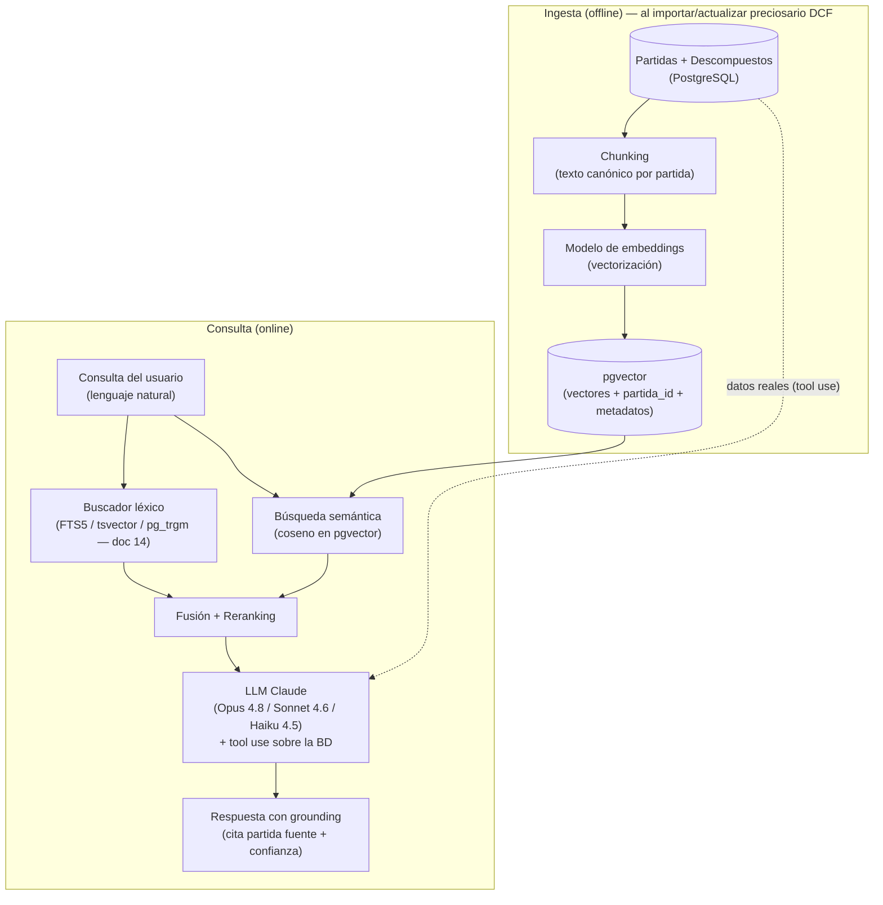
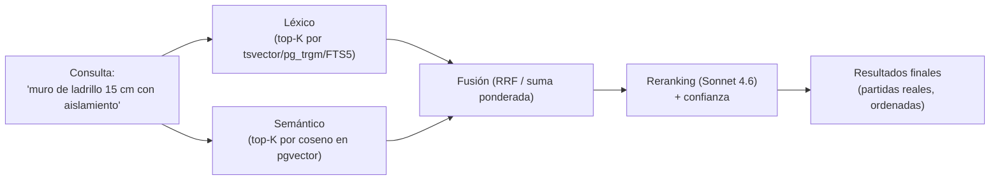

# Inteligencia Artificial

Documento de la capa de **Inteligencia Artificial** de **Preventivi App**: app moderna de presupuestos y mediciones de obra (estilo Primus/ACCA), offline-first con sync a la nube e importación de preciosarios DCF.

La IA en Preventivi App tiene un objetivo claro: **acelerar el trabajo del presupuestista sin sustituir su criterio**. Se construye sobre datos reales (los preciosarios, descompuestos y mediciones del propio sistema) mediante un pipeline **RAG** (Retrieval-Augmented Generation) con embeddings almacenados en **pgvector** y razonamiento con modelos **Claude**. La regla de oro es **grounding**: el LLM nunca inventa precios ni partidas; siempre cita la partida fuente y la confianza, y el usuario revisa antes de aplicar.

> **Resumen de decisiones**
> - **Almacén vectorial**: PostgreSQL + **pgvector** (servidor). Local sin IA o con caché de resultados.
> - **Modelos LLM**: **Claude Opus 4.8** (`claude-opus-4-8`) razonamiento complejo, **Claude Sonnet 4.6** (`claude-sonnet-4-6`) uso general, **Claude Haiku 4.5** (`claude-haiku-4-5-20251001`) tareas rápidas/baratas.
> - **Búsqueda híbrida**: léxica (doc 14, tsvector/pg_trgm/FTS5) + semántica (similitud de coseno en pgvector) + reranking.
> - **Privacidad**: IA desactivable; nada sensible sale a la nube sin consentimiento explícito.

---

## Casos de uso

La IA se expone como un conjunto de funciones acotadas, cada una con su contrato de entrada/salida, su modelo recomendado y su nivel de revisión humana. No es un "chatbot genérico": son asistentes especializados sobre el dominio de obra.

| # | Caso de uso | Entrada | Salida | Modelo recomendado | Revisión humana |
|---|-------------|---------|--------|--------------------|-----------------|
| 1 | **Búsqueda de partidas en lenguaje natural** | Texto libre del usuario | Lista priorizada de partidas candidatas con confianza | Sonnet 4.6 (reranking) | Selección |
| 2 | **Generación de mediciones** | Descripción + dimensiones / plano | Líneas de medición (uds, largo, ancho, alto, fórmula) | Opus 4.8 | Obligatoria |
| 3 | **Sugerencia de partidas** | Contexto del capítulo / partidas ya añadidas | Partidas complementarias probables | Sonnet 4.6 | Aceptar/descartar |
| 4 | **Detección de duplicados** | Presupuesto / preciosario | Pares/grupos de partidas similares | Haiku 4.5 + reglas | Confirmación |
| 5 | **Optimización de presupuestos** | Presupuesto completo | Propuestas de ahorro / consolidación | Opus 4.8 | Obligatoria |
| 6 | **Análisis de diferencias entre versiones** | Dos versiones de un presupuesto | Resumen de cambios y su impacto | Sonnet 4.6 | Informativa |
| 7 | **Estimación de costes** | Partida sin precio / histórico | Rango de precio estimado con confianza | Opus 4.8 + históricos | Obligatoria |
| 8 | **Explicación de partidas en lenguaje claro** | Partida + descompuesto | Texto explicativo para cliente | Haiku 4.5 | Opcional |

### 1. Búsqueda de partidas en lenguaje natural

El usuario escribe lo que quiere en su lenguaje, no en el del preciosario.

```
Usuario: "Muro de ladrillo de 15 cm con aislamiento"
        ↓ (búsqueda híbrida + reranking)
Resultados:
  1. FAB010  Fábrica de ladrillo perforado 1/2 pie + aislamiento térmico    (conf. 0.94)  m2
  2. FFR020  Muro de fábrica de LP 15 cm con cámara y aislante              (conf. 0.88)  m2
  3. FFX030  Cerramiento de ladrillo cara vista 15 cm                       (conf. 0.61)  m2
```

El sistema combina la coincidencia **léxica** ("ladrillo", "15", "aislamiento") con la coincidencia **semántica** (un "muro de ladrillo" es semánticamente cercano a "fábrica de ladrillo" / "cerramiento de fábrica" aunque el texto no coincida), y reordena por relevancia. Cada resultado **enlaza a la partida real** (`Partida.id`); nunca se devuelve una partida inexistente.

### 2. Generación de mediciones

A partir de una descripción ("tabique de 12 m de largo por 2,7 de alto, 3 unidades") o de datos extraídos de un plano, el LLM propone **líneas de medición** estructuradas (entidad `LineaMedicion`: `uds`, `largo`, `ancho`, `alto`, `formula`, `parcial`). El usuario revisa siempre antes de aceptar: las cantidades afectan directamente al importe.

### 3. Sugerencia de partidas

Conociendo las partidas ya presentes en un capítulo, el sistema sugiere las que suelen acompañarlas (p. ej., tras "fábrica de ladrillo" → "enfoscado", "guarnecido", "ayudas de albañilería"). Se basa en co-ocurrencia histórica + similitud semántica.

### 4. Detección de duplicados

Combina **similitud semántica** (embeddings cercanos) con **reglas deterministas** (mismo `unidad_id`, precio dentro de un margen, códigos hermanos). Ver [Detección de duplicados](#detección-de-duplicados-detalle).

### 5. Optimización de presupuestos

Sobre el presupuesto completo, propone consolidar partidas redundantes, detectar descompuestos atípicos y señalar partidas cuyo precio se desvía del preciosario. Tarea de razonamiento profundo → **Opus 4.8**.

### 6. Análisis de diferencias entre versiones

Dado que `Presupuesto` es **versionable** (entidad `Version` con `snapshot`), la IA compara dos versiones y produce un resumen legible: "Se añadió el capítulo 03 (+12.400 €), se redujo la medición de FAB010 un 8%, el precio de FFR020 pasó de 24,10 a 25,30 €".

### 7. Estimación de costes

Para una partida sin precio o de mercado incierto, combina el **modelo** con el **histórico** (precios de la organización, partidas equivalentes en otros preciosarios) y devuelve un **rango con confianza**, no un número único.

### 8. Explicación de partidas en lenguaje claro

Traduce la jerga del descompuesto a una explicación apta para el cliente: "Esta partida incluye el material (ladrillo y mortero), la mano de obra del oficial y peón, y un 6% de costes indirectos." Tarea barata y de alto volumen → **Haiku 4.5**.

---

## Arquitectura de IA (pipeline RAG)

El flujo se divide en dos fases: **ingesta** (offline, al importar o actualizar un preciosario) y **consulta** (online, cuando el usuario pregunta).

### Ingesta

1. **Ingesta de partidas**: al importar un preciosario DCF, cada `Partida` (con su `resumen`, `texto_largo`, `unidad`, `capitulo` y `descompuesto`) entra en el pipeline.
2. **Chunking**: se construye un texto canónico por partida (código + resumen + texto largo + unidad + capítulo padre) y, para descompuestos extensos, se segmenta. La unidad de recuperación es **la partida**, no el documento entero.
3. **Embeddings**: cada chunk se vectoriza con el **modelo de embeddings** (ver [Modelos](#modelos)).
4. **Almacenamiento vectorial**: el vector se guarda en una columna `vector` de **pgvector**, junto a la `partida_id` y metadatos para filtrar (`preciosario_id`, `capitulo_id`, `unidad_id`).

### Consulta

5. **Recuperación híbrida**: la consulta del usuario se resuelve por dos vías en paralelo — **léxica** (doc 14: FTS5/tsvector/pg_trgm) y **semántica** (similitud de coseno en pgvector). Los dos rankings se fusionan y se reordenan (reranking).
6. **LLM (Claude)**: las partidas candidatas recuperadas se entregan al modelo **como contexto** (grounding). Mediante **tool use**, el modelo consulta la BD para confirmar datos en lugar de inventarlos, razona y responde citando las partidas fuente.



### Encaje en la Clean Architecture

La IA vive principalmente en **Infrastructure** (clientes de Claude y de embeddings, repositorios vectoriales sobre EF Core/pgvector) y se orquesta desde **Application** mediante casos de uso (handlers MediatR), respetando la regla de dependencia hacia adentro. El **Domain** no conoce a Claude ni a pgvector: define interfaces (`IBuscadorSemantico`, `IGeneradorEmbeddings`, `IAsistenteIA`) que Infrastructure implementa. Cada operación de IA devuelve un **Result** (Result Pattern) con éxito, confianza y posibles errores, y se registra con Serilog.

---

## Modelos

### Modelos de razonamiento (LLM Claude)

Se selecciona el modelo según la **complejidad** y el **coste/latencia** de cada tarea. Por defecto, **Opus 4.8** para razonamiento de alto valor; se baja a Sonnet/Haiku donde el ahorro lo justifica.

| Modelo | ID exacto | Uso | Tareas |
|--------|-----------|-----|--------|
| **Claude Opus 4.8** | `claude-opus-4-8` | Razonamiento complejo | Generación de mediciones, optimización, estimación de costes |
| **Claude Sonnet 4.6** | `claude-sonnet-4-6` | Uso general (equilibrio) | Reranking de búsqueda, sugerencias, análisis de diferencias |
| **Claude Haiku 4.5** | `claude-haiku-4-5-20251001` | Rápido y barato | Detección de duplicados (apoyo), explicaciones, clasificación, alto volumen |

> Usar **siempre el ID exacto** de la tabla. No añadir sufijos de fecha a `claude-opus-4-8` ni a `claude-sonnet-4-6`.

### Modelo de embeddings

Para la **vectorización** (ingesta y consulta) se usa un **modelo de embeddings** dedicado, distinto de los modelos de chat. Requisitos:

- **Multilingüe** con buen rendimiento en **español** técnico de construcción.
- **Dimensión fija** del vector (la columna `vector(N)` de pgvector se define con esa dimensión; cambiarla obliga a re-vectorizar todo el corpus).
- **Coherencia ingesta/consulta**: el vector de la consulta y los de las partidas deben generarse con el **mismo** modelo y la **misma** dimensión, o la similitud de coseno carece de sentido.

El `modelo` y la `version` de embeddings se almacenan junto al vector para permitir **re-indexación controlada** cuando se actualice el modelo, sin invalidar silenciosamente el índice.

---

## Búsqueda híbrida

La búsqueda combina lo mejor de los dos mundos:

- El **buscador léxico** (documento 14) — basado en `FTS5` (SQLite local) y `tsvector` + `pg_trgm` (PostgreSQL) — es preciso con códigos, números y términos exactos ("FAB010", "15 cm").
- La **búsqueda semántica** (pgvector, distancia de coseno) entiende **sinónimos y paráfrasis** ("muro" ≈ "fábrica" ≈ "cerramiento") que el léxico no captura.

### Fusión y reranking

Cada vía produce un ranking. Se **fusionan** (estrategia tipo *Reciprocal Rank Fusion* o suma ponderada de puntuaciones normalizadas) y, sobre el conjunto top-K resultante, se aplica un **reranking** con un modelo Claude (Sonnet 4.6) que reordena por relevancia real frente a la consulta, devolviendo además una **confianza** por candidato.



**Cálculo de la distancia en pgvector** (operador de coseno `<=>`, menor distancia = mayor similitud), filtrando por preciosario:

```sql
SELECT p.id, p.codigo, p.resumen,
       1 - (e.vector <=> @consulta_vector) AS similitud
FROM partida_embedding e
JOIN partida p ON p.id = e.partida_id
WHERE e.preciosario_id = @preciosario_id
ORDER BY e.vector <=> @consulta_vector   -- coseno ascendente
LIMIT 50;
```

> El índice vectorial (HNSW o IVFFlat en pgvector) hace que esta consulta escale a preciosarios de **500.000+ partidas** sin recorrer la tabla completa.

---

## Privacidad y modo offline

La IA es un **acelerador opcional**, no un requisito de funcionamiento. Todo lo esencial de la app (crear presupuestos, mediciones, descompuestos, importar DCF, exportar) funciona **sin IA y sin conexión**.

### Qué corre local vs en la nube

| Componente | Local (SQLite, offline) | Nube (PostgreSQL + servicios) |
|------------|-------------------------|-------------------------------|
| Búsqueda léxica (FTS5) | ✅ Siempre disponible | ✅ |
| Búsqueda semántica (pgvector) | ❌ (no hay índice vectorial local) | ✅ |
| Generación de embeddings | ❌ (requiere servicio) | ✅ |
| Razonamiento LLM (Claude) | ❌ (requiere API en la nube) | ✅ |
| Caché de resultados de IA | ✅ (resultados previos consultables offline) | ✅ |

Sin conexión, la app **degrada con elegancia**: la búsqueda cae al buscador léxico local y las funciones de IA quedan deshabilitadas con un aviso claro, no con un error.

### Controles de privacidad

- **IA desactivable**: interruptor global por organización y por usuario. Con la IA desactivada, la app no realiza ninguna llamada a servicios de IA.
- **Consentimiento explícito**: **no se envían datos sensibles a la nube sin consentimiento**. Antes de la primera llamada, el usuario aprueba qué datos pueden salir (resúmenes de partidas, descripciones de medición) y cuáles **nunca** (datos de cliente: `nif`, `email`, `telefono`, `direccion`).
- **Minimización**: solo se envía el contexto estrictamente necesario para la tarea. Los identificadores de cliente y datos personales se **omiten o anonimizan** antes de construir el prompt.
- **Sin retención indebida**: las llamadas a IA no deben usar los datos para entrenamiento; se documenta la configuración de retención del proveedor.
- **Auditoría**: toda invocación de IA se registra en `Historial / Auditoria` (quién, qué función, sobre qué entidad), sin volcar datos personales en el log.

---

## Diseño de prompts y herramientas (tool use)

El principio rector es **grounding sobre datos reales**: el LLM **no es la fuente de verdad**; la BD lo es. Para evitar alucinaciones (precios inventados, códigos inexistentes), el modelo no responde "de memoria": **consulta la base de datos mediante herramientas** (function calling / tool use) y razona sobre los datos devueltos.

### Herramientas expuestas al modelo

| Herramienta | Propósito | Devuelve |
|-------------|-----------|----------|
| `buscar_partidas` | Búsqueda híbrida por texto | Lista de partidas reales (id, código, resumen, precio, unidad) |
| `obtener_descompuesto` | Análisis de precios de una partida | Recursos, rendimientos, importes |
| `obtener_historico_precios` | Precios históricos de la organización | Series de precios + fechas |
| `obtener_partida` | Detalle de una partida por id/código | Partida completa con metadatos |

### Patrón de grounding

1. El sistema recupera candidatos (búsqueda híbrida) y los pasa al prompt **como contexto citado** (cada uno con su `partida_id`).
2. Se instruye al modelo: *"Responde únicamente con partidas presentes en el contexto o que obtengas mediante las herramientas. Si no encuentras una partida adecuada, dilo explícitamente. Nunca inventes códigos ni precios. Cita siempre el `id` de la partida fuente."*
3. Cuando el modelo necesita un dato que no está en el contexto, **llama a una herramienta** en vez de suponerlo. El backend ejecuta la consulta contra la BD y devuelve el resultado real.
4. La respuesta final incluye, por cada afirmación, la **partida fuente** y una **confianza**.

> **System prompt mid-sesión** (Opus 4.8): para inyectar contexto que la app descubre durante la sesión (p. ej., "el preciosario activo es 2026-Q2") se usa un mensaje `system` dentro de `messages`, preservando la caché del prefijo. Frasear como **contexto, no como orden** ("El preciosario activo es X"), no como instrucción de anulación.

### Snippet conceptual — llamada al SDK de Anthropic con tool use

Cliente .NET (paquete `Anthropic`), pensado para Infrastructure. El **bucle de herramientas**: el modelo pide una herramienta → el backend la ejecuta contra la BD → se devuelve el resultado → el modelo responde con grounding.

```csharp
using Anthropic;
using Anthropic.Models.Messages;
using System.Text.Json;

// Cliente (clave desde configuración segura, nunca hardcodeada)
AnthropicClient client = new();

var tools = new ToolUnion[]
{
    new Tool
    {
        Name = "buscar_partidas",
        Description = "Busca partidas reales del preciosario por texto en lenguaje natural. " +
                      "Devuelve id, codigo, resumen, precio y unidad. Úsala antes de proponer cualquier partida.",
        InputSchema = new()
        {
            Properties = new Dictionary<string, JsonElement>
            {
                ["texto"] = JsonSerializer.SerializeToElement(
                    new { type = "string", description = "Descripción en lenguaje natural" }),
                ["preciosario_id"] = JsonSerializer.SerializeToElement(
                    new { type = "string", description = "Preciosario activo" }),
            },
            Required = ["texto", "preciosario_id"],
        },
    },
};

var systemPrompt =
    "Eres un asistente de presupuestos de obra. Responde SOLO con partidas obtenidas " +
    "mediante las herramientas; nunca inventes códigos ni precios. Cita el id de cada " +
    "partida fuente y una confianza (0-1). Si no hay partida adecuada, dilo.";

var messages = new List<MessageParam>
{
    new() { Role = Role.User,
            Content = "Muro de ladrillo de 15 cm con aislamiento" },
};

// Bucle de tool use
while (true)
{
    var response = await client.Messages.Create(new MessageCreateParams
    {
        Model = Model.ClaudeSonnet4_6,        // reranking/búsqueda → uso general
        MaxTokens = 4096,
        System = systemPrompt,
        Tools = tools,
        Messages = messages,
    });

    messages.Add(new() { Role = Role.Assistant, Content = ReconstruirContenido(response) });

    if (response.StopReason != "tool_use") break;   // el modelo terminó

    var toolResults = new List<ContentBlockParam>();
    foreach (var block in response.Content.Select(b => b.Value).OfType<ToolUseBlock>())
    {
        // Ejecuta la herramienta contra la BD real (grounding) → JSON con partidas reales
        string resultadoJson = await EjecutarHerramientaAsync(block.Name, block.Input);
        toolResults.Add(new ToolResultBlockParam { ToolUseID = block.ID, Content = resultadoJson });
    }
    messages.Add(new() { Role = Role.User, Content = toolResults });
}
```

> Nota: `claude-sonnet-4-6` y `claude-opus-4-8` usan **adaptive thinking** (`thinking: {type: "adaptive"}`) y **no** aceptan `budget_tokens` ni `temperature`/`top_p`. Para tareas de razonamiento profundo (mediciones, optimización) se sube a `Model.ClaudeOpus4_8` con `OutputConfig.Effort = High`.

### Snippet conceptual — generación y almacenamiento de embeddings en pgvector

Lado ingesta. Se vectoriza el texto canónico de la partida y se inserta en la columna `vector` de pgvector, junto a la `partida_id`, el modelo/versión de embeddings y los metadatos de filtrado.

```sql
-- Esquema (PostgreSQL + pgvector)
CREATE EXTENSION IF NOT EXISTS vector;

CREATE TABLE partida_embedding (
    id              uuid PRIMARY KEY,            -- UUID v7
    partida_id      uuid NOT NULL REFERENCES partida(id),
    preciosario_id  uuid NOT NULL,
    capitulo_id     uuid,
    unidad_id       uuid,
    modelo          text NOT NULL,               -- modelo de embeddings usado
    version         text NOT NULL,               -- para re-indexación controlada
    vector          vector(1024) NOT NULL,       -- dimensión fija del modelo
    creado_en       timestamptz NOT NULL DEFAULT now()
);

-- Índice ANN para escalar a 500.000+ partidas (coseno)
CREATE INDEX ON partida_embedding USING hnsw (vector vector_cosine_ops);
```

```csharp
// Generación + almacenamiento (Infrastructure)
public async Task IndexarPartidaAsync(Partida partida, CancellationToken ct)
{
    // 1. Texto canónico de la partida (chunking)
    string texto = $"{partida.Codigo} {partida.Resumen} {partida.TextoLargo} " +
                   $"{partida.Unidad.Nombre} {partida.Capitulo.Titulo}";

    // 2. Vectorización con el modelo de embeddings (mismo modelo en ingesta y consulta)
    float[] vector = await _embeddings.GenerarAsync(texto, ct);   // p. ej. dim=1024

    // 3. Almacenamiento en pgvector (UPSERT por partida_id)
    await _db.ExecuteAsync(
        @"INSERT INTO partida_embedding
            (id, partida_id, preciosario_id, capitulo_id, unidad_id, modelo, version, vector)
          VALUES (@id, @pid, @prec, @cap, @uni, @modelo, @version, @vector)
          ON CONFLICT (partida_id) DO UPDATE
            SET vector = EXCLUDED.vector, modelo = EXCLUDED.modelo,
                version = EXCLUDED.version, creado_en = now();",
        new
        {
            id = Uuid7.NewUuid(), pid = partida.Id, prec = partida.PreciosarioId,
            cap = partida.CapituloId, uni = partida.UnidadId,
            modelo = _embeddings.Modelo, version = _embeddings.Version,
            vector = new Pgvector.Vector(vector),
        });
}
```

> La indexación se ejecuta en **background** al importar/actualizar un preciosario (procesamiento por lotes), para no bloquear la UI y soportar volúmenes grandes.

---

## Detección de duplicados (detalle)

Detectar partidas duplicadas o casi-duplicadas (al importar varios DCF, al fusionar presupuestos) combina dos señales:

1. **Similitud semántica**: dos partidas son candidatas a duplicado si sus embeddings están por encima de un umbral de similitud de coseno (p. ej. ≥ 0,92).
2. **Reglas deterministas** (descartan falsos positivos del paso 1):
   - Misma `unidad_id` (un duplicado real comparte unidad de medida).
   - Precio dentro de un margen relativo (p. ej. ±5%).
   - Códigos hermanos o pertenecientes al mismo capítulo.
   - Solapamiento alto de recursos en el `descompuesto`.

Solo cuando **ambas** señales coinciden se marca el par como duplicado probable; el resultado es **una sugerencia con confianza**, nunca una fusión automática. El usuario **confirma** antes de unificar.

---

## Estimación de costes (detalle)

Para una partida sin precio fiable, la estimación se apoya en **modelo + históricos**:

1. Se recuperan partidas **semánticamente equivalentes** (búsqueda híbrida) con precio conocido, dentro de la organización y en otros preciosarios.
2. Se consulta el **histórico de precios** (`Precio`, con `vigente_desde`) para detectar tendencia.
3. **Opus 4.8** razona sobre el conjunto y devuelve un **rango** (mínimo–esperado–máximo) con su **confianza**, citando las partidas y precios fuente usados.

El resultado **nunca sobrescribe** un `Precio` `bloqueado`. Es una propuesta que el presupuestista acepta, ajusta o rechaza.

---

## Métricas de calidad y guardarraíles

La IA se mide y se contiene. No se confía en ella a ciegas.

### Métricas de calidad

| Métrica | Qué mide | Aplica a |
|---------|----------|----------|
| **Precisión@K / Recall@K** | Si la partida correcta aparece en el top-K | Búsqueda híbrida |
| **MRR** (Mean Reciprocal Rank) | Posición media de la partida correcta | Reranking |
| **Tasa de aceptación** | % de sugerencias aceptadas por el usuario | Sugerencias, mediciones |
| **Tasa de alucinación** | % de respuestas con partida inexistente (objetivo: 0) | Todo LLM |
| **Latencia p95** | Tiempo de respuesta percentil 95 | Todo |
| **Coste por consulta** | Tokens × tarifa por modelo | Todo LLM |
| **Cobertura de citas** | % de afirmaciones con partida fuente citada | Todo LLM |

### Guardarraíles

- **Citar la partida fuente**: toda partida/precio propuesto enlaza a su `Partida.id` real. Una respuesta sin cita verificable se descarta.
- **Confianza explícita**: cada resultado lleva una puntuación de confianza; por debajo de un umbral, la UI lo marca como "baja confianza, revisar".
- **Revisión humana obligatoria** en operaciones de impacto económico: generación de mediciones, optimización, estimación de costes. La IA **propone**; el usuario **dispone**.
- **Sin escritura automática**: la IA nunca modifica precios, mediciones ni presupuestos directamente. Genera **propuestas** que el usuario aplica.
- **Validación de salida**: las salidas estructuradas (líneas de medición, listas de partidas) se validan con **FluentValidation** antes de mostrarse; los `id` se comprueban contra la BD.
- **Trazabilidad**: cada interacción de IA queda registrada en auditoría (función, modelo, confianza, resultado), permitiendo análisis posterior y mejora del pipeline.

> **Principio final**: la IA de Preventivi App es un **copiloto con cinturón de seguridad**. Acelera, sugiere y explica — sobre datos reales, citando sus fuentes y siempre bajo el criterio del profesional.
