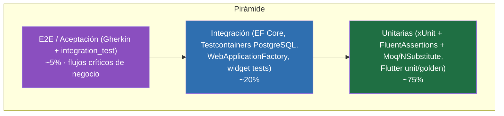
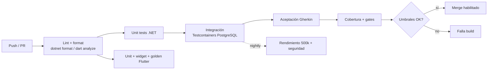

# Plan de Pruebas

Plan de pruebas integral de **Preventivi App** (presupuestos y mediciones de obra, estilo Primus/ACCA). Define la estrategia de calidad sobre el stack fijo del proyecto: backend **.NET 9** (Clean Architecture, MediatR/CQRS, Result Pattern, FluentValidation, EF Core) y frontend **Flutter + Riverpod** (feature-first + MVVM), con offline-first, sync a la nube e importación de preciosarios **DCF**.

El objetivo es construir una red de seguridad que permita refactorizar con confianza, soportar preciosarios de **500.000+ partidas** y garantizar la corrección del **motor de cálculo** (mediciones, descompuestos, costes indirectos, IVA), que es el corazón funcional del producto.

## 1. Estrategia y pirámide de pruebas

La estrategia sigue la **pirámide de pruebas**: muchas pruebas unitarias rápidas y deterministas en la base, una capa intermedia de integración (BD, repositorios, API) y una cima reducida de pruebas E2E/aceptación que validan flujos completos de negocio.

Principios:

- **Lógica de dominio sin dependencias** (cálculo, fórmulas, reglas): cobertura unitaria exhaustiva en `Domain` y `Application`.
- **El borde I/O se prueba en integración**: EF Core, PostgreSQL, endpoints API, sync.
- **E2E mínimo y estable**: solo flujos críticos de usuario, ligados a historias de usuario, en Gherkin.
- **Determinismo**: sin dependencias de reloj/red reales (se inyectan `IClock`, `IGuidGenerator` para UUID v7).
- **Tests como documentación viva**: nombres descriptivos en español, patrón *Arrange-Act-Assert* (AAA) y *Given-When-Then* en aceptación.



| Capa | Qué valida | Velocidad | Volumen | Dónde |
|------|-----------|-----------|---------|-------|
| Unitaria | Reglas de dominio, casos de uso, validadores, mappers, view models | ms | Alto (~75%) | `Tests.Unit`, `frontend/test` |
| Integración | EF Core + BD real, repositorios, endpoints, SignalR, sync | 100 ms–s | Medio (~20%) | `Tests.Integration`, widget tests |
| E2E / Aceptación | Flujos completos ligados a historias de usuario | s–min | Bajo (~5%) | `integration_test`, SpecFlow/Reqnroll |

## 2. Pruebas unitarias backend (.NET / xUnit)

**Proyecto**: `src/backend/PreventiviApp.Tests.Unit`.
**Herramientas**: **xUnit**, **FluentAssertions** (aserciones legibles), **Moq** o **NSubstitute** (dobles de prueba), **AutoFixture** (datos), **Bogus** (datos realistas), `coverlet` (cobertura).

### 2.1 Qué se prueba

- **Lógica de dominio (sin mocks)**: entidades y value objects calculan correctamente.
  - `LineaMedicion.Parcial`: `uds × largo × ancho × alto` o evaluación de `formula`.
  - `Medicion.Total`: suma de parciales de sus líneas.
  - `Descompuesto.Importe`: `rendimiento × cantidad × precio_unitario`.
  - `AnalisisPrecios`: agregación mano de obra + material + maquinaria + % costes indirectos.
  - `Presupuesto.Total`: árbol de capítulos/partidas → medición × precio, costes indirectos, IVA, redondeo.
  - Reglas de invariantes: `Precio.bloqueado` no se sobrescribe; versionado de `Presupuesto`.
- **Casos de uso (MediatR handlers)**: con repositorios y servicios *mockeados*; se verifica el `Result` (éxito/fallo) y los errores de dominio.
- **Validadores FluentValidation**: reglas de entrada de cada comando.
- **Mappers (Mapster/AutoMapper)**: DTO ↔ entidad.
- **Domain events**: se emiten en las transiciones esperadas.

### 2.2 Ejemplo — value object de medición

```csharp
public class LineaMedicionTests
{
    [Theory]
    [InlineData(2, 5.0, 3.0, 0, 30.0)]   // uds × largo × ancho (alto=0 ⇒ ignorado)
    [InlineData(1, 4.0, 0, 0, 4.0)]      // solo largo
    [InlineData(3, 2.0, 2.0, 2.0, 24.0)] // volumen × uds
    public void Parcial_se_calcula_como_producto_de_dimensiones(
        decimal uds, decimal largo, decimal ancho, decimal alto, decimal esperado)
    {
        var linea = LineaMedicion.Crear(uds, largo, ancho, alto);

        linea.Parcial.Should().Be(esperado);
    }

    [Fact]
    public void Parcial_con_formula_evalua_la_expresion()
    {
        var linea = LineaMedicion.ConFormula("PI()*(0.5/2)^2*10"); // sección circular × longitud

        linea.Parcial.Should().BeApproximately(1.9635m, 0.0001m);
    }
}
```

### 2.3 Ejemplo — caso de uso con Result Pattern (Moq)

```csharp
public class CrearPresupuestoHandlerTests
{
    private readonly Mock<IPresupuestoRepository> _repo = new();
    private readonly Mock<IUnitOfWork> _uow = new();

    [Fact]
    public async Task Devuelve_fallo_cuando_el_proyecto_no_existe()
    {
        _repo.Setup(r => r.ExisteProyecto(It.IsAny<Guid>())).ReturnsAsync(false);
        var handler = new CrearPresupuestoHandler(_repo.Object, _uow.Object);

        var result = await handler.Handle(
            new CrearPresupuestoCommand(ProyectoId: Guid.NewGuid(), Nombre: "P1"),
            CancellationToken.None);

        result.IsFailure.Should().BeTrue();
        result.Error.Code.Should().Be("Proyecto.NoEncontrado");
        _uow.Verify(u => u.SaveChangesAsync(It.IsAny<CancellationToken>()), Times.Never);
    }
}
```

## 3. Pruebas de integración backend

**Proyecto**: `src/backend/PreventiviApp.Tests.Integration`.
**Herramientas**: xUnit, **Testcontainers (PostgreSQL)** para fidelidad con producción (pg_trgm, tsvector, pgvector), **Respawn** para limpiar la BD entre tests, **WebApplicationFactory** para probar la API en proceso, **SQLite in-memory** para tests de repositorio rápidos donde no se requieren funciones específicas de PostgreSQL.

### 3.1 Qué se prueba

- **Migraciones EF Core**: aplican limpio sobre PostgreSQL vacío.
- **Repositorios + Unit of Work**: persistencia, queries jerárquicas (`Capitulo.padre_id`), filtros, paginación, FTS.
- **Endpoints API end-to-end (in-process)**: routing, validación, mapeo, códigos HTTP, problem details, autenticación/RBAC.
- **Búsqueda**: pg_trgm / tsvector sobre catálogo de partidas.
- **SignalR / cola de sincronización**: persistencia de `ColaSincronizacion` y notificaciones.

### 3.2 Ejemplo — Testcontainers PostgreSQL (fixture compartida)

```csharp
public class PostgresFixture : IAsyncLifetime
{
    public PostgreSqlContainer Container { get; } = new PostgreSqlBuilder()
        .WithImage("postgres:16")
        .Build();

    public async Task InitializeAsync()
    {
        await Container.StartAsync();
        await using var db = NuevoContexto();
        await db.Database.MigrateAsync();
    }

    public AppDbContext NuevoContexto() =>
        new(new DbContextOptionsBuilder<AppDbContext>()
            .UseNpgsql(Container.GetConnectionString()).Options);

    public Task DisposeAsync() => Container.DisposeAsync().AsTask();
}
```

```csharp
public class PartidaRepositoryTests : IClassFixture<PostgresFixture>
{
    private readonly PostgresFixture _fx;
    public PartidaRepositoryTests(PostgresFixture fx) => _fx = fx;

    [Fact]
    public async Task BuscarPorTexto_usa_indice_trigram_y_devuelve_resultados()
    {
        await using var db = _fx.NuevoContexto();
        await db.Seed(PartidasMuestra.Catalogo); // incluye "Hormigón HA-25"

        var repo = new PartidaRepository(db);
        var res = await repo.BuscarPorTextoAsync("ormigon ha25", take: 20);

        res.Should().Contain(p => p.Codigo == "HOR.001");
    }
}
```

### 3.3 Ejemplo — endpoint con WebApplicationFactory

```csharp
public class PresupuestoEndpointsTests : IClassFixture<ApiFactory>
{
    private readonly HttpClient _client;
    public PresupuestoEndpointsTests(ApiFactory f) => _client = f.CreateClient();

    [Fact]
    public async Task POST_presupuestos_devuelve_201_y_Location()
    {
        var resp = await _client.PostAsJsonAsync("/api/presupuestos",
            new { proyectoId = SeedData.ProyectoId, nombre = "Reforma cocina" });

        resp.StatusCode.Should().Be(HttpStatusCode.Created);
        resp.Headers.Location.Should().NotBeNull();
    }

    [Fact]
    public async Task POST_presupuestos_sin_nombre_devuelve_400_ProblemDetails()
    {
        var resp = await _client.PostAsJsonAsync("/api/presupuestos",
            new { proyectoId = SeedData.ProyectoId, nombre = "" });

        resp.StatusCode.Should().Be(HttpStatusCode.BadRequest);
        var pd = await resp.Content.ReadFromJsonAsync<ProblemDetails>();
        pd!.Extensions.Should().ContainKey("errors");
    }
}
```

`ApiFactory : WebApplicationFactory<Program>` reemplaza el `DbContext` por la BD de Testcontainers/SQLite y sustituye `IClock`/`IGuidGenerator` por implementaciones deterministas.

## 4. Pruebas frontend (Flutter)

**Ubicación**: `src/frontend/test` (unit, widget, golden) y `src/frontend/integration_test` (E2E).
**Herramientas**: `flutter_test`, **`mocktail`** (mocks sin codegen), **`riverpod`** con `ProviderContainer` y overrides, `golden_toolkit` (golden), `integration_test` + `flutter_driver`/`patrol`, `coverage`.

### 4.1 Unit tests
Lógica pura: view models (MVVM), notifiers de Riverpod, parsers, formateadores de moneda/unidades, motor de fórmulas de medición del lado cliente, mapeo DTO ↔ modelo.

```dart
test('PresupuestoNotifier recalcula el total al añadir una partida', () {
  final container = ProviderContainer(overrides: [
    presupuestoRepoProvider.overrideWithValue(FakePresupuestoRepo()),
  ]);
  addTearDown(container.dispose);
  final notifier = container.read(presupuestoNotifierProvider.notifier);

  notifier.añadirPartida(PartidaFake(precio: 10, medicion: 5));

  expect(container.read(presupuestoNotifierProvider).total, 50);
});
```

### 4.2 Widget tests
Renderizado, interacción y estados (loading/error/datos) de pantallas clave: editor de mediciones, árbol de capítulos, ficha de partida, buscador de preciosario. Se inyectan providers fake con `ProviderScope(overrides: ...)`.

### 4.3 Golden tests
Comparación pixel-a-pixel de componentes críticos de UI (tabla de mediciones, resumen de presupuesto, tema claro/oscuro) para detectar regresiones visuales. Se versionan los `*.png` de referencia; se regeneran con `flutter test --update-goldens` solo en cambios intencionados.

### 4.4 Integration tests
Flujos completos en dispositivo/emulador con `integration_test`: arranque, login, importar DCF, crear presupuesto, generar PDF, trabajar offline y sincronizar. Se comparten escenarios con la sección de aceptación.

## 5. Pruebas de aceptación / E2E (Gherkin)

Escenarios en **Gherkin** (Given-When-Then), ligados a historias de usuario, ejecutados con **Reqnroll/SpecFlow** (backend) y `integration_test`/Patrol (frontend). Sirven como criterios de aceptación verificables.

### 5.1 Importar preciosario DCF

```gherkin
# HU: Como presupuestista quiero importar un preciosario DCF
#     para disponer del catálogo de precios en mis presupuestos.
Característica: Importación de preciosario DCF

  Escenario: Importación correcta de un DCF válido
    Dado un archivo DCF válido con 3 capítulos y 120 partidas
    Cuando importo el preciosario
    Entonces se crea un Preciosario con origen_dcf y hash_archivo
    Y se crean 3 capítulos y 120 partidas con sus descompuestos
    Y los precios bloqueados existentes no se sobrescriben

  Escenario: DCF corrupto
    Dado un archivo DCF con estructura inválida
    Cuando importo el preciosario
    Entonces la importación falla con error "DCF.FormatoInvalido"
    Y no se persiste ningún Preciosario
```

### 5.2 Crear presupuesto

```gherkin
# HU: Como presupuestista quiero crear un presupuesto a partir de un proyecto.
Característica: Creación de presupuesto

  Escenario: Presupuesto con capítulos, partidas y mediciones
    Dado un proyecto "Reforma" en estado activo
    Y un preciosario importado
    Cuando creo un presupuesto y añado la partida "HOR.001" con medición 12,5 m3
    Entonces el importe de la partida es 12,5 × precio
    Y el total del presupuesto incluye costes indirectos e IVA
```

### 5.3 Generar PDF

```gherkin
# HU: Como jefe de obra quiero exportar el presupuesto a PDF para enviarlo al cliente.
Característica: Exportación a PDF

  Escenario: PDF del presupuesto
    Dado un presupuesto con 2 capítulos y 8 partidas
    Cuando exporto a PDF con QuestPDF
    Entonces se genera un PDF con portada, capítulos, mediciones y resumen económico
    Y el total impreso coincide con el total calculado
```

### 5.4 Sincronización offline

```gherkin
# HU: Como usuario quiero trabajar sin conexión y que mis cambios se sincronicen al volver.
Característica: Sincronización offline-first

  Escenario: Encolado y envío de cambios offline
    Dado que el dispositivo está sin conexión
    Cuando edito una medición de una partida
    Entonces el cambio se guarda en SQLite y se encola en ColaSincronizacion con estado "pendiente"
    Cuando se recupera la conexión
    Entonces la cola se envía y los cambios quedan en estado "confirmado"
```

## 6. Pruebas específicas

### 6.1 Importador DCF
- **Archivos de muestra** versionados en `tests/fixtures/dcf/`: `valido_basico.dcf`, `valido_grande_500k.dcf`, `con_descompuestos.dcf`, `con_precios_unicode.dcf`.
- **Casos de error**: archivo vacío, cabecera ausente, codificación incorrecta, partida sin unidad, descompuesto que referencia recurso inexistente, capítulo huérfano (padre_id inválido), duplicados de código.
- **Verificaciones**: mapeo correcto a entidades del dominio, idempotencia (reimportar mismo `hash_archivo` no duplica), respeto de `Precio.bloqueado`, cómputo de `hash_archivo`.

### 6.2 Motor de cálculo (casos numéricos con valores esperados)

| Concepto | Entrada | Cálculo | Esperado |
|----------|---------|---------|----------|
| Parcial línea | uds=2, largo=5, ancho=3, alto=0 | 2×5×3 | **30,00** |
| Parcial fórmula | `(3.5+1.5)/2*4` | media × longitud | **10,00** |
| Total medición | parciales 30 + 10 + 5,5 | suma | **45,50** |
| Importe partida | medición 45,5 × precio 12,40 | producto | **564,20** |
| Descompuesto | rendimiento 0,5 × cantidad 100 × precio 8 | producto | **400,00** |
| Costes indirectos | base 1.000,00 × 13% | base × % | **130,00** |
| IVA | base 1.130,00 × 21% | base × % | **237,30** |
| Total presupuesto | 1.000 + CI 130 + IVA 237,30 | suma | **1.367,30** |
| Redondeo | 0,005 a 2 decimales (banker's) | half-to-even | **0,00 / 0,01 según regla** |

Se prueban explícitamente: redondeo (regla y número de decimales por moneda), precisión `decimal` (nunca `double` en importes), valores cero/negativos rechazados, fórmulas inválidas → error controlado.

### 6.3 Sincronización (conflictos)
- **Resolución de conflictos**: misma entidad editada en dos dispositivos → estado `conflicto`; estrategia *last-write-wins* por `actualizado_en` o *merge* según entidad.
- **Orden e idempotencia**: reenvío de operaciones encoladas no duplica ni corrompe; `insert/update/delete` se aplican en orden.
- **Borrado vs edición**: delete remoto + update local → política definida y testeada.
- **UUID v7**: sin colisiones; orden temporal preservado.

### 6.4 Rendimiento (500.000+ partidas)
- **Carga e indexación** de un preciosario de 500k partidas dentro de presupuesto de tiempo/memoria definido.
- **Búsqueda FTS** (pg_trgm/tsvector) p95 < umbral con catálogo completo.
- **Paginación / virtual scrolling / lazy loading**: queries acotadas, sin N+1 (verificado con interceptor de EF Core).
- **Importación en background** sin bloquear UI.
- Herramientas: **BenchmarkDotNet** (microbenchmarks de cálculo/parser), **NBomber** o **k6** (carga API), `flutter` DevTools/timeline (frames en scroll).

### 6.5 Seguridad
- **RBAC**: cada endpoint exige rol/permiso correcto (admin, jefe_obra, presupuestista, lector); accesos no autorizados → 401/403.
- **Aislamiento multi-tenant**: un usuario no accede a datos de otra `Organizacion` (tests por cada repositorio/endpoint).
- **Validación de entrada**: rechazo de payloads maliciosos; sin inyección SQL (EF parametrizado) ni en FTS.
- **Subida de adjuntos**: validación de mime/tamaño/ruta (path traversal).
- **Análisis estático/SCA**: `dotnet list package --vulnerable`, CodeQL, `dart analyze`.

## 7. Datos de prueba, cobertura y gates de CI

### 7.1 Datos de prueba / fixtures
- **Builders del dominio** (`PresupuestoBuilder`, `PartidaBuilder`) para construir grafos válidos legibles.
- **`AutoFixture` + `Bogus`** (backend) y factories (Flutter) para datos masivos/realistas.
- **Fixtures DCF** versionadas en `tests/fixtures/dcf/` (incluye un fichero grande para rendimiento).
- **Seeds deterministas**: IDs UUID v7 fijos vía `IGuidGenerator` de test; reloj fijo vía `IClock`.
- **Aislamiento**: Respawn limpia PostgreSQL entre tests; cada test crea su propio `ProviderContainer`.

### 7.2 Cobertura objetivo

| Capa / proyecto | Cobertura objetivo |
|-----------------|--------------------|
| `Domain` (cálculo, reglas) | **≥ 90%** |
| `Application` (use cases, validadores) | **≥ 85%** |
| `Infrastructure` (repos, EF) | ≥ 70% (vía integración) |
| `Api` (endpoints) | ≥ 75% (vía integración) |
| Flutter `lib` (notifiers/VM) | **≥ 80%** |
| Global | ≥ 80% |

La cobertura se mide con **coverlet**/ReportGenerator (backend) y `flutter test --coverage` + `lcov` (frontend).

### 7.3 Gates de CI
- La build falla si: cualquier test rojo, cobertura por debajo del umbral de la capa, paquetes con vulnerabilidades, `dotnet format`/`dart analyze` con errores, o un golden test sin actualizar.
- Tests de rendimiento como job **no bloqueante** con alerta de regresión sobre baseline.

## 8. Herramientas y proceso en CI (GitHub Actions)

| Necesidad | Herramienta |
|-----------|-------------|
| Test backend | xUnit, FluentAssertions, Moq/NSubstitute, AutoFixture, Bogus |
| Integración backend | Testcontainers (PostgreSQL), Respawn, WebApplicationFactory |
| Aceptación | Reqnroll/SpecFlow (Gherkin) |
| Cobertura backend | coverlet + ReportGenerator |
| Test frontend | flutter_test, mocktail, riverpod overrides |
| Golden / visual | golden_toolkit |
| E2E frontend | integration_test, Patrol |
| Rendimiento | BenchmarkDotNet, NBomber/k6 |
| Seguridad/SCA | CodeQL, `dotnet list package --vulnerable`, `dart analyze` |

### 8.1 Flujo en CI



### 8.2 Esqueleto de workflow

```yaml
# .github/workflows/ci.yml
name: CI
on: [push, pull_request]
jobs:
  backend:
    runs-on: ubuntu-latest
    steps:
      - uses: actions/checkout@v4
      - uses: actions/setup-dotnet@v4
        with: { dotnet-version: '9.0.x' }
      - run: dotnet restore src/backend
      - run: dotnet format --verify-no-changes src/backend
      - name: Tests unitarios + integración (Testcontainers usa Docker del runner)
        run: >
          dotnet test src/backend
          --collect:"XPlat Code Coverage"
          --logger trx
      - run: dotnet list src/backend package --vulnerable --include-transitive
  frontend:
    runs-on: ubuntu-latest
    steps:
      - uses: actions/checkout@v4
      - uses: subosito/flutter-action@v2
      - run: flutter pub get
        working-directory: src/frontend
      - run: flutter analyze
        working-directory: src/frontend
      - run: flutter test --coverage
        working-directory: src/frontend
  performance-security:
    if: github.event_name == 'schedule'   # nightly
    runs-on: ubuntu-latest
    steps:
      - uses: actions/checkout@v4
      - run: echo "BenchmarkDotNet + NBomber + CodeQL"
```

> Los tests de integración usan **Testcontainers**, que requiere Docker; los runners `ubuntu-latest` de GitHub Actions lo proveen por defecto.

## 9. Tabla de casos de prueba clave

| ID | Descripción | Entrada | Resultado esperado |
|----|-------------|---------|--------------------|
| TC-DCF-01 | Importar DCF válido | `valido_basico.dcf` (120 partidas) | Preciosario + 120 partidas creadas; `hash_archivo` calculado |
| TC-DCF-02 | DCF corrupto | Archivo con cabecera inválida | Fallo `DCF.FormatoInvalido`; sin persistencia |
| TC-DCF-03 | Reimportar mismo DCF | DCF ya importado | Idempotente: sin duplicados; precios bloqueados intactos |
| TC-CAL-01 | Parcial por dimensiones | uds=2, largo=5, ancho=3, alto=0 | Parcial = 30,00 |
| TC-CAL-02 | Parcial por fórmula | `(3.5+1.5)/2*4` | Parcial = 10,00 |
| TC-CAL-03 | Total medición | Parciales 30+10+5,5 | Total = 45,50 |
| TC-CAL-04 | Importe partida | Medición 45,5 × precio 12,40 | Importe = 564,20 |
| TC-CAL-05 | Descompuesto | rend 0,5 × cant 100 × precio 8 | Importe = 400,00 |
| TC-CAL-06 | Costes indirectos + IVA | Base 1.000 · CI 13% · IVA 21% | Total = 1.367,30 |
| TC-PRE-01 | Crear presupuesto sin proyecto | `proyectoId` inexistente | Fallo `Proyecto.NoEncontrado`; sin guardar |
| TC-API-01 | POST presupuesto válido | DTO correcto | 201 Created + `Location` |
| TC-API-02 | POST presupuesto inválido | `nombre` vacío | 400 + ProblemDetails con `errors` |
| TC-SYNC-01 | Cambio offline encolado | Edición sin conexión | Guardado en SQLite; cola estado "pendiente" |
| TC-SYNC-02 | Envío al reconectar | Cola pendiente + red | Estado "confirmado" en servidor |
| TC-SYNC-03 | Conflicto de edición | Misma entidad en 2 dispositivos | Estado "conflicto" + resolución por política |
| TC-SEC-01 | Acceso sin permiso | Rol `lector` hace POST | 403 Forbidden |
| TC-SEC-02 | Aislamiento multi-tenant | Usuario org A pide dato org B | 404/403; sin fuga de datos |
| TC-PERF-01 | Catálogo 500k partidas | `valido_grande_500k.dcf` | Importación y búsqueda dentro de umbrales |
| TC-PDF-01 | Exportar a PDF | Presupuesto 2 cap / 8 partidas | PDF con resumen; total impreso = total calculado |
| TC-UI-01 | Golden tabla mediciones | Datos fijos, tema claro/oscuro | Coincide con golden de referencia |
