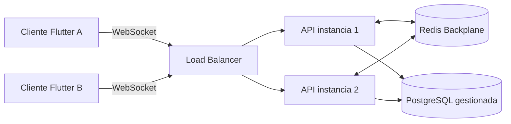
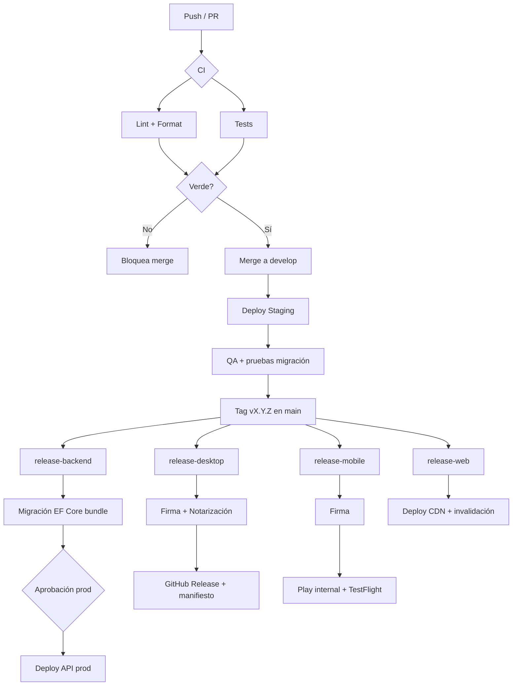

# Estrategia de Despliegue

Este documento define la estrategia de despliegue, distribución y operación de **Preventivi App** (presupuestos y mediciones de obra estilo Primus). Cubre el backend **.NET 9 Web API** (Clean Architecture, MediatR, EF Core, Serilog), la base de datos **PostgreSQL** de servidor, la distribución del frontend **Flutter** (Desktop + Mobile + Web), la sincronización offline-first y la cadena CI/CD con **GitHub Actions**.

Principios rectores:

- **Offline-first**: el cliente funciona sin red (SQLite local con FTS5); el servidor es la fuente de verdad para la nube.
- **Inmutabilidad de artefactos**: un artefacto firmado se construye una vez y se promociona entre entornos (no se reconstruye por entorno).
- **Versionado semántico** (`MAJOR.MINOR.PATCH`) compartido entre cliente y contrato de API.
- **Despliegue reproducible**: contenedores e infraestructura como código.

---

## 1. Entornos

Se definen tres entornos con paridad de configuración (mismo binario, distinta configuración).

| Entorno | Propósito | Rama / Trigger | Datos | URL ejemplo |
|---|---|---|---|---|
| **Desarrollo** (`dev`) | Trabajo local y feature branches | push a `feature/*` | Datos sintéticos, reseteables | `https://api.dev.preventivi.app` |
| **Staging** (`staging`) | Pre-producción, QA, pruebas de migración | merge a `develop` | Copia anonimizada de producción | `https://api.staging.preventivi.app` |
| **Producción** (`prod`) | Clientes reales | tag `vX.Y.Z` en `main` | Datos reales | `https://api.preventivi.app` |

### 1.1 Gestión de configuración

La configuración sigue el patrón **Options** de .NET con jerarquía de fuentes (la última gana):

1. `appsettings.json` (valores por defecto, versionado en repo).
2. `appsettings.{Environment}.json` (`Development`/`Staging`/`Production`).
3. **Variables de entorno** (prefijo `PREVENTIVI_`), inyectadas por el orquestador.
4. **Gestor de secretos** (en runtime, ver §1.2).

`ASPNETCORE_ENVIRONMENT` selecciona el perfil. Ninguna credencial vive en archivos versionados.

```jsonc
// appsettings.json (estructura, sin secretos)
{
  "ConnectionStrings": { "Postgres": "" },      // se inyecta por secreto
  "Redis": { "Configuration": "" },             // backplane SignalR
  "Serilog": { "MinimumLevel": "Information" },
  "Ai": { "Model": "claude-sonnet-4-6" },
  "Cors": { "AllowedOrigins": [] }
}
```

### 1.2 Gestión de secretos

| Entorno | Mecanismo |
|---|---|
| Desarrollo local | `dotnet user-secrets` (nunca en disco del repo) |
| CI/CD | **GitHub Encrypted Secrets** + **OIDC** hacia el cloud (sin claves estáticas de larga vida) |
| Staging / Producción | **Azure Key Vault** / **AWS Secrets Manager** / HashiCorp Vault, montados como variables de entorno o vía CSI driver |

Reglas:

- Rotación automática de credenciales de BD y claves de API LLM (Claude) cada 90 días.
- Cadena de conexión a PostgreSQL siempre con `SSL Mode=Require`.
- Secretos de firma de artefactos (certificados) almacenados cifrados, accesibles solo en jobs de `release`.

---

## 2. Despliegue del backend .NET 9

### 2.1 Contenedor Docker

Imagen multi-stage para minimizar superficie y tamaño. Se publica self-contained sobre la imagen runtime oficial de .NET 9.

```dockerfile
# build
FROM mcr.microsoft.com/dotnet/sdk:9.0 AS build
WORKDIR /src
COPY ["Directory.Build.props", "."]
COPY ["src/", "src/"]
RUN dotnet restore "src/Preventivi.Api/Preventivi.Api.csproj"
RUN dotnet publish "src/Preventivi.Api/Preventivi.Api.csproj" \
    -c Release -o /app/publish /p:UseAppHost=false

# runtime
FROM mcr.microsoft.com/dotnet/aspnet:9.0 AS final
WORKDIR /app
ENV ASPNETCORE_HTTP_PORTS=8080
ENV DOTNET_gcServer=1
RUN groupadd -r app && useradd -r -g app app
USER app
COPY --from=build /app/publish .
EXPOSE 8080
HEALTHCHECK CMD wget -qO- http://localhost:8080/health/live || exit 1
ENTRYPOINT ["dotnet", "Preventivi.Api.dll"]
```

Buenas prácticas aplicadas: usuario no-root, puerto no privilegiado, healthcheck integrado, capa de restore cacheable, sin SDK en la imagen final.

### 2.2 Base de datos PostgreSQL gestionada

Se usa un servicio **PostgreSQL gestionado** (Azure Database for PostgreSQL Flexible Server / Amazon RDS / Aurora PostgreSQL) en lugar de auto-hospedarlo, por backups automáticos, alta disponibilidad y parcheo gestionado.

Requisitos de la instancia (alineados con el dominio: preciosarios de 500.000+ partidas):

- Extensiones habilitadas: `pg_trgm` (búsqueda fuzzy), `pgvector` (embeddings/IA), soporte `tsvector` para full-text.
- Réplica de lectura para descargar consultas pesadas de catálogo (búsqueda de partidas/recursos).
- `max_connections` dimensionado para el pooling de la API (ver §2.5); se recomienda **PgBouncer** o pooling gestionado.
- Almacenamiento con escalado automático y snapshots diarios.

### 2.3 Migraciones EF Core en despliegue

**Decisión**: las migraciones **no** se aplican con `Database.Migrate()` al arrancar la app (riesgo en escalado horizontal: varias instancias migrando a la vez). Se ejecutan en un **paso dedicado del pipeline**, antes de promocionar la nueva versión.

```bash
# Job de migración (single-run) previo al despliegue de la API
dotnet ef migrations bundle \
  --project src/Preventivi.Infrastructure \
  --startup-project src/Preventivi.Api \
  --configuration Release -o efbundle

# El bundle es un ejecutable autónomo idempotente
./efbundle --connection "$PREVENTIVI_ConnectionStrings__Postgres"
```

Reglas de migración segura (compatible con despliegue sin downtime):

- Migraciones **expand/contract**: primero se añaden columnas/tablas (compatibles hacia atrás), se despliega el código que las usa, y solo en una release posterior se eliminan las antiguas.
- Toda migración debe ser **forward-only** en producción; el rollback se hace por restauración (ver §8) o por migración inversa probada en staging.
- El bundle de migración se valida primero en **staging** contra una copia de producción.

### 2.4 Opciones de hosting

| Opción | Servicio | Cuándo elegirla |
|---|---|---|
| **Azure** | Azure Container Apps (o AKS) + Azure Database for PostgreSQL + Azure Cache for Redis | Integración con Key Vault, OIDC nativo, escalado a cero |
| **AWS** | ECS Fargate (o EKS) + RDS/Aurora PostgreSQL + ElastiCache Redis | Ecosistema AWS, Fargate sin gestión de nodos |
| **Contenedores genéricos** | Kubernetes (cualquier cloud) / Nomad | Portabilidad, control total, multi-cloud |

En todos los casos: el contenedor del §2.1 es el mismo; cambia el orquestador y los servicios gestionados de BD/Redis.

### 2.5 Escalado horizontal

- La API es **stateless** (sin estado de sesión en memoria): se replica tras un balanceador.
- **Autoscaling** por CPU/RPS y por longitud de cola de SignalR.
- Pooling de conexiones a PostgreSQL acotado por instancia para no agotar `max_connections` (usar PgBouncer en modo transaction).
- Trabajos en background (procesamiento de importación DCF, recálculo de presupuestos, generación de embeddings) se separan en **workers** dedicados consumiendo una cola, para no competir con el tráfico HTTP.

### 2.6 SignalR con backplane (Redis)

Con múltiples instancias de API, los mensajes de tiempo real (sync de cambios, presencia, colaboración) deben llegar a clientes conectados a **cualquier** réplica. Se usa un **backplane Redis**:

```csharp
builder.Services
    .AddSignalR()
    .AddStackExchangeRedis(cfg.GetConnectionString("Redis"), o =>
    {
        o.Configuration.ChannelPrefix =
            StackExchange.Redis.RedisChannel.Literal("preventivi");
    });
```



El backplane Redis también respalda la propagación de eventos de la **ColaSincronizacion** (change log) hacia los clientes conectados.

---

## 3. Distribución del frontend Flutter

Un único código base Flutter (Riverpod, feature-first + MVVM) se compila a cada plataforma. La distribución difiere por canal.

### 3.1 Tabla por plataforma

| Plataforma | Build / Artefacto | Firma | Canal de distribución |
|---|---|---|---|
| **Windows** | `.msix` (Store) + instalador `.exe` (Inno Setup/MSIX sideload) | Authenticode (cert EV) | Microsoft Store + descarga directa con auto-update |
| **macOS** | `.app` empaquetado en `.dmg` | Codesign + **notarización** Apple + stapling | Mac App Store + descarga directa notarizada |
| **Linux** | `AppImage` + paquete `.deb` (y opcional `Flatpak`) | GPG (repo `.deb`) | Descarga directa + repositorio APT |
| **Web** | `flutter build web` (CanvasKit) → assets estáticos | — (HTTPS/TLS) | **CDN** (Azure Front Door / CloudFront) + caché versionada |
| **Android** | `.aab` (App Bundle) | Play App Signing | **Google Play Store** (+ APK interno para QA) |
| **iOS** | `.ipa` | Apple Distribution + provisioning | **App Store** / **TestFlight** (beta) |

### 3.2 Notas por plataforma

**Desktop (Windows / macOS / Linux)**

- Windows: se publican ambos canales. El instalador directo integra el auto-update (§4.1); el `.msix` de Store delega la actualización a la Store.
- macOS: notarización obligatoria (`xcrun notarytool submit` + `stapler staple`), si no Gatekeeper bloquea la app. Hardened Runtime activado.
- Linux: `AppImage` para portabilidad universal; `.deb` para integración con gestor de paquetes y auto-update por APT.

**Web**

- Build con `--release` y service worker para offline parcial (cache de assets).
- Despliegue a almacenamiento estático + **CDN**, con `index.html` sin caché y assets con hash en el nombre (caché inmutable).
- Cabeceras CORS del backend (§1.1) deben incluir el origen web.

**Mobile**

- Android: `.aab` con Play App Signing; tracks `internal → closed → open → production`.
- iOS: distribución por **TestFlight** para beta y App Store para producción; build con Xcode Cloud o fastlane.

---

## 4. Estrategia de actualizaciones y compatibilidad

### 4.1 Auto-update Desktop

- Canal directo (no Store): la app consulta un **endpoint de manifiesto** (`/releases/{plataforma}/latest.json`) con la última versión, URL del artefacto firmado y notas.
- Descarga en background, verificación de firma/hash, y aplicación al reinicio (estilo Squirrel/Sparkle).
- Soporte de **canales** `stable` y `beta`.

### 4.2 OTA (Mobile y Web)

- **Web**: cada deploy invalida la caché versionada del CDN; el service worker detecta nueva versión y solicita recarga.
- **Mobile**: actualizaciones de binario vía Store. Cambios de contenido/configuración (no de código nativo) pueden entregarse OTA mediante configuración remota; el código nativo siempre pasa por la Store (cumpliendo políticas de Apple/Google).

### 4.3 Versionado semántico y contrato de API

- `MAJOR.MINOR.PATCH`. La API expone versión en `/health` y cabecera `X-Api-Version`.
- El cliente envía su versión; el servidor aplica **degradación elegante** o solicita actualización si la versión cliente es incompatible (`MAJOR` distinto).
- Política de compatibilidad: el servidor soporta las **N-1** versiones `MINOR` del cliente para permitir despliegues escalonados.

### 4.4 Compatibilidad de esquema offline

El cliente usa SQLite local; al sincronizar (ColaSincronizacion + SignalR), pueden coexistir versiones de esquema distintas entre cliente y servidor.

- Cada cambio offline en la `ColaSincronizacion` incluye `schema_version`.
- El servidor **migra/normaliza** payloads de versiones anteriores antes de aplicarlos (adaptadores de versión).
- Cambios de esquema en cliente: migraciones SQLite locales **idempotentes** y forward-only, ejecutadas al abrir la base local.
- Política expand/contract también en el contrato de sync: nunca eliminar un campo que clientes antiguos aún envían sin un periodo de gracia.

---

## 5. CI/CD con GitHub Actions

### 5.1 Pipelines

Se separan por responsabilidad y plataforma. Los workflows de PR validan (build/test/lint); los de tag construyen y publican artefactos firmados.

| Workflow | Trigger | Jobs principales |
|---|---|---|
| `ci-backend.yml` | PR / push | restore, build, **xUnit tests**, análisis (`dotnet format`, analizadores), build imagen Docker |
| `ci-flutter.yml` | PR / push | `flutter analyze`, `dart format --set-exit-if-changed`, `flutter test` |
| `release-backend.yml` | tag `vX.Y.Z` | build+push imagen a registry, `ef migrations bundle`, deploy a staging→prod (con aprobación) |
| `release-desktop.yml` | tag `vX.Y.Z` | matrix `windows/macos/linux`: build, firma/notarización, publicar release + manifiesto auto-update |
| `release-mobile.yml` | tag `vX.Y.Z` | build `.aab` y `.ipa`, firma, subir a Play (internal) y TestFlight |
| `release-web.yml` | tag `vX.Y.Z` | `flutter build web`, sync a almacenamiento estático, invalidar CDN |

Características transversales:

- Matrix builds para desktop (Windows/macOS/Linux runners).
- Caché de dependencias (NuGet, pub) para acelerar.
- Autenticación al cloud por **OIDC** (sin secretos estáticos).
- **Entornos protegidos** de GitHub para `prod` con revisión obligatoria.

### 5.2 Firma de artefactos

| Artefacto | Firma |
|---|---|
| `.msix` / `.exe` Windows | Authenticode con certificado EV (HSM / Azure Trusted Signing) |
| `.app` / `.dmg` macOS | `codesign` + `notarytool` + `stapler` |
| `.deb` / repo Linux | Firma GPG del repositorio |
| `.aab` Android | Play App Signing + clave de carga |
| `.ipa` iOS | Apple Distribution certificate + provisioning profile |
| Imagen Docker | Firma con **cosign** (Sigstore) + SBOM |

Los certificados se almacenan como GitHub Secrets cifrados o en HSM, y solo son accesibles desde jobs de `release` con entorno protegido.

### 5.3 Diagrama del pipeline



---

## 6. Observabilidad

### 6.1 Logging (Serilog)

- **Serilog** con salida estructurada **JSON** a stdout (recogido por el orquestador) y sink a un backend de logs (Seq / Elastic / Azure Monitor / CloudWatch).
- Enriquecedores: `RequestId`, `CorrelationId`, `UserId`, `OrganizacionId`, versión de la app.
- Nivel por entorno (`Debug` en dev, `Information` en prod) configurable sin redeploy.
- **Correlación cliente-servidor**: el cliente Flutter propaga un `CorrelationId` por operación de sync.

### 6.2 Métricas

- Exposición de métricas en formato **OpenTelemetry / Prometheus** (`/metrics`): latencia HTTP, RPS, errores 5xx, conexiones SignalR activas, profundidad de la cola de sync, duración de jobs en background, pool de conexiones a PostgreSQL.
- Dashboards en Grafana / Azure Monitor / CloudWatch.

### 6.3 Health checks

| Endpoint | Propósito |
|---|---|
| `/health/live` | Liveness (proceso vivo) — usado por el orquestador para reinicio |
| `/health/ready` | Readiness (BD, Redis, dependencias listas) — usado por el balanceador |

Implementados con `AddHealthChecks()` incluyendo checks de PostgreSQL y Redis.

### 6.4 Alertas

- Tasa de error 5xx > umbral, latencia p99 alta, fallo de health check, cola de sync creciendo sin drenar, uso de conexiones de BD cercano al límite, fallo de job de migración.
- Notificación a Slack/Email/PagerDuty. Alertas críticas (prod caída, migración fallida) con escalado on-call.

---

## 7. Estrategia de base de datos en producción

### 7.1 Backups

- **Backups automáticos** del servicio gestionado: snapshot diario + **PITR** (Point-In-Time Recovery) con WAL, ventana ≥ 7 días (recomendado 30 en prod).
- Backup adicional **lógico** (`pg_dump`) semanal a almacenamiento de objetos con cifrado y retención escalonada.
- **Pruebas de restauración** periódicas en un entorno aislado (un backup no probado no es un backup).

### 7.2 Migraciones

- Ejecutadas por el bundle EF Core en paso dedicado (§2.3), siempre **probadas en staging** contra copia de producción.
- Estrategia **expand/contract** para cero downtime.
- Snapshot/backup **inmediatamente antes** de aplicar migraciones en producción.

### 7.3 Rollback

| Escenario | Acción |
|---|---|
| Bug en código (esquema compatible) | Redeploy de la imagen anterior (artefacto inmutable) — rollback en minutos |
| Migración aditiva problemática | Desplegar versión anterior del código (el esquema expandido sigue siendo compatible); migración correctiva posterior |
| Migración destructiva / corrupción | **Restauración PITR** al instante previo + replay controlado; máxima precaución, implica downtime |

Regla: gracias a expand/contract, el rollback de código casi nunca requiere rollback de esquema. Las migraciones destructivas se posponen a releases dedicadas con ventana de mantenimiento.

---

## 8. Checklist de release

**Pre-release**

- [ ] Todas las pruebas (backend xUnit + Flutter) en verde en CI.
- [ ] `flutter analyze` y `dotnet format` sin hallazgos.
- [ ] Versión `MAJOR.MINOR.PATCH` actualizada (API, `pubspec.yaml`, imagen Docker, manifiestos store).
- [ ] CHANGELOG / notas de versión redactadas.
- [ ] Migraciones EF Core probadas en **staging** contra copia de producción.
- [ ] Backup/snapshot de la BD de producción tomado.
- [ ] Compatibilidad de contrato API verificada (N-1) y `schema_version` de sync actualizada.

**Release**

- [ ] Tag `vX.Y.Z` creado en `main`.
- [ ] Imagen Docker construida, firmada (cosign) y publicada; SBOM generado.
- [ ] Bundle de migración ejecutado en producción correctamente.
- [ ] Deploy de API aprobado en entorno protegido y desplegado.
- [ ] Artefactos desktop firmados y notarizados; manifiesto de auto-update actualizado.
- [ ] `.aab` subido a Play (internal) e `.ipa` a TestFlight.
- [ ] Web desplegada a CDN con invalidación de caché.

**Post-release**

- [ ] Health checks `/health/ready` en verde en todas las réplicas.
- [ ] Métricas y logs sin anomalías (errores 5xx, latencia, cola de sync).
- [ ] Smoke test de flujos críticos (login, abrir presupuesto, importar DCF, sync offline).
- [ ] Promoción gradual de canales mobile (`internal → production`) tras validación.
- [ ] Comunicación de release y monitorización on-call durante ventana de estabilización.
- [ ] Plan de rollback confirmado y disponible (imagen anterior + backup).
