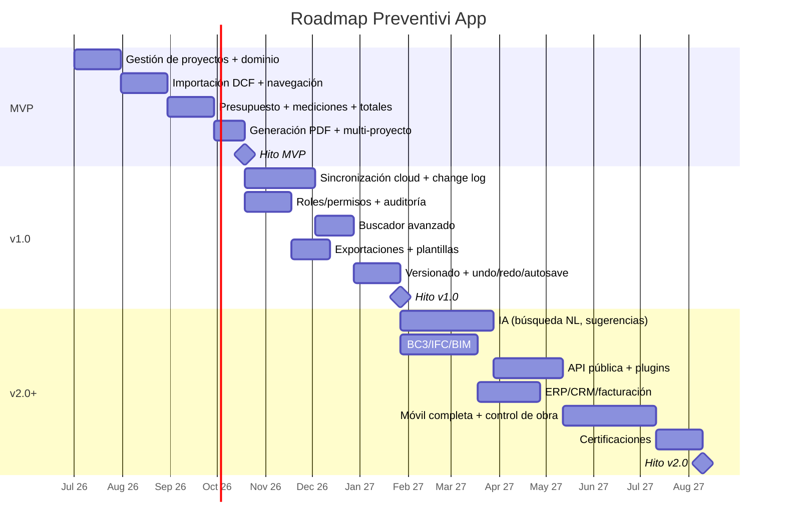
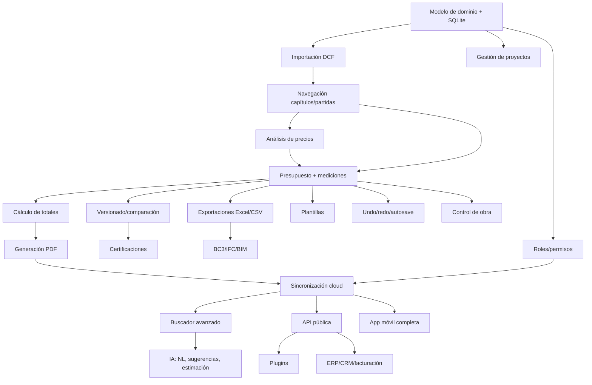

# Roadmap de Desarrollo — Preventivi App

Este documento define el plan de desarrollo por fases de **Preventivi App**, la aplicación de presupuestos y mediciones de obra estilo Primus (ACCA). Detalla el alcance funcional, criterios de salida, dependencias, hitos, riesgos y esfuerzo estimado de cada fase.

El roadmap respeta el stack fijo (Flutter + Riverpod, .NET 9 Web API con Clean Architecture/MediatR, EF Core, SQLite local + PostgreSQL servidor, QuestPDF/ClosedXML, IA con pgvector + Claude) y el modelo de dominio canónico.

## Visión general de fases

| Fase | Objetivo central | Duración aprox. | Estado |
|------|------------------|-----------------|--------|
| **MVP** | App de presupuestos offline-first funcional y usable | 4 meses | Inicial |
| **v1.0** | Producto colaborativo en la nube, listo para mercado | 5 meses | Planificado |
| **v2.0+** | Plataforma inteligente, integrable y extensible | 6+ meses | Futuro |

---

## Fase 1 — MVP

### Objetivo
Entregar una aplicación **offline-first** (sin sincronización) que permita a un presupuestista crear presupuestos y mediciones completos a partir de un preciosario DCF importado, calcular totales y generar el PDF del presupuesto. Es el corazón del producto y debe ser sólido y rápido en local.

### Alcance funcional

| Módulo | Descripción |
|--------|-------------|
| **Gestión de proyectos** | CRUD de `Proyecto` y `Cliente`. Estados: borrador/activo/cerrado/archivado. |
| **Importación DCF básica** | Parser DCF → `Preciosario`, `Capitulo`, `Partida`, `Descompuesto`, `Recurso`, `Unidad`, `Precio`. |
| **Navegación capítulos/partidas** | Árbol jerárquico (`padre_id`) con lazy loading y virtual scrolling. |
| **Análisis de precios** | Visualización del `Descompuesto` por partida (mano de obra + material + maquinaria + % costes indirectos). |
| **Crear presupuesto + mediciones** | `Presupuesto`, `CapituloPresupuesto`, `PartidaPresupuesto`, `Medicion`, `LineaMedicion` (uds × largo × ancho × alto o fórmula). |
| **Cálculo de totales** | Total medición × precio = importe; agregación por capítulos + `CostesIndirectos` + `Iva`. |
| **Generación de PDF** | Exportación del presupuesto con QuestPDF. |
| **Multi-proyecto** | Gestión simultánea de varios proyectos en local. |
| **Offline local (sin sync)** | Persistencia completa en SQLite (FTS5) sin dependencia de red. |

### Fuera de alcance (MVP)
Sincronización cloud, exportación Excel/CSV, plantillas, versionado, roles/permisos, undo/redo, IA, BC3/IFC.

### Criterios de salida
- Importar un preciosario DCF real y navegarlo con fluidez (objetivo: 500.000+ partidas con lazy loading).
- Crear un presupuesto completo con mediciones y obtener totales correctos (validados contra cálculo manual).
- Generar el PDF del presupuesto sin errores de formato.
- La app funciona 100% sin conexión.
- Cobertura de tests del dominio de cálculo (mediciones, totales, IVA, costes indirectos) ≥ 80%.

---

## Fase 2 — Versión 1.0

### Objetivo
Convertir el MVP en un **producto colaborativo, multiusuario y comercializable**, con sincronización a la nube, seguridad por roles y herramientas de productividad (búsqueda avanzada, exportaciones, plantillas, versionado, undo/redo).

### Alcance funcional

| Módulo | Descripción |
|--------|-------------|
| **Sincronización cloud** | `ColaSincronizacion` (change log) + SignalR/WebSockets + background sync. IDs UUID v7. PostgreSQL servidor. Resolución de conflictos. |
| **Buscador inteligente avanzado** | Búsqueda full-text con FTS5 (local) y pg_trgm/tsvector (servidor), filtros, facetas, búsqueda fuzzy. |
| **Exportaciones (Excel/CSV)** | ClosedXML (Excel) + exportadores CSV/JSON/XML. |
| **Plantillas** | `Plantilla` de presupuestos y documentos reutilizables. |
| **Versionado/comparación** | `Version` (snapshot) de presupuestos; comparación entre versiones (diff). |
| **Roles/permisos** | `Usuario`, `Rol`, `Permiso`, `Organizacion`. RBAC: admin, jefe_obra, presupuestista, lector. |
| **Undo/redo/autoguardado** | Pila de comandos, autoguardado, recuperación ante cierre inesperado. |
| **Auditoría** | `Historial/Auditoria` de cambios (datos_antes/datos_despues). |

### Criterios de salida
- Dos usuarios editan offline y la sincronización converge sin pérdida de datos; los conflictos se detectan y resuelven.
- Exportación a Excel/CSV fiel al presupuesto y reimportable donde aplique.
- RBAC efectivo: cada rol solo accede a lo permitido.
- Undo/redo y autoguardado sin corrupción de estado.
- Comparación de versiones muestra diferencias correctas.
- App empaquetada para Desktop, Web y Mobile.

---

## Fase 3 — Versión 2.0 y futuro

### Objetivo
Transformar la app en una **plataforma inteligente, interoperable y extensible**: IA aplicada a presupuestos, estándares del sector (BC3/IFC/BIM), integraciones empresariales (ERP/CRM/facturación), API pública, ecosistema de plugins, app móvil completa, control de obra y certificaciones.

### Alcance funcional

| Módulo | Descripción |
|--------|-------------|
| **IA** | Búsqueda en lenguaje natural, sugerencias de partidas, estimación de precios. Embeddings + pgvector + LLM Claude (Opus 4.8, Sonnet 4.6, Haiku 4.5). |
| **BC3/IFC/BIM** | Importación/exportación FIEBDC-3 (BC3), IFC y vinculación con modelos BIM. |
| **ERP/CRM/facturación** | Integraciones con sistemas externos de gestión y facturación. |
| **API pública** | API REST/GraphQL documentada para terceros. |
| **Plugins** | Arquitectura de extensiones para funcionalidades de terceros. |
| **App móvil completa** | Experiencia móvil completa (no solo consulta), captura en obra. |
| **Certificaciones** | Certificaciones de obra ejecutada (a origen/parciales). |
| **Control de obra** | Seguimiento de avance, comparativa presupuesto vs. ejecución. |

### Criterios de salida (por incremento)
- IA: la búsqueda NL y las sugerencias aportan resultados relevantes medibles (precisión validada con usuarios).
- BC3: round-trip de importación/exportación sin pérdida frente a herramientas del sector.
- API pública: documentada, versionada, con autenticación y rate limiting.
- Al menos un plugin de referencia funcionando end-to-end.
- Control de obra y certificaciones validados en un proyecto piloto real.

> Nota: la v2.0+ se entrega de forma **incremental**; cada módulo es un mini-proyecto con su propio criterio de salida, no un único hito monolítico.

---

## Diagrama Gantt

---

## Dependencias entre fases y módulos

### Dependencias clave
- **Todo el MVP** depende del modelo de dominio y la persistencia SQLite.
- **Presupuesto + mediciones** depende de la navegación y del análisis de precios (preciosario importado).
- **Sincronización cloud (v1.0)** requiere el modelo de dominio estable con UUID v7 desde el inicio y los datos del MVP.
- **Buscador avanzado** se apoya en sync (índices servidor) además de FTS5 local.
- **IA (v2.0)** depende del buscador (embeddings sobre el corpus indexado) y de datos sincronizados en PostgreSQL/pgvector.
- **Plugins, ERP/CRM** dependen de la API pública.
- **Certificaciones / control de obra** dependen de presupuestos versionados.

---

## Tabla de hitos

| Hito | Fecha relativa | Entregable |
|------|----------------|------------|
| **M0 — Cimientos** | Inicio + 1 mes | Modelo de dominio, capas Clean Architecture, SQLite, CRUD de proyectos/clientes. |
| **M1 — Preciosario navegable** | Inicio + 2 meses | Importación DCF + navegación de capítulos/partidas + análisis de precios. |
| **M2 — Presupuesto calculado** | Inicio + 3 meses | Presupuesto con mediciones y totales (costes indirectos + IVA) correctos. |
| **M3 — Release MVP** | Inicio + 4 meses | App offline-first con PDF y multi-proyecto. |
| **M4 — Cloud + seguridad** | Inicio + 6,5 meses | Sincronización offline-first + RBAC + auditoría. |
| **M5 — Productividad** | Inicio + 8 meses | Buscador avanzado, exportaciones, plantillas, versionado, undo/redo. |
| **M6 — Release v1.0** | Inicio + 9 meses | Producto colaborativo empaquetado (Desktop/Web/Mobile). |
| **M7 — IA aplicada** | Inicio + 11 meses | Búsqueda NL, sugerencias y estimación con pgvector + Claude. |
| **M8 — Interoperabilidad** | Inicio + 13 meses | BC3/IFC/BIM y API pública. |
| **M9 — Plataforma extensible** | Inicio + 15 meses | Plugins, integraciones ERP/CRM/facturación. |
| **M10 — Release v2.0** | Inicio + 18 meses | Móvil completa, control de obra y certificaciones. |

---

## Riesgos y mitigaciones por fase

### MVP

| Riesgo | Impacto | Mitigación |
|--------|---------|------------|
| Rendimiento con 500.000+ partidas | Alto | Lazy loading, virtual scrolling, índices FTS5, caché, procesamiento en background desde el día 1. |
| Variabilidad/ambigüedad del formato DCF | Alto | Parser tolerante con validación FluentValidation, suite de archivos DCF de prueba, logging detallado de errores. |
| Errores en cálculo de mediciones/totales | Crítico | Lógica de cálculo en Domain con tests unitarios exhaustivos; validación contra Primus/cálculo manual. |
| Curva de Flutter Desktop | Medio | Prototipo temprano de la navegación del árbol; patrón feature-first + MVVM consistente. |

### v1.0

| Riesgo | Impacto | Mitigación |
|--------|---------|------------|
| Conflictos de sincronización / pérdida de datos | Crítico | Change log con operaciones idempotentes, UUID v7, estrategia de resolución de conflictos definida y testada; tests de convergencia. |
| Complejidad RBAC | Medio | Modelo de permisos por código (`Permiso.codigo`) centralizado; pruebas por rol. |
| Inconsistencia entre estado local y servidor | Alto | Single source of truth en el change log, reconciliación, telemetría con Serilog. |
| Corrupción por undo/redo + autoguardado | Medio | Pila de comandos inmutable, snapshots, pruebas de estrés. |

### v2.0+

| Riesgo | Impacto | Mitigación |
|--------|---------|------------|
| Calidad/alucinaciones de la IA | Alto | RAG sobre corpus propio (pgvector), validación humana, selección de modelo por tarea (Haiku para clasificación, Opus para razonamiento), evaluaciones offline. |
| Costes de inferencia LLM | Medio | Caché de embeddings/respuestas, enrutado por coste (Haiku/Sonnet/Opus), límites por organización. |
| Complejidad de BC3/IFC/BIM | Alto | Empezar por subconjunto BC3, validar round-trip con herramientas del sector, abordar IFC/BIM de forma incremental. |
| Seguridad y estabilidad de la API/plugins | Alto | Versionado de API, autenticación, rate limiting, sandboxing de plugins, revisión de seguridad. |
| Alcance abierto de v2.0+ | Medio | Entrega incremental por módulos independientes, cada uno con criterio de salida propio. |

---

## Equipo recomendado y esfuerzo estimado

### Esfuerzo por fase

| Fase | Duración | Equipo recomendado | Esfuerzo (persona-mes) |
|------|----------|--------------------|------------------------|
| **MVP** | 4 meses | 1 Tech Lead, 2 Flutter, 1 .NET, 1 QA (½) | ~18 PM |
| **v1.0** | 5 meses | 1 Tech Lead, 2 Flutter, 2 .NET, 1 DevOps, 1 QA | ~35 PM |
| **v2.0+** | 6+ meses | 1 Tech Lead, 2 Flutter, 2 .NET, 1 ML/IA, 1 DevOps, 1 QA, 0,5 UX | ~48+ PM |

### Roles clave
- **Tech Lead / Arquitecto**: garante de Clean Architecture, dominio canónico y decisiones técnicas.
- **Desarrollo Flutter**: UI feature-first + MVVM, Riverpod, rendimiento (virtual scrolling), offline-first.
- **Desarrollo .NET**: Web API, MediatR/CQRS, EF Core, sync, API pública.
- **ML/IA** (desde v2.0): embeddings, pgvector, integración LLM Claude, evaluación.
- **DevOps** (desde v1.0): CI/CD, PostgreSQL, despliegue cloud, observabilidad (Serilog).
- **QA**: automatización de tests, foco en cálculo (MVP) y convergencia de sync (v1.0).
- **UX/Producto** (transversal): coherencia con la inspiración Notion/Linear/Figma/ClickUp.

### Notas de estimación
- Las estimaciones asumen un equipo estable y dedicación a tiempo completo salvo indicación (½ / 0,5).
- El MVP es el camino crítico: su solidez (dominio + cálculo + rendimiento) reduce el riesgo de todas las fases posteriores.
- La v2.0+ se planifica por módulos independientes; el equipo y esfuerzo pueden ajustarse según prioridad comercial de cada módulo.
