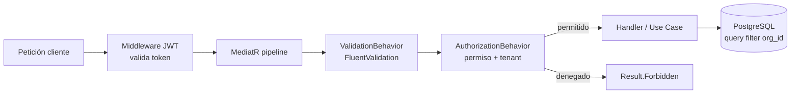

# Seguridad

Documento de seguridad de **Preventivi App**. Cubre autenticación, autorización, cifrado, auditoría, backups, protección de la API, privacidad/cumplimiento, gestión de secretos y un modelo de amenazas resumido.

La app es **offline-first** (Flutter Desktop/Mobile/Web + BD local SQLite) con sincronización a un backend **.NET 9 Web API** sobre PostgreSQL. Esta naturaleza híbrida define los principales retos de seguridad: hay datos sensibles tanto en el servidor como en cada dispositivo, y operaciones que ocurren sin conexión y se concilian más tarde.

Principios rectores:

- **Defensa en profundidad**: ninguna capa es el único control.
- **Mínimo privilegio**: cada `Usuario`, `Rol` y servicio recibe solo los permisos necesarios.
- **Cero confianza en el cliente**: toda autorización se reevalúa en el servidor durante la sincronización; el cliente nunca es la fuente de verdad de permisos.
- **Aislamiento multi-tenant**: cada operación se acota a una `Organizacion`.
- **Cifrado por defecto** en tránsito y en reposo, en servidor y dispositivo.

## Autenticación

### Modelo de tokens (JWT + refresh)

La autenticación se basa en **access tokens JWT** de vida corta y **refresh tokens** opacos de vida larga.

| Token | Tipo | Vida | Almacenamiento cliente | Uso |
|-------|------|------|------------------------|-----|
| Access token | JWT firmado (RS256/EdDSA) | 15 min | Memoria (no persistente) | Autorización en cada petición a la API |
| Refresh token | Opaco aleatorio (256 bits) | 30 días, deslizante | Almacén seguro del SO | Renovar el access token |

- El access token transporta claims mínimos: `sub` (`usuario_id`, UUID v7), `org` (`organizacion_id`), `rol`, `jti`, `exp`, `iat`. **Nunca** datos personales ni permisos completos.
- Los refresh tokens se persisten en servidor (hash) ligados a un dispositivo y se pueden **revocar individualmente** (logout remoto, robo de dispositivo).
- **Rotación de refresh tokens**: cada uso emite uno nuevo e invalida el anterior. La reutilización de un refresh token ya consumido se trata como compromiso → se revoca toda la familia de tokens del dispositivo.
- Lista de revocación / `jti` blocklist para invalidar access tokens antes de su expiración natural (corta gracias a los 15 min).

### Hashing de contraseñas

- Algoritmo preferido: **Argon2id** (memory-hard, resistente a GPU/ASIC). Alternativa aceptada: **bcrypt** (factor de coste ≥ 12) en entornos donde Argon2 no esté disponible.
- Parámetros Argon2id de partida: `memory = 64 MB`, `iterations = 3`, `parallelism = 2`, ajustables al hardware.
- Sal única por usuario generada con CSPRNG; **pepper** opcional almacenado en el gestor de secretos (no en BD).
- El campo `Usuario.password_hash` guarda el hash con su prefijo de algoritmo y parámetros, permitiendo **rehash transparente** al iniciar sesión si la política cambia.
- Políticas: longitud mínima, comprobación contra listas de contraseñas filtradas (k-anonymity, p. ej. HIBP), bloqueo temporal tras N intentos fallidos.

### OAuth2 / OpenID Connect (opcional)

- Soporte opcional de **inicio de sesión federado** vía OIDC (Google, Microsoft Entra ID) para clientes corporativos.
- Flujo **Authorization Code + PKCE** en los clientes Flutter (incluido Web y Desktop).
- El backend actúa como Relying Party, mapea la identidad federada a un `Usuario` existente o aprovisiona uno nuevo (JIT) asociado a su `Organizacion`.

### MFA (futuro)

- **TOTP** (RFC 6238, apps Authenticator) como segundo factor inicial; WebAuthn/Passkeys como evolución.
- Códigos de recuperación de un solo uso, cifrados en reposo.
- MFA exigible por política de `Organizacion` y obligatorio para el rol `admin`.

### Sesiones multi-dispositivo y offline

- Un mismo `Usuario` puede tener **varias sesiones activas** (escritorio, móvil, web), cada una con su refresh token y registro de dispositivo (id, plataforma, último acceso, IP).
- Panel de "dispositivos activos" para que el usuario revise y revoque sesiones.
- **Operación offline**: el dispositivo guarda un access token válido y un cache de los claims de autorización. Mientras esté sin conexión:
  - Solo se permiten acciones permitidas por el último estado de permisos conocido (fail-safe: si el rol fue degradado mientras estaba offline, los cambios se rechazan al sincronizar).
  - Las acciones se encolan en `ColaSincronizacion` con el `usuario_id` que las originó.
  - Al recuperar conexión, el servidor **reautentica** (refresh token) y **reautoriza cada operación** del change log antes de aplicarla. Las que ya no estén permitidas pasan a estado `conflicto`.
- Tiempo máximo de operación offline configurable; superado el umbral, la app exige reautenticación online antes de seguir sincronizando.

## Autorización

Modelo **RBAC** (Role-Based Access Control) con permisos granulares, reforzado con autorización **a nivel de recurso y de organización** (multi-tenant).

### Roles y permisos

Entidades del dominio: `Rol` (admin, jefe_obra, presupuestista, lector), `Permiso` (RBAC, identificado por `codigo`). La relación `Rol`×`Permiso` es de muchos a muchos.

Permisos canónicos (`codigo`):

| Código | Descripción |
|--------|-------------|
| `proyecto.leer` | Ver proyectos y su contenido |
| `proyecto.crear` | Crear proyectos |
| `proyecto.editar` | Editar/cerrar/archivar proyectos |
| `proyecto.borrar` | Eliminar proyectos |
| `presupuesto.leer` | Ver presupuestos, mediciones, análisis |
| `presupuesto.editar` | Crear/editar presupuestos, partidas, mediciones |
| `presupuesto.versionar` | Crear nuevas versiones de presupuesto |
| `preciosario.importar` | Importar/actualizar preciosarios DCF |
| `preciosario.gestionar` | Bloquear/desbloquear precios, gestionar fuentes |
| `cliente.gestionar` | Alta/edición de clientes y proveedores |
| `documento.exportar` | Generar PDF/Excel/CSV/XML |
| `usuario.gestionar` | Gestionar usuarios y asignar roles |
| `organizacion.administrar` | Configuración, facturación, políticas de seguridad |
| `auditoria.leer` | Consultar historial/auditoría |

### Matriz rol × permiso

| Permiso | admin | jefe_obra | presupuestista | lector |
|---------|:-----:|:---------:|:--------------:|:------:|
| `proyecto.leer` | ✅ | ✅ | ✅ | ✅ |
| `proyecto.crear` | ✅ | ✅ | ✅ | ❌ |
| `proyecto.editar` | ✅ | ✅ | ✅ | ❌ |
| `proyecto.borrar` | ✅ | ✅ | ❌ | ❌ |
| `presupuesto.leer` | ✅ | ✅ | ✅ | ✅ |
| `presupuesto.editar` | ✅ | ✅ | ✅ | ❌ |
| `presupuesto.versionar` | ✅ | ✅ | ✅ | ❌ |
| `preciosario.importar` | ✅ | ✅ | ✅ | ❌ |
| `preciosario.gestionar` | ✅ | ✅ | ❌ | ❌ |
| `cliente.gestionar` | ✅ | ✅ | ✅ | ❌ |
| `documento.exportar` | ✅ | ✅ | ✅ | ✅ |
| `usuario.gestionar` | ✅ | ❌ | ❌ | ❌ |
| `organizacion.administrar` | ✅ | ❌ | ❌ | ❌ |
| `auditoria.leer` | ✅ | ✅ | ❌ | ❌ |

Resumen de roles:

- **admin**: control total de la organización, usuarios, políticas y auditoría.
- **jefe_obra**: gestiona proyectos y presupuestos completos, incluida importación de preciosarios y auditoría.
- **presupuestista**: crea y edita presupuestos, mediciones y clientes; no administra usuarios ni la organización.
- **lector**: acceso de solo lectura y exportación.

### Autorización a nivel de recurso y multi-tenant

- Cada entidad raíz (`Proyecto`, `Presupuesto`, `Cliente`, `Preciosario`...) pertenece a una `Organizacion`. **Toda consulta** lleva implícito un filtro `organizacion_id = claim.org` aplicado en la capa de Application/Infrastructure (EF Core global query filter), no opcional.
- Esto previene **IDOR**: aunque un atacante conozca un UUID v7 de otra organización, el filtro de tenant lo excluye antes de evaluar el permiso.
- La autorización se implementa en el pipeline de **MediatR** (CQRS): un `AuthorizationBehavior` intercepta cada comando/consulta, valida el permiso requerido y el tenant antes de ejecutar el handler. El resultado se modela con el **Result Pattern** (`Forbidden`/`Unauthorized`) sin lanzar excepciones de control de flujo.
- Validaciones de permiso también en la capa de presentación (ocultar acciones), pero **la decisión vinculante es siempre la del servidor**.

## Cifrado

### En tránsito

- **TLS 1.3** obligatorio (mínimo 1.2) en toda comunicación cliente↔API y API↔servicios.
- **HSTS** en los endpoints web, redirección forzada HTTP→HTTPS.
- WebSockets/SignalR sobre **WSS**.
- Certificate pinning opcional en clientes móviles para mitigar MITM con CAs comprometidas.

### En reposo (servidor)

- Cifrado a nivel de volumen/instancia de **PostgreSQL** (TDE del proveedor o cifrado de disco).
- **Cifrado a nivel de columna** para datos especialmente sensibles (datos de contacto de `Cliente`, secretos OIDC, códigos de recuperación MFA). Claves gestionadas por un **KMS**; la BD almacena solo ciphertext.
- Hashes de contraseña y de refresh tokens nunca en texto plano (ya cubierto en Autenticación).

### En reposo (dispositivo) — SQLite

- La **BD local SQLite** se cifra con **SQLCipher** (AES-256). Sin la clave, el fichero `.db` en el dispositivo es ilegible.
- La clave de SQLCipher se deriva de un secreto guardado en el **almacén seguro del SO**: Keychain (iOS/macOS), Keystore (Android), DPAPI/Credential Locker (Windows), Secret Service/libsecret (Linux). Nunca embebida en el binario ni en código.
- Adjuntos (`Adjunto`: fotos, planos) almacenados localmente se cifran igualmente; las rutas en BD apuntan a contenido cifrado.
- Borrado seguro de la clave al cerrar sesión o tras N fallos → la copia local queda inaccesible.

## Auditoría y logs

### Pista de auditoría

La entidad **`Historial / Auditoria`** registra el rastro de cambios sensibles:

`(id, usuario_id, accion, entidad_tipo, entidad_id, datos_antes, datos_despues, creado_en)`

- Captura **quién** (`usuario_id`), **qué** (`accion`, `entidad_tipo`, `entidad_id`), **cuándo** (`creado_en`) y **antes/después** (`datos_antes`/`datos_despues` como snapshots JSON).
- Se generan vía **domain events** (arquitectura event-driven) en operaciones de escritura, de forma transversal y consistente.
- Eventos auditados de forma obligatoria: login/logout, cambios de rol y permisos, alta/baja de usuarios, importación de preciosarios, borrado de proyectos/presupuestos, exportaciones de documentos, accesos a auditoría.
- Registros de auditoría **append-only** (inmutables): sin UPDATE/DELETE desde la aplicación; solo `auditoria.leer` puede consultarlos.

### Logs de seguridad y operación

- **Serilog** con logging estructurado. Niveles separados para seguridad (auth fallida, denegaciones de autorización, rate limit excedido, reutilización de refresh token) y operación.
- **Sin datos sensibles en logs**: nunca contraseñas, tokens, `password_hash`, ni PII. Se redactan/enmascaran mediante destructuring policies.
- Correlación por `trace_id`/`jti` para seguir una petición de extremo a extremo.
- Centralización en un sistema de log seguro con control de acceso y, deseablemente, almacenamiento a prueba de manipulaciones.

### Retención

| Tipo de registro | Retención recomendada |
|------------------|----------------------|
| Auditoría de negocio (`Historial/Auditoria`) | ≥ 1 año (configurable por organización/cumplimiento) |
| Logs de seguridad (auth, autorización) | 90–180 días |
| Logs operativos/diagnóstico | 30 días |

Retención y purga automatizadas; datos personales en logs sujetos a las políticas de privacidad (GDPR) descritas más abajo.

## Backup y recuperación

- **Backups automáticos** de PostgreSQL: full diario + WAL/PITR (point-in-time recovery) continuo para minimizar RPO.
- **Cifrado de backups** en reposo (AES-256) con claves gestionadas por el KMS, distintas de las de producción; transferidos y almacenados solo cifrados.
- Almacenamiento **redundante y geográficamente separado**; control de acceso estricto y auditado a los backups.
- **Pruebas de restauración** periódicas (al menos trimestrales) para validar integridad y los objetivos RPO/RTO.
- **Dispositivos offline**: la BD local SQLite no es el respaldo autoritativo; la fuente de verdad es el servidor tras sincronizar. Aun así, se recomienda exportación/copia cifrada local para tolerancia a fallos del dispositivo.
- Procedimiento de recuperación documentado (runbook): restauración de instancia, reaplicación de WAL, verificación de integridad y de la pista de auditoría.

## Protección de la API

### Rate limiting

- Límites por IP, por `usuario_id` y por `organizacion_id`.
- Límites más estrictos en endpoints sensibles: login, refresh, recuperación de contraseña, importación de preciosarios.
- Respuestas `429 Too Many Requests` con `Retry-After`; backoff exponencial recomendado en el cliente.
- Protección contra fuerza bruta de credenciales combinando rate limiting + bloqueo temporal de cuenta.

### Validación de entrada

- **FluentValidation** en cada comando/consulta MediatR (`ValidationBehavior`) como primera barrera; rechazo temprano con `Result` de error de validación.
- Validación de tipos, rangos, longitudes y formato (emails, NIF, UUID v7).
- Las **fórmulas de medición** (`LineaMedicion.formula`) se evalúan en un **motor sandbox** sin acceso a sistema/IO, con whitelist de operadores y funciones, para evitar inyección de código.
- Importación DCF: validación de esquema y `hash_archivo`, límites de tamaño y parsing defensivo (evitar XXE/zip-bomb/recursión excesiva).

### OWASP Top 10

| Riesgo | Mitigación en Preventivi App |
|--------|------------------------------|
| Inyección (SQL) | EF Core parametrizado; sin SQL concatenado. FTS5/pg_trgm vía API segura. |
| XSS | Flutter no renderiza HTML del usuario por defecto; salida escapada. En exportaciones/Web, sanitización y CSP estricta. |
| CSRF | API stateless con Bearer JWT (no cookies de sesión) → sin CSRF clásico. Si se usan cookies en Web, `SameSite=Strict` + tokens anti-CSRF. |
| IDOR / Broken Access Control | Filtro de `organizacion_id` + comprobación de permisos por recurso en cada operación. UUID v7 no enumerable. |
| Autenticación rota | JWT corto + rotación de refresh + MFA (futuro) + bloqueo por fuerza bruta. |
| Mala configuración de seguridad | Headers de seguridad, secretos fuera de código, entornos endurecidos por defecto. |
| Componentes vulnerables | Escaneo de dependencias (SCA) en CI, actualización regular. |
| Fallos de integridad de datos/software | Firmas de artefactos, verificación de `hash_archivo` en importaciones. |
| Logging/monitorización insuficiente | Logs de seguridad + alertas (ver Auditoría). |
| SSRF | Validación/whitelist de URLs salientes (p. ej. fuentes DCF, callbacks OIDC, llamadas a IA). |

### CORS

- Política CORS restrictiva: **allowlist** explícita de orígenes (dominios de la app Web), métodos y headers permitidos.
- Sin `Access-Control-Allow-Origin: *` en endpoints autenticados.
- Preflight cacheado con `Access-Control-Max-Age` razonable.

## Privacidad y cumplimiento

- **GDPR/RGPD**: la app trata datos personales de usuarios (`Usuario`) y de `Cliente`/contactos (nombre, NIF, email, teléfono, dirección).
  - **Base legal y minimización**: solo se recogen los datos necesarios para presupuestos y gestión de obra.
  - **Derechos del interesado**: acceso, rectificación, supresión ("derecho al olvido") y **portabilidad** (exportación de datos del cliente en formato estándar, p. ej. JSON/CSV).
  - **Supresión**: borrado o anonimización de datos personales bajo solicitud, respetando obligaciones legales de retención (la auditoría puede seudonimizar el `usuario_id`).
  - **Registro de actividades de tratamiento** y, si aplica, **DPA** con proveedores (hosting, IA).
- **Datos personales de clientes**: aislados por `Organizacion`, cifrados en columnas sensibles, accesibles solo con `cliente.gestionar`/`*.leer`.
- **Consentimiento para IA en la nube**: las funciones de IA (embeddings, búsqueda semántica con pgvector, LLM Claude) pueden enviar contenido a servicios externos.
  - Requiere **consentimiento explícito y revocable** por organización antes de habilitar IA en la nube.
  - **Minimización**: enviar solo el contexto necesario; ofrecer opción de **desactivar IA** o limitarla a datos no personales.
  - Transparencia sobre qué se envía, a qué proveedor y con qué finalidad; sin uso de datos del cliente para entrenamiento por parte del proveedor (garantizado contractualmente).

## Gestión de secretos y rotación de claves

- **Sin secretos en el código ni en el repositorio**. Variables de entorno solo para desarrollo; en producción, un **gestor de secretos**/KMS (Azure Key Vault, AWS Secrets Manager/KMS, HashiCorp Vault).
- Secretos gestionados: claves de firma JWT, pepper de contraseñas, claves de cifrado de columnas, credenciales de BD, claves de API de IA, secretos OIDC, claves de cifrado de backups.
- **Rotación de claves**:
  - Firma JWT con **kid** (key id) y conjunto de claves activas → rotación sin downtime (los tokens viejos se validan con la clave anterior hasta expirar).
  - Claves de cifrado con **versionado**; el ciphertext referencia la versión usada para permitir re-cifrado progresivo.
  - Rotación periódica programada y rotación inmediata ante sospecha de compromiso.
- Acceso a secretos auditado y de mínimo privilegio (identidades de servicio, no credenciales compartidas).
- Escaneo de secretos en CI (secret scanning) para impedir filtraciones accidentales.

## Modelo de amenazas resumido

Tabla de amenazas principales y sus mitigaciones.

| # | Amenaza | Vector | Mitigación |
|---|---------|--------|------------|
| 1 | Robo de credenciales | Phishing, fuerza bruta, filtraciones | Argon2id, MFA (futuro), rate limit + bloqueo, comprobación HIBP |
| 2 | Robo/uso indebido de tokens | XSS, sniffing, robo de refresh token | Access token corto, refresh rotativo con detección de reutilización, TLS 1.3, almacén seguro del SO |
| 3 | Acceso a datos de otra organización (IDOR) | Manipulación de IDs | Filtro `organizacion_id` obligatorio + permisos por recurso + UUID v7 |
| 4 | Escalada de privilegios | Manipulación de claims/roles | Reautorización en servidor en cada operación; claims de rol verificados, no confiados del cliente |
| 5 | Robo de dispositivo offline | Acceso físico al `.db` local | SQLCipher (AES-256) con clave en almacén seguro del SO; borrado de clave en logout |
| 6 | Inyección (SQL / fórmulas / DCF) | Entradas maliciosas | EF Core parametrizado, sandbox de fórmulas, parsing DCF defensivo, FluentValidation |
| 7 | Conflictos/manipulación en sincronización | Cambios offline maliciosos o desfasados | Reautenticación + reautorización de cada op del change log; estado `conflicto`; idempotencia |
| 8 | Fuga de datos personales (PII) | Logs, exportaciones, IA en la nube | Redacción en logs, cifrado de columnas, consentimiento IA, minimización |
| 9 | MITM | Red insegura, CA comprometida | TLS 1.3, HSTS, certificate pinning (móvil) |
| 10 | Pérdida de datos | Fallo de BD/dispositivo, ransomware | Backups cifrados + PITR, pruebas de restauración, fuente de verdad en servidor |
| 11 | Filtración de secretos | Secretos en código/repos/logs | KMS/gestor de secretos, secret scanning en CI, rotación de claves |
| 12 | Abuso de API / DoS | Tráfico masivo, automatización | Rate limiting por IP/usuario/org, CORS restrictivo, límites de tamaño |
| 13 | Manipulación de la pista de auditoría | Borrado de evidencias | Auditoría append-only e inmutable, acceso restringido (`auditoria.leer`) |
| 14 | Dependencias vulnerables | Librerías comprometidas | SCA en CI, actualizaciones, verificación de integridad de artefactos |
