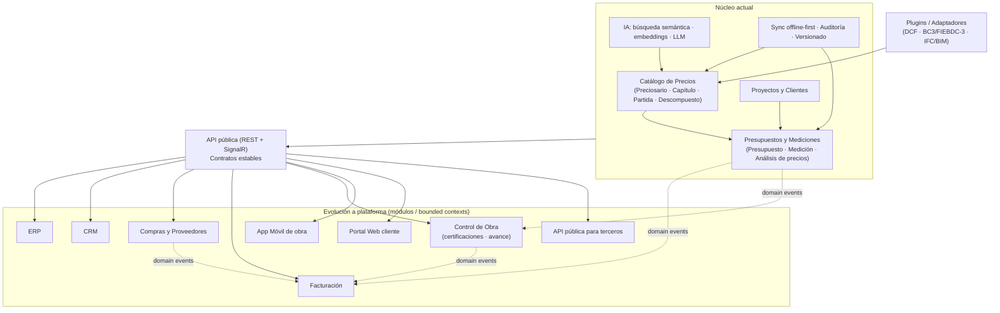

# Rendimiento y Escalabilidad

Documento de **rendimiento y escalabilidad** de **Preventivi App**: app moderna de presupuestos y mediciones de obra (estilo Primus/ACCA), offline-first con sync a la nube e importación de preciosarios DCF.

El requisito que vertebra todo este documento es claro: **soportar preciosarios de 500.000+ partidas con búsquedas instantáneas y una UI fluida**, tanto en escritorio como en móvil y web, y hacerlo sin sacrificar la experiencia offline-first.

## Requisitos de rendimiento

| Dimensión | Requisito |
|---|---|
| Volumen | Preciosarios de **500.000+ partidas** (más descompuestos, recursos, mediciones). Un proyecto grande puede tener decenas de miles de partidas de presupuesto. |
| Búsqueda | Resultados **percibidos como instantáneos** (< 150 ms p95) al teclear código/resumen, con autocompletado y filtros por capítulo/unidad/tipo. |
| Navegación | Apertura de un preciosario o presupuesto grande sin bloqueo de UI: el árbol y las tablas se pintan de inmediato y se rellenan bajo demanda. |
| Fluidez UI | **60 fps** en scroll y expansión de árbol; sin jank perceptible al desplazar listas de cientos de miles de filas. |
| Edición | Recálculo de mediciones y totales **incremental** y local, sin recorrer todo el presupuesto. |
| Offline | Todo lo anterior debe cumplirse **sin conexión**, sobre SQLite local, replicando luego al servidor. |

La estrategia general: **no cargar nunca el dataset completo en memoria ni en pantalla**. Todo se pagina, se virtualiza, se proyecta y se cachea.

## Frontend (Flutter + Riverpod)

El frontend nunca materializa colecciones masivas. Trabaja siempre con ventanas de datos sobre estructuras virtualizadas.

### Listas y árboles virtualizados (virtual scrolling)

- **Listas planas**: `ListView.builder` / `SliverList` con `itemCount` igual al total lógico, pero construyendo solo los ítems visibles (más un pequeño _cacheExtent_). Para 500.000 filas el coste de render es proporcional a la ventana visible, no al total.
- **Tablas grandes** (partidas, descompuestos, mediciones): tabla virtualizada de doble eje basada en `TwoDimensionalScrollView` / `SliverList` + columnas con `itemExtent` fijo cuando es posible (altura de fila constante → scroll O(1) y _jump-to-index_ exacto). Cabecera _pinned_ y columnas congeladas mediante slivers, no widgets apilados.
- **Árbol de capítulos/partidas**: árbol **virtualizado y aplanado**. El árbol jerárquico se "aplana" a una lista lineal de nodos visibles (solo los expandidos); se renderiza con `ListView.builder`. Expandir un capítulo inserta sus hijos en la lista aplanada de forma incremental (lazy), no carga toda la rama de golpe.
- **`itemExtent` / `prototypeItem`**: se fija la altura de fila siempre que sea viable para que Flutter calcule el _scroll offset_ sin medir cada hijo.

### Lazy loading y paginación

- Los repositorios locales exponen consultas **paginadas por keyset** (ver backend) y el ViewModel mantiene un buffer deslizante. Al acercarse al final del buffer visible se solicita la siguiente página.
- **Carga diferida de descompuestos**: al abrir el listado de partidas no se traen sus descompuestos. El análisis de precios (`AnalisisPrecios`) de una partida se carga **solo al expandir/seleccionar** esa partida (on-demand), y se cachea.
- Los textos largos (`texto_largo` de Partida) se cargan diferidos: en la lista solo viaja `resumen`; el `texto_largo` se pide al abrir el detalle.

### Búsqueda fluida

- **Debounce** del input (≈ 200–250 ms) para no lanzar una consulta por pulsación.
- **Cancelación**: cada nueva búsqueda cancela la anterior en vuelo (token de cancelación / descarte de resultados obsoletos por _request id_).
- La búsqueda local se sirve desde **SQLite FTS5** (índice de texto completo sobre código + resumen + texto), devolviendo solo las primeras N filas proyectadas.
- Resultados **incrementales/streaming** a la UI: se pintan los primeros aciertos en cuanto llegan, sin esperar al recuento total.

### Render eficiente

- **Memoización** con Riverpod: providers `select`-ivos para que un widget solo se reconstruya cuando cambia el campo concreto que observa (p. ej. el total de una partida, no todo el presupuesto). Uso de `family` + `autoDispose` para liberar estado de pantallas grandes.
- **`const` widgets** y `RepaintBoundary` alrededor de filas/celdas para aislar repintados.
- **Recálculo incremental** en cliente: al editar una `LineaMedicion`, se recalcula solo el `parcial` de esa línea, el `total` de su `Medicion` y se propaga hacia arriba por la jerarquía afectada (capítulo → presupuesto), no se recorre el árbol completo.
- Trabajo pesado (parseo de importaciones, recálculos masivos) en **isolates** para no bloquear el hilo de UI.

## Backend y Base de Datos (.NET 9 + EF Core)

### Paginación keyset (no OFFSET)

Para datasets de 500.000+ filas, `OFFSET n` degrada linealmente. Se usa **paginación keyset (seek method)**: se ordena por una clave estable (p. ej. `(capitulo_id, orden, id)`) y se pagina con un `WHERE` sobre el último cursor.

```sql
-- Página siguiente a partir del último (orden, id) visto
SELECT id, codigo, resumen, unidad_id, precio
FROM   partida
WHERE  capitulo_id = @capitulo
  AND  (orden, id) > (@ultimo_orden, @ultimo_id)
ORDER BY orden, id
LIMIT  100;
```

El cursor (no el número de página) viaja en la API, lo que da rendimiento constante independientemente de la profundidad.

### Índices

| Tabla | Índice | Propósito |
|---|---|---|
| `partida` | `(capitulo_id, orden, id)` | Listado y keyset por capítulo |
| `partida` | `(codigo)` | Búsqueda/lookup exacto por código |
| `capitulo` | `(preciosario_id, padre_id, orden)` | Navegación jerárquica del árbol |
| `descompuesto` | `(partida_id)` | Carga diferida del análisis de precios |
| `partida_presupuesto` | `(capitulo_presupuesto_id, orden)` | Render del árbol de presupuesto |
| `cola_sincronizacion` | `(estado, creado_en)` | Drenado de la cola por el worker de sync |
| **PostgreSQL** | GIN sobre `tsvector` (búsqueda full-text) + `pg_trgm` (similitud/typo) | Búsqueda servidor |
| **PostgreSQL** | índice `pgvector` (HNSW/IVFFlat) sobre embeddings | Búsqueda semántica |
| **SQLite** | tabla virtual **FTS5** sobre `codigo + resumen + texto_largo` | Búsqueda full-text local |

### Consultas optimizadas y proyecciones

- **Proyecciones, nunca entidades completas** para listas. Se hace `Select` a DTOs ligeros con solo las columnas que la UI necesita (código, resumen, precio, unidad), evitando traer `texto_largo`, descompuestos o relaciones no usadas.
- **`AsNoTracking`** en todas las consultas de solo lectura (la inmensa mayoría de las de listado/búsqueda) para evitar el coste del change tracker de EF Core.
- **Evitar N+1**: nunca cargar partidas y luego iterar pidiendo descompuestos uno a uno. Se usa proyección con sub-consultas / `Include` selectivo solo cuando se necesita el agregado, o se cargan los descompuestos en lote (un único `WHERE partida_id IN (...)`).
- **`SplitQuery`** cuando un `Include` legítimo provocaría explosión cartesiana.

### Streaming con `IAsyncEnumerable`

Para exportaciones, importaciones masivas y recálculos sobre todo el preciosario, las consultas se consumen como **flujo** (`AsAsyncEnumerable()` / `IAsyncEnumerable<T>`), procesando fila a fila sin materializar 500.000 objetos en memoria. Esto mantiene la huella de memoria acotada y permite _backpressure_ natural.

```csharp
public async IAsyncEnumerable<PartidaDto> StreamPartidasAsync(Guid preciosarioId)
{
    var query = _db.Partida
        .AsNoTracking()
        .Where(p => p.Capitulo.PreciosarioId == preciosarioId)
        .OrderBy(p => p.Orden).ThenBy(p => p.Id)
        .Select(p => new PartidaDto(p.Id, p.Codigo, p.Resumen, p.Precio));

    await foreach (var dto in query.AsAsyncEnumerable())
        yield return dto;
}
```

### Connection pooling

- **`DbContext` pooling** (`AddDbContextPool`) para reutilizar instancias y reducir la presión del GC bajo alta concurrencia.
- Pool de conexiones de Npgsql/PostgreSQL dimensionado y reutilizado; conexiones cortas, sin transacciones largas que retengan el pool.
- En importaciones masivas se usa **batching** de EF Core / `COPY` de PostgreSQL para inserciones de cientos de miles de filas.

## Caché

Estrategia de caché en **varios niveles**, del más cercano al usuario al más lejano:

| Nivel | Tecnología | Contenido típico | Política / Invalidación |
|---|---|---|---|
| L0 — Memoria de la app cliente | Estado Riverpod (`autoDispose`, `keepAlive`) | Páginas recientes del árbol, descompuestos abiertos, resultados de búsqueda recientes | LRU + `autoDispose` al salir de pantalla; invalidación por evento de edición |
| L1 — Caché local persistente | **SQLite** local (FTS5) | Preciosario completo offline, índice de búsqueda, totales precalculados | Se rehidrata desde sync; invalidación por change log |
| L2 — Memoria del servidor | `IMemoryCache` (.NET) | Metadatos de preciosario, catálogos (unidades, IVA, roles), resultados calientes | TTL corto + invalidación por evento de dominio |
| L3 — Caché distribuida | **Redis** | Resultados de búsqueda compartidos, sesiones, _rate limiting_, resultados de embeddings | TTL + invalidación por clave al publicarse un dominio event |

### Invalidación

- **Basada en eventos de dominio**: al confirmarse un cambio (nueva versión de preciosario, edición de precio no bloqueado, reimport DCF), los handlers publican un evento que invalida las claves afectadas en L2/L3 y marca las filas a refrescar en L1.
- **Por versión**: las entidades versionables (`Preciosario.version`, `Presupuesto.version`) permiten cachear por clave `entidad:id:version`; al subir la versión, las claves antiguas caducan solas (sin _busting_ explícito).
- **Precios bloqueados**: un `Precio.bloqueado = true` no se invalida al reimportar DCF (regla de dominio), por lo que su caché sobrevive a la reimportación.

## Indexación y búsqueda

### Índices de búsqueda

- **Local (SQLite FTS5)**: tabla virtual sincronizada con `partida` (triggers `INSERT/UPDATE/DELETE` o reconstrucción por lotes tras import). Soporta prefijos (`codigo*`) y ranking BM25 para ordenar relevancia.
- **Servidor (PostgreSQL)**: columna `tsvector` con índice GIN para full-text + `pg_trgm` para tolerancia a errores tipográficos y _fuzzy match_ de códigos/resúmenes.

### Indexado en background

La construcción de índices pesados **no bloquea** el flujo de importación ni la UI:

- Tras importar un DCF, las partidas quedan disponibles de inmediato; el **índice FTS5/tsvector** se construye/actualiza en un proceso de fondo y se va habilitando por capítulos.
- **Embeddings (pgvector)**: el cálculo de embeddings para búsqueda semántica de partidas es un trabajo **asíncrono y por lotes** (cola de embeddings). Se procesa con los modelos definidos en el stack (Claude Haiku 4.5 `claude-haiku-4-5-20251001` para volumen, escalando a Sonnet/Opus según necesidad) y el índice HNSW se actualiza incrementalmente.
- El estado de indexación es observable (porcentaje completado) para mostrar progreso sin bloquear.

## Procesamiento en segundo plano

Las operaciones largas se sacan del ciclo petición/respuesta y se ejecutan en **workers** sobre **colas**.

| Trabajo | Mecanismo | Notas |
|---|---|---|
| **Importación DCF** (500k+ partidas) | Cola + worker, en lotes con `COPY`/batching | Idempotente por `hash_archivo`; progreso reportado por SignalR |
| **Generación de documentos** (PDF/Excel) | Cola; QuestPDF / ClosedXML en worker | El usuario sigue trabajando; descarga cuando termina |
| **Sincronización** (change log) | `BackgroundService` + SignalR/WebSockets | Drena `ColaSincronizacion` (pendiente→enviado→confirmado); resolución de conflictos |
| **Embeddings / IA** | Cola dedicada, por lotes | Rate-limited hacia el proveedor LLM; reintentos con backoff |
| **Reindexado de búsqueda** | Job de fondo | Tras import o edición masiva |

### Tecnología

- **`BackgroundService` / `IHostedService`** de .NET para procesos residentes (sync, drenado de colas internas).
- **Hangfire** (con almacén PostgreSQL) para jobs **persistentes, programados y con reintentos**: importación DCF, generación de documentos, recálculos masivos, embeddings. Aporta dashboard, _retries_ con backoff, jobs recurrentes y _continuations_.
- Patrón **outbox** ligado a los domain events para garantizar que cada cambio confirmado encola su trabajo de fondo de forma transaccional (sin pérdidas).

## Objetivos de rendimiento (SLOs)

Objetivos sobre dataset de **500.000+ partidas**, medidos como percentil p95 salvo indicación. "Local" = SQLite offline; "Servidor" = .NET + PostgreSQL.

| Operación | Objetivo (p95) | Ámbito | Notas |
|---|---|---|---|
| Búsqueda incremental (tecleo) | **< 150 ms** | Local FTS5 | Resultado percibido instantáneo |
| Búsqueda full-text servidor | < 300 ms | Servidor | GIN/pg_trgm |
| Búsqueda semántica (embeddings) | < 500 ms | Servidor | pgvector HNSW |
| Apertura de preciosario grande | **< 1 s** hasta primer render interactivo | Local | Árbol virtualizado + lazy |
| Carga de página (100 partidas, keyset) | < 80 ms | Local / < 200 ms servidor | Proyección DTO |
| Carga de descompuesto de una partida | < 120 ms | Local | On-demand + caché |
| Recálculo de presupuesto (edición de línea) | **< 100 ms** | Local | Incremental, no full-scan |
| Recálculo total de presupuesto (10k partidas) | < 2 s | Local | Recorrido completo puntual |
| Generación de PDF (presupuesto típico, ~500 partidas) | **< 5 s** | Background | QuestPDF en worker |
| Generación de Excel | < 4 s | Background | ClosedXML |
| Importación DCF (500k partidas) | < 5 min | Background | Batch/COPY, idempotente |
| Scroll de listas/árbol | **60 fps** (≤ 16 ms/frame) | Cliente | Virtual scrolling |
| Latencia de sync (cambio → confirmado) | < 2 s con conexión | Sync | SignalR + change log |

Estos SLOs son **presupuestos de rendimiento (performance budgets)**: se vigilan en CI y en producción, y una regresión que los incumpla se trata como defecto.

## Estrategia de medición

No se optimiza a ciegas: **primero medir, luego optimizar** el cuello de botella real.

### Benchmarks

- **BenchmarkDotNet** para microbenchmarks de backend: consultas EF Core (keyset vs offset, tracking vs no-tracking, proyección vs entidad), serialización, recálculos.
- Benchmarks de Flutter con `flutter test --profile` y _benchmark harness_ para tiempos de build/layout/paint de las tablas y árboles virtualizados.

### Profiling

- **Flutter DevTools**: timeline de frames, _raster/UI thread_, detección de jank, _memory profiler_ para fugas en listas grandes y `RepaintBoundary` mal colocados.
- **.NET**: `dotnet-trace` / `dotnet-counters` / PerfView para CPU y GC; análisis de plan de consulta con `EXPLAIN ANALYZE` (PostgreSQL) y `EXPLAIN QUERY PLAN` (SQLite) para verificar uso de índices.
- **Serilog + métricas**: instrumentación de tiempos de las operaciones clave (búsqueda, apertura, recálculo, generación de documentos) con etiquetas para construir histogramas de latencia (p50/p95/p99) y comparar contra los SLOs.

### Pruebas de carga

- **Datasets sintéticos** de 500k–1M partidas para reproducir el caso extremo en CI nocturno.
- **k6 / NBomber** para carga sobre la API (búsqueda concurrente, paginación, sync masivo) y medición de throughput/latencia bajo concurrencia creciente.
- **Pruebas de soak** (larga duración) para detectar fugas de memoria y degradación de la cola de sync y los workers de fondo.
- **Detección de regresiones** en CI: los benchmarks clave fallan el pipeline si superan un umbral respecto a la línea base.

## Escalabilidad arquitectónica

El rendimiento es solo una cara; la otra es **crecer en alcance** sin reescribir. La Clean Architecture + DDD del proyecto está pensada para que Preventivi App evolucione de app de presupuestos a una **plataforma tipo ERP** del sector construcción.

### Cómo escala la arquitectura

- **Modularidad por features (frontend) y por casos de uso (backend, MediatR/CQRS)**: cada capacidad nueva (compras, facturación, control de obra) es un módulo que se añade sin tocar los existentes.
- **Bounded contexts (DDD)**: el dominio se organiza en contextos delimitados (Presupuestos, Catálogo de Precios, Proyectos/Obra, Compras, Facturación, IA). Cada contexto tiene su modelo, sus agregados y su lenguaje, y se comunica con los demás mediante **eventos de dominio** y contratos, no por acoplamiento directo de tablas. Esto permite que un contexto escale, se cachee o incluso se extraiga a su propio servicio sin arrastrar a los demás.
- **API como contrato estable**: la **API pública** (REST + SignalR) desacopla clientes (escritorio, móvil, web, terceros) del backend. Nuevos clientes y un **portal web** consumen la misma API.
- **Extensibilidad por plugins**: puntos de extensión (importadores/exportadores, motores de cálculo, generadores de documentos) tras interfaces, de modo que **BC3 (FIEBDC-3), IFC/BIM** se añaden como nuevos adaptadores del importador sin tocar el núcleo (igual que hoy se añade DCF).
- **Escalado horizontal del servidor**: backend sin estado tras la API → réplicas detrás de balanceador; caché distribuida Redis y colas (Hangfire) compartidas; PostgreSQL con réplicas de lectura para búsqueda/reporting.

### Diagrama de evolución modular



La clave es que **cada flecha de evolución es aditiva**: nuevos bounded contexts cuelgan de la API y se integran por eventos de dominio, reutilizando el núcleo de precios/presupuestos/sync/IA sin reescribirlo. Así, la misma arquitectura que sostiene 500.000 partidas con UI fluida es la que permite crecer hacia ERP, CRM, BIM, facturación, compras, control de obra, móvil, portal web, API pública y plugins.
