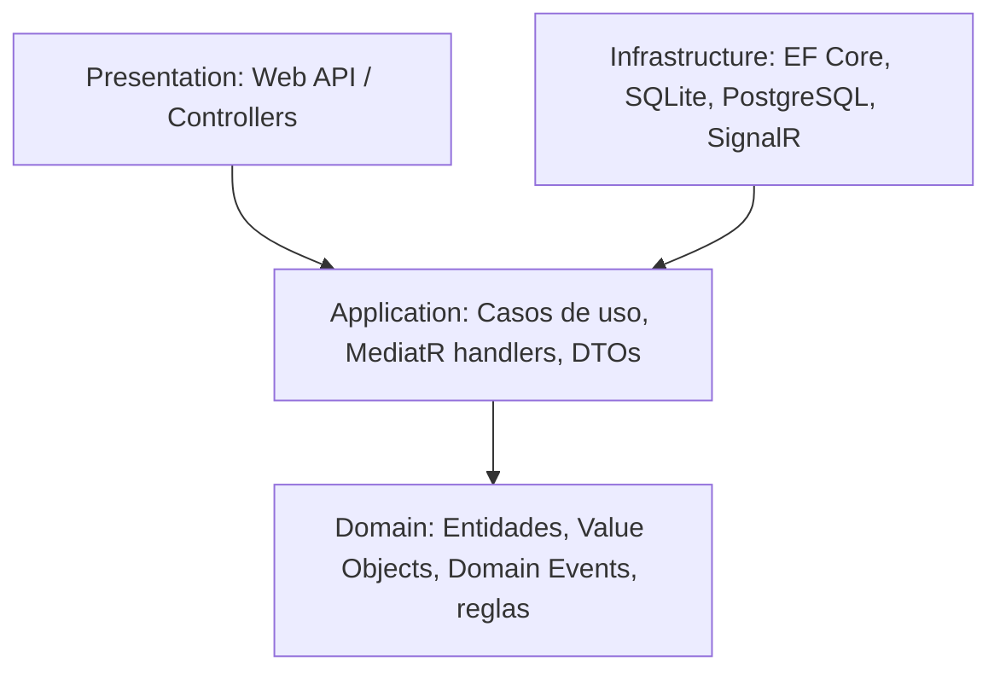

# 0001 - Adoptar Clean Architecture + Domain-Driven Design

## Estado

Aceptado

## Contexto

Preventivi App es un sistema con un **dominio rico y complejo**: preciosarios DCF estilo Primus, capítulos jerárquicos, partidas, descompuestos (análisis de precios), mediciones por líneas con fórmulas, presupuestos versionables, costes indirectos e IVA. Las reglas de negocio (cálculo de importes, propagación de precios, bloqueo de precios al reimportar DCF, versionado) son el núcleo del valor del producto y deben permanecer estables frente a cambios tecnológicos.

Necesitamos una arquitectura que:

- Aísle la lógica de negocio de la infraestructura (EF Core, SQLite, PostgreSQL, SignalR, LLM).
- Sea testeable sin depender de bases de datos ni frameworks.
- Soporte múltiples puntos de entrada (Web API, sync en background) y dos motores de persistencia (local y servidor).
- Permita evolucionar el dominio con vocabulario compartido entre negocio y desarrollo (preciosario, partida, medición...).

## Decisión

Adoptamos **Clean Architecture** con cuatro capas y la **regla de dependencia hacia adentro**:

- **Domain**: entidades (Proyecto, Preciosario, Partida, Descompuesto, Medición...), value objects, eventos de dominio y reglas invariantes. Sin dependencias externas.
- **Application**: casos de uso como handlers de MediatR, interfaces de repositorio y unit of work, DTOs y validaciones (FluentValidation). Orquesta el dominio.
- **Infrastructure**: implementaciones concretas (EF Core, repositorios, SQLite/PostgreSQL, SignalR, exportadores, cliente LLM).
- **Presentation**: ASP.NET Core Web API.

Aplicamos tácticas de **DDD**: agregados con raíz (p. ej. Presupuesto como raíz de sus capítulos/partidas/mediciones), value objects (Precio, Unidad), domain events para efectos secundarios (auditoría, encolado de sincronización) y un **lenguaje ubicuo** alineado con la terminología Primus/DCF.

Patrones de soporte: Repository, Unit of Work, Dependency Injection, Result Pattern para el manejo de errores, Mapper (Mapster/AutoMapper), logging estructurado (Serilog) y manejo de errores centralizado.

## Consecuencias

**Positivas**

- La lógica de negocio es independiente de frameworks y altamente testeable con tests unitarios rápidos.
- Cambiar SQLite ↔ PostgreSQL o el cliente LLM no afecta al dominio.
- El lenguaje ubicuo reduce la fricción entre requisitos de negocio y código.
- Los límites de agregado facilitan razonar sobre consistencia y sincronización.

**Negativas / costes**

- Mayor número de capas y artefactos (DTOs, mappers, interfaces) → más código repetitivo (boilerplate) para operaciones CRUD simples.
- Curva de aprendizaje para desarrolladores no familiarizados con Clean Architecture/DDD.
- Riesgo de sobreingeniería si se aplica DDD táctico a partes anémicas del dominio; se aplicará con criterio solo donde el dominio sea rico.

## Alternativas consideradas

- **Arquitectura en capas tradicional (N-tier) con modelo anémico**: más simple al inicio, pero tiende a dispersar la lógica de negocio en servicios y a acoplarse a EF Core, dificultando los tests y la doble persistencia. Descartada por la complejidad del dominio.
- **Vertical Slice Architecture pura** (sin capa de dominio formal): excelente para reducir boilerplate, pero diluye los límites de agregado y el lenguaje ubicuo que necesitamos para el modelo de presupuestos. Adoptamos en su lugar un enfoque por features sobre Clean Architecture (los handlers MediatR ya dan cortes verticales dentro de Application).
- **Transaction Script**: adecuado para CRUD trivial; insuficiente para las reglas de cálculo y versionado del dominio. Descartada.
