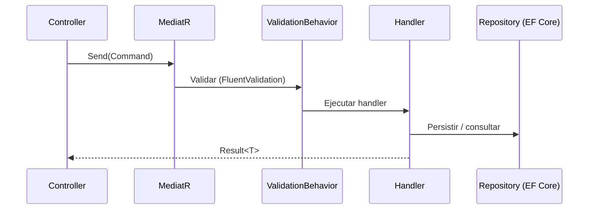

# 0003 - Backend en .NET 9 con MediatR/CQRS

## Estado

Aceptado

## Contexto

El backend de Preventivi App expone una **Web API** para sincronización, gestión de proyectos, importación de preciosarios DCF, generación de documentos (PDF/Excel) y funciones de IA. Requisitos:

- Alto rendimiento e I/O eficiente para procesar preciosarios de 500.000+ partidas y sincronización concurrente.
- Encaje natural con **Clean Architecture** (ver ADR 0001) y separación clara de lecturas y escrituras.
- Ecosistema maduro de ORM, validación, logging y generación de documentos.
- Tipado fuerte y mantenibilidad a largo plazo.

## Decisión

Adoptamos **.NET 9 Web API** (ASP.NET Core) como backend, con **MediatR** implementando **CQRS**: cada caso de uso es un `Command` o `Query` con su handler.

Componentes del stack backend:

- **MediatR (CQRS)**: comandos para escrituras, queries para lecturas; los pipeline behaviors centralizan validación, logging y manejo de errores.
- **FluentValidation**: validación declarativa de comandos/queries en un behavior del pipeline.
- **Result Pattern**: las operaciones devuelven `Result<T>` en lugar de lanzar excepciones para el flujo esperado de errores de negocio.
- **EF Core**: acceso a datos sobre SQLite (local) y PostgreSQL (servidor) — ver ADR 0004.
- **Serilog**: logging estructurado.
- **QuestPDF / ClosedXML**: generación de PDF y Excel; exportadores CSV/JSON/XML.

## Consecuencias

**Positivas**

- CQRS separa modelos de lectura y escritura, permitiendo optimizar queries (proyecciones, paginación, FTS) sin contaminar el dominio.
- Los pipeline behaviors de MediatR centralizan preocupaciones transversales (validación, logging, transacciones, manejo de errores) de forma uniforme.
- .NET 9 ofrece excelente rendimiento, AOT/JIT maduro y soporte first-class para EF Core, SignalR y QuestPDF.
- Result Pattern hace explícitos los errores de negocio y mejora la previsibilidad del flujo.

**Negativas / costes**

- Más artefactos por operación (command/query + handler + validator), aumentando el boilerplate frente a controladores "gordos".
- MediatR introduce indirección que puede dificultar el trazado del flujo para quien no conoce el patrón.
- CQRS sin event sourcing mantiene un único almacén; no obtenemos las ventajas (ni la complejidad) de modelos de lectura/escritura físicamente separados, lo cual es intencionado.

## Alternativas consideradas

- **Node.js + NestJS**: comparte lenguaje (TypeScript) con un hipotético frontend web y tiene buen soporte de CQRS; sin embargo ofrece menor rendimiento bruto en cargas CPU/IO intensivas, un ORM (TypeORM/Prisma) menos potente que EF Core para escenarios complejos, y un ecosistema de generación de documentos PDF/Excel inferior. Descartada.
- **.NET con controladores tradicionales (sin MediatR)**: menos boilerplate, pero dispersa validación/logging y mezcla orquestación con HTTP, dificultando el cumplimiento de Clean Architecture. Descartada a favor de CQRS explícito.
- **Java + Spring Boot**: maduro y de alto rendimiento, pero mayor verbosidad, peor integración con el ecosistema de documentos elegido y sin ventaja sobre .NET para este equipo. Descartada.
