# 0005 - Sincronización por cola de cambios + SignalR y resolución de conflictos

## Estado

Aceptado

## Contexto

Con un modelo **offline-first** (ADR 0004), el cliente (SQLite) y el servidor (PostgreSQL) divergen mientras no hay conexión. Necesitamos un mecanismo que:

- Capture de forma fiable cada cambio realizado offline y lo reproduzca en el servidor al reconectar.
- Propague cambios del servidor (de otros usuarios) hacia los clientes en **tiempo real** cuando sea posible.
- **Resuelva conflictos** de forma determinista cuando dos extremos modifican la misma entidad.
- Sea robusto frente a reintentos, duplicados y cortes de red.

## Decisión

Implementamos sincronización mediante una **cola de cambios (change log)** combinada con **SignalR/WebSockets** y **background sync**.

**1. Cola de cambios (entidad `ColaSincronizacion`)**

Cada operación de escritura local genera un registro en la cola con: `entidad_tipo`, `entidad_id` (UUID v7), `operacion` (insert/update/delete), `payload` y `estado` (pendiente → enviado → confirmado / conflicto). Un proceso de **background sync** drena la cola hacia el servidor.

**2. Push del servidor con SignalR**

El servidor notifica a los clientes conectados los cambios relevantes vía **SignalR** (WebSockets), permitiendo actualización casi en tiempo real. Si no hay conexión, el cliente recupera los cambios pendientes mediante **pull** (sincronización incremental por marca temporal/versión) al reconectar.

**3. Resolución de conflictos**

- UUID v7 (ADR 0006) garantiza que las inserciones offline no colisionen.
- Para actualizaciones concurrentes se aplica **Last-Write-Wins** basado en versión/marca temporal como política por defecto.
- Para entidades sensibles (presupuestos, precios) se conserva el historial/versión (`Version`, `Historial/Auditoria`) y los conflictos no triviales se marcan con estado `conflicto` para **resolución asistida** por el usuario, evitando pérdidas silenciosas de datos.
- Las operaciones son **idempotentes** (clave de entidad + versión), de modo que los reintentos no duplican efectos.

```mermaid
sequenceDiagram
    participant L as SQLite (local)
    participant Q as ColaSincronizacion
    participant API as Backend (.NET 9)
    participant DB as PostgreSQL
    participant SR as SignalR
    L->>Q: registrar cambio (pendiente)
    Q->>API: background sync (enviado)
    API->>DB: aplicar + detectar conflicto
    API-->>Q: confirmado / conflicto
    API->>SR: notificar a otros clientes
    SR-->>L: push de cambios remotos
```

## Consecuencias

**Positivas**

- Captura fiable y auditable de todos los cambios offline; nada se pierde por desconexión.
- Reintentos seguros gracias a la idempotencia y a los estados de la cola.
- Experiencia colaborativa casi en tiempo real cuando hay conexión (SignalR).
- La política de conflictos es explícita y, para datos críticos, evita sobrescrituras silenciosas.

**Negativas / costes**

- Lógica de sincronización y resolución de conflictos **no trivial** de implementar y testear (escenarios de red parcial, relojes desfasados, borrados vs. ediciones).
- Last-Write-Wins puede descartar cambios si no se complementa con versionado/resolución asistida en entidades sensibles.
- SignalR añade infraestructura de conexiones persistentes a gestionar (escalado, reconexión, backplane).
- La cola puede crecer en periodos largos sin conexión; requiere compactación y control de tamaño.

## Alternativas consideradas

- **CRDTs** (tipos de datos replicados sin conflicto): convergencia automática sin coordinación, pero alta complejidad de modelado para un dominio relacional/jerárquico como capítulos-partidas-mediciones, y mayor coste de almacenamiento. Reservado como posible evolución; descartado como base inicial.
- **Sincronización basada en logs de replicación de la BD** (p. ej. CDC/logical replication): potente, pero acopla la solución a la infraestructura de BD, no funciona con SQLite del lado cliente y dificulta la lógica de conflictos a nivel de dominio. Descartada.
- **Polling periódico sin push**: más simple, pero introduce latencia y carga innecesaria; no da la sensación de tiempo real de Linear/ClickUp buscada. Se mantiene solo como **fallback** cuando SignalR no está disponible.
- **Servicio de sync gestionado** (Firebase/Supabase Realtime, etc.): rápido de adoptar, pero ata a un proveedor y limita el control sobre conflictos y el modelo .NET/PostgreSQL+pgvector. Descartada.
