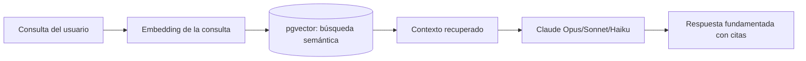

# 0007 - IA con RAG, embeddings en pgvector y modelos Claude

## Estado

Aceptado

## Contexto

Preventivi App incorpora funciones de **IA** para acelerar la elaboración de presupuestos: búsqueda semántica de partidas en preciosarios DCF, sugerencia de partidas/descompuestos, asistencia para redactar textos largos y resúmenes, y respuesta a preguntas sobre el catálogo de precios. Restricciones:

- El conocimiento clave (preciosarios de 500.000+ partidas, datos de proyectos) es **propio y dinámico**; no puede depender solo del conocimiento paramétrico del modelo.
- Las respuestas deben estar **fundamentadas en los datos reales** del usuario, minimizando alucinaciones y citando la fuente.
- Ya disponemos de **PostgreSQL** en servidor con extensiones avanzadas (ADR 0004).
- Necesitamos calidad y razonamiento sólidos, con control de coste/latencia por caso de uso.

## Decisión

Adoptamos un patrón **RAG (Retrieval-Augmented Generation)** con **embeddings almacenados en pgvector** y **modelos Claude** de Anthropic como LLM.

**1. Indexación (embeddings + pgvector)**

Las partidas, descompuestos y textos relevantes se convierten en **embeddings** y se almacenan en columnas `vector` de **pgvector** (PostgreSQL). Las búsquedas usan índices de vecino más próximo aproximado (HNSW/IVFFlat) para recuperación semántica a escala de cientos de miles de registros. Se combina con la búsqueda léxica existente (tsvector, pg_trgm) en un esquema **híbrido**.

**2. Generación (modelos Claude)**

El contexto recuperado se inyecta en el prompt del LLM. Seleccionamos el modelo Claude según la exigencia del caso de uso:

| Modelo | ID | Uso previsto |
|---|---|---|
| Claude Opus 4.8 | `claude-opus-4-8` | Razonamiento complejo, análisis de presupuestos, tareas de alta calidad |
| Claude Sonnet 4.6 | `claude-sonnet-4-6` | Equilibrio calidad/coste para asistencia general y redacción |
| Claude Haiku 4.5 | `claude-haiku-4-5-20251001` | Tareas rápidas y de alto volumen (clasificación, sugerencias ligeras) |

## Consecuencias

**Positivas**

- Las respuestas se **fundamentan en los datos reales** del usuario (preciosarios, proyectos), reduciendo alucinaciones y permitiendo citar la partida origen.
- pgvector reutiliza la infraestructura PostgreSQL existente: **una sola base de datos** para datos relacionales, búsqueda léxica y vectorial; menos piezas que operar.
- La gama de modelos Claude permite ajustar **coste y latencia** por caso de uso sin cambiar de proveedor.
- El esquema híbrido (semántico + léxico) mejora la precisión sobre catálogos técnicos con códigos y terminología específica.

**Negativas / costes**

- Dependencia de un **proveedor externo de LLM** (red, coste por token, límites de tasa); mitigable con caché de respuestas, selección de modelo y degradación a búsqueda léxica.
- Mantener los **embeddings sincronizados** con los datos (reindexación al importar/actualizar preciosarios) añade procesamiento en background.
- pgvector a gran escala requiere ajuste de índices (HNSW/IVFFlat) y recursos de memoria/CPU.
- El envío de datos a un servicio externo exige cuidar **privacidad y gobierno del dato** (qué se envía, anonimización, configuración por organización).

## Alternativas consideradas

- **Base de datos vectorial dedicada** (Pinecone, Weaviate, Qdrid, Milvus): mayor especialización y escalado vectorial, pero añade una **pieza de infraestructura separada** y sincronización extra frente a tener los vectores junto a los datos en PostgreSQL. Descartada para la fase actual; reconsiderable si la escala vectorial lo exige.
- **Otros LLM (OpenAI GPT, Gemini, Llama autoalojado)**: alternativas válidas, pero se opta por **Claude** por su calidad de razonamiento y manejo de contexto largo para análisis de presupuestos; la abstracción del cliente LLM (ADR 0001) permite cambiar de proveedor si fuera necesario.
- **Solo búsqueda léxica (tsvector/pg_trgm) sin embeddings**: más simple y barata, pero no captura **similitud semántica** (sinónimos, descripciones equivalentes) necesaria para sugerir partidas. Se mantiene como complemento, no como sustituto.
- **Fine-tuning de un modelo propio**: costoso y rígido frente a un catálogo que cambia constantemente; RAG es más adecuado para conocimiento dinámico. Descartado.
